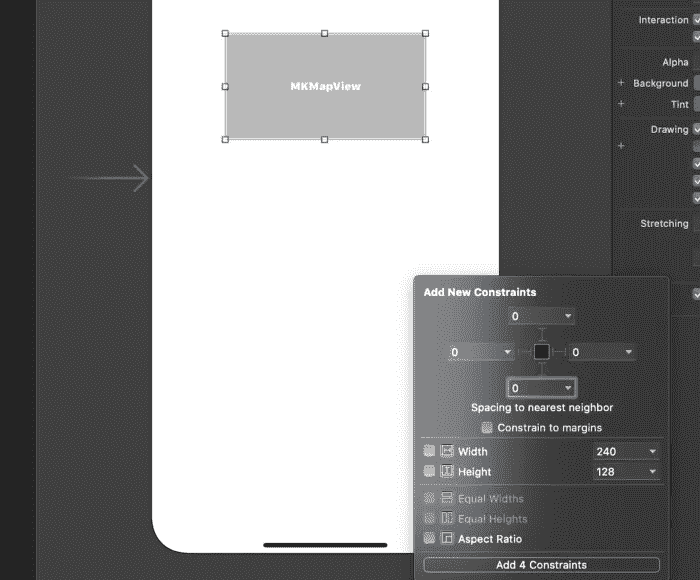
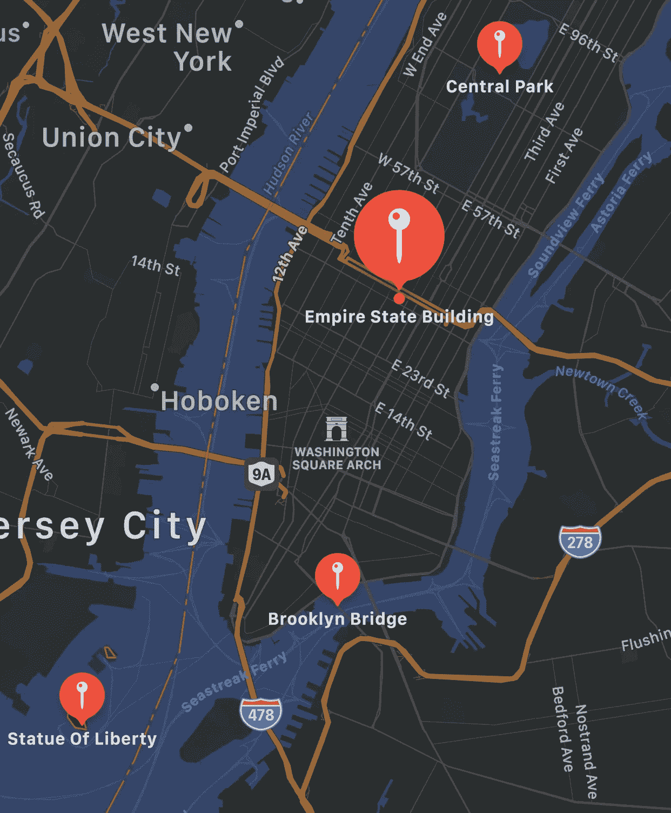
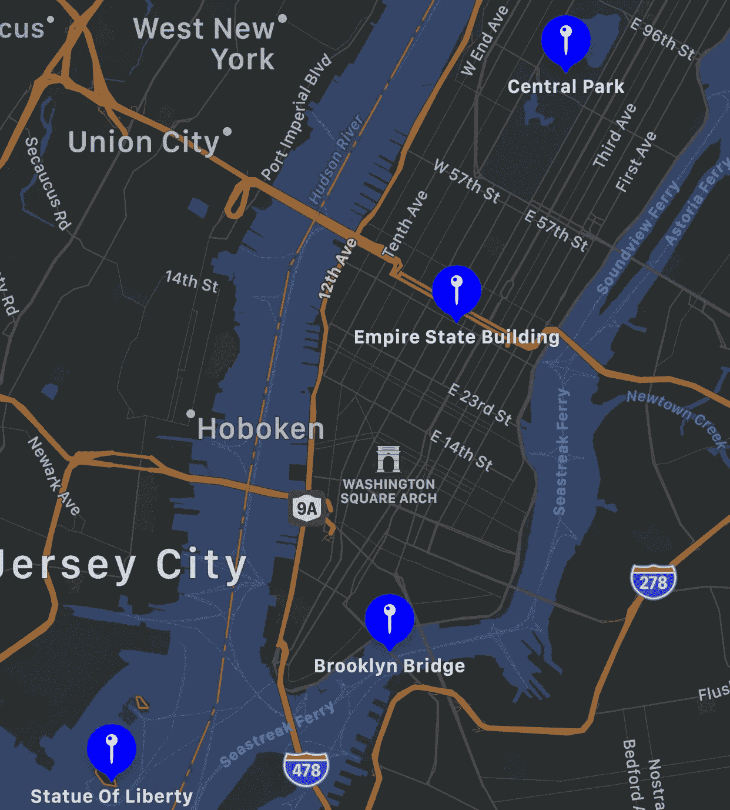
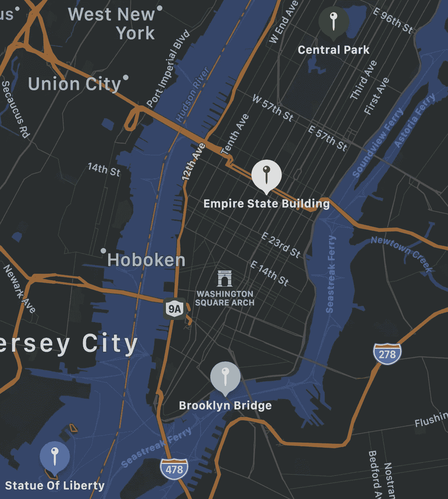
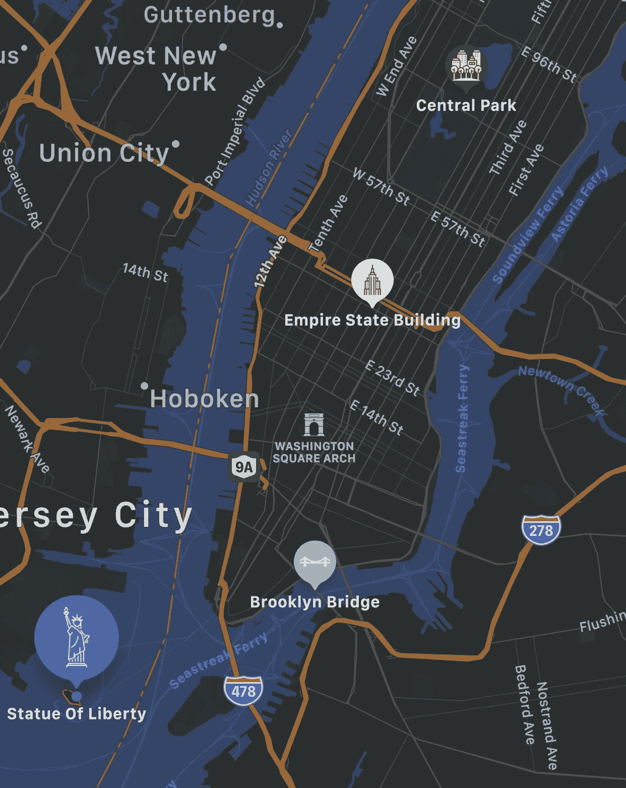

# 如何自定义地图工具包注释

> 原文：<https://betterprogramming.pub/how-to-customize-mapkit-annotations-baad32487a7>

## 自定义注释的简单方法


安妮·斯普拉特在 [Unsplash](https://unsplash.com?utm_source=medium&utm_medium=referral) 上拍摄的照片。

我是户外探险追踪应用 [Outdoorist](https://apps.apple.com/app/id1489423707) 的创始人。我最近花了很多时间使用 MapKit，并想分享我发现的自定义 MapKit 注释的最简单的方法。我的目标是让一切简单明了，这样对任何人都有用。

让我们开始吧。

# 入门指南

让我们首先创建一个新的单视图应用程序 Xcode 项目。唯一需要注意的是，我们将使用 Storyboard 用户界面，而不是 SwiftUI。我将把我的项目命名为`customMapAnnotations`，尽管你可以使用任何你喜欢的名字。

打开`Main.storyboard` 文件，拖动`MapKitView` 到屏幕中央。通过选择*添加新约束*按钮*和*将视图的所有边约束为 0，为视图添加一些约束。在点击*添加约束*按钮之前，取消勾选*约束至页边距*按钮。



现在让我们给`ViewController`添加一个连接:

*   使用 Xcode 中的拆分视图打开当前打开的故事板旁边的`ViewController.swift`文件。
*   按住 Control 键从`MKMapView`文件拖动到`ViewController`文件，创建一个`IBOutlet` 连接。在随后的模式中，将连接命名为`mapView`并点击*连接*按钮。

现在一切都连接好了，我们可以开始创建地图视图了！

# 配置地图视图

*   通过将`import MapKit`添加到`ViewController.Swift`的顶部(在`import UIKit`的正下方)，将 MapKit 依赖项添加到项目中。
*   添加子类`MKMapViewDelegate`使`ViewController`成为我们地图视图的代表。这使我们能够完全控制地图的行为，这将在以后广泛使用。
*   在`super.viewDidLoad()`下，添加一行`mapView.delegate = self`。这一行将`ViewController`指定为地图视图的代表。本质上，这仅仅意味着我们告诉`MapView`我们想从这个类中控制它。

现在的`ViewController.swift`应该是这样的:

在添加注释之前，我们需要首先设置地图视图的区域。该区域控制地图中心的位置以及地图所需的缩放级别。我将在下面提供它的代码，然后开始研究:

*   该函数的第一行指定了我们希望作为地图视图中心的坐标。在这个例子中，地图的中心是华盛顿广场拱门。
*   第二行设置地图视图的范围，这只是一个包含多少地图的规范(即缩放级别)。
*   第三行和第四行使用中心坐标和跨度创建一个`MKCoordinateRegion`对象，然后将其设置为地图视图使用的区域。

# 向地图添加注记

让我们给地图添加四个注释。首先，创建一个`MKPointAnnotation`的实例，然后给它一个坐标和标题，最后给`mapView`添加注释。我将在下面的代码中提供这个例子的坐标和标题。让我们在一个名为`placePins`的新函数中实现这一点:

*   前两行设置了我们想要绘制的每个位置的坐标和标题。
*   在`for`循环中，首先要做的是创建一个`MKPointAnnotation` 的新实例，并根据我们创建的变量指定它的坐标和标题。最后，该注记被添加到地图视图中。

现在地图已经可以使用了，通过在`viewDidLoad()`的末尾添加下面两行来添加对我们刚刚创建的两个方法的调用:

```
self.configureMap()
self.placePins()
```

现在，地图视图将在应用程序启动时打开并添加注释，您将能够看到所有四个注释:



# 自定义注释颜色

您可能希望进行的最常见的样式更改是更改大头针的背景颜色。让我们从改变所有四个大头针的背景颜色开始。这可以通过指定由子类化`MKMapViewDelegate`提供的`viewFor`方法来实现:

在上面的代码中，`annotationView`被创建为一个新的注释视图，它的色调被更改为我们自定义的蓝色值。然后它会返回到地图视图。这将设置所有的引脚为蓝色:



虽然这很简洁，但我们可能不希望每个标记都是相同的颜色或相同的图标。定制每个大头针的一个简单方法是利用标记的标题来区分它们。

为了做到这一点，让我们为每个注释添加自定义颜色。我们将使用注释标题和一个`switch`语句来轻松区分注释。如果您不熟悉 Swift 中的`switch`声明，请参阅[官方文档](https://docs.swift.org/swift-book/LanguageGuide/ControlFlow.html#ID129)以了解所有相关信息。

让我们定制这里的代码，通过用包含每个标记的`switch`语句替换行`annotationView.markerTintColor = UIColor.blue`,为所有标记添加自定义颜色:

现在，我们已经成功定制了每枚胸针的颜色:



# 自定义注释图标

我最喜欢用注释定制的东西之一是字形图标。我通常在[图标 8](https://icons8.com/) 或[平面图标](https://www.flaticon.com/)上找到图标，在这个例子中我将使用平面图标中的图标。我会在最后添加每个图标的创作者的信用。

为了保持简洁，我为您提取了图标，并将它们与源代码一起放在最后。在 flaticon 上找到我喜欢的图标后，我的工作流程是下载 64px PNG 版本，并添加创建者姓名的注释，以便我以后使用它时可以适当地给图标添加属性。

将图标添加到资产文件夹后，我们要做的就是添加行`annotationView.glyphImage = UIImage(named: “{image-name}”)`。

因为我们已经有了一个`switch`语句，所以最简单的方法就是给每种情况添加适当的图像规范。我将在下面包含更新后的`switch`语句的代码:

现在，每个注释都有了自己的自定义图标。让我们看看这个是什么样子的:



现在，您可以看到每个注释都有自己的自定义背景颜色和图标。好多了！

# 其他定制选项

虽然颜色和图标是最常见的定制，你还可以改变更多！我将列出一些您可以轻松更改的其他有用内容:

*   批注内图标的颜色是可定制的。默认情况下，图标是根据批注的背景颜色自动设置的。但是，如果您想改变它的默认颜色，您可以通过将`glyphTintColor`属性设置为任意颜色来实现。
*   可以通过相应地编辑`titleVisibility`和`subtitleVisibility`属性来定制标题和副标题的可见性设置。
*   无论何时选择，注释都可以显示不同的图标。这可以通过为`selectedGlyphImage`属性指定一个图像来实现。

要查看可以用注释定制的所有内容的详尽列表，请查看[苹果开发者文档](https://developer.apple.com/documentation/mapkit/mkmarkerannotationview)。

# 包扎

感谢阅读！我希望这对你有帮助。如果您有任何问题，请随时发表评论。另外，请在评论中让我知道你最常用的注释样式定制！

我将这个项目的所有内容存储在 GitHub 仓库中。

# 信用

*   布鲁克林大桥图标由来自 [flaticon](http://www.flaticon.com) 的 [Freepik](https://www.flaticon.com/authors/freepik) 制作。
*   由[桉树](https://www.flaticon.com/authors/eucalyp)制成的中央公园图标来自[扁平图标](http://www.flaticon.com)。
*   帝国大厦图标由来自 [flaticon](http://www.flaticon.com) 的 [Freepik](https://www.flaticon.com/authors/freepik) 制作。
*   来自 [flaticon](http://www.flaticon.com) 的 [Nikita Golubev](https://www.flaticon.com/authors/nikita-golubev) 制作的自由女神像图标。