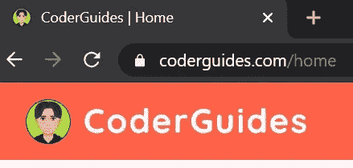
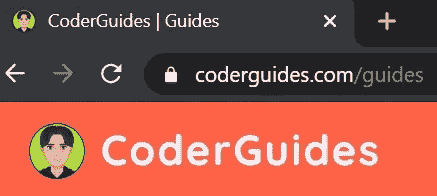
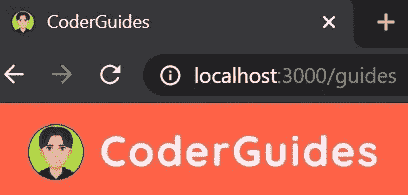

# 如何在 React 中自定义任何页面的标题

> 原文：<https://betterprogramming.pub/how-to-customize-the-title-of-any-page-in-react-45ef14d2a695>

## 使用 React 头盔保持简单


照片由 [Kari Shea](https://unsplash.com/@karishea?utm_source=medium&utm_medium=referral) 在 [Unsplash](https://unsplash.com?utm_source=medium&utm_medium=referral) 上拍摄。

当你使用普通 HTML 创建一个网站或 web 应用程序时，`<title>`标签是你用来定义 HTML 文档标题的。例如，如果你有一个作品集网站，登陆页面的 HTML 代码的`<head>`中的`<title>`标签可能是这样的:

```
<title>My Portfolio</title>
```

同样，您的“关于”页面上的`<title>`标签可能看起来像这样:

```
<title>My Portfolio | About</title>
```

无论你在这里有什么标题，它都会准确地显示在浏览器的标题栏或页面的标签中。

在本文中，我将向您展示如何在 React 应用程序中定制任何页面的标题。在此示例中，选项卡中显示的标题是“CoderGuides | Home”:



文档标题示例:主页

在本例中，显示的标题是“CoderGuides | Guides”:



文档标题示例:指南页面

如果我们进入 React 应用程序在公共文件夹中的`index.html`文件，我们可以使用`<title>`标签在`<head>`中添加任何我们想要的标题。正如您在这里看到的，标题被定义为“CoderGuides”:

如果我们转到我们的主页(注意 URL: /home)，我们会在选项卡中获得标题的“CoderGuides ”:


文件标题示例

现在，如果我们转到指南页面(注意 URL: /guides)，我们还会在选项卡中显示“CoderGuides ”:



文件标题示例

事实上，这就是上面的`index.html`文件中对标题的定义。你会发现，这样做，你的应用程序中的所有页面都会有相同的标题(即“CoderGuides”)。但是，如果我们想定制我们每个页面的标题，以便我们应用程序中的每个页面都有自己唯一的标题，我们该怎么办呢？换句话说，如果我们转到主页，我们希望选项卡中的标题显示为“CoderGuides | Home”当我们转到指南页面时，我们希望标签中的标题显示为“CoderGuides | Guides”

为了帮助我们，我们将使用一个名为 [React 头盔](https://github.com/nfl/react-helmet)的包。React Helmet 是 React 的文档头管理器，允许您管理对文档头的所有更改。React 头盔有不同的使用方式，但我们将在这里使用它来帮助我们定制每个页面的标题。

# **做什么**

我们需要做的第一件事是安装反应头盔。因此，在终端中，运行以下命令:

```
npm install --save react-helmet
```

我们可以通过检查`package.json`文件中的依赖项来验证它是否已经安装:

```
"dependencies": {
  "react": "^16.13.1",
  "react-dom": "^16.13.1",
  **"react-helmet": "^6.0.0",**
  "react-router-dom": "^5.2.0",
},
```

我们需要做的下一件事是将 React 头盔导入到我们的应用程序中，无论我们想在哪里使用它。在这种情况下，我们将在主页和指南页面组件中使用它。我把它们都作为单独的文件(`Home.js`和`Guides.js`)，所以我要把 React 头盔导入到每个文件中。对于`Home.js`和`Guides.js`来说，看起来都是这样的。例如，如果您的应用程序总共有五个页面，并且您计划定制这五个页面中每个页面的标题，那么您需要将 React Helmet 导入这五个文件中的每个文件。

```
import React from 'react';
**import { Helmet } from 'react-helmet';**
```

既然我们已经带来了 React 头盔，我们就可以使用它了。这是我们定制标题的地方。我们将在组件内部使用它(在本例中，是我们的 Home 组件)。我们在顶部`return`和第一个打开的`<div>`标签之后这样做。请注意，我们在`<title>`标记内添加了我们定制的标题“CoderGuides | Home”，该标题又放在开始和结束`<Helmet>`标记内:

仅此而已。现在，当我们在浏览器中转到主页时，我们可以在选项卡中看到我们定制的标题。请注意，标题现在显示为“CoderGuides | Home”:


文档标题示例:主页

然后，对于指南页面组件，我们做同样的事情，但相应地更改标题:

当我们进入浏览器中的指南页面时，我们会在标签中得到我们定制的标题:“CoderGuides | Guides。”


文档标题示例:指南页面

这就是全部了。因此，要自定义所有页面的标题，只需对每个要自定义标题的页面重复相同的步骤。