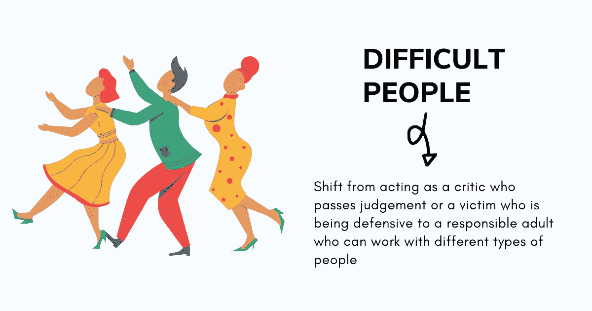
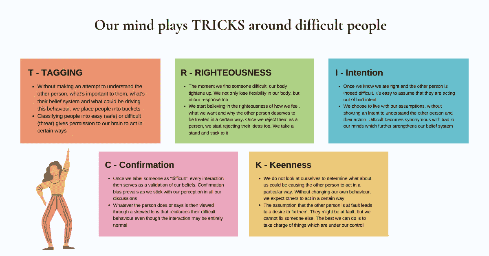
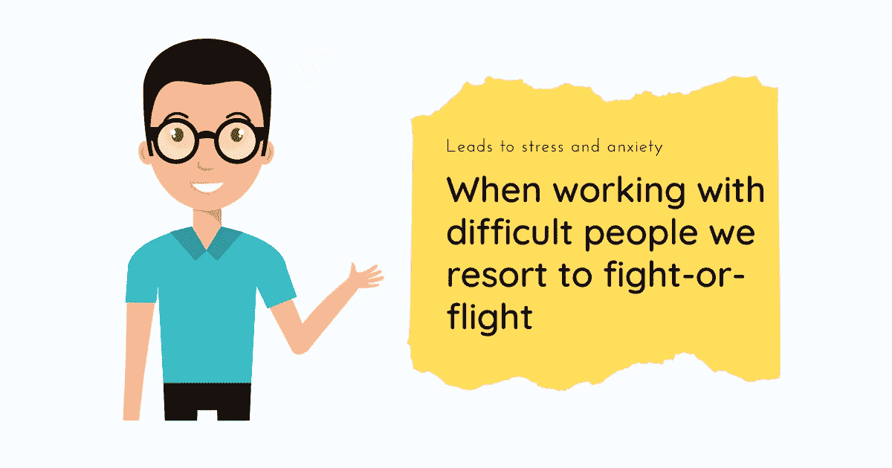
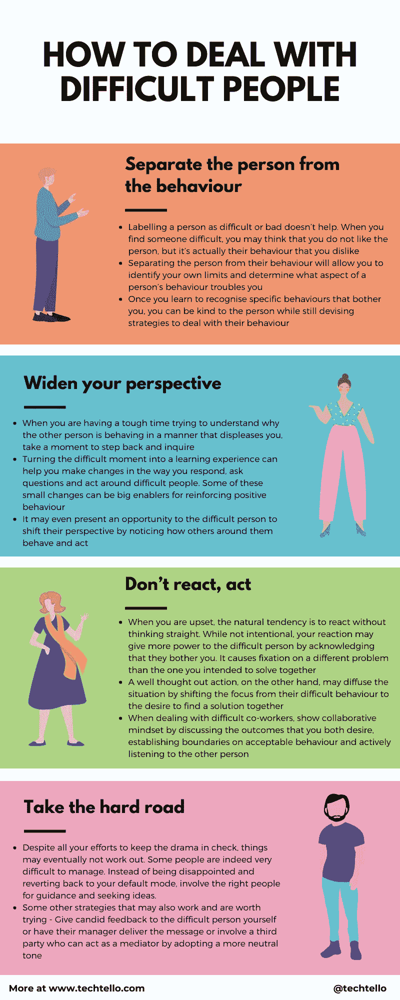

# 如何在工作中与难相处的人打交道

> 原文：<https://betterprogramming.pub/how-to-deal-with-difficult-people-at-work-ca9f09a20984>

## 了解技巧

图片来源:作者

人类是社会性动物，他们基于他人如何与他们互动来寻求个人认同。当其他人分享我们的信仰体系时，我们感觉很好，很重要，当有意见冲突时，我们会沮丧。

然后很自然地想要和和我们一样的人一起工作，我们的克隆人。

每隔一段时间，当我们遇到一些人，他们不重视我们的投入，粉碎我们的想法，忽视我们要说的话，表现得像个万事通，似乎在批评中找到乐趣，在制造混乱中找到满足感，寻找事情的消极面，这让我们感到不安。

这些所谓的难相处的人以不良的方式激怒了我们。他们的行为允许我们做出判断，并通过指责他们来推卸责任。毕竟是他们的错。

希腊斯多葛派哲学家爱比克泰德曾经说过:“人们不是被事物困扰，而是被他们对事物的看法困扰。”

虽然难相处的人是生活中的现实，我们对他们的一切感觉都可能是真的，但责备他们，让他们为我们没有达到目标负责，假装我们因为一些刻薄的同事而没有成功，这真的符合我们的最佳利益吗？

有没有更好的方法与难相处的人共事？我们能不能从一个做出判断的批评家或处于防御状态的受害者转变为一个负责任的成年人，与不同类型的人一起工作？

在开始采取策略之前，让我们先了解一下在难相处的人面前我们是如何思考、行动和表现的。除非我们了解自己的心态，否则我们试图付诸实践的任何策略都将是肤浅的。它不会解决我们潜在的情绪，这是在与我们觉得困难和具有挑战性的人一起工作时需要处理的最重要的方面。

> “如果我们不能审视那些态度和行为所源自的基本范式，那么从长远来看，试图改变外在的态度和行为没有什么好处。尽管我们认为自己看事物的角度清晰客观，但我们开始意识到，其他人看事物的角度与自己同样清晰客观的观点不同。我们站在哪里取决于我们坐在哪里。"
> 
> —斯蒂芬·R·科维的《高效人士的 7 个习惯》

# 我们如何与难相处的人打交道？

图片来源:作者

我们有个人过滤器，决定我们如何看待这个世界和其中的人。我们如何与他人相处取决于我们自己的个性、期望、背景和经历。

有些人会立即点击并联系我们，很难理解或合理解释我们为什么信任他们。还有一些我们不喜欢的人，当我们和他们握手的时候，我们内心的声音在耳边低语:“我不会喜欢这个人的。”

为什么我们发现某人很难相处是一件非常私人的事情。这并不意味着没有很大程度上不受欢迎的人，但他们非常罕见。

一旦我们的思维带我们走上情感之路，我们就会片面地看待问题。当与难相处的人打交道时，记住这个技巧(T-标记，R-正义，I-意图，C-确认，K-敏锐)框架，它驱使我们以特定的方式行事:

## t——标记导致分类

难道不容易注意到别人的缺点而忽略自己的缺点吗？

我们很快就给别人贴上标签——他贫穷、控制欲强、虚伪、欺骗、自命不凡、居高临下、愤世嫉俗、说谎、固执己见、傲慢、爱争论。

> “我们通过他人的行为来判断他人，但我们认为我们拥有关于自己的特殊信息——我们知道自己内心‘真正的样子’,所以我们很容易找到方法来解释我们的自私行为，并坚持认为我们比别人更好的幻想。”—乔纳森·海特，幸福假说

我们没有尝试去理解其他人，什么对他们来说是重要的，他们的信仰体系是什么，以及是什么驱动了这种行为，我们把人们放在桶里。

给人贴标签发生在我们大脑中自动运行的部分，没有我们的意识。这有助于我们的大脑在与他人打交道时应用捷径。

将人分为容易相处的(安全的)或难相处的(危险的)会让我们的大脑以特定的方式行动。

## r——要求拒绝的正义

当我们发现某人很难相处时，我们的身体会绷紧。我们不仅失去了身体的灵活性，也失去了反应的灵活性。

我们开始相信我们的感觉，我们想要的，以及为什么其他人应该以某种方式被对待。一旦我们拒绝他们，我们也开始拒绝他们的想法。我们坚持自己的立场。

> ““…他为维护自己的通行权而死/他是对的，完全正确，当他加速前进时，/但他死了，就像他错了一样。”当你在辩论中加快速度时，你可能是对的，完全正确；但是就改变别人的想法而言，你可能会像你错了一样徒劳无功。"
> 
> —戴尔·卡内基，如何赢得朋友和影响他人

固定的观点使我们能够合理解释为什么这个人会这样做。

## I —由假设驱动的意图

一旦我们知道自己是对的，而对方确实很难相处，我们就很容易认为他们是出于恶意。

汉隆剃刀说:“永远不要把可以用无知、无能、疏忽、误解、懒惰或其他可能的原因充分解释的不良意图归咎于他人。”

如果不把汉伦剃刀作为理解他们行为和寻找替代观点的心理模型，我们就假设不良意图是问题的根源。

我们选择生活在自己的假设中，没有表现出理解他人及其行为的意图。

*难*在我们心中成为*坏*的代名词，这进一步强化了我们的信仰体系。

## c——确认我们的信念

一旦我们给某人贴上难以相处的标签，每一次互动都是对我们信念的确认。确认偏见占了上风，因为我们在所有的讨论中都坚持自己的看法。

它引导我们拒绝与我们的信念相矛盾的证据，并寻找强化我们观点的信息。

无论这个人做了什么或说了什么，都会被带着偏见的眼光看待，这强化了他们困难的行为，尽管这种互动可能是完全正常的。

我们坚持自己的第一印象，而不是试图从不同的角度看待每一种情况。

## k——修复他人的热情

我们不会审视自己来决定是什么导致了他人的特定行为。在不改变自己行为的情况下，我们期望别人以某种方式行动。

假设对方是错的，会导致解决问题的欲望。

他们可能有错，但我们不能修复别人。我们能做的最好的事情就是掌控我们能控制的事情。

> “在相互依赖的情况下，许多因素不在你的关注范围内——问题、分歧、环境、他人的行为。如果你把精力集中在那里，你会耗尽它们而没有什么积极的结果。但是你总是可以先寻求理解。那是你能控制的事情。当你这样做时，当你专注于你的影响圈时，你真的，深深地了解了其他人。你有准确的信息可以利用，你能迅速抓住问题的核心，你能建立情感银行账户，你能给人们提供他们需要的心理氛围，这样你们就能有效地合作。”
> 
> —高效能人士的 7 个习惯中的斯蒂芬·R·科维

请记住，我们的大脑利用这些技巧来帮助我们理解这个世界和其中的人。给某人贴上难以相处的标签并坚持下去是让你的大脑自动运转，而掌控局面需要有意识的努力和深思熟虑。

# 当我们与难相处的人交往时会发生什么？

图片来源:作者

杏仁核是我们大脑边缘系统中较老的部分，负责处理情绪，它不太擅长区分真实的危险和感知的危险。

当与难相处的人打交道时，杏仁核会将其视为一种威胁，从而引发战斗或逃跑反应，作为应对危险的机制。

我们要么试图通过本能反应而不是深思熟虑的反应来对抗这种行为，要么在没有解决问题的情况下逃离这种情况。每次这样的互动都会释放压力荷尔蒙，导致心跳加速、呼吸加快、肌肉紧张和焦虑。

它还会耗尽我们的精力，让我们感到筋疲力尽，并导致过度思考，使我们陷入困境，偏离重要的工作，从而影响我们的生产力。

# 应对难相处的人的 4 个策略

我们可能没有意识到，我们对自己的思想和行为拥有至高无上的权力，这影响着我们周围其他人的行为。正如 Mike Bechtle 博士在《如果你不给他们钥匙，他们不会让你发疯》一书中所提倡的，“这意味着我们在关系的这一方工作，不管另一方发生了什么。我们不会改变它们；我们改变自己。”

想让别人改变看起来似乎是对的，但这是极其困难的。所以，通过遵循这四种做法来应对难相处的人，控制你能做的，不要再去想你不能做的。

## 1.将人与行为分开

给一个人贴上“难相处”或“坏”的标签于事无补。当你发现某人很难相处时，你可能会认为你不喜欢这个人，但实际上你讨厌的是他们的行为。

将这个人与他们的行为分开，会让你发现自己的局限，并确定一个人行为的哪一方面让你烦恼。

每当你遇到一个难相处的人时，把这作为一种练习，可以帮助你画出图案。困扰你的是完美主义者，还是过于咄咄逼人和大声喧哗的人？那些忽视情感暗示的极度逻辑型的人，或者那些坚持常规并害怕被破坏的人呢？或者可能是文化上的不合群？

一旦你明白了这一点，你就可以善待这个人，同时还能设计出应对他们行为的策略。

它还通过帮助你转换你使用的语言来实现健康的对话。说“我觉得你很讨厌”和说“你提出的想法没有考虑到……”有很大的不同

第一种说法是关于人的，可以瞬间让他们产生防御心理，而第二种说法是关于他们的想法，邀请对方进行健康的辩论。

## 2.拓宽你的视野

当你很难理解为什么别人的行为让你不高兴时，花点时间后退一步。不要下判断，要探索答案。

通过问这些问题来拓宽你的视野:

*   为什么我会有这种感觉？
*   对方在这种情况下是什么感受？
*   我的偏见是如何发挥作用的？
*   我能跳过一些事实吗？
*   我如何促成这种行为？
*   我的感觉是错的怎么办？
*   这种情况和这个人教会了我什么？
*   他们在我身边会感到不安全吗？

> “自我意识使我们能够站在一边，甚至审视我们‘看’自己的方式——我们的自我范式，最基本的有效性范式。它不仅影响我们的态度和行为，也影响我们如何看待他人。它成为我们描绘人类基本本性的地图。”
> 
> —斯蒂芬·R·科维的《高效人士的 7 个习惯》

把困难的时刻变成一次学习的经历可以帮助你改变回应、提问和与难相处的人相处的方式。这些小变化中的一些可以成为强化积极行为的重要因素。

它甚至可以给难相处的人一个机会，通过观察周围的人如何表现和行动来改变他们的观点。

## 3.不要反应，要行动

当你心烦意乱时，自然倾向于不加思考就做出反应。虽然你不是故意的，但你的反应可能会给难相处的人更多力量，承认他们打扰了你。这会导致你专注于一个不同的问题，而不是你打算一起解决的问题。

另一方面，一个深思熟虑的行动可能会将注意力从他们的困难行为转移到一起寻找解决方案的愿望上来，从而缓解这种局面。

与难相处的同事相处时，通过以下方式展现合作精神:

*   讨论你们都想要的结果
*   建立可接受行为的界限
*   积极倾听他人的声音
*   将焦点从戏剧转移到一起寻找解决方案

推动结果的是行动，而不是反应。

## 4.走艰难的路

尽管你尽了最大努力来控制事态发展，但事情最终可能不会有结果。有些人确实很难管理。

不要失望，回到你的默认模式，让合适的人来指导和寻求想法。

其他一些策略也可能有效，值得一试:

*   自己给难相处的人坦率的反馈，或者让他们的经理传达信息。
*   通过采用更中性的语气，让能够充当调解人的第三方参与进来。

人类是复杂的、非理性的生物，我们不是魔术师，不会把每个人都变成我们的克隆体。

但是我们可以通过控制自己在难相处的人面前的行为来给我们的生活增添一点魔力。

你在工作和生活中是如何管理难相处的人的？

# 摘要

