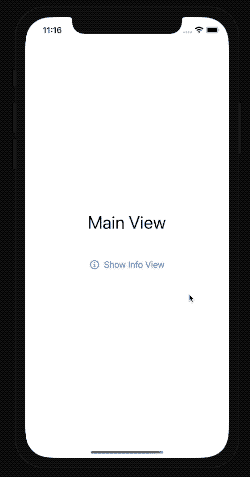
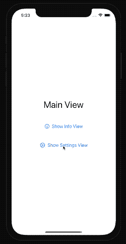

# 如何在 SwiftUI 中处理模态视图

> 原文：<https://betterprogramming.pub/how-to-deal-with-modal-views-a-k-a-sheets-with-swiftui-5c4cca7862d6>

## 关于床单你需要知道的一切


照片由 [Dries De Schepper](https://unsplash.com/@driesdeschepper) 在 [Unsplash](https://unsplash.com/?utm_source=medium&utm_medium=referral) 上拍摄。

当在屏幕上显示一小段额外信息时，显示模态视图是必不可少的。有了 UIKit，我们可以用`presentViewController:animated:completion:` [函数](https://developer.apple.com/documentation/uikit/uiviewcontroller/1621380-presentviewcontroller)来做这件事。

然而，当使用 SwiftUI 时，我们需要将我们的思维转向使用视图或环境状态，因为模态视图现在被称为工作表。

让我们详细检查一下。

# 打开模式视图(又名图纸)

SwiftUI 表帮助我们向用户展示一个模态视图。`sheet`是[视图展示](https://developer.apple.com/documentation/swiftui/view-presentation)的实例方法。它描述了我们如何展示 SwiftUI 视图，涵盖具体的用户旅程场景。

假设我们想要向用户显示关于我们的应用程序的信息。

首先，我们需要定义应用程序是否应该显示模态视图，用`Bool`值绑定它。

这里的关键字是“应该”，因为一旦我们忽略它，呈现的视图值将被设置回`false`。这个值用一个`@State`属性包装器修饰，或者可以来自`ObservableObject`视图模型。为了简单起见，我们不打算在这篇文章中讨论视图模型。

其次，我们需要改变视图，或者在某些情况下，改变环境状态。一旦我们使用了`@State`属性包装器，我们只需将其设置为`true`，SwiftUI 将完成剩下的工作来呈现模态视图。

让我们看看如何在代码中做到这一点:

当我们运行应用程序时，我们现在可以打开模式视图并查看详细信息:



# 以编程方式关闭模式视图

我们的应用程序用户可以简单地向下滑动模态视图，它将隐藏一个漂亮的动画。将状态设置为`false`以隐藏负责显示模态视图的视图。

现在，我们如何从模态视图本身做到这一点呢？我们有两种选择:

*   使用`@Environment`属性`presentationMode`。
*   将状态作为绑定传递给模式视图。

## 使用环境

属性包装器`@Environment`允许我们读取和更改视图环境状态的值。为了隐藏模态视图，我们需要更改`presentationMode`属性。首先，我们需要定义我们的视图。为此，我们将它添加到模式视图属性中。要消除模态视图，我们需要改变呈现模式包装值:

这种方法相当麻烦，而且处理环境属性可能会导致难以跟踪和调试的意外问题。

## 使用绑定

在呈现模式视图的视图和模式视图本身之间使用绑定是另一种从代码中隐藏它的方法。

首先，我们需要使用`@Binding`属性包装器向模态视图结构添加一个新属性。这说明这个值来自视图范围之外的其他地方。

现在当我们初始化`ModalView`时，我们需要通过`isPresented`:

```
.sheet(isPresented: $showInfoModalView) {
    InfoView(isPresented: $showInfoModalView)
  }
```

使用这种方法，我们可以确定这个变量只属于这两个视图。测试和调试更加简单。

# 一个 SwiftUI 视图上的多个工作表

现在我们知道了如何呈现一个模态视图，但是如何显示多个模态视图呢？

假设我们希望从主应用程序视图中呈现应用程序和设置视图的相关信息。

我们可以通过以下两种方法实现这一点:

*   使用多张纸展示功能。
*   使用`Identifiable`枚举保持当前显示的工作表的状态。

## 一个 SwiftUI 视图中的多个工作表功能

我们可以将`sheet`功能附加到任何 SwiftUI 视图或控件上(例如，附加到`Button`):

有两个按钮可以很好，但假设我们有更多的按钮。这会变得相当混乱，所以我们应该处理许多`@State`变量。

## 使用所有模态视图的枚举

如果我们看苹果的官方文档，还有另外一个[函数](https://developer.apple.com/documentation/swiftui/view/actionsheet(item:content:))显示一张表。让我们试着使用它。

首先，我们将定义一个包含所有模态视图选项的`enum`:

```
enum Sheet: Identifiable {
    case info
    case settings
  }
```

现在我们可以在 SwiftUI 视图中使用它。我们需要一个可选类型为`Sheet`的新`@State`变量，并使用它来确定我们想要呈现哪个模态视图:

我们不需要在这里停下来。我们可以通过向`Sheet`枚举添加一个计算属性来整理这段代码:

然后我们可以在打开工作表时使用它:

```
.sheet(item: $activeSheet) { $0.modalView }
```

使用闭包中新奇的 keypaths 功能，我们可以进一步简化:

```
.sheet(item: $activeSheet, content: \.modalView)
```

对这种方法的一个警告是，我们需要改变我们过程的一部分来隐藏代码中的视图。为此，我们将其设置为`nil`而不是`false`。

这种方法要安全得多，因为我们使用枚举类型来保持一切井井有条。

让我们看看它的实际效果。



# TL；速度三角形定位法(dead reckoning)

SwiftUI 中的模态视图是使用视图或控件上的`sheet`修饰符来呈现的。最简单的方法是用一个`@State`属性来指示它何时应该可见。

为了隐藏模态视图，我们可以使用环境参数或者向模态视图对象传递一个绑定。显示多个表可以通过使用多个表修饰符或者使用一个具有所有可能的模式视图枚举的对象来实现。

# 资源

*   [演示应用——我们讨论的所有内容都有多个分支](https://github.com/fassko/ModalViewApp)
*   [苹果官方文件](https://developer.apple.com/documentation/swiftui/view/sheet(ispresented:ondismiss:content:))
*   [如何在 SwiftUI 中有模式地展示一个表](https://www.simpleswiftguide.com/how-to-present-sheet-modally-in-swiftui/)
*   [swift ui 中的警报、动作表、模态和弹出框](https://swiftwithmajid.com/2019/07/24/alerts-actionsheets-modals-and-popovers-in-swiftui/)
*   [如何使用工作表呈现新视图](https://www.hackingwithswift.com/quick-start/swiftui/how-to-present-a-new-view-using-sheets)
*   [如何在 SwiftUI 中管理多张表](https://masilotti.com/multiple-sheets-swiftui/)
*   [线程进入堆栈溢出](https://stackoverflow.com/questions/58837007/multiple-sheetispresented-doesnt-work-in-swiftui)
*   [多张纸的枚举](https://www.youtube.com/watch?feature=player_embedded&v=7dZfpAn_P2g)
*   [多张纸](https://github.com/davdroman/MultiSheet)