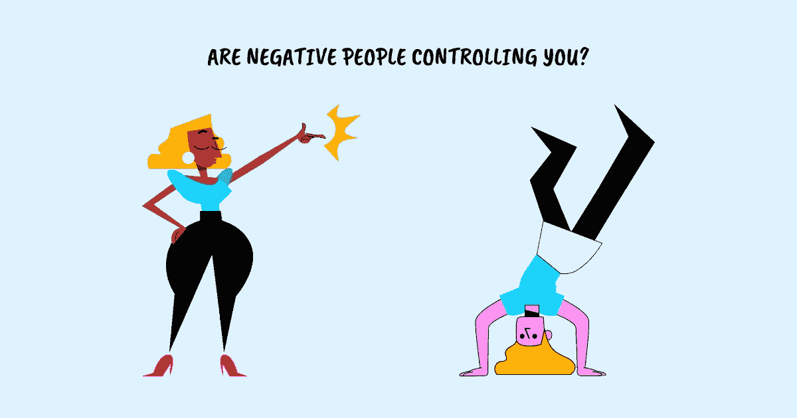

# 如何对付消极的人而不发疯

> 原文：<https://betterprogramming.pub/how-to-deal-with-negative-people-without-going-crazy-dbfe6f3ae1df>

## 对付消极的人的 6 个策略

鸣谢:作者

如果你身边的人有不断抱怨的倾向，他们用消极的观点将完美的结果变成令人不满意的结果，那些过分挑剔或用攻击性的评论、有害的行为和悲观的态度对待一切的人，这些消极的人可能已经控制了你的情绪，限制了你的成就。

想一想。这些因素中有哪些适合你吗:

*   你是否花了大量的时间去抱怨他们，而不是用这些时间去采取建设性的行动？
*   你是否因为一遍又一遍地在脑海中与消极的人对话而过度思考？
*   一想到要再次面对它们，你会感到强烈的情绪和极度的不适吗？
*   在他们面前，你会因为行为方式与你的价值观不符而变得与众不同吗？
*   遇到他们后你会觉得很难平静下来吗？
*   它们是否经常让你发疯，夺走你理性思考和行动的能力？

你花越多的时间思考、抱怨和折磨消极的人，你就越允许他们掌控你的生活。通过给他们太多的权力来控制你的经历、你的感受和你的行为方式，你让这些消极的人来决定你如何度过你的一天和时间。

消极会传染。一开始可能并不明显，但如果你在消极的人周围不小心，很容易陷入他们的思维方式。如果听之任之，他们愤世嫉俗、悲观和失败主义的行为会耗尽你的情绪，影响你的工作效率，并把你变成你一开始讨厌的那个人。

> 我们将无法消除生活中的戏剧性或逃避所有的疯狂。但是我们实际上可以学会积极地生活，而不是被动地生活，在别人消极的时候保持积极——迈克·贝克特尔

# **1。注意安全**

当你对自己的能力充满信心时，消极的人可能会用他们伤人的评论或愤世嫉俗的态度暂时让你感觉不好，但他们不会让你失望。

他们不会自我怀疑，也不会阻止你追求你想要的东西，因为他们的消极态度反映了他们自身的不安全感，丝毫不会限制你能做什么和不能做什么。

一般来说:当你发现自己被他们的行为困扰时，把你的注意力放回自我，提醒自己有信心、勇气和坚持就能实现的事情。

# **2。不加判断地倾听**

当与一个消极的人交往时，很容易从假设和观点开始，这通常会使情况恶化。

然而，当你不带判断，带着同情去进行对话时，你给了自己空间来引导对话走向更好的结果。

> 除非对方觉得自己被倾听和理解，否则你无法将谈话引向更积极的方向。除非你认真倾听，否则他们不会感到被倾听和理解——道格拉斯·斯通，《艰难的对话》

通过认真倾听他们要说的话，你可以辨别出他们是真的需要你的建议，还是只是想被听到。给一个没有心情的消极的人主动的建议只会适得其反。

不带判断地倾听的另一个好处是，它使你能够通过谈论未来和他们可以采取的步骤来重新引导谈话，同时放下过去发生的事情。问他们一些问题，帮助他们从消极的思路转向积极的思路。重构负面语言有助于将注意力转移到从这些经历中学习，并利用它们来设计更好的未来。

例如:如果他们抱怨他们的老板让他们的生活变得痛苦不堪，问问他们采取了什么措施来改变他们的处境。如果他们对结果持否定态度，询问他们如何做才能取得更好的结果。如果他们不停地告诉你为什么有些事情可能行不通，问问他们会做出什么改变来使之成为可能。

一般来说:停止评判他们的消极态度和行为，寻找积极参与谈话的方法。

# **3。掌控你的时间**

> 我们都经常想容易想到的事情，而不是正确的事情——大卫·洛克，你的大脑在工作

消极的人消耗了太多的精神能量，以至于你没有意识到你花了多少时间去思考和哀叹他们的行为和行动，即使他们不在你身边。

你有没有发现自己一遍又一遍地想着与一个消极的人的某次谈话:

*   她为什么这么说？她不信任我吗？
*   他为什么会这样？
*   我做错了什么让她对我的想法如此刻薄和消极吗？

你可能会被他们的行为和话语深深地吸引，以至于你让他们占用了你的工作时间。让他们控制你的情绪和思维过程会增加他们对你生活方式的控制力。

分散和重新控制你的时间的唯一方法是通过有意识地观察你如何度过你的时间来拒绝他们的这种力量。

一般来说:抓住那些围绕着消极的人的行为和行动的想法，有意识地将它们导向做有意义的工作和采取积极的行动。

# **4。带着意图行动，不要做出反应**

当你有目的地行动，而不对消极的人的行为做出反应时，你就分散了他们的消极情绪，并带走了影响你的力量。

当你有选择的时候，争取时间保持头脑清醒，优雅地处理它们。你不必对他们的消极做出轻率的回应。小心而机智地处理它们。你越不在乎他们的消极行为，你就越能获得引导自己采取建设性行动的力量。

最终，当他们看到这对你没有影响时，他们可能会停止咆哮，把它们带到其他地方。

一般来说:在一个消极的人身边，注意你的身体语言和语调。确保它不会传达出对消极的人的不舒服、不愉快或任何形式的怨恨。

# **5。设置边界**

到目前为止，我提到的所有策略都只在一定程度上起作用，因为我们所有人对负面情绪的容忍程度都是有限的。除非你对自己生活中的消极因素非常小心，否则在某些时候它会战胜你。

设定界限，什么是你允许的，什么是完全不能接受的。当别人越过这些界限时，要友好礼貌地让他们知道。采取积极主动的措施远离消极情绪，限制接触，对这种情绪容易高涨的活动说不。

> 当我们未能设定界限并让人们承担责任时，我们会感到被利用和被虐待。这就是为什么我们有时会攻击他们是谁，这远比针对一种行为或一个选择更具伤害性

当我试图控制自己对一个消极的人的反应时，有一个诀窍一直对我有效，那就是说“我现在不能清楚地思考。我们可以稍后再联系，进一步讨论这个问题。”这给了我时间来精心准备一个谨慎的回应，也给了我空间来防止自己对他们的行为反应过度，或者说一些我以后会后悔的话。

一般来说:通过确定你的容忍度并保持在这个范围内来限制你对消极的暴露。

# **6。接受责任**

最后，责怪消极的人对你没有好处。责备只会将你的注意力从寻找解决方案转移到表现得像个受害者。在你意识到之前，采取一种受害者的心态会让你变成你最开始讨厌的那个人。

试图修复一个消极的人也不会有帮助。你不能控制别人，但你绝对可以控制自己对别人的反应。对你在他们面前的行为负责。

通过承担责任，你在你的影响范围内行动，在那里你有能力控制你的想法，并使你的行动朝着积极的方向。

> 专注于我们力所能及的事情会放大和增强我们的力量。但是，每一盎司的精力都浪费在我们实际上无法影响的事情上——自我放纵和自我毁灭——瑞安·霍利迪，障碍在于方式

一般来说:关注你能控制的事情，不要担心你不能控制的事情。

## 摘要

1.  你不能完全避开生活中消极的人，但你可以学会和他们一起工作。
2.  如果你没有有意识地与消极的人相处，你会让他们控制你的情绪，从而影响你的感受和成就。
3.  对付一个消极的人的第一步是感到自信。当你对自己的能力和技能有信心时，一个消极的人就不会把你拖垮。
4.  接下来，仔细听他们要说什么。没有判断，你就创造了机会将它们从问题模式转换到解决模式。
5.  有意识地优先安排你的时间。通过投资于建设性的行动，你就剥夺了他们消耗你生产时间的能力。
6.  用一个经过深思熟虑的回应，小心而机智地处理他们，驱散他们的消极情绪。他们对你的影响越小，他们就越不愿意和你分享他们的咆哮、愤世嫉俗和失败主义行为。
7.  设定界限以继续有效。没有人能容忍极端的消极而不受影响。知道自己的极限。
8.  最后，从责备他人转变为对自己的反应负责。你不能改变别人，但是你可以改变你在他们面前的行为。

在 Twitter 上关注我，了解更多故事。

*这个故事最初发表于*[*【https://www.techtello.com】*](https://www.techtello.com/how-to-deal-with-negative-people/)*。*