# 如何使用 Pandas 和 Plotly Express 处理时间序列

> 原文：<https://betterprogramming.pub/how-to-deal-with-time-series-using-pandas-and-plotly-express-45b6848432df>

## 处理时间序列数据

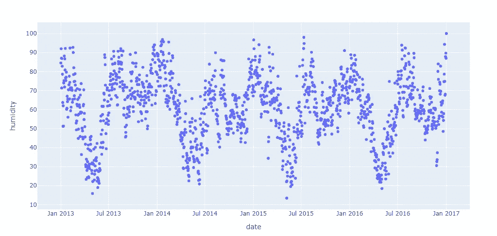

作者图表。

# 概观

*   时间序列分析导论
*   熊猫时间序列索引
*   使用 plotly express 的可视化
*   熊猫功能，如`resample`、`rolling`、`shift`

# 介绍

如果您使用 Python 处理时间序列数据，您应该知道一些技巧来避免计算开销大的操作。幸运的是， [pandas](https://pandas.pydata.org/) 是一个可以应用很多有用函数的库。我认为在进行更复杂的分析，如特征提取和预测之前，对时间序列可能做的事情有一个概述是很重要的。

在本文中，我将展示 pandas 时间序列最强大的优势之一是 datatime 索引，它有助于以直观和简单的方式选择特定日期的数据。此外，我们还需要使用 Plotly Express 进行基本的探索性可视化，它在分析时间序列中起着重要的作用，因为它允许检测模式并最终检测异常值。

稍后，我将介绍三个函数，它们有助于在处理这类数据时提高 Python 代码的速度。这是我个人面临的问题，我想帮助那些需要处理时间序列数据的人。

## 目录

1.  [导入数据](#09db)
2.  [时间序列指标](#fbc6)
3.  [可视化](#58e0)
4.  [重采样](#25fb)
5.  [滚动](#d173)
6.  [换档](#86d3)

# 1.输入数据

我们可以开始导入库和数据集。我们将使用 Kaggle 中的一个数据集，名为“每日气候时间序列数据”它提供了 2013 年至 2017 年印度德里的天气数据。

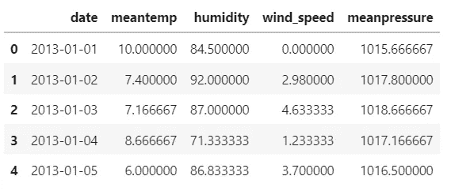

从数据集的预览中，我们可以看到有五列:日期、平均温度、湿度、风速和平均气压。我们还可以可视化列的数据类型:

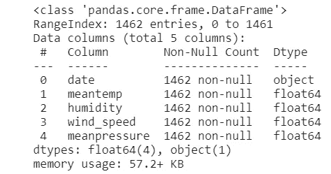

为了方便地从日期字段中提取信息，我们需要将它转换成一个`DateTime`对象，因为它仍然是一个对象。稍后，我们可以将日期列作为索引，因为每一行对应不同的日期。

现在，我们可以创建包含相应年、月、日的单一特征，所有这些都是从日期中提取的。

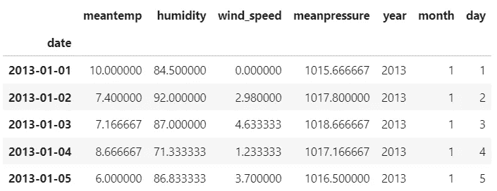

# 2.时间序列指数

在`DataFrame`中使用日期作为索引的一个好处是可以提取单个日期的数据或者连续日期的数据。

下面，我使用字符串`‘2014–07–07’`选择数据。

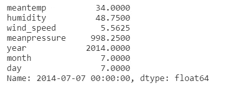

现在，我将在数据集中选择从`‘2014–07–07’`到`‘2014–07–14’`的一周。为此，我们使用一个带有标签`'2014–07–07':’2014-07-14’`的切片对象，其中包含了开始和停止两个极端(仅当出现在索引上时)。

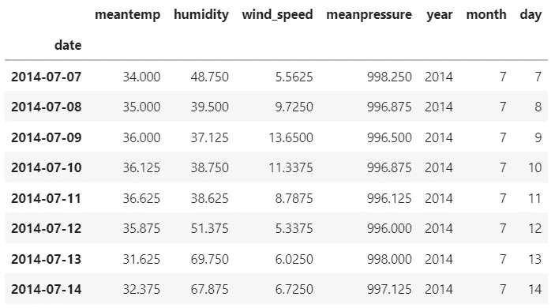

# 3.形象化

我们可以用 pandas 和 [Plotly Express](https://plotly.com/python/plotly-express/) 来可视化我们的四个时间序列。看这些图很重要，因为它们可以让你看到时间序列在一段时间内的表现。

让我们创建一个德里平均气温完整时间序列的散点图:

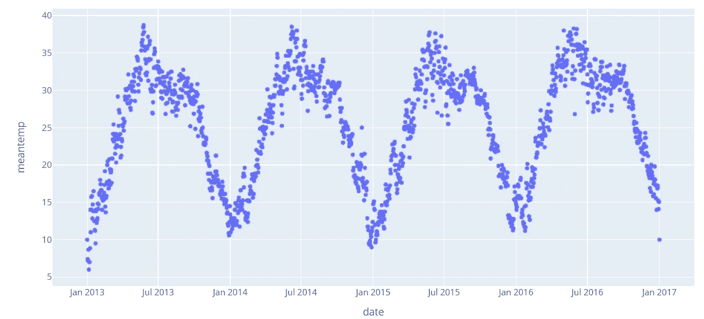

为了可视化更多的时间序列，我们可以使用`make_subplots`功能。

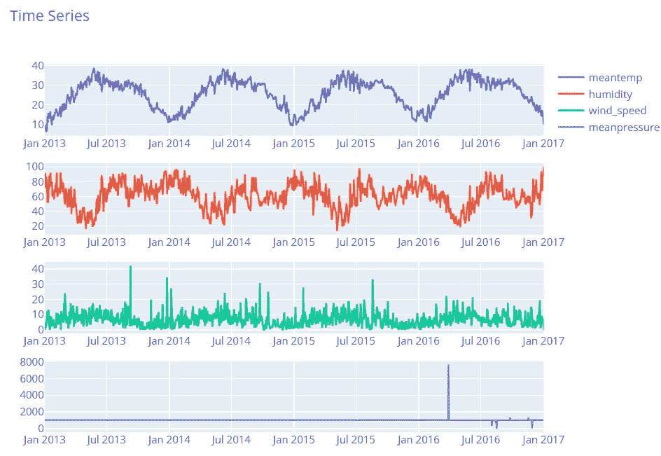

很明显:

*   平均温度七月较高，一月较低。此外，这一时间序列多年来有重复的模式。
*   一月份湿度较高，七月份湿度较低。作为平均温度，这一系列呈现重复的模式。
*   随着时间的推移，风速似乎具有不规则的行为。有些年份一月份会有一些峰值，而有些年份则是在七月份。
*   这些年来，平均压力似乎是恒定的，除了 2016 年的一些峰值。

# 4.重新取样

有时，改变频率，对数据进行重新采样会很有用。常见的选择是下采样。例如，在我们的例子中，我们有每日数据，并将其转换为每月数据。

我们可以选择每月的第一天，这里`'MS'`是指月开始的频率。

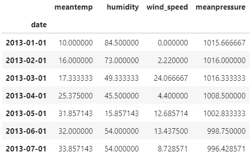

如果我们想选择每个月的最后一天，我们使用`'M'`，它指的是月末频率。

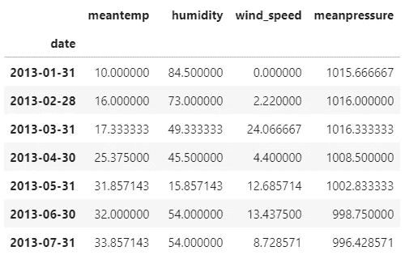

我们还可以通过将`first()`替换为`mean()`来获得月平均时间序列:

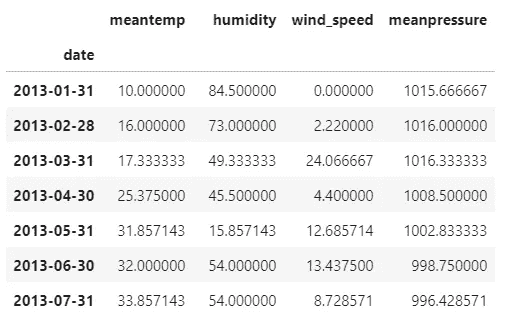

# 5.旋转

与`mean`函数一样，`rolling`函数可用于将数据划分为多个时间窗口，并使用统计数据汇总每个窗口中的数据。但与`resample`不同的是，滚动窗口滑过数据。

我们可以计算每日数据的 30 天滚动平均值。添加参数`center=True`来标记每个窗口的中点。

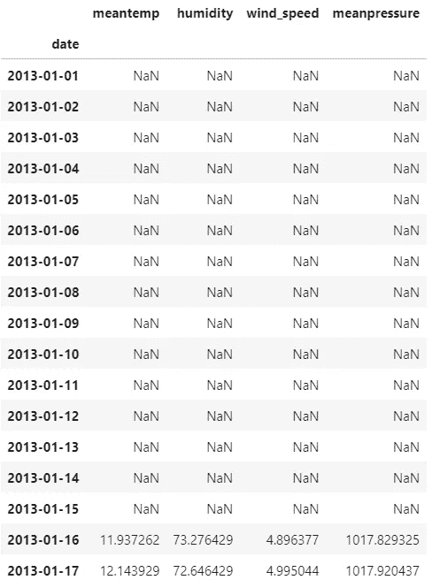

我们还可以获得每日数据的年度滚动平均值，即 365 天。

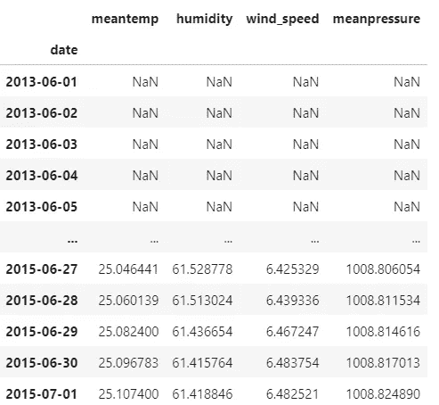

现在，我们可以在一个独特的图中显示每日序列、30 天序列和每年滚动平均时间序列:

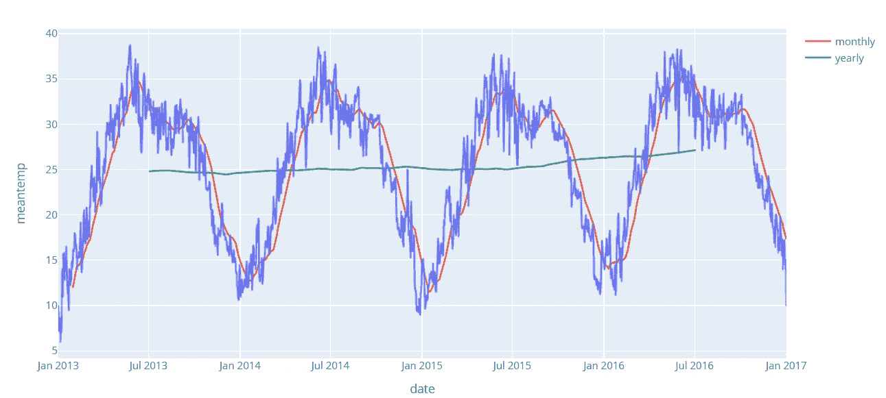

我们可以观察到，30 天的滚动平均值保留了年度季节性，而 30 天内的变化略有丢失。

相反，从 365 天的滚动平均时间序列来看，很明显，它失去了年度季节性，行为是平坦的。

# 6.变化

另一种处理时间序列数据的方法是使用`shift`函数。其命名的原因是因为它以固定的周期数/频率移动索引。

如果我们想在不使用`for`循环的情况下比较某一列的一行和它的前一行，我们可以这样做:

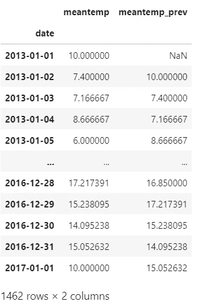

另一种可能性是将一天的平均温度与一周前的平均温度进行比较:

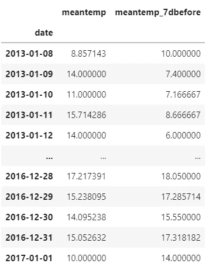

# 最后的想法

恭喜你！现在，您能够操作时间序列数据。我希望本指南有助于让您对这种类型的数据更加灵活。这篇文章中的代码可以在 Kaggle 上找到[。](https://www.kaggle.com/eugeniaanello/timeseriespandas)

感谢阅读。祝你有愉快的一天。

你有兴趣阅读其他类似主题的文章吗？下面我给你推荐这个故事:

 [## 3 Pandas 功能用于分组和汇总数据

### 导入数据并进行简单和多重聚合

better 编程. pub](/3-pandas-functions-to-group-and-aggregate-data-9763a32583bb) 

你喜欢我的文章吗？ [*成为会员*](https://eugenia-anello.medium.com/membership) *每天无限获取数据科学新帖！这是一种间接的支持我的方式，不会给你带来任何额外的费用。如果您已经是会员，* [*订阅*](https://eugenia-anello.medium.com/subscribe) *每当我发布新的数据科学和 python 指南时，您都会收到电子邮件！*