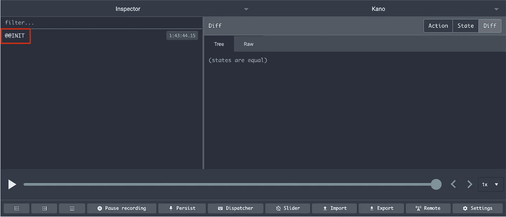

# 如何调试 React 上下文 API 应用程序

> 原文：<https://betterprogramming.pub/how-to-debug-a-react-context-api-app-547b75818754>

## 使用 Redux DevTools 扩展

由 [Unsplash](https://unsplash.com?utm_source=medium&utm_medium=referral) 上的[谷仓图像](https://unsplash.com/@barnimages?utm_source=medium&utm_medium=referral)拍摄的照片。

前段时间，我分享了当我创建一个 React 应用程序时，我是如何为上下文 API 放弃 Redux 的。这篇文章得到了一些很好的反馈，但也有人说与 [Redux DevTools](https://github.com/reduxjs/redux-devtools) 相比，它很难调试，并问我是否有一种简单的方法来做这件事。

答案是肯定的。实际上，如果 Redux 有什么了不起的，那就是 DevTools。最棒的是，我们可以用我们的 Redux-free 应用程序轻松地将它们与我们喜欢的一切联系起来，真的。

现在让我们看看它是如何工作的！

# Redux 开发工具 API

当我们安装了 Redux DevTools 后，扩展会自动在窗口中注入一个特殊的对象(`__REDUX_DEVTOOLS_EXTENSION__`)。这当然是一个奇怪的名字，但是它防止了与现有代码的任何冲突。

这就是一切开始的地方:这个对象给了我们需要的一切— `connect`和`disconnect`方法，它们将我们的代码与 Redux DevTools 链接起来。

但是，如果您只是尝试运行这些函数，您仍然会在 DevTools 中看不到任何内容，因为我们首先需要启动会话。

为此，我们利用返回`connect`方法的对象。它拥有启动 DevTools 会话的 init 方法。

基本上，它看起来像这样:

简单的 Redux DevTools 连接。

即使这样做了，您仍然在 DevTools 中看不到任何东西，因为会话在我们创建时就被关闭了。

# DevTools 提供者

为了在开发应用程序时使会话永久化，您需要一个`Provider`，如下所示:

一个基本的 Redux DevTools 提供程序。

如果您将这段代码添加到应用程序的最顶层，您将在 Redux DevTools 中看到启动会话，您可以用弹出的`@@INIT`事件来识别它。

弹出的 INIT 事件。

# 向 DevTools 发送事件

既然我们已经能够启动一个会话，下一步就是向 DevTools 发送一个事件，这和我们想象的一样简单:我们已经创建的`devTools`对象也提供了一个`send`方法，它接受一个名称和一些数据来说明变化。

基本上，它看起来像这样:

带有发送事件的简单 Redux DevTools 连接。

# 把所有东西放在一起

我们现在拥有一切让它运转起来的东西。我们将在我们的`Provider`中添加一些东西来使它真正可用:

*   一个钩子，允许简单的事件发送到 DevTools 会话。
*   一个上下文 API，因此 DevTools 可以在整个项目中使用。
*   使用默认名称值的简单发送方法。

现在在应用程序中使用非常简单。我们需要调用我们在`Provider`文件中创建的`useReduxDevtools`钩子，将初始方法包装成一个处理调试会话的高阶函数:

看看第 10 行是如何调用 useReduxDevtools 的。

瞧，Redux DevTools 中的上下文 API！

现在，当我们调用`setTheme`方法时，它会在 DevTools 中弹出，这样您就可以检查正在发生什么了！

# 结论

将任何应用程序连接到 Redux DevTools 非常容易，并且您现在就可以开始调试任何没有 Redux 的应用程序。

此外，让我们重温一下我在上一篇文章中说过的关于上下文 API 的一些内容:这是一个易于使用的 API，在许多情况下可以取代 Redux，但请记住，Redux 比上下文 API 大得多。如果你需要做出改变，明智地选择。