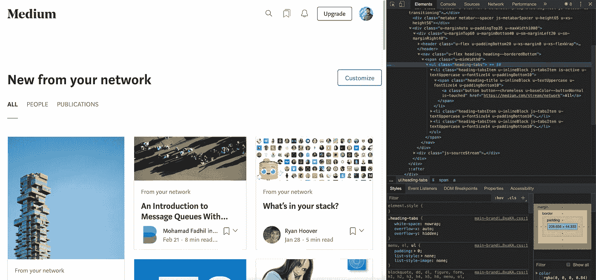
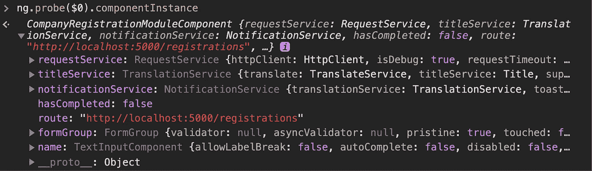

# 如何使用 ng 在浏览器控制台中调试 Angular Ivy 应用程序

> 原文：<https://betterprogramming.pub/how-to-debug-angular-ivy-apps-in-the-browser-console-with-ng-950facb490c7>

## 直接在浏览器中检查和修改角度零部件


Andrew Scherle 在 [Unsplash](https://unsplash.com/s/photos/ivy?utm_source=unsplash&utm_medium=referral&utm_content=creditCopyText) 上拍摄的照片

Ivy 是 Angular 的下一代编译和渲染管道的代号。Ivy 自动用于新的 Angular 项目和现有项目，这些项目通过 Angular CLI 更新到 Angular 9。

到目前为止，我还没有遇到与 Ivy 相关的问题，但是如果你遇到问题，你可以在你的`tsconfig.json`文件中暂时禁用它。

调试 web 应用程序有许多方法。一些人在他们的代码中插入日志记录语句，许多人使用包括强大调试器的浏览器开发工具，一些人甚至使用额外的工具和 web 扩展(例如用于 Angular 应用的 [Augury](https://augury.rangle.io/) )。

然而，如果你正在使用 Angular 框架，那么我可以推荐另一种调试 Angular 应用程序的方法。

Angular 公开了一个名为`ng`的全局变量。这个变量允许我们访问相应的角度分量。我们不仅可以看到组件属性和功能，我们甚至可以在控制台中修改它们并触发更改检测。

通过这样做，您可以避免在代码中插入不必要的日志记录语句，因为您可以直接在浏览器中查看组件状态，而无需任何其他工具。

记住`ng`只在开发模式下工作。将您的应用发布到生产环境时，您应该使用 [AOT(提前)编译](https://angular.io/guide/aot-compiler)和[启用生产模式](https://angular.io/api/core/enableProdMode)，这也会移除调试功能。

`ng`自最初发布以来一直是 Angular 的一部分。有了 Ivy，`ng`的 API 就变了。在这篇文章中，我想告诉你如何使用这个全局变量来调试 Angular 应用程序，不管你是否使用 Ivy。

在下面的例子中，我使用了`$0`，一个由 Google Chrome 等浏览器公开的全局变量，它返回最近选择的 DOM 元素。这与 Angular 没有直接关系，但是对于在开发模式下调试 Angular 应用程序非常有用。



$0 表示当前选中的 DOM 元素(在本例中是一个

# 如何获得没有角藤的组件实例

如果您的 Angular 版本早于第 9 版或 Angular 中禁用了 Ivy，则需要运行以下命令来检查选定的 Angular 组件:

```
ng.probe($0).componentInstance
```



检查角形部件(不使用 Ivy)

如您所见，我们可以在控制台中看到所选组件的属性和功能。

# 如何获得有角常春藤的组件实例

如果在启用 Ivy 的情况下使用 Angular 9 和更高版本，则需要运行以下命令来检查选定的角度组件:

```
ng.getComponent($0)
```


检查角形部件(使用 Ivy)

如你所见，使用上的差别相当小。然而，我发现新的 API 更容易理解，也更容易向其他开发者解释。

# ng 在 Ivy 中提供的其他有用功能

除了`ng.getComponent(el)`之外，新的 API 还有一些很好的功能，有时非常有用:

*   `[ng.getOwningComponent(el)](https://angular.io/api/core/global/ngGetOwningComponent)`返回所选组件的父组件。与`ng.getComponent(el)`相比，你不需要在 DOM 树中选择确切的组件。
*   `[ng.getDirectives(el)](https://angular.io/api/core/global/ngGetDirectives)`返回所选元素的相关指令。
*   `[ng.applyChanges(el)](https://angular.io/api/core/global/ngApplyChanges)`触发所选组件的变化检测。

# 结论

感谢您阅读这篇关于调试 Angular 应用程序的短文。

在我看来，Angular Ivy 通过使`ng`的功能更容易理解来改进现有的 API。你是如何调试角度应用的？请在评论中告诉我。