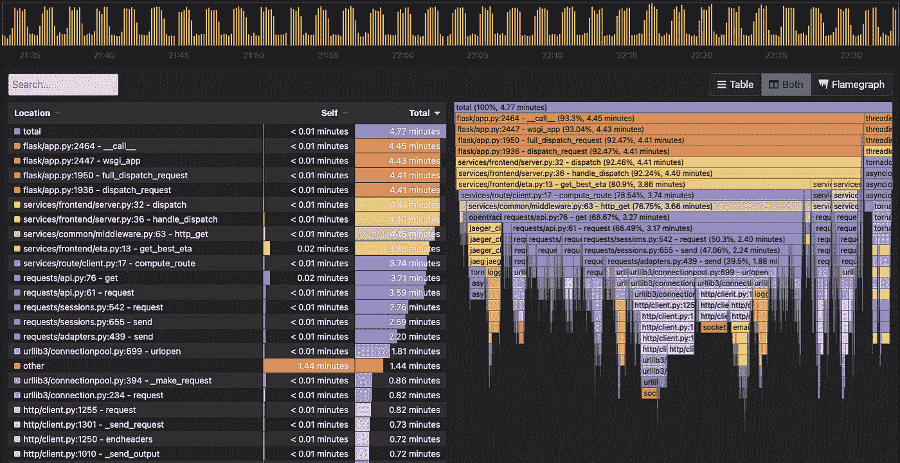
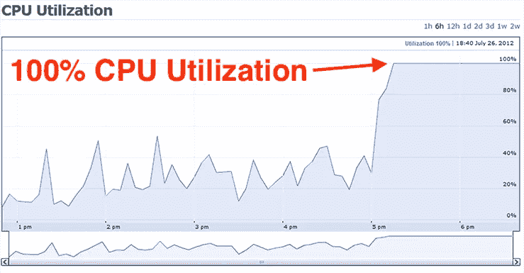
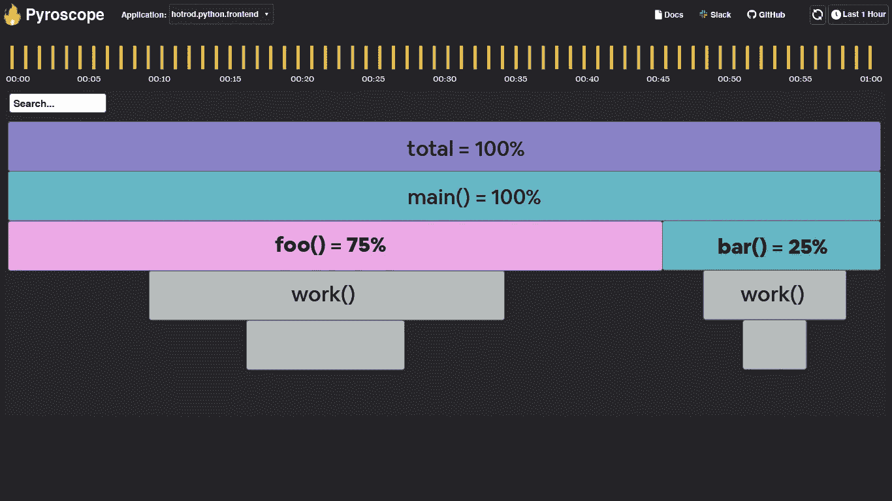
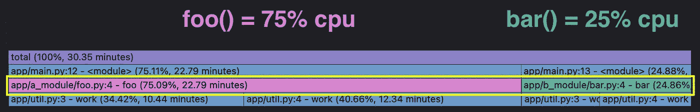
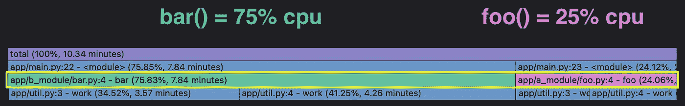
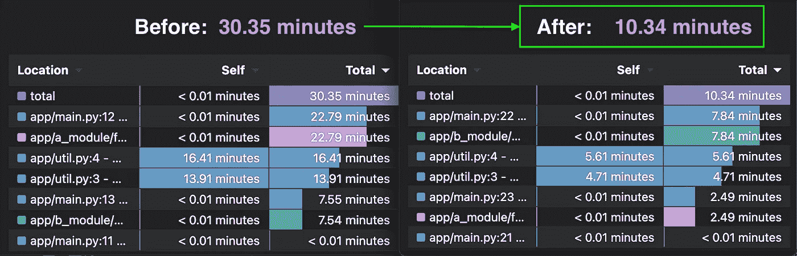

# 如何用分析器调试 Python 中的性能问题

> 原文：<https://betterprogramming.pub/how-to-debug-performance-issues-in-python-with-profilers-ae62ab9fe834>

## 使用火焰图找到问题的根源

作者照片。

> "调试就像是犯罪电影中的侦探，而你同时也是凶手."— [菲利普·福特](https://twitter.com/fortes/status/399339918213652480?lang=en)

我从个人经验中知道，在 Python 服务器上调试性能问题会令人非常沮丧。通常，增加的流量或短暂的错误会导致最终用户报告有问题。

通常情况下，*不可能*精确地复制错误发生的条件，所以我会努力找出我们的代码/基础设施的哪个部分对我们服务器上的性能问题负责。

本文解释了如何使用火焰图来持续地剖析您的代码，并准确地揭示哪些行是造成这些讨厌的性能问题的原因。

# 为什么您应该关注 CPU 性能

CPU 利用率是在云中运行软件的公司通常使用的应用程序性能指标(例如，在 AWS、Google Cloud 等上)。).

> “网飞非常关心 CPU 利用率，这是我们扩展云的关键指标。如果我们能够将 CPU 利用率降低 1%或 5%，这将是一个非常大的胜利。”—布伦丹·葛雷格，网飞高级性能建筑师

然而，较小的公司在提高性能时可以看到类似的好处，因为无论规模大小，CPU 通常与运行软件的两个非常重要的方面直接相关:

*   您在服务器上花了多少钱—您需要的 CPU 资源越多，运行服务器的成本就越高。
*   最终用户体验—服务器 CPU 的负载越大，网站或服务器的速度就越慢。

因此，当您看到如下所示的 CPU 利用率图表时:

如果您的 CPU 利用率看起来像这样，那可能是不好的。

在 100% CPU 利用率期间，您可以假设:

*   最终用户的体验令人沮丧(即应用/网站加载缓慢)。
*   在您配置新服务器来处理额外负载后，服务器成本会不断增加。

代码的哪一部分对 CPU 利用率的增加负责？这就是火焰图的用武之地！

# 如何使用火焰图调试性能问题(并在服务器上节省 66K 美元)

假设下面的火焰图表示与上图中 CPU 使用率达到峰值的“事件”相对应的时间跨度。在此峰值期间，服务器的 CPU 消耗:

*   在`foo()`中有 75%的时间。
*   25%的时间在`bar()`中。
*   10 万美元的服务器成本。

您可以将火焰图想象成一个超级详细的饼图，其中:

*   火焰图的宽度代表 100%的时间范围。
*   每个节点代表一个功能。
*   最大的节点占用了大部分 CPU 资源。
*   每个节点都由它上面的节点调用。

在这种情况下，`foo()`占据了总时间范围的 75%,所以它是最容易摘到的果子。我们可以改进`foo()`和它调用的函数，以减少我们的 CPU 使用量(并节省资金)。

# **用火镜创建火焰图形和表格**

为了用实际代码重现这个例子，我们将使用[pyro scope](http://pyroscope.io)——一个专门为调试性能问题而构建的开源连续分析器。

为了模拟服务器工作，我创建了一个`work(duration)`函数，模拟在传入的持续时间内工作。这样，我们可以通过从下面的代码生成这个火焰图来复制花费 75%时间的`foo()`和花费 25%时间的`bar()`:

然后，假设您优化了代码，将`foo()`的时间从 75，000 减少到 8，000，但是代码的其他部分保持不变。新代码和火焰图如下所示:

# **改进 foo()节省了 66000 美元**

感谢火焰图，我们能够立即识别出`foo()`是我们代码中的瓶颈。优化之后，我们降低了 CPU 的使用率。

这意味着您的总 CPU 利用率下降了 66%。如果您为您的服务器支付 100，000 美元，您现在只需 34，000 美元就可以管理相同的负载。