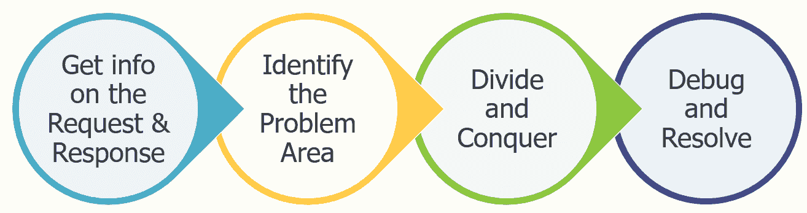
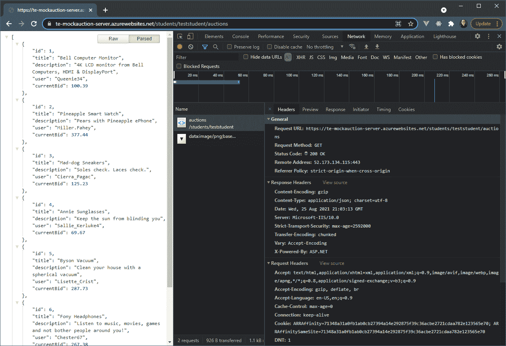
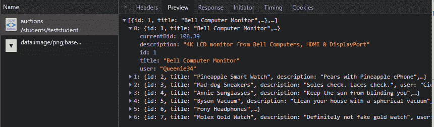
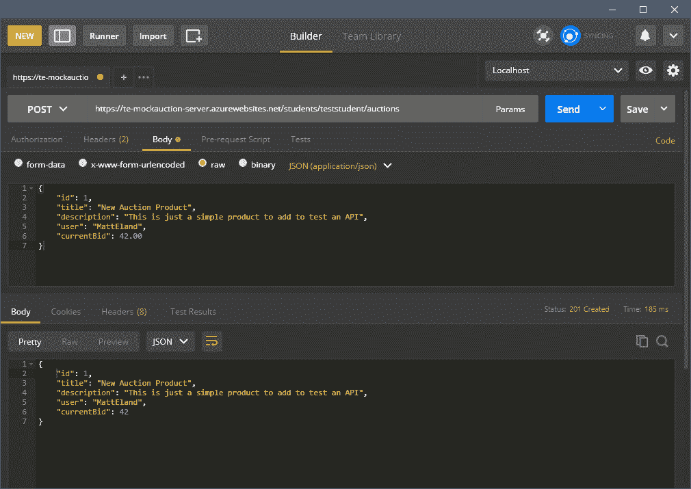
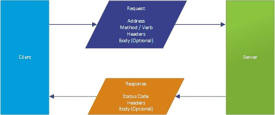
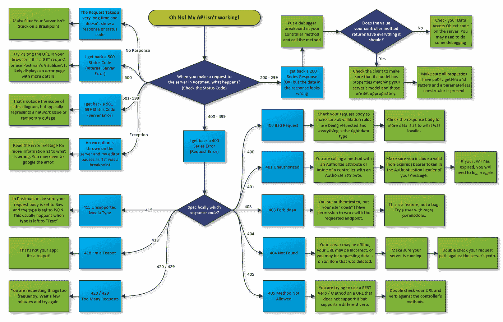
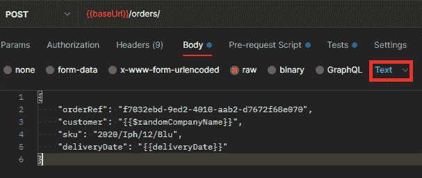

# 用 4 个步骤调试你的 Web API 问题

> 原文：<https://betterprogramming.pub/how-to-debug-web-api-problems-in-4-steps-170aa12a5a9c>

## 简化您的 web 服务

多梅尼科·洛亚在 [Unsplash](https://unsplash.com?utm_source=medium&utm_medium=referral) 上拍摄的照片

本文是解决 web 服务常见问题的分步诊断指南。本文假设您有一个 web 客户端和一个服务器，并试图让这两个客户端和服务器进行通信，但是遇到了问题。

# Web 服务和复杂性

代码很复杂，很多事情都可能出错。然而，当您将 web 通信加入进来时，除了编译器和逻辑错误之外，还会出现更多的问题。

一些可能出错的事情包括:

*   网络问题使您无法与其他服务器通话
*   另一台服务器可能因为维护而停机
*   服务器端的新代码可能需要您改变调用 API 的方式
*   您的请求数据可能不是服务器可以接受的有效格式(例如，试图在商店关门的那天预约)
*   用户可能没有填写所需的数据
*   您的登录信息可能丢失或已过期，需要您重新登录

上面所有的问题都可能破坏已经工作的 API，所以你可以想象，让一个新的 API 第一次工作是非常困难的。

然而，如果您遵循一个逻辑进程，您可以诊断和解决大多数 web 服务问题。

# 诊断 API 问题

以下是我在诊断问题时学会遵循的四个步骤:

1.  获取关于请求和响应的信息
2.  识别问题区域
3.  各个击破
4.  调试和解决

作者图表

我们将依次查看其中的每一项。

# 步骤 1:获取关于 Web 请求的信息

在诊断 web 通信问题时，首先要查看的是关于发送的请求和返回的响应的信息。

如果您正在发出一个不需要身份验证的简单 GET 请求，您通常可以在浏览器中执行此操作，打开浏览器的开发人员工具并选择 network 选项卡。查看 [Chrome 的官方教程](https://developer.chrome.com/docs/devtools/network/)了解更多关于如何使用这个功能的信息。

Chrome 的网络工具(如上图所示)允许你选择一个特定的请求，并在 Headers 标签页上获得许多事情的细节，包括:

*   请求 URL
*   请求方法(或动词)
*   产生的状态代码
*   与请求和响应相关联的标头
*   请求有效负载(或主体)

预览和响应选项卡还将提供有关返回数据的更多信息，如下图所示:

有时您需要诊断非 GET 请求或需要身份验证令牌的请求。在这些情况下，我喜欢从精彩的(免费的) [Postman](https://www.postman.com/product/api-client/) 应用程序中进行测试。

使用 Postman，您可以指定您想要使用的方法/动词、要使用的 URL、设置您需要的任何头(例如身份验证不记名令牌)，并为您的消息提供正文(确保使用应用程序 JSON 内容类型将内容设置为 raw)。

完成后，单击 Send 将发出请求，并在下方窗格中显示结果，允许您观察状态代码、响应正文和响应标题。

或者，如果您的应用程序从代码中进行调用，您可以使用调试器来获得请求和响应的详细信息，这取决于您用来进行 web 请求的库。但是，如果你这样做的话要非常小心，因为开发者很容易认为他们所做的请求的细节是不正确的。Postman 消除了这种顾虑，并允许您独立于您的客户机代码来验证 web 服务的行为。

关于如何开始使用该应用程序的更多信息，请参见 Postman's wonderful [学习中心](https://learning.postman.com/)。

# 步骤 2:识别问题区域

现在您已经有了关于您遇到的实际请求和响应的信息，您可以开始确定哪里出错了。

根据我的经验，最有帮助的事情是确定错误发生在哪里——是客户端发送了一个错误的请求，还是服务器发回了一个错误的响应。一旦你能专注于这两个领域中的一个，问题就变得不那么令人生畏了。

马特·伊兰制图

当您查看关于请求和响应的信息时，验证请求看起来是否正确是很重要的。

以下是我经常检查的一些东西:

1.  请求是否使用了适当的 URL？
2.  是否使用了正确的方法/动词？例如，当它应该执行 POST 时，它是否在执行 GET？
3.  如果请求是一个 POST 或 PUT，它是否包含一个 body？
4.  那个身体看起来正确吗？即使是像发送字符串“1”而不是数字 1 这样的小事也会有所不同。

如果您确定请求在各方面看起来都是正确的，请查看响应。响应可以告诉您很多关于服务器如何处理您的请求的信息。有两条非常重要的信息与响应相关联:响应状态和响应主体。

## 使用响应状态

响应状态是一个范围从 100 到 599 的代码。作为开发人员，您最可能看到的状态代码在 200–299 范围、400–499 范围和 500–599 范围内。

每个主要的状态代码代表不同的东西。200 系列状态代码通常用于没有问题的情况。另一方面，400 和 500 系列的状态代码都表明出了问题或无效。400 系列状态代码表示服务器认为请求有问题，而 500 系列状态代码通常表示服务器有问题。

虽然这可能会令人生畏，但这些状态代码可以快速传达作为开发人员您所遇到的情况。正因为如此，学习它们很重要。通常，如果响应状态不在 200–299 的范围内，那么一定是出了问题，如果问题不是很明显，您需要对其进行诊断。

我们将在后面的步骤 4 中更多地讨论开发人员最常看到的一些个人状态代码。

## 使用响应体

虽然响应状态是一个简单的数字代码，但是响应的*主体*可以是任何内容，从完全为空到简单的错误消息到复杂的 JSON 对象。响应体的内容取决于您正在使用的服务器技术(例如，有些技术会自动为无效请求生成响应),并基于您的 web 服务返回的任何响应数据。

当您查看响应正文时，您需要检查两件事情:

1.  回复体告诉我什么有趣的事情了吗？例如，此响应中是否包含错误消息？
2.  响应正文看起来是否正确？如果没有，您的服务器可能有一个错误。如果是这样，您的 API 可能工作正常，但是您在处理 API 调用的结果时可能有一个错误。

如果您怀疑您的服务器可能没有根据您获得的主体返回正确的结果，那么在您的服务器上放置调试断点并逐步完成发送请求时发生的事情可能是一个好主意。

# 第三步:分而治之

现在，您应该对客户机向服务器发送什么消息以及服务器发回什么响应有了一个合理的概念。

此时，你的首要目标是将问题一分为二。

因为软件系统是非常复杂的，所以排除一些事情并关注剩余的因素会很有帮助。这个原则在处理 web 服务时非常有用。

现在，您应该有足够的信息来回答以下问题:

*   客户端是否向服务器发送了适当的消息？
*   服务器是否以成功的状态代码和有用的响应正文进行响应？

如果您对第一个问题的回答是否定的，那么您的问题至少是从客户端代码开始的，它没有发送有效的请求。

如果您对第二个问题的回答是“否”,则您的服务器没有正确处理来自客户端的请求，这可能是由于请求(内容或身份验证)有问题，或者是由于服务器上的错误或逻辑缺陷。请参阅步骤 4 中的更多详细信息来诊断发生了什么，但通常如果状态代码在 400s，您将调查客户端，如果状态代码在 500s，您将调查服务器。

如果服务器返回 200 个状态代码，但却是无效数据，这通常表明服务器端存在逻辑问题，您应该调查服务器。

在极少数情况下，客户端发送适当的请求，服务器以良好的响应进行回复，但应用程序中仍然出现问题，您可能在客户端处理对数据的响应时遇到了问题，应该查看该代码。

# 步骤 4:调试和解决

此时，您只关注了客户端或服务器。恭喜你，这让你的工作变得简单多了。你现在的工作是通过调试确认问题，并做出适当的修复。

不幸的是，考虑到 web 服务中有多少不同的问题和多少不同的状态代码，这使得我写调试的工作变得很困难。

当事情变得困难时，我喜欢使用图片，所以让我们来看看我创建的流程图。该流程图从图表顶部的橙色圆角矩形开始，并基于图表中的决策从那里开始流动。准备好您的状态代码，并遵循下表:

Matt Eland 的流程图

为了获得最佳效果，您可能需要单击图像以展开它，或者右键单击它并在新的选项卡中打开它。

如果您遵循这个过程，您可能会看到一个包含您遇到的错误的蓝框，以及至少一个推荐解决方案或您可以采取的附加步骤的绿框。

我将在下一节概述一些更常见的问题以及解决这些问题的步骤，但是如果您的错误不在这里，您可能需要参考 Mozilla 的[状态代码列表](https://developer.mozilla.org/en-US/docs/Web/HTTP/Status)或者进行一些网络搜索。

# 常见问题

让我们来看看一些常见的状态代码，以及您可以对它们做些什么。

## 无响应/连接被拒绝

如果您的服务器根本没有返回响应，您通常会收到某种形式的“无法连接到服务器”消息。这通常发生在互联网中断或服务器没有运行时。

发生这种情况的另一个原因是，如果服务器在断点处暂停，它可能无法处理后续请求。

确保您有一个有效的互联网连接，并且您的服务器正在运行，没有在断点处停滞..

## 200–299 个状态代码

如果你得到一个 200 系列的状态码，这意味着服务器认为一切正常。然而，如果您正在调试东西并试图找出为什么某些东西在工作，这意味着两件事情中的一件正在发生:

1.  服务器正在返回 200 系列响应，但没有做正确的事情/返回正确的响应正文
2.  服务器正在返回一个 200 系列响应和一个正确的正文，但是用户仍然会看到一个错误

在第一种情况下，你应该调试服务器，看看它是如何完成请求的，因为某种形式的*逻辑错误*正在发生，你的程序并没有完全按照你的预期去做。

在第二种情况下，您应该调试客户端的代码来处理服务器的响应，因为看起来 API 运行正常。您可能需要后退一步，思考您的应用程序应该如何在较高的层次上工作，以便发现 bug。

## 400 —错误的请求

当客户端发送的信息与服务器期望的不匹配时，通常会遇到坏请求。这可能是任何东西，从丢失的一段数据到字符串形式而不是数字形式的值，到发送的无效邮政编码。

通常，当服务器返回一个 400 错误请求时，响应主体会告诉您关于请求无效的更多信息。您还可以查看请求体，以确保请求看起来有效，并且所有参数都存在并且是适当的类型。

## 401-未经授权

当客户端请求安全的内容，但服务器无法验证他们是谁时，会出现此错误。通常，当客户端在其请求标头中不包含身份验证令牌时会发生这种情况，但如果身份验证令牌已过期，也会发生这种情况。

检查您的请求，并确保您正在向服务器发送适当的授权头。

如果您正在使用外部 API，您可能需要查阅他们的文档或联系他们，以了解他们希望您如何进行身份验证。

## 403 —禁止

如果当服务器不知道您是谁并需要登录才能获得特定资源时发生 401 未授权，当服务器知道您是谁但该身份不允许访问特定资源时发生 403。

可以这样想:你的服务器是站在一个非常重要的门口的保安。一个请求走到门口，但警卫拒绝进入。请求接着说“你知道我是谁吗？”。如果保安回答“不”，那就是 401 未授权。如果警卫回答“可以，但你不允许回到这里”，这是 403 禁止的。

403 禁止响应根本不是 bug。在这些情况下，应用程序的安全性是为了防止未经授权的访问。如果您认为您应该有权访问某些内容，请仔细检查您的用户权限以及服务器对您请求的资源强制执行的权限。

## 404 —未找到

这种状态代码是开发圈之外最常见的代码，因为当链接无效或 URL 输入不正确时，它会出现在许多浏览器中。

在 API 开发中，404 Not Found 响应代码以两种方式之一出现:

1.  您试图调用服务器上不存在的 API 端点
2.  您调用了一个有效的 API 端点来请求一个不再存在的特定东西

第一种情况是最常见的，所以我们来讨论一下。如果我有一个支持 GET 的服务器，在一个像`/api/menu`这样的 URL 上，你对`/api/menuitems`做了一个 GET 请求，这时服务器将会响应 404，告诉你没有支持的端点来处理对`/api/menuitems`的 GET 请求。在这种情况下，最好将请求的 URL 与服务器支持的 URL 进行比较。

第二种情况发生在当你试图得到不存在的特定的东西时。例如，如果我向`/api/products/5003`发出一个 GET 请求，但是数据库中最大的产品号是 250，服务器将无法找到我正在寻找的产品，并且理所当然地返回一个 404，告诉我它不在那里。

在这两种情况下，您都应该仔细检查客户端的逻辑，并确保您请求的是一个合适的 URL。使用浏览器中的网络选项卡有助于验证所请求的 URL 是否如您所想。

## 405-不允许的方法

当服务器提供支持特定方法(如 GET)的端点，但您尝试使用不同的方法访问它时，会出现 405。例如，如果一个服务器提供了一个支持 GET 的`/api/menu`端点，而我删除了这个端点，我会得到一个不允许的 405 方法。

通常，当您使用不正确的 URL 进行操作，或者服务器尚未实现您尝试调用的方法时，会出现 405。仔细检查 API，确保你的 URL 是正确的。

## 415 —不支持的媒体类型

这个错误最有可能发生在 Postman 内部。在 Postman 中，如果您忘记将请求体的内容类型更改为 JSON，您很可能会得到 415 响应。

这是因为服务器不知道如何处理您请求的内容。确保在 Postman 中适当地设置了内容类型。

如果您在代码中遇到这种情况，您可能没有指定请求的 content-type 标头，或者将它设置为服务器不支持的内容。然而，这是一个不太常见的问题，所以我不会在这里深入讨论。

## 420 / 429 —请求太多

一些服务器支持速率限制，这是一种抑制传入请求的方法，可以确保没有用户在特定的时间跨度内用太多的请求来淹没 API。

通常，如果您遇到 420 或 429 响应代码，这意味着您过于频繁地调用服务器，或者需要减少您发送的请求数量，或者需要升级到付费级别。

更多细节请参考您的 API 文档。

## 其他 400 系列状态代码

有时你会得到 400–499 的不同回答，这里没有列出。当使用不寻常的 API 时，这些错误往往是更多的情境错误。参考 Mozilla 关于特定错误代码的文档,并参考您正在尝试使用的 API 的文档。如果 API 是由其他人运行的，您可能需要联系他们的支持团队。

## 500 —内部服务器错误

这通常发生在试图处理请求时服务器代码中抛出异常的情况下。看一看响应正文，看看它是否告诉您错误发生在哪里。您还可以在服务器上放置一个调试器断点，并逐句通过，直到出现错误。

一旦确定了有问题的代码行，就进行修改并再次测试。

## 其他 500 系列状态代码

有时你会得到 500 以上的回复。这些通常是指网络问题、服务器暂时离线等。并且更难诊断。请参考 [Mozilla 的文档](https://developer.mozilla.org/en-US/docs/Web/HTTP/Status)了解具体的错误代码，并根据需要咨询您的网络管理员。

# 第五步:冲洗并重复

是的，我知道，我声称这是一个 4 步的过程。这是谎言，因为当一个问题解决了，它可能不是你的过程的结束。

解决 web 服务中的问题后，如果遇到新问题，再次测试并返回到步骤 1 是很重要的。

软件是复杂的，很多时候可能会有不止一个问题阻止软件工作。有时，在应用程序回到工作状态之前，您需要依次解决两三个问题。

如您所见，API 是复杂但强大的东西。学习曲线很陡，但这些技术对现代 web 开发至关重要。

理解 API 和 API 调试对于所有类型的开发人员来说都是一项核心技能，这就是为什么我们在[科技电梯](https://www.techelevator.com/)上如此强调它。

除了开发人员之外，技术专业人员，如质量保证专业人员、项目/产品经理、系统管理员和技术领导，都需要对 API 的基础知识以及它们给开发团队和开发项目带来的挑战有深刻的理解。

简而言之，学习 API 至关重要，也是你需要做的事情。希望这份指南能帮到你。

*原载于 2021 年 8 月 30 日*[*【https://killalldefects.com】*](https://killalldefects.com/2021/08/30/how-to-debug-web-api-problems-in-4-steps/)*。*