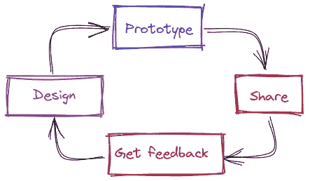
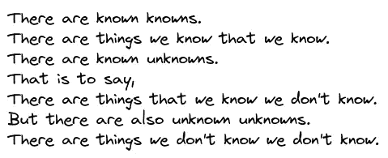
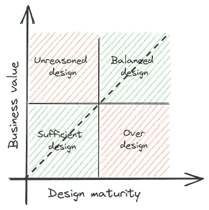

# 决定何时停止设计并开始编码的 5 种启发式方法

> 原文：<https://betterprogramming.pub/how-to-decide-when-its-time-to-stop-designing-and-start-coding-eb9b6d8625c>

## 平衡设计和开发计划的技术

作为工程师，我们将工作分为设计解决方案和构建解决方案。在这篇文章中，我将着重于决定在任何执行(编码)之前，应该在设计工作中投入多少时间和精力。

迭代设计过程

我是“迭代设计过程”的忠实信徒，这意味着你不是一个接一个地在不同的阶段工作，而是随着你发现挑战、获得反馈或提出创新的想法，在微小的设计调整中前进。

但是问题来了，团队如何知道是时候构建原型了？

[人名]阿尔伯特·爱因斯坦(犹太裔理论物理学家)

那么，你如何决定投入设计的时间呢？会是 10%，也许是 90%(就像我们亲爱的艾伯特)？当使用敏捷方法时，这对软件架构师来说是一个关键的决定。应该开始迭代还是等待完整的解决方案？

# 已知和未知框架

唐纳德·拉姆斯菲尔德

在这个框架中，有四个层次的知识。这些级别可以帮助我们衡量我们离完成设计和实施还有多远。

*   **已知的知识**:你知道和理解的事情
    *示例:开发 SAML 单点登录*
*   **已知未知**:您知道但不了解的事情
    *示例:将 SAML 单点登录与现有认证流程集成*
*   **未知的知识**:你不知道但了解的事情
    *示例:双因素认证的附加要求(你知道如何开发)*
*   **未知的未知**:你既不认识也不了解的事情
    *举例:你熟悉并打算使用的单点登录库中存在安全漏洞*

在前期设计中，我们可以在前两个层面做很多工作。后两项需要实施工作，可以是真正的交易或概念验证。

# 探索法

> 启发式，或启发式技术，是任何解决问题或自我发现的方法，采用一种实用的方法，不保证是最佳的，完美的，或合理的，但足以达到一个直接的，短期的目标或近似值。—【https://en.wikipedia.org/wiki/Heuristic 

我们将从定义我们的 ***成本函数*** *:
花费了多少时间+风险水平开始。*

让我们回顾一下期望的期望值。我们想要一个策略，允许我们决定何时**停止设计**和**开始实施**，同时**优化成本函数。**

## 启发#1:有足够多的“已知的知识”

你有最少的知识来带来价值吗？

你的项目可能是巨大的；因此，有许多需求，可能其中一些可以在没有其他需求的情况下交付。在“迭代设计过程”中，我们希望尽快得到反馈。这就是为什么，如果你有可以低风险运输的东西，就去做。

我们希望平衡商业价值和设计成熟度。

注意风险等级。虽然您确实想迭代，但是您不想破坏系统的核心组件。

## 启发#2:不再有“已知的未知”

*你解决了所有的“未决问题”了吗？*

强烈建议在开始任何项目时进行一些风险评估。在评估期间，团队应该提出任何未解决的问题。可能是你很久没接触的模块，也可能是项目需要的新技术。

一个很好的启发是，当你对每个开放点都有一个或多个解决方案时，是时候继续前进了。

## 启发#3:有太多“已知的未知”

*你无法集中注意力，因为你有太多的“开放点”*

有这么多的开放点，你不知道从哪里开始。这可能是你需要更多信息的好迹象。一个原型可以集中你的努力。您可能需要再次返回设计表，但这次会有更多的信息(和更少的开放点)。

## 启发#4:你停止学习新事物

*你是否一遍又一遍地讨论同一个开放点？*

所以你确实为你所有的“开放点”找到了解决方案，但是你不能决定在某一点上。有多种解决方案，但团队一直在争论哪一个是最好的。你们进行了几次讨论，但没有结果。是时候编码了。

如果风险是合理的，你可以考虑从其中一个解决方案开始，并进行密切跟进。如果风险较高，可以考虑从多个方案入手，迭代评估。

## 启发#5: F *落进兔子洞*

*事情开始变得过于复杂和抽象*

是的，我们在这里是为了解决复杂的问题，是的，一些解决方案需要一些非常深入的思考，但是试着问问你自己，我的项目需要这样的复杂程度吗？

工程师喜欢解决问题。这就是为什么我们经常发明新的(想象中的问题是坏软件的根源)。如果您注意到设计开始质疑几乎与您的目标无关的领域，那么是时候让 PoC 或原型保持脚踏实地了。

# 最后的话

请记住，这些都是启发式的；因此，它们不能提供 100%准确的决策。你的角色是明智地使用它们，并与你的团队一起评估你的具体情况。

你永远不会找到设计/构建的最佳比例，但你可以训练自己和你的团队在该切换的时候有更好的感觉。

祝你的下一个项目好运:)