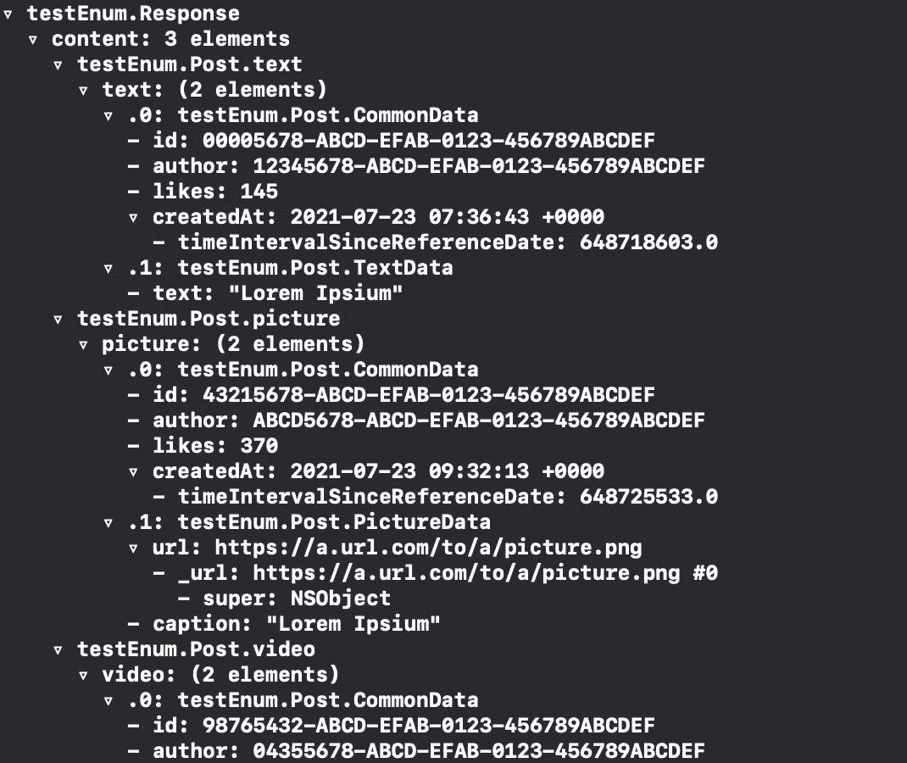
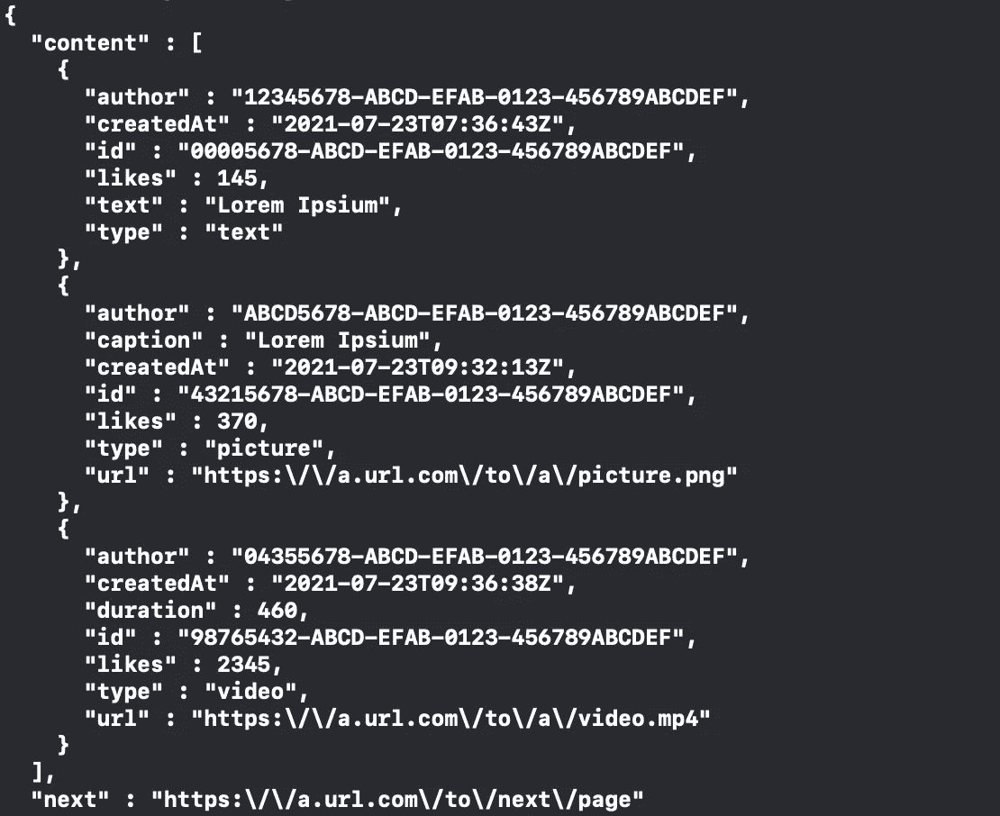

# 如何在 Swift 中解码动态 JSON

> 原文：<https://betterprogramming.pub/how-to-decode-dynamic-json-in-swift-5ca5f923aed1>

## 处理可以动态变化的服务器响应

[Florian Krumm](https://unsplash.com/@floriankrumm?utm_source=medium&utm_medium=referral) 在 [Unsplash](https://unsplash.com?utm_source=medium&utm_medium=referral) 上拍摄的照片。

现代应用程序必须与后端通信。他们可能出于几个原因使用它:

*   对用户进行身份验证。
*   来备份他们的数据。
*   下载数据显示给用户。
*   和许多其他用例。

在大多数交互中，来自后端的数据都是定义良好的。有一个具有固定数量属性的模型，每个属性都有一个明确定义的类型。客户机和服务器同意这种模型:对于每个请求，都有一个对应的响应和一个精确的契约。

在其他应用程序中，根据一天中的时间或用户的地理位置，相同的请求可能会返回不同的数据。一个典型的例子是社交网络的 feed。当我们请求新帖子时，我们会根据一天中的时间、地理位置和其他用户的帖子得到不同的结果。

解码这些响应不是立即的，我们可能会尝试以次优的方式实现解码。我们来看看怎么做才合适。

# 问题是

假设我们想要检索一个社交网络的提要。应用程序和后端使用 JSON 内容进行通信。这是对呼叫的可能响应:

`content`属性包含三个不共享相同结构的对象:一个对象的类型是`text`，另一个是`picture`，还有一个`video`。有一些通用字段(如`id`和`author`)，但有些字段是特定类型的(如`text`的`text`、`picture`的`caption`或`video`的`duration`)。

我们如何正确地建模它们？正如在计算机科学中经常发生的那样，我们有几种选择，每一种都有其优点和缺点。

# 班级

第一种方法是使用类层次结构来编码这些信息。我们从包含所有共享信息的父类`Post`开始。然后，我们为每种类型实现不同的子类，扩展基类并添加特定于类型的信息。

这种方法有几个问题:

1.  我们不能利用`inits`的自动合成，结果我们写了很多不必要的代码。
2.  我们不能利用`Codable`协议的自动合成。子类将要求超类显式实现它(见下面的错误)。
3.  解码时，我们仍然需要实现一些自定义机制来确定在解码过程中需要实例化哪个具体的子类。

由于它的长度，我不会提供这个解决方案的代码，但您可以尝试自己实现它。

# 结构体

第二种方法是使用带有可选字段的单个`struct`。这种方法是可行的，并且克服了类方法的一些缺点:

1.  我们有一个自动合成的`init`。
2.  我们有一个自动合成的`Codable`实现。
3.  在与后端通信时，我们不必费心去理解内容的类型。

当我们需要使用它时，我们可以简单地创建一个解码器，为日期设置适当的解码策略，并对其进行解码。然后，我们可以访问单个 post 类型的`decoded.content`数组`switch`，并对其执行某种操作。

这种方法也不完美:

1.  每个内容都有几个`nil`属性。
2.  我们可以对没有意义的类型使用属性。比如一个`text`有一个`duration`是什么意思？
3.  它呈现重复。`text`有一个名为`text`的`String`属性，`picture`有一个名为`caption`的`String`属性。我们两个都需要，因为服务器为不同类型的帖子发送不同的密钥，但是我们可以使用两个中的一个。
4.  很难扩展。添加新类型时，我们可能需要添加额外的`nil`字段。模型中的属性数量可能会急剧增加。

# 列举型别

最后一种方法两全其美。它最大限度地减少了重复，并确保所有必填字段都被正确填充。它移除了所有的`nil`属性，给了我们一个易于阅读和扩展的模型。

不幸的是，尽管这是最好的模型之一，它仍然需要我们做一些工作。编译器在抱怨，因为 Swift 不能自动合成这样的枚举([除非在 Swift 5.5](https://github.com/apple/swift-evolution/blob/main/proposals/0295-codable-synthesis-for-enums-with-associated-values.md) 之前):

我们需要自己实现`Decodable`和`Encodable`协议。一旦我们理解了它们，它们的实现就容易了。它甚至可以自动化。我们将分三步实施协议:

*   添加所需的支持类型。
*   实现`encode(to:)`功能。
*   执行`init(from:)`功能。

然后我们将看到编码和解码的实际操作。

## 添加配套`types`

第一步是正确编码`Post`枚举。我们必须对三位信息进行编码:

*   由枚举事例本身编码的类型属性
*   一些常见数据
*   一些特定类型的数据

为了对`type`进行编码，我们首先需要创建一个`CodingKeys`枚举，在这里我们将定义它的 case。

我们还需要一个`Types`枚举来描述我们知道的没有数据的帖子类型。这种类型允许您安全地编码和解码`type`属性的值。

我们可以添加几个计算变量来轻松访问共享信息和类型。

## 实现可编码

一旦我们有了编码密钥，我们就可以实现`Encodable`协议。我们需要将所有信息一点一点地添加到编码器中。

在这里，我们创建了一个特殊的容器，它使用一个`type`键。这让我们可以对 JSON 的`"type"`属性进行编码。

然后，我们利用`encode(to:)`方法的数据结构的综合实现，向编码器添加更多信息。说到`commonData`，不管帖子的类型如何，我们都可以对其进行编码。对于特定类型的数据，我们简单地`switch`所有的选择。

# 实现可解码

最后，我们需要实现双重协议:`Decodable`。

`init(from:)`功能与`encode(to:)`的结构相同。首先，我们从一个使用正确枚举的容器开始解码`type`。然后，我们从类型中独立地提取出`commonData`。最后，我们切换类型来初始化来自解码器的适当的 post-specific 数据。

注意，同样对于解码部分，我们是如何利用自动合成的初始化器`CommonData`、`TextData`、`PictureData`和`VideoData`。

# 使用

为了编码和解码我们的 enum，我们遵循通常的过程:我们创建`JSONEncoder`和`JSONDecoder`，并且我们使用通常的`encode()`和`decode()`方法。

第一次转储的(部分)输出如下:

你可以看到解码工作正常。

将编码转换成人类可读的文本后，其输出如下:

# 结论

在今天的文章中，我们探讨了如何对数据建模，这些数据的模式可以在有限的选项集之间变化。更一般地说，我们看到了如何在 Swift 中对异构的项目集合建模，以及如何安全地对它们进行编码和解码。

该解决方案也是高度可扩展的:如果您需要支持额外的情况，只需用适当的数据将其添加到 enum 中，编译器会告诉您如何实现其余部分。如果需要向现有类型添加一些数据，可以在不影响其他数据的情况下更新相关的结构。