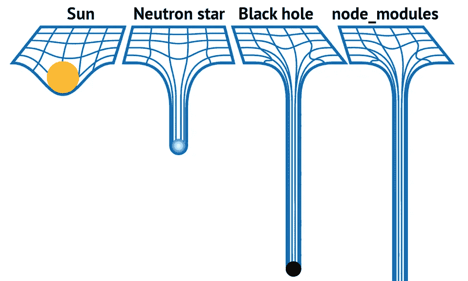
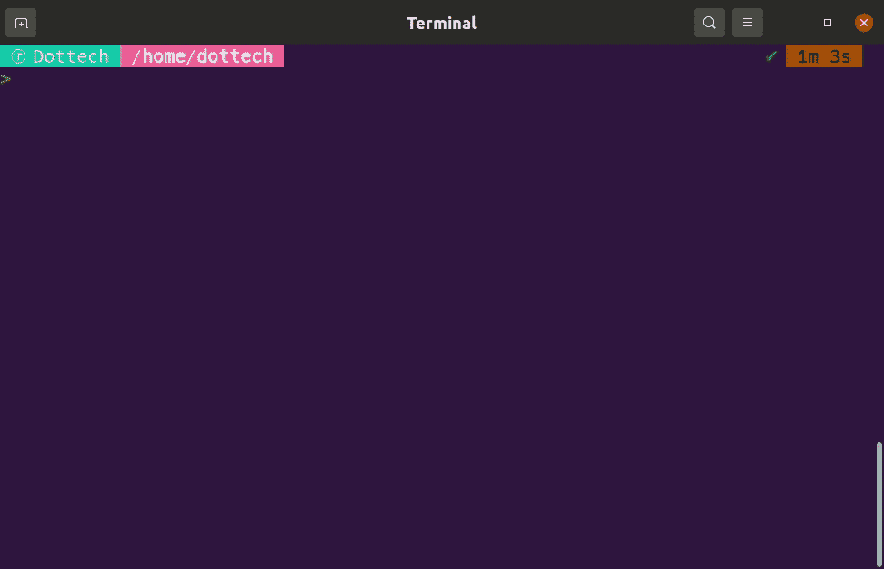
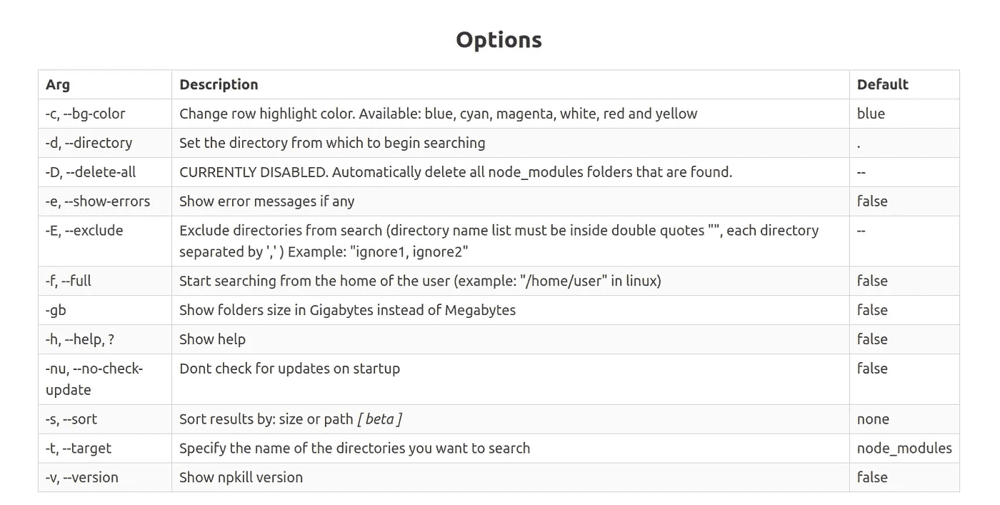

# 如何用一个简单的命令删除 node_modules

> 原文：<https://betterprogramming.pub/how-to-delete-node-modules-with-one-simple-command-3ba27ea2cca7>

## 摆脱 node_modules，重新获得千兆字节的磁盘空间



# 介绍

文件夹是 JavaScript 开发者的克星。随着我们每个新项目的开始，一个可爱的新的`node_modules`文件夹在我们的机器上诞生了，而且，你可能知道，这些宝贝渴望磁盘空间。

如果你像我一样是个大书呆子，我敢肯定你会有几十个 JS 项目正在进行，也就是说你的硬盘上有几十亿字节的空间被`node_modules`占用了。

每当我有时间的时候(或者更确切地说，每当我的机器抱怨几乎没有可用空间的时候)，我就继续寻找`node_modules`。然而，正如通常发生的那样，我并不总是记得我所有的项目都在哪里，所以即使有了`find`命令的帮助，找到并销毁它们也并不总是那么容易。

# 拯救人类

请允许我介绍一下 [Npkill](https://npkill.js.org/) ，这是一个开源的 npm 包(由您真正开发的)，可以轻松找到并摧毁`node_modules`。我们如何使用它？就像在您的终端上运行以下命令一样简单:

```
npx npkill
```

Npkill 会找到所有的`node_modules`文件夹，整齐地显示在一个列表中，然后耐心地等待你点击空格键，摧毁那些硬盘入侵者。这里有一个例子:



Npkill 正在运行

简单，形象，容易。我们还能要求什么？

## Npkill 选项

默认情况下，Npkill 会在运行命令的目录中搜索`node_modules`。但是，有相当多的选项允许您自定义 Npkill 的行为(包括更改高亮颜色，如果您愿意的话)。下表列出了所有不同的选项:



Npkill 选项

更多关于 Npkill 的信息，可以访问[官网](https://npkill.js.org/)或者 [GitHub 资源库](https://github.com/voidcosmos/npkill)。

# 结论

就这些了，伙计们！这封信简短、甜蜜，而且(我希望)非常有用。现在你知道了如何通过在你的终端上运行一个简单的命令来轻松摆脱又旧又重的`node_modules`文件夹。

有问题就在评论里落下，我会尽力解答。非常感谢您的阅读！