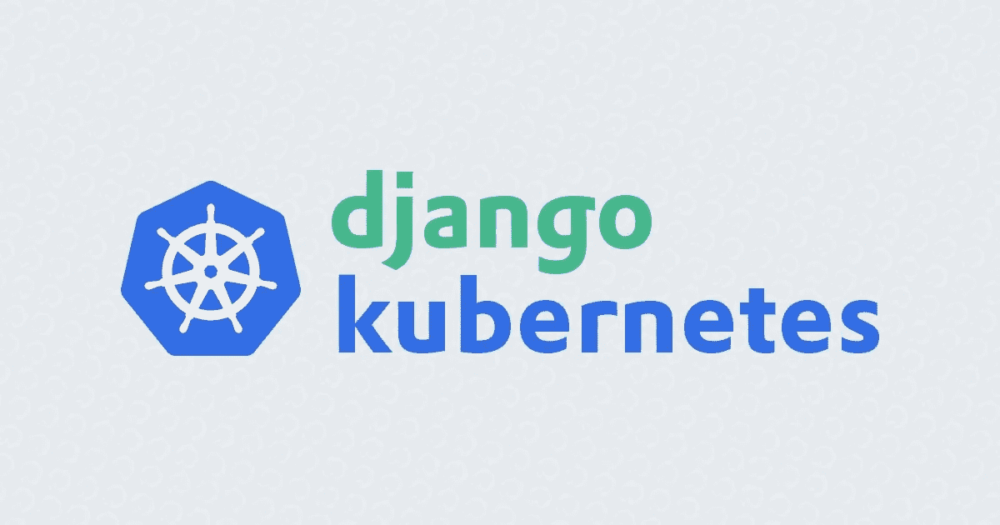
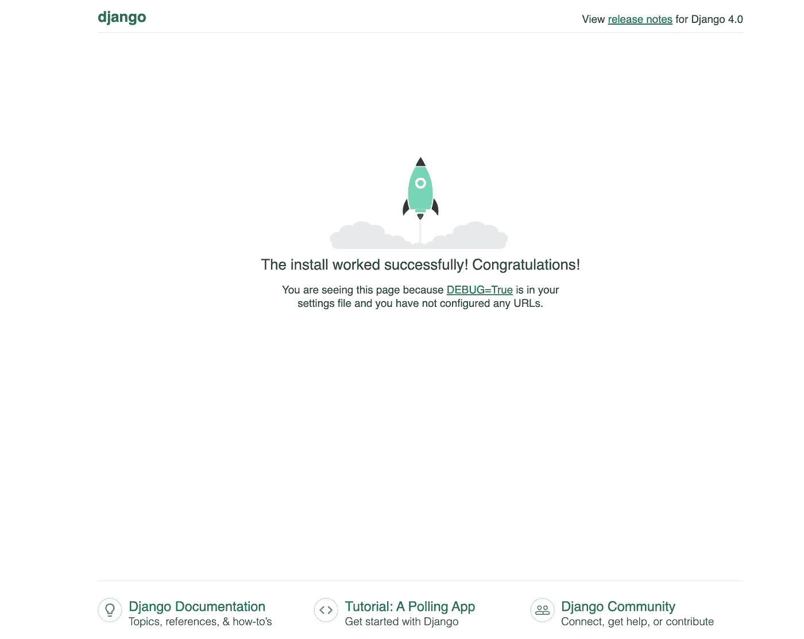

# 如何用 Kubernetes 部署 Django 应用程序

> 原文：<https://betterprogramming.pub/how-to-deploy-a-django-application-with-kubernetes-f5814b0688bf>

## 将可扩展的 Django 应用部署到 Kubernetes 集群中



在本教程中，我们将使用 Kubernetes (K8s)部署一个容器化的 Django 应用程序。

[Django](https://www.djangoproject.com/) 是一个基于 Python 的免费开源 web 框架，遵循模型-模板-视图架构模式。

Kubernetes ，也称为 K8s，是一个开源系统，用于自动化容器化应用程序的部署、扩展和管理。

# 步骤 1——用 Docker 封装我们的应用程序

让我们创建一个新的 Django 应用程序:

```
$django-admin startproject djangokubernetesproject
```

导航到`djangokubernetesproject`目录:

```
$cd djangokubernetesproject
```

之后，我们需要创建一个新的`Dockerfile`，Docker 将使用它来构建我们的容器映像:

```
$vim Dockerfile
```

Dockerfile:

```
FROM ubuntu:20.04RUN apt-get update && apt-get install -y tzdata && apt install -y python3.8 python3-pipRUN apt install python3-dev libpq-dev nginx -yRUN pip install django gunicorn psycopg2ADD . /appWORKDIR /appEXPOSE 8000CMD ["gunicorn", "--bind", ":8000", "--workers", "3", "djangokubernetesproject.wsgi"]
```

这个 Dockerfile 以官方 Ubuntu 20.04 docker 镜像为基础，安装 Django、Gunicorn、Python3.8，最后暴露出端口 8000 将用于接受传入的容器连接，用 3 个 workers 运行`gunicorn`，监听端口 8000。

现在，让我们使用`docker build`来建立我们的形象:

```
$docker build -t djangokubernetesproject.
```

我们使用`-t`标志将图像命名为`djangokubernetesproject`，并传入当前目录作为构建上下文，即在将图像容器化时要引用的文件集。

Docker 构建并标记图像后，使用`docker images`列出可用的图像:

```
$docker images
```

您应该会看到列出的`djangokubernetesproject`图像:

```
REPOSITORY                                                                                                                           IMAGE ID       CREATED         SIZE
djangokubernetesproject                                                   latest
```

下一步，我们将在本地运行配置好的容器。

# 步骤 2 —创建数据库模式

构建并配置好容器后，使用`docker run`覆盖 Dockerfile 中设置的`CMD`，并使用`manage.py makemigrations`和`manage.py migrate`命令创建数据库模式

```
$docker run -i -t djangokubernetesproject sh
```

这将在运行的容器中为您提供一个 shell 提示符

```
#python3 manage.py makemigrations && python3 manage.py migrate
```

如果您正在运行此程序，您应该会看到:

```
OutputOperations to perform:
  Apply all migrations: admin, auth, contenttypes, sessions
Running migrations:
  Applying contenttypes.0001_initial... OK
  Applying auth.0001_initial... OK
  Applying admin.0001_initial... OK
  Applying admin.0002_logentry_remove_auto_add... OK
  Applying admin.0003_logentry_add_action_flag_choices... OK
  Applying contenttypes.0002_remove_content_type_name... OK
  Applying auth.0002_alter_permission_name_max_length... OK
  Applying auth.0003_alter_user_email_max_length... OK
  Applying auth.0004_alter_user_username_opts... OK
  Applying auth.0005_alter_user_last_login_null... OK
  Applying auth.0006_require_contenttypes_0002... OK
  Applying auth.0007_alter_validators_add_error_messages... OK
  Applying auth.0008_alter_user_username_max_length... OK
  Applying auth.0009_alter_user_last_name_max_length... OK
  Applying auth.0010_alter_group_name_max_length... OK
  Applying auth.0011_update_proxy_permissions... OK
  Applying auth.0012_alter_user_first_name_max_length... OK
  Applying sessions.0001_initial... OK
```

这表明数据库模式已经成功创建。

```
#python3 manage.py createsuperuser
```

输入超级用户的用户名、电子邮件地址和密码，创建超级用户后，点击`CTRL+D`退出容器并杀死它。

现在让我们运行 docker 容器。

```
$docker run -p 80:8000 djangokubernetesproject
```

您应该看到:

```
Output[2022-04-18 06:40:37 +0000] [1] [INFO] Starting gunicorn 20.1.0
[2022-04-18 06:40:37 +0000] [1] [INFO] Listening at: [http://0.0.0.0:8000](http://0.0.0.0:8000) (1)
[2022-04-18 06:40:37 +0000] [1] [INFO] Using worker: sync
[2022-04-18 06:40:37 +0000] [9] [INFO] Booting worker with pid: 9
[2022-04-18 06:40:37 +0000] [10] [INFO] Booting worker with pid: 10
[2022-04-18 06:40:37 +0000] [11] [INFO] Booting worker with pid: 11
```

这里，我们运行 docker 文件中定义的默认命令`gunicorn --bind :8000 --workers 3 djangokubernetesproject.wsgi:application`，并公开容器端口`8000`，以便本地机器上的端口`80`被映射到`djangokubernetesproject`容器的端口`8000`。

现在，您应该能够通过在地址栏中键入`http://localhost`来使用您的网络浏览器导航到`djangokubernetesproject`应用程序。

导航到`http://localhost`查看 djangoapp:



当你完成探索后，在运行 Docker 容器的终端窗口中点击`CTRL+C`来杀死容器。

# 步骤 3 —将 Django 应用映像推送到 Docker Hub

要将您的应用程序部署到 Kubernetes，您的应用程序映像必须上传到 docker hub 注册表。Kubernetes 将从其存储库中检索应用程序映像，然后将其部署到您的集群中。

您可以使用公开可用的 Docker 注册中心，比如 Docker Hub。Docker Hub 还允许您创建私有 Docker 存储库。公共存储库允许任何人查看和检索容器图像，私有存储库允许您限制对您和您的团队成员的访问。

在本教程中，我们将把 Django 映像推送到公共 Docker Hub 存储库中。

首先登录到本地机器上的 [Docker Hub](https://hub.docker.com/) :

```
$docker login
```

输入您的 Docker Hub 用户名和密码登录。成功登录后，您应该会看到:

```
OutputLogin Succeeded
```

Django 图像有`djangokubernetesproject:latest`标签。要将其推送到您的 Docker Hub 存储库，请使用您的 Docker Hub 用户名和 repo 名称重新标记该映像:

```
$docker tag djangokubernetesproject:latest your_dockerhub_username/your_dockerhub_repo_name:latest
```

将图像推送到回购:

```
$docker push your_dockerhub_username/your_dockerhub_repo_name:latest
```

当图像层被推送到 Docker Hub 时，您会看到一些更新的输出。

现在 Docker Hub 上 Kubernetes 可以使用您的映像了，您可以开始在集群中部署它了。

# 步骤 4——使用部署来部署 Django 应用程序

在这一步中，您将为 Django 应用程序创建一个部署。Kubernetes 部署是一个*控制器*，可用于管理集群中的无状态应用程序。控制器是一个控制回路，它通过放大或缩小工作量来调节工作量。控制器还重启并清除故障容器。

部署控制一个或多个 Pods，Pods 是 Kubernetes 集群中最小的可部署单元。pod 封装一个或多个容器。要了解更多关于您可以启动的不同类型的工作负载，请查看[Kubernetes 简介](https://www.digitalocean.com/community/tutorials/an-introduction-to-kubernetes)。

首先在您最喜欢的编辑器中打开一个名为`django-deployment.yaml`的文件:

```
$vim django-deployment.yaml
```

粘贴以下部署清单:

```
apiVersion: apps/v1
kind: Deployment
metadata:
  name: django-app
  labels:
    app: django
spec:
  replicas: 3
  selector:
    matchLabels:
      app: django
  template:
    metadata:
      labels:
        app: django
    spec:
      containers:
        - image: your_dockerhub_username/app_repo_name:latest
          name: django
          ports:
            - containerPort: 8000
              name: gunicorn
```

填写适当的容器映像名称，引用您在步骤 2 中推送到 Docker Hub 的 Django 项目映像。

这里我们定义了一个名为 django-app 的 Kubernetes 部署，并用键值对`app: django`对其进行标记。我们指定想要运行在`template`字段下定义的 Pod 的三个副本。

最后，我们将`containerPort` `8000`曝光，命名为`gunicorn`。

要了解更多关于配置 Kubernetes 部署的信息，请参考 Kubernetes 文档中的[部署](https://kubernetes.io/docs/tasks/run-application/run-stateless-application-deployment/)。

编辑完文件后，保存并关闭它。

使用`kubectl apply -f`在集群中创建部署:

```
$kubectl apply -f django-deployment.yaml
```

您应该看到:

```
deployment.apps/django-app created
```

使用`kubectl get`检查部署是否正确展开:

```
$kubectl get deploy django-app
```

输出:

```
NAME        READY   UP-TO-DATE   AVAILABLE   AGE
django-app   3/3     3           3          3m21s
```

如果您遇到一个错误或一些不太正常的事情，您可以使用`kubectl describe`来检查失败的部署:

```
$kubectl describe deplo
```

您可以使用`kubectl get pod`检查两个吊舱:

```
$kubectl get pod
```

输出:

```
NAME                         READY   STATUS    RESTARTS   AGE
django-app-7c55868755-4wglz   1/1     Running   0             2m5s
django-app-7c55868755-7tpjd   1/1     Running   0             2m5s
django-app-7c55868755-9s4s8   1/1     Running   0             2m5s
```

您的 Django 应用程序的三个副本现在已经在集群中启动并运行。要访问该应用程序，您需要创建一个 Kubernetes 服务，这是我们接下来要做的。

# 步骤 5-允许使用服务进行外部访问

在这一步中，您将为您的 Django 应用程序创建一个服务。Kubernetes 服务是一种抽象，它允许您将一组正在运行的 pod 作为网络服务公开。使用服务，您可以为您的应用程序创建一个稳定的端点，它不会随着 pod 的死亡和重新创建而改变。

有多种服务类型，包括 ClusterIP 服务，它在集群内部 IP 上公开服务；节点端口服务，它在称为节点端口的静态端口上公开每个节点上的服务；以及负载平衡器服务，它提供云负载平衡器以将外部流量定向到集群中的单元(通过它自动创建的节点端口)。要了解更多相关信息，请参见 Kubernetes 文档中的[服务](https://kubernetes.io/docs/concepts/services-networking/service/)。

首先使用您最喜欢的编辑器创建一个名为`django-svc.yaml`的文件:

```
$vim django-svc.yaml
```

粘贴以下服务清单:

```
apiVersion: v1
kind: Service
metadata:
  name: django
  labels:
    app: django
spec:
  type: NodePort
  selector:
    app: django
  ports:
    - port: 8000
      targetPort: 8000
```

这里我们创建了一个名为`django`的节点端口服务，并给它贴上了`app: django`标签。然后，我们选择带有`app: django`标签的后端 pod，并将它们的`8000`端口作为目标。

编辑完文件后，保存并关闭它。

使用`kubectl apply`推出服务:

```
$kubectl apply -f django-svc.yaml
```

输出:

```
service/django created
```

确认您的服务是使用`kubectl get svc`创建的:

```
$kubectl get svc django
```

输出:

```
NAME    TYPE       CLUSTER-IP       EXTERNAL-IP   PORT(S)          AGE
django       NodePort    10.107.211.249   <none>        8000:30306/TCP   15s
```

该输出显示了服务的集群内部 IP 和节点端口(`30306`)。为了连接到服务，我们需要集群节点的外部 IP 地址:

在 web 浏览器中，使用 http://localhost:30306 访问 Django 应用程序

您应该会看到在步骤 1 中本地访问的 Django 应用程序接口。


在这个阶段，您已经使用一个部署推出了 Django 应用程序容器的三个副本。您还为这三个副本创建了一个稳定的网络端点，并使用 NodePort 服务使其可以从外部访问。

# 结论

在本教程中，您在 Kubernetes 集群中部署了一个可伸缩的 Django 应用程序。使用`django-app`部署清单中的`replicas`字段，可以快速扩大或缩小运行单元。

下一次我将向您展示如何从 GitHub 资源库部署您自己的项目。