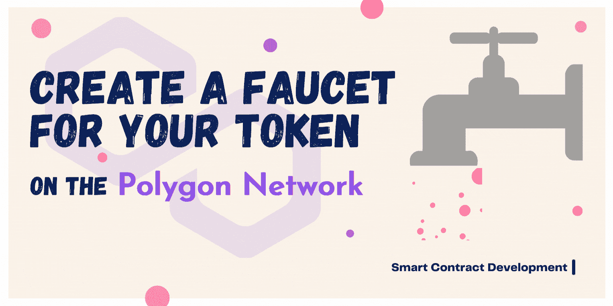
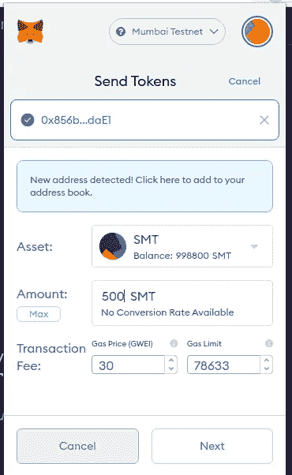
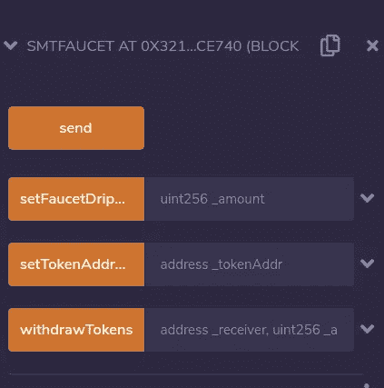
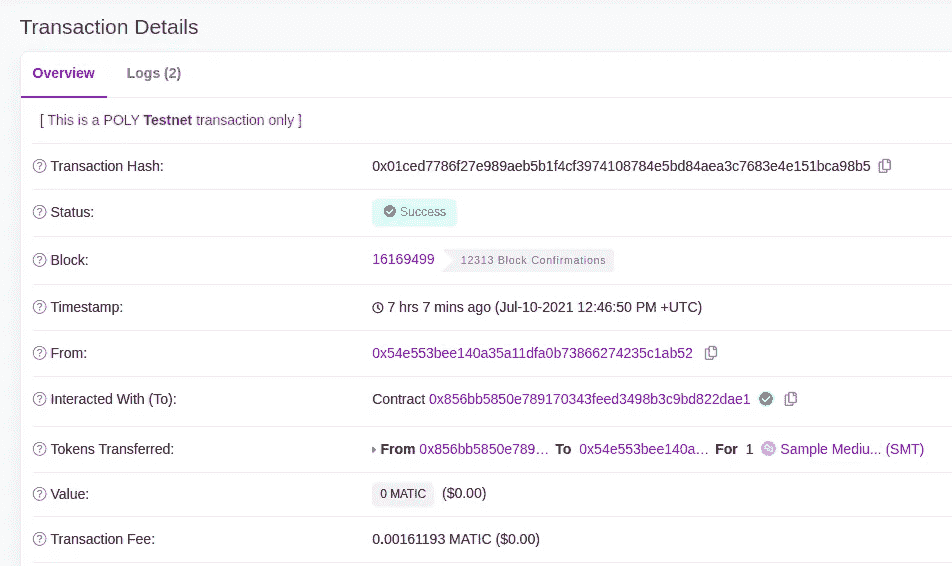
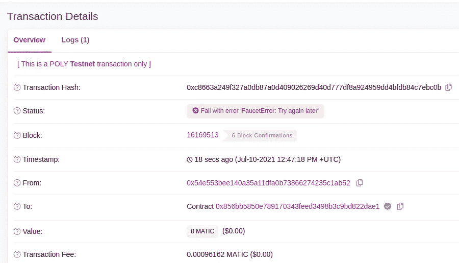

# 如何在多边形网络上为您的令牌部署水龙头

> 原文：<https://betterprogramming.pub/how-to-deploy-a-faucet-for-your-token-on-the-polygon-network-363785e52d67>

## 利用混音 IDE

图片由作者提供。

在这个演示中，我们将探索如何使用 Solidity 为您的令牌创建一个水龙头，并将其部署到 Matic/Polygon 实时网络。令牌有水龙头有几个原因。它可以是一个 mainnet 水龙头，用于在一些任务完成的基础上向社区分发令牌，一个 testnet 水龙头，用于支持开发人员使用令牌构建应用程序，等等。

本文将重点介绍如何:

*   创建水龙头智能合同。
*   在孟买测试网上部署它。

*注意:您也可以在以太坊或币安智能链(BSC)上部署该水龙头。*

# 我们开始吧！

导航到[混音 IDE](https://remix.ethereum.org/) *。*创建一个名为`Faucet.sol`的新文件，并将以下内容添加到该文件中:

*注意:我假设您已经在 Mumbai testnet 上部署了一个令牌。如果您尚未部署令牌，请浏览此* [*文章*](https://medium.com/geekculture/how-to-create-your-own-bep20-tokens-on-binance-smart-chain-bsc-d7075ba2f057) *。它使用 BSC，但是也可以遵循相同的方法在 Mumbai testnet 上部署令牌。只有元掩码应该配置为与 Mumbai testnet 一起工作。*

出于测试目的，我在 Mumbai testnet 上部署了一个名为“ [Sample Medium Token (SMT)](https://mumbai.polygonscan.com/token/0x27e091bff37be958387efbe7133cc7bc144da8ac) ”的简单令牌，这个水龙头将每隔五分钟向请求的钱包地址发送一个 SMT 令牌(可以更改)。

因此，让我们编译合同，并将其部署到孟买测试网。

为了部署，我们需要一些 [testnet Matic 令牌](https://faucet.matic.network/)。使用 Remix 编译和部署契约的步骤也可以在上面提到的文章中找到。在部署期间，应该通过`tokenAddress`和`ownerAddress`来进行合同初始化。

水龙头有四种方法:

1.  `send()` —此功能向发出请求的钱包发送 1 条短信(默认)。应当注意，已经声明了映射(`nextRequestAt`)来实现基本速率限制机制。从同一个钱包连续拨打两次电话之间应该至少间隔五分钟。
2.  `setTokenAddress`(地址)—水龙头所有者/管理员可以使用该方法来更新底层令牌地址。例如，如果我们正在启动一个新版本的令牌(例如 SMTv2)，我们可以将新的令牌地址传递给这个方法，以便水龙头开始滴下新的令牌而不是旧的令牌。这有点类似于可升级合同中遵循的“适配器方法”。
3.  `setFaucetDripAmount` (uint256) —使用这种方法，所有者可以增加或减少每个请求发送的令牌数。默认值为 1 SMT。
4.  `withdrawTokens`(地址，uint256) *—* 水龙头所有者可以用这个从智能合约中提取令牌。

我们需要在部署合同后立即手动将一些令牌存入水龙头合同。

向水龙头发送代币

抛开`send()`方法，其他三个功能只能由水龙头主人调用。因此，`onlyOwner`修饰符被传递。

# 直播时间到了

一旦契约被成功部署，我们可以在 Remix IDE 的左下方看到这些方法。

我们可以连接 MetaMask wallet 并使用这些方法。

`send`方法将 1 个 SMT 滴入钱包，如下所示:

如果我们再次尝试在五分钟内强制约定发送令牌，交易将被恢复，并显示错误消息“稍后重试”

如果我们想改变令牌或每个请求要发送的数量，可以通过调用相应的方法来完成。

# 结论

这个水龙头智能合同只是为了好玩而构建的，它是一个基本的实现。可以对契约进行许多修改，使其更加健壮、安全和可靠。你可以根据自己的需要随意修改水龙头，摆弄它。

感谢阅读！