# 如何使用 AWS SAM 部署本地无服务器应用程序

> 原文：<https://betterprogramming.pub/how-to-deploy-a-local-serverless-application-with-aws-sam-b7b314c3048c>

## 开始使用无服务器、Lambda 和 Docker


Craig Lovelidge 在 [Unsplash](https://unsplash.com/s/photos/lazers?utm_source=unsplash&utm_medium=referral&utm_content=creditCopyText) 上拍摄的照片

SAM 是一个[开源框架](https://github.com/awslabs/serverless-application-model)，可以用来在 AWS 上构建、测试和部署[无服务器应用](https://aws.amazon.com/serverless/)。

本文的主要目标是让您熟悉 AWS SAM，这样您就可以在本地机器上测试您的 lambdas，而不需要每次都在 AWS 上(重新)部署它们。我将讨论 SAM 和 lambda 的不同集成和示例。

SAM 使用 Docker 在本地构建和运行 lambdas，所以需要有 Docker 的基础知识。

# 体系结构

假设有一家公司有很多文件。这些文档有一个`documentId`和一个`versionId`。一个文档也有多个版本。

该公司的员工发现很难找到特定版本的文档。该公司开发了一种解决方案，可以根据文档的`documentId`和`versionId`轻松请求文档的存储位置。

让我们将用例转化为 AWS 中的技术架构。我们将使用 DynamoDB 来存储文档的`documentId`、`versionId`和存储位置。我们需要用现有的文档信息填充 DynamoDB 表，然后在 API Gateway 中设置 lambda 代理集成。最终用户将能够通过对 API 网关端点执行带有正确参数(`documentId`和`versionId`)的 GET 请求来检索文档的正确存储位置。

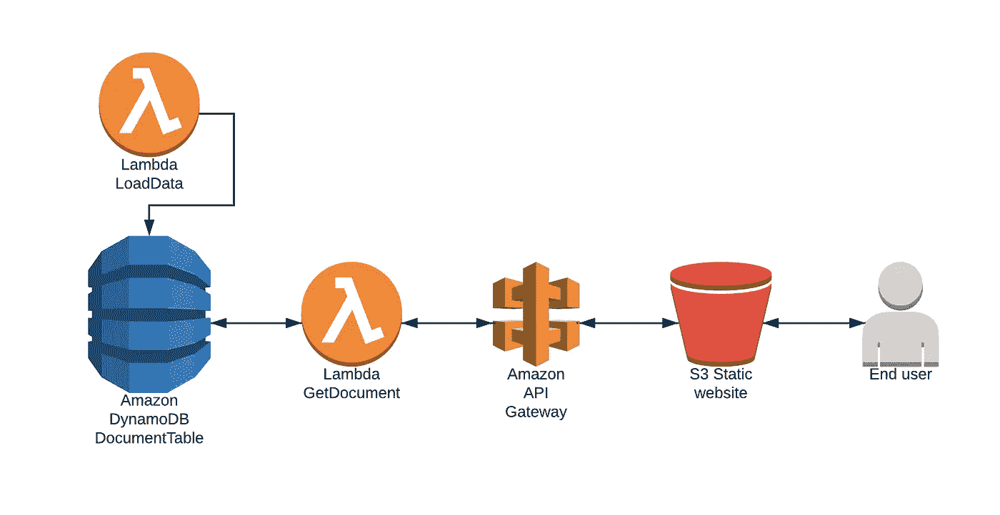

最终用户将使用静态网站执行一个 GET 请求，看起来像这样:
[https://xxx/document？documentId = 1044&versionId = v _ 1](http://127.0.0.1:3000/document?documentId=1044&versionId=v_1)

我们可以使用 SAM 在 AWS 中部署这个堆栈，但是 SAM 的优势之一是它提供了一种直接的方法来本地测试您的集成。

我们将使用 SAM local 来:

*   使用 SAM CLI 调用一次 lambda 来填充 DynamoDB。
*   通过 lambda 代理集成托管我们的本地 API 网关端点。
*   生成一个示例事件，当有人搜索文档时，API Gateway 会将该事件发送给我们的 lambda 函数。

当本地一切正常时，我们将在 AWS 中部署整个堆栈。

# 初始设置

要进行此演示，您需要具备以下先决条件:

*   [码头工人](https://docs.docker.com/install/)
*   [SAM CLI](https://docs.aws.amazon.com/serverless-application-model/latest/developerguide/serverless-sam-cli-install.html)
*   [AWS CLI](https://docs.aws.amazon.com/cli/latest/userguide/cli-chap-install.html)
*   [演示 GitHub 项目](https://github.com/lvthillo/aws-lambda-sam-demo)
*   AWS 帐户(可选)

我们将使用 Docker 来运行本地 DynamoDB 实例——但不仅仅是这样。

SAM 也高度依赖 Docker。当 SAM CLI 调用本地 lambda 函数时，SAM 将启动一个 Docker 容器，执行 lambda 代码并销毁该容器。

我们先创建一个 [Docker 桥接网络](https://docs.docker.com/network/bridge/)。我们将使用这种类型的 Docker 网络，这样我们的 Docker 容器就可以通过解析它们的容器名来相互通信。因此，我们可以从由 SAM 管理的 lambda 容器内部与本地 DynamoDB Docker 容器进行对话。DynamoDB 容器被称为“dynamodb”。

```
$ docker network create sam-demo
$ docker run --network sam-demo --name dynamodb -d -p 8000:8000 amazon/dynamodb-local
```

当容器启动并运行时，我们可以创建 DynamoDB 表。我们的 DynamoDB 的主键将由一个分区键(documentId)和一个排序键(versionId)组成。

```
$ aws dynamodb create-table --table-name documentTable --attribute-definitions AttributeName=documentId,AttributeType=N AttributeName=versionId,AttributeType=S --key-schema AttributeName=documentId,KeyType=HASH AttributeName=versionId,KeyType=RANGE --provisioned-throughput ReadCapacityUnits=5,WriteCapacityUnits=5 --endpoint-url [http://localhost:8000](http://localhost:8000)
```

# 使用 SAM 构建和调用本地函数

现在从 GitHub 克隆[演示项目。](https://github.com/lvthillo/aws-lambda-sam-demo)

这个项目包含了`[template.yaml](https://github.com/lvthillo/aws-lambda-sam-demo/blob/master/template.yaml)`，它完整地描述了堆栈应该是什么样子。它部署了一个名为`LoadDataFunction`的独立 lambda 函数，我们手动触发该函数来将数据加载到 DynamoDB 表中。第二个函数称为 GetDocumentFunction，将由 API 网关事件触发。

我们可以验证模板是否有效:

```
$ cd aws-lambda-sam-demo
$ sam validate -t template.yml
xxx/template.yaml is a valid SAM Template
```

[LoadDataFunction](https://github.com/lvthillo/aws-lambda-sam-demo/blob/master/functions/load_data/app.py) 将用于填充我们的 DynamoDB 表。使用 SAM CLI 构建函数。如果您的本地环境中没有安装 Python3.7，您可以使用`--use-container`参数在 Docker 容器中构建该函数。

```
$ sam build --use-container
```

这构建了我们的 lambda 函数，如我们的 [template.yaml](https://github.com/lvthillo/aws-lambda-sam-demo/blob/master/template.yaml) 中所述。 [SAM 模板是 CloudFormation 模板](https://docs.aws.amazon.com/serverless-application-model/latest/developerguide/what-is-sam.html)的扩展。构建将下载必要的依赖项，在我们的`requirements.txt`中描述，并创建存储在`.aws-sam/build/functionName`中的部署工件。

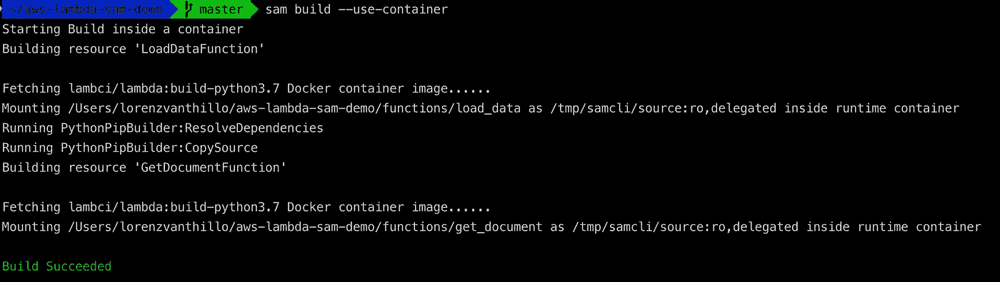

只需要执行一次`LoadDataFunction`就可以将现有文档及其位置放入 DynamoDB 表中。让我们仔细看看函数本身:

基于 env var 环境的值，我们将连接到本地或远程 DynamoDB

我们可以使用 SAM 来调用这个函数。我们用一个参数来表示我们的环境。有效选项为`local`或`aws`。lambda 函数基于该参数与正确的 DynamoDB 端点连接。

本地 lambda 函数将在 Docker 容器中运行。我们告诉 SAM 在与我们的 DynamoDB 容器相同的 Docker 桥网络中旋转容器。现在，我们的 lambda 可以使用容器名与 DynamoDB 容器进行通信。

```
$ sam local invoke LoadDataFunction --parameter-overrides ParameterKey=Environment,ParameterValue=local ParameterKey=DDBTableName,ParameterValue=documentTable --docker-network sam-demo
```

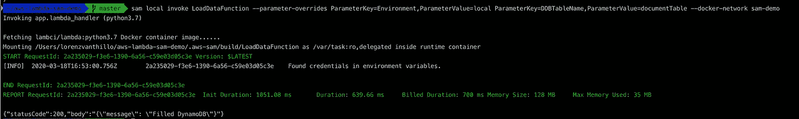

当 lambda 函数成功结束时，我们可以看到 DynamoDB 表中是否有正确的数据。浏览表格的内容:

```
$ aws dynamodb scan --table-name documentTable --endpoint-url [http://localhost:8000](http://localhost:8000)
```

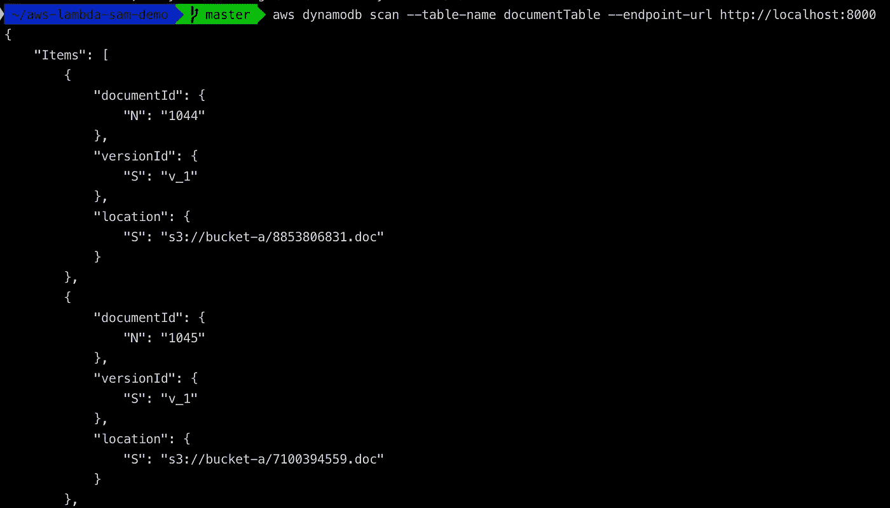

我们在 s3://bucket-a/8853806831.doc 中看到一个 documentId 为 1044 且版本为 v_1 的文档

# 使用 SAM 生成一个示例负载

下一个功能是`[GetDocumentFunction](https://github.com/lvthillo/aws-lambda-sam-demo/blob/master/functions/get_document/app.py)`。这是由 API 网关事件触发的。

API 网关设置在`[template.yaml](https://github.com/lvthillo/aws-lambda-sam-demo/blob/master/template.yaml)`中定义。我们部署了一个 [API Gateway lambda 代理集成](https://docs.aws.amazon.com/apigateway/latest/developerguide/set-up-lambda-proxy-integrations.html)，当对`API-GW-URL/document?documentId=xxx&versionId=xxx`发出 GET 请求时，将会触发`GetDocumentFunction`。

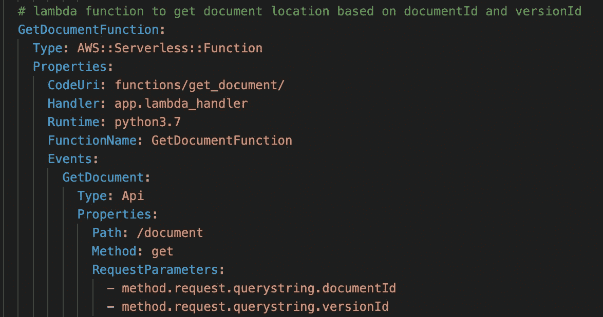

在我们部署这个 API 网关端点之前，我希望我们测试一下`GetDocumentFunction`。这里我必须创建一个有效的事件来触发这个函数。下面的命令将创建一个有效的 JSON，我们可以用它作为一个假的 API 网关事件来触发 lambda。

```
$ sam local generate-event apigateway aws-proxy --method GET --path document --body "" > local-event.json
```

遗憾的是，SAM CLI 还没有支持(还没有？)用于事件生成期间的`queryStringParameters`。所以我们应该在`local-event.json`中手动更新这个。记住，我们看到了一个带有`documentId 1044`和`version_id v_1 in DynamoDB`的文档，所以我们可以使用它们作为有效的参数值:

```
...
"queryStringParameters": {
 "documentId": "1044",
 "versionId": "v_1"
 },
...
```

现在使用我们的事件调用`GetDocumentFunction`来测试它:

```
sam local invoke GetDocumentFunction --event local-event.json --parameter-overrides ParameterKey=Environment,ParameterValue=local ParameterKey=DDBTableName,ParameterValue=documentTable --docker-network sam-demo
```

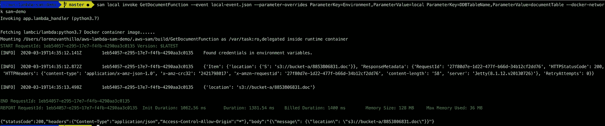

显示了 documentId 为 1044、versionId 为 v_1 的文档的正确存储位置

# 使用 Lambda 代理集成设置本地 API 网关端点

公司的员工将使用静态网站向 API 网关执行有效的 GET 请求。员工填写他们需要的文件的`documentId`和`versionId`。

API 网关会将请求转发给我们的`GetDocumentFunction`。`GetDocumentFunction`将使用`queryStringParameters`查询 DynamoDB 表中的正确位置。

启动我们的本地 API 网关端点:

```
$ sam local start-api --parameter-overrides ParameterKey=Environment,ParameterValue=local ParameterKey=DDBTableName,ParameterValue=documentTable --docker-network sam-demo
```

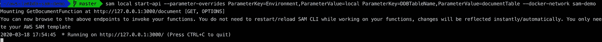

它运行在 http://127.0.0.1:3000 上

该存储库包含一个基本的静态网页作为可视化。员工将使用它与 API 网关对话。API 网关与后端对话，也就是我们的`GetDocumentFunction`。

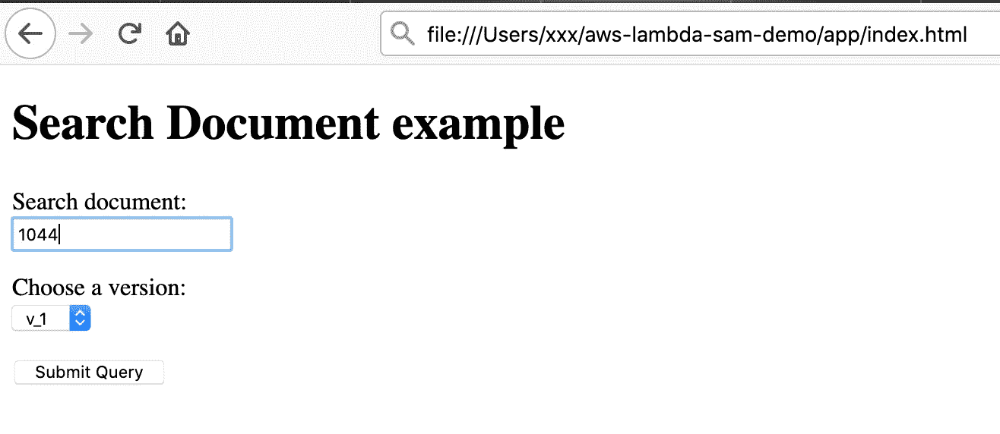

这将实际执行以下 GET 调用:

```
$ curl ["http://127.0.0.1:3000/document?documentId=1044&versionId=v_1](http://127.0.0.1:3000/document?documentId=1044&versionId=v_1)"
```

现在单击提交查询。这会触发我们的λ。

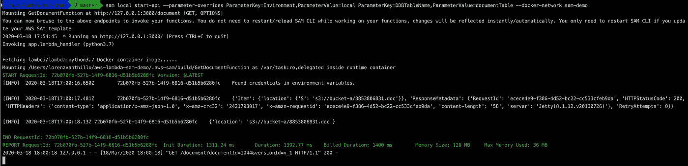

lambda 在本地 DynamoDB 中搜索文档的相应位置

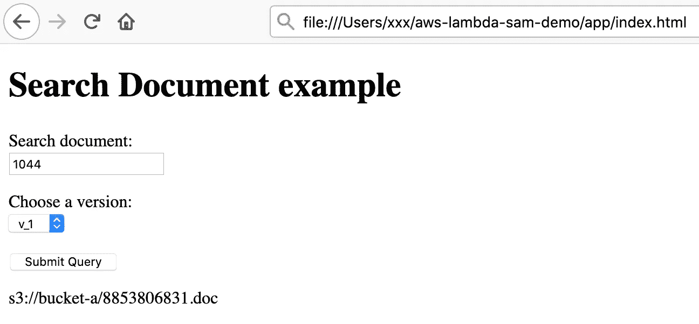

将显示文档的位置

现在我展示了如何在本地构建和测试我们的堆栈。对模板或 lambdas 进行更改后，您应该再次运行`sam build`命令，重新调用或重新部署您的资源。

就是这样！如果您有可用的 AWS 帐户，您可以进入下一步。

# 将 SAM 堆栈部署到 AWS(可选)

现在我将向您展示将这个堆栈部署到 AWS 有多容易。

我们已经运行了`sam build` 命令。这在`.aws-sam/build/`目录中创建了我们的部署工件。

`sam deploy`打包并部署我们的堆栈。我们必须指定一个 S3 存储桶来上传我们的部署工件。注意，我们现在指向 AWS 作为环境，而不是`local`。现在我们的 lambdas 知道他们必须连接到 AWS 的 DynamoDB 端点，而不是我们的本地端点。

```
$ sam deploy --template-file .aws-sam/build/template.yaml --s3-bucket lvthillo-sam-upload-bucket --parameter-overrides ParameterKey=Environment,ParameterValue=aws ParameterKey=DDBTableName,ParameterValue=documentTable --stack-name aws-lambda-sam-demo --capabilities CAPABILITY_NAMED_IAM
```

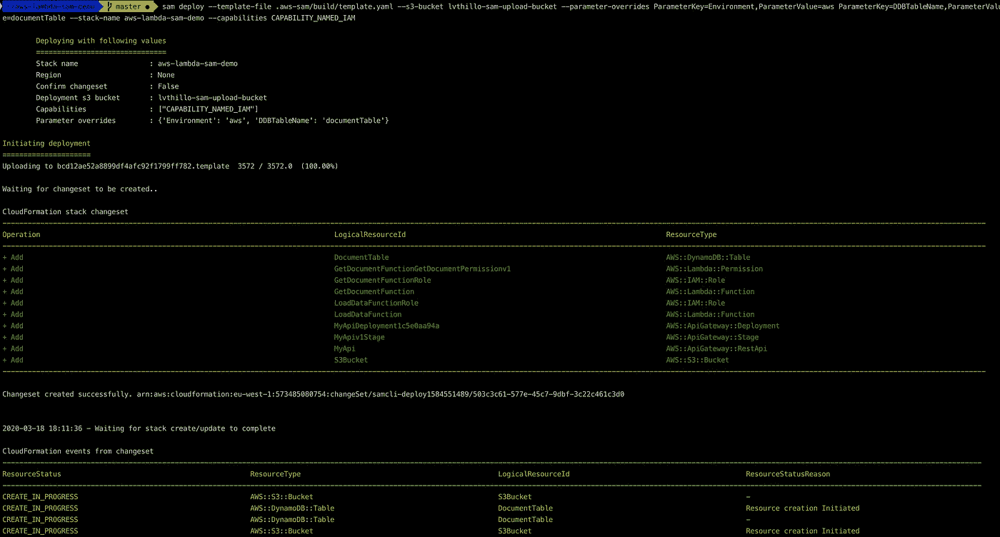

在成功部署之后，我们应该首先运行`LoadDataFunction`来填充我们的 DynamoDB。只需在 lambda 控制台中创建一个空的测试事件并执行函数:

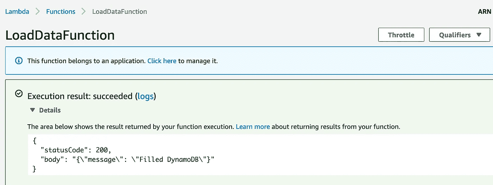

DynamoDB 中提供了正确的数据:

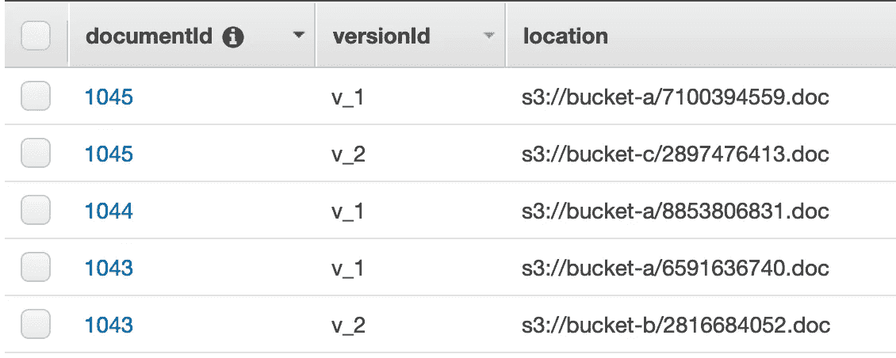

现在我们可以再次测试我们的 API 网关 lambda 代理集成:

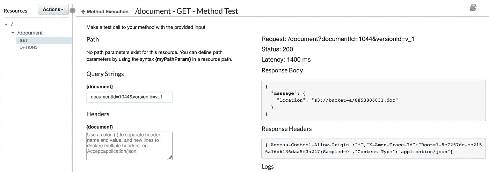

一切正常！最后，我们可以在由堆栈创建的 S3 桶中重新部署静态网站。在这个演示中，我使用[公共静态站点桶](https://s3.console.aws.amazon.com/s3/#)作为桶。该模板将生成一个随机的存储桶名称，配置为静态网站。

我们只需要更新我们的静态应用程序来指向正确的 API 网关 URL。要找到这个网址，你可以去 CloudFormation。搜索您的堆栈并检查输出。堆栈被配置为输出我们的 API 网关端点。

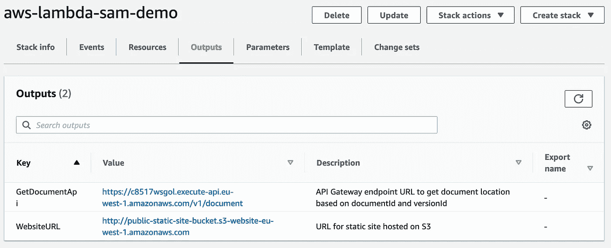

为了快速测试，我们可以使用`curl`和正确(或不正确)的参数。

```
$ curl "[https://c8517wsgol.execute-api.eu-west-1.amazonaws.com/v1/document?documentId=1044&versionId=v_1](https://c8517wsgol.execute-api.eu-west-1.amazonaws.com/v1/document?documentId=1044&versionId=v_1)"
```

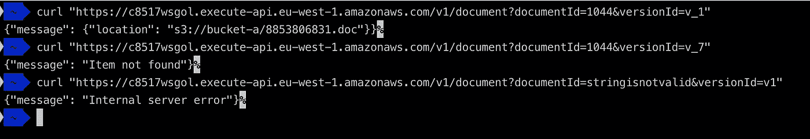

现在我们可以用这个 URL 更新我们的静态应用程序:

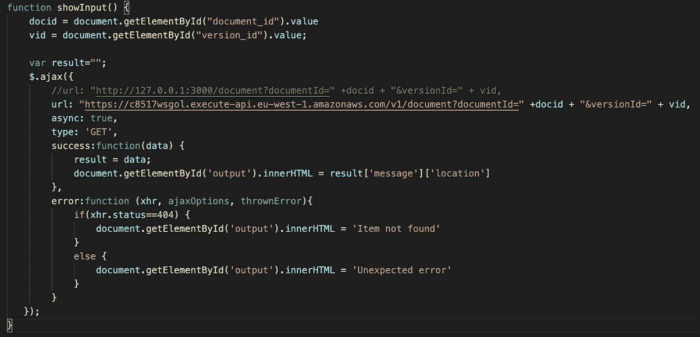

现在我们已经更新了网址，我们可以上传文件到我们的 S3 桶。请确保在上传期间或之后公开对象。

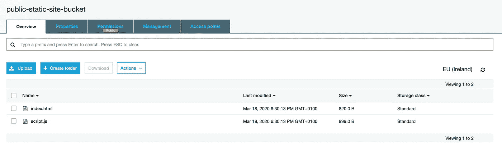

访问您的 S3 桶作为一个静态网站！

CloudFormation 控制台中也会输出正确的 URL。

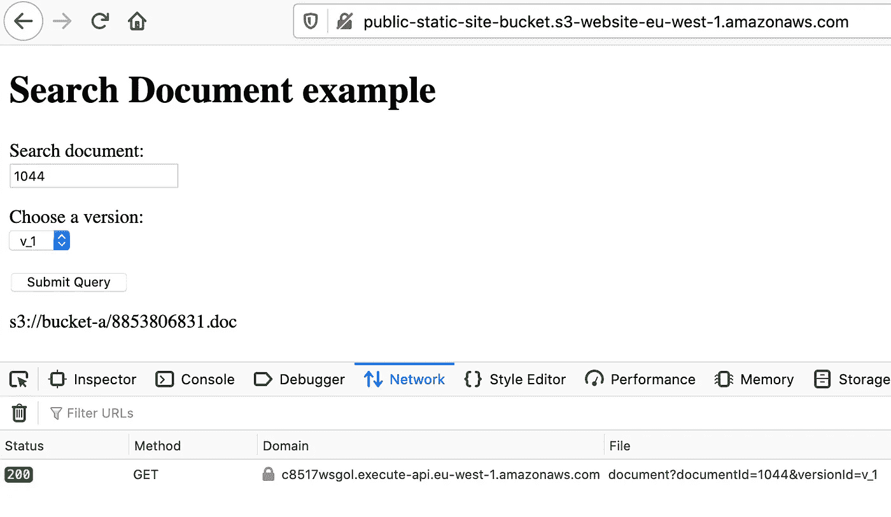

# 结论

我们发现了 AWS 无服务器应用程序模型的魔力。

我们经历了你可以用它做的大部分重要的事情。我们使用 SAM 模板在本地机器上部署和测试 lambda 函数。我们甚至部署了一个本地 API 网关！在我们确认一切正常后，我们在 AWS 上部署了完全相同的堆栈。

我希望你喜欢它。感谢您的阅读，并随时询问任何问题！