# 如何在 EC2 的服务器中将 Nodejs 应用程序部署到 AWS

> 原文：<https://betterprogramming.pub/how-to-deploy-a-nodejs-app-to-aws-in-ec2s-server-8709be02470d>

## 通过 HTTPS 使用 Docker、RDS Amazon Aurora 和 Nginx


[Robynne Hu](https://unsplash.com/@robynnexy) 在 [Unsplash](https://unsplash.com/) 上的照片

# 介绍

部署 Nodejs 应用程序有多种方式，无论是在云上还是在本地。然而，这不仅仅是部署您的应用程序，而是以正确的方式部署它。安全性也是一个不容忽视的重要方面。如果您这样做，应用程序将不会存在很长时间，并且很有可能会受到损害。

因此，我们将帮助您完成将 Nodejs 应用程序部署到 AWS 的步骤[。我们将向您展示如何使用 Docker containers、RDS Amazon Aurora 和 Nginx 和 HTTPS 将 Nodejs 应用部署到服务器。你可以用域名访问它。](https://www.clickittech.com/resource/slides/aws/Deploy-Nodejs-app-to-AWS.pdf)

# 工具堆栈

## **Nodejs 示例应用**

一个带有三个 API 的示例 Nodejs 应用程序:即 status、insert 和 list。这些 API 将用于检查应用程序的状态，将数据插入数据库，并从数据库中获取和显示数据。

## **AWS EC2 实例**

Ubuntu 20.04 LTS 亚马逊弹性计算云(Amazon EC2)实例将用于部署容器化的 Nodejs 应用程序。我们将在这个实例中安装 Docker，在此基础上将创建容器。我们还将在实例上安装 MySql 客户端。MySql 客户端需要连接到 Aurora 实例来创建所需的表。

## **AWS RDS 亚马逊极光**

我们的数据将存储在 AWS RDS 亚马逊极光。我们将在 AWS RDS Amazon Aurora 实例中存储简单的字段，如`username`、`email-id`和`age`。

Amazon Aurora 是 AWS 上提供的 MySQL 和 PostgreSQL 兼容的关系数据库。

## **码头工人**

Docker 是一个容器化平台，用于构建 Docker 映像并使用容器进行部署。我们将把 Nodejs 应用程序作为 Docker 容器部署到服务器、Nginx 和 Certbot。

## **Docker-Compose**

为了启动 Nodejs、Nginx、Certbot 容器，我们将使用 Docker-Compose。Docker Compose 有助于减少容器部署和管理时间。

## **Nginx**

这将用于为示例 Nodejs 应用程序启用 HTTPS，并将所有用户请求重定向到 Nodejs 应用程序。它将充当反向代理，将用户请求重定向到应用程序，并通过提供启用 SSL/HTTPS 的配置来帮助保护连接。

## **Certbot**

这将使我们能够自动使用 Let's Encrypt 进行域验证并颁发 SSL 证书。

## **域**

在本文的最后，您将能够通过 HTTPS 使用您的域名访问示例 Nodejs 应用程序，也就是说，您的示例 Nodejs 将通过 internet 得到保护。

## **邮递员**

我们将使用 Postman 来测试我们的 API，即检查状态、插入数据和列出数据库中的数据。

正如我所说，我们将“使用 Docker containers、RDS Amazon Aurora、Nginx 和 HTTPS 将 Nodejs 应用部署到服务器，并使用域名访问它。”首先，在动手之前，让我们先了解一下架构。

# 使用 Docker 将 Nodejs 应用程序部署到 EC2 服务器的架构

Nodejs 应用将于`port 3000`上市。这个示例 Nodejs 应用程序从 RDS Amazon Aurora 实例获取数据，该实例是在与 EC2 实例相同的 VPC 中创建的。Amazon Aurora DB 实例是私有的，因此可以在同一个 VPC 中访问。部署在 EC2 实例上的 Nodejs 应用程序可以使用它在`port 3000`上的公共 IP 来访问，但是我们不会。

不建议在非标准端口上访问应用程序。因此，我们将让 Nginx 充当反向代理，并启用 SSL 终止。用户将尝试使用域名访问应用程序，这些请求将被转发到 Nginx。

Nginx 将检查请求，并根据 API 将请求重定向到 Nodejs 应用程序。应用程序也将与 SSL 一起终止。因此，客户端和服务器之间的通信将受到保护。

# 先决条件

在我们将 Nodejs 应用程序部署到 AWS 之前，假设您已经具备了以下先决条件:

1.  AWS 帐户
2.  PostMan 或任何其他替代程序来测试 API
3.  您的 AWS 帐户中的注册域

# 在 AWS 上创建一个 Ubuntu 20.04 LTS EC2 实例

前往[https://AWS.amazon.com/console/](https://aws.amazon.com/console/)并登录您的账户。

登录后，在搜索栏中单击并键入 EC2。单击结果以访问 EC2 仪表板，从而创建 EC2 实例。

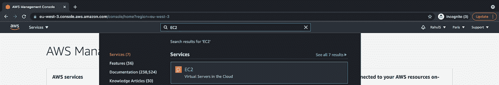

然后，单击“启动实例”来配置和创建 EC2 实例。

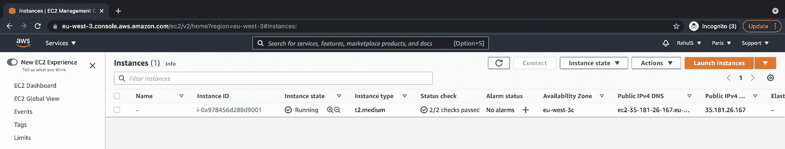

选择“Ubuntu Server 20.04 LTS”AMI。

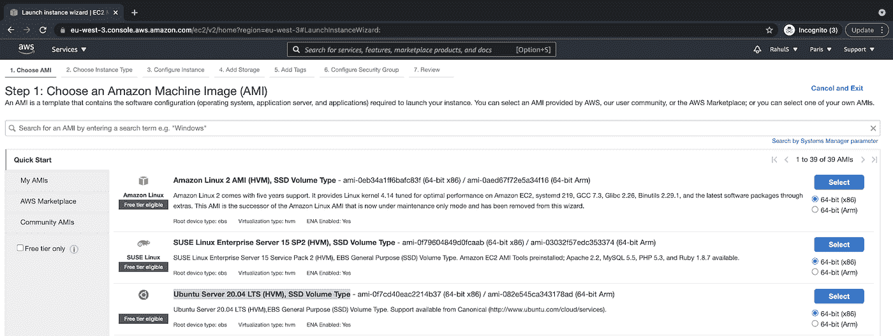

我建议你选择`t3.small`只是为了测试。这将有两个 CPU 和 2GB 内存。您可以根据自己的需要和选择来选择实例类型。

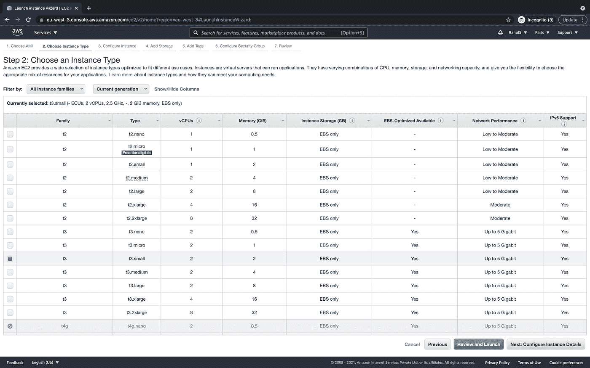

您可以保留默认设置并继续操作。在这里，我选择了默认的 VPC。如果你愿意，你可以选择你的 VPC。请注意，我将在公共子网中创建一个实例。

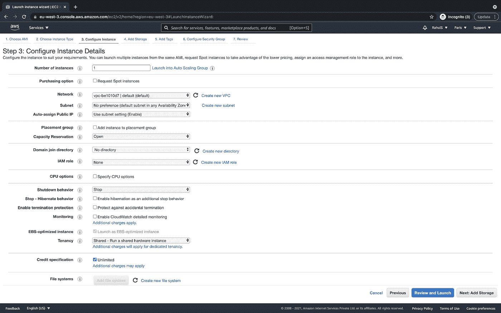

最好将更大的磁盘空间设置为 30GB。剩下的可以默认。

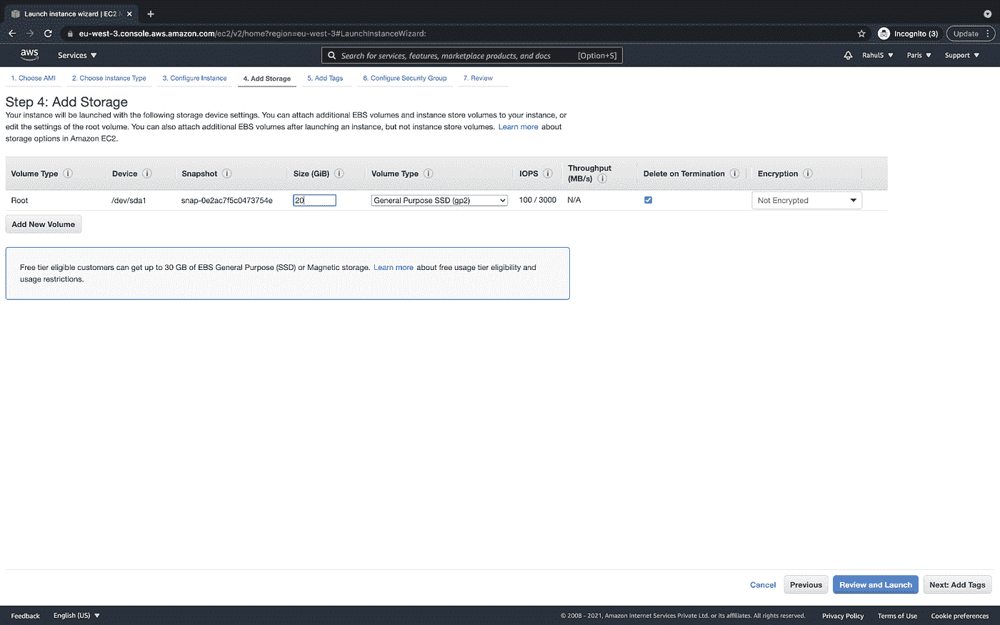

为您选择的任何值分配一个“名称”和“环境”标签。你甚至可以跳过这一步。

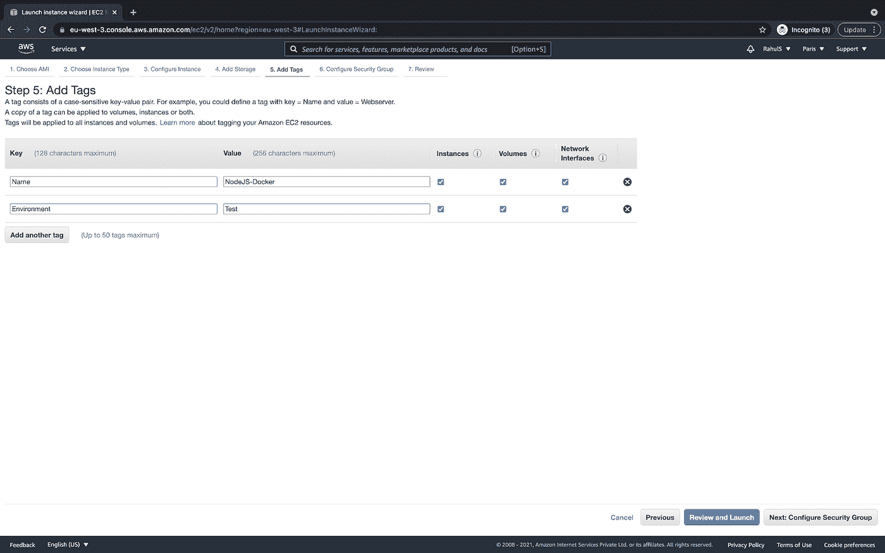

仅允许从您的 IP 连接到`port 22`。如果你从`0.0.0.0/0`开始允许，那么你的实例将允许`port 22`上的任何人。

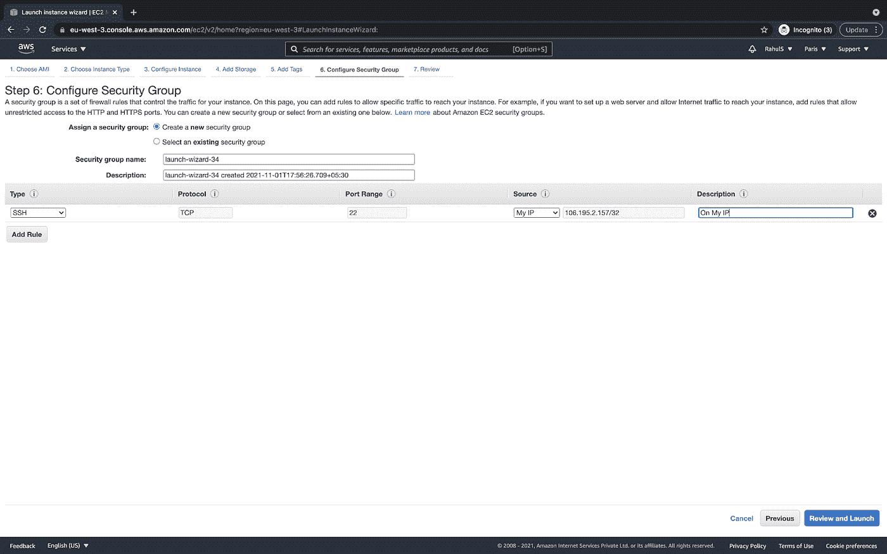

查看一次配置，然后单击“启动”如果一切正常，创建一个实例。

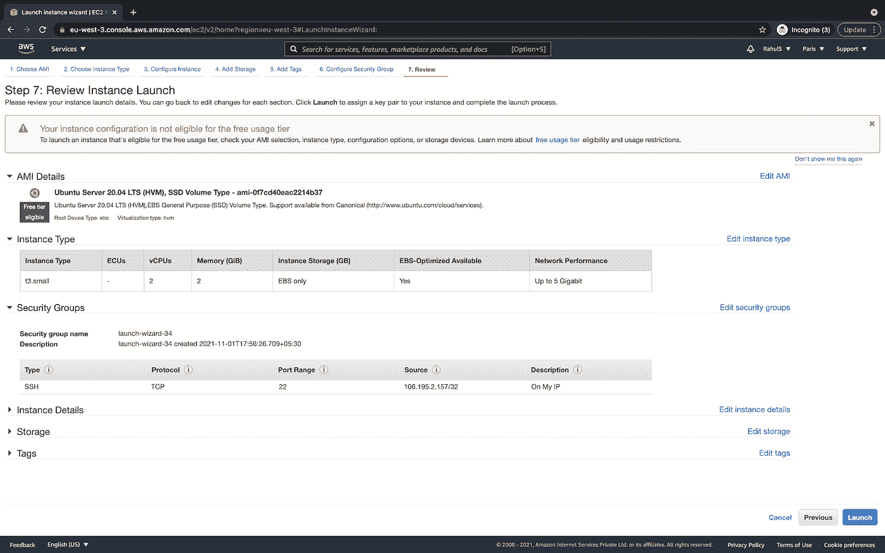

在创建实例之前，它需要一个密钥对。您可以创建一个新的密钥对，也可以使用现有的密钥对。单击“启动实例”按钮，启动实例创建。

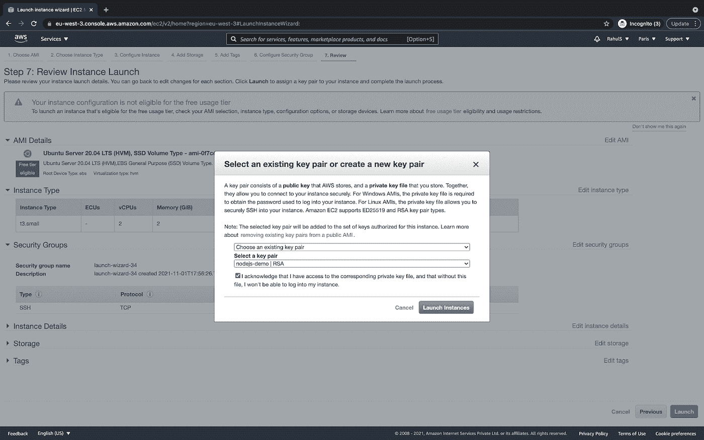

要转到控制台并检查您的实例，请单击“查看实例”按钮。

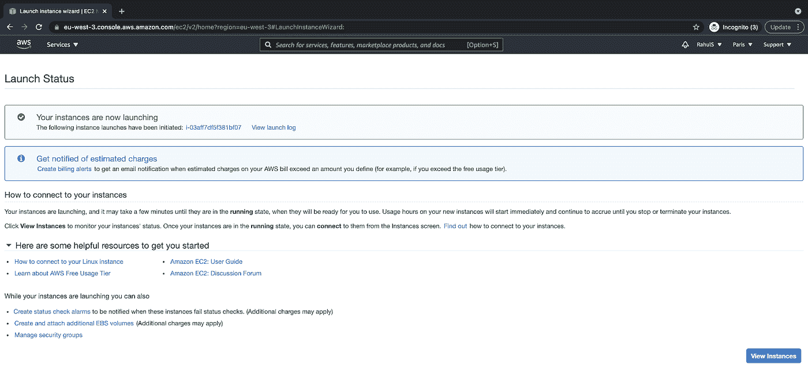

在这里，您可以看到实例已经创建，并处于“初始化”阶段。在一两分钟内，您可以看到您的实例启动并运行。

同时，让我们创建一个 RDS 实例。

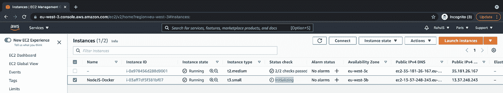

# 在 AWS 上使用 MySQL 实例创建 RDS Aurora

再次单击页面顶部的搜索栏，这次搜索“RDS”单击结果以访问 RDS 仪表板。

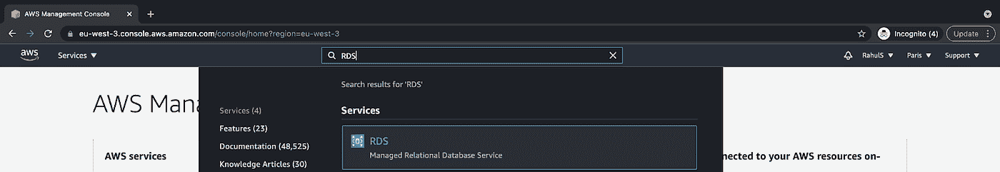

单击“创建数据库”按钮，在 RDS 仪表板上配置和创建 RDS 实例。

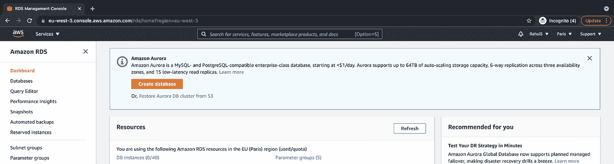

选择“简单创建”方法、“Amazon Aurora”引擎类型和“开发/测试”数据库实例大小，如下所示:

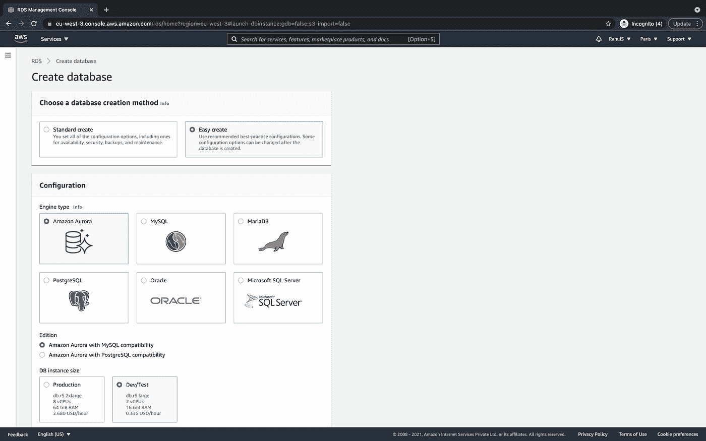

向下滚动一点，将“DB cluster identifier”指定为“my-Nodejs-database”您可以指定自己选择的任何名称，因为它只是为 RDS 实例指定的名称。但是，我建议使用相同的名称，以避免在接下来的步骤中混淆。

另外，指定一个主用户名为“admin”，其密码，然后单击“Create database”

这将启动 RDS Amazon Aurora 实例创建。请注意，您不能为生产或实际环境设置简单的用户名和密码。

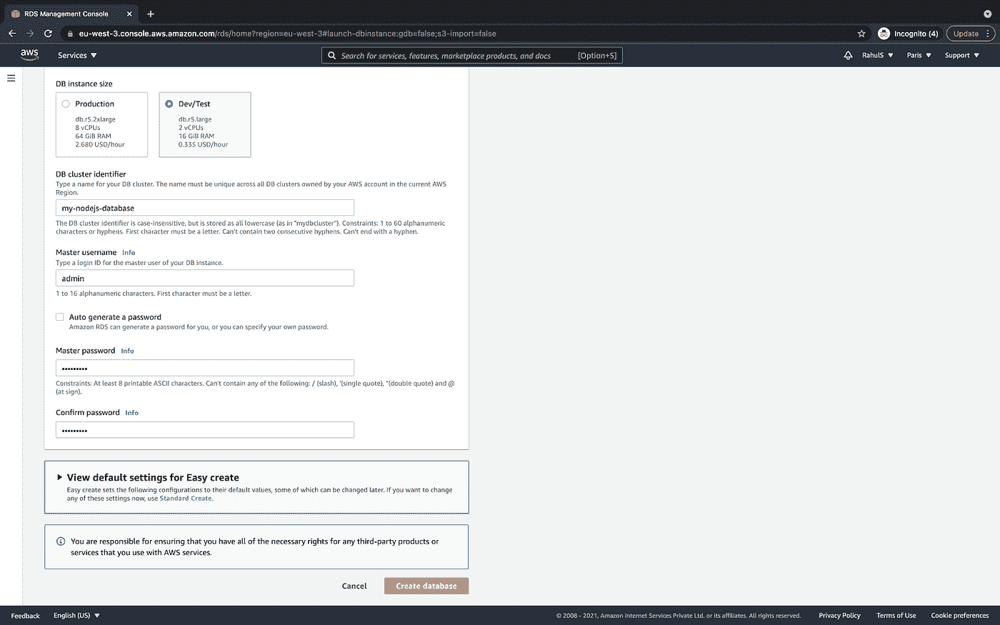

在这里，您可以看到实例处于“创建”状态。大约 5-10 分钟后，您应该可以启动并运行实例。

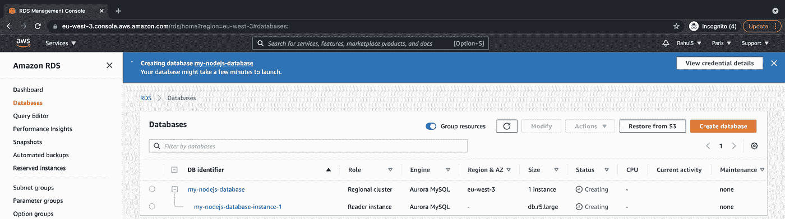

以下是一些注意事项:

*   默认情况下，RDS Amazon Aurora 实例将是私有的，这意味着 RDS Amazon Aurora 实例将无法从外部世界访问，只能在 VPC 内使用。
*   EC2 实例和 RDS 实例属于同一个 VPC。
*   可以从 EC2 实例访问 RDS 实例。

# 在 EC2 实例上安装依赖项

现在，您可以连接到我们创建的实例。我不会详细讨论连接到实例的细节；我相信你已经知道了。

# MySQL 客户端

我们需要一个 MySQL 客户端连接到 RDS Amazon Aurora 实例，并在其中创建一个数据库。连接到 EC2 实例，并从中执行以下命令。

`sudo apt update
sudo apt install mysql-client`

# 创建表格

我们需要 RDS Amazon Aurora 实例中的一个表来存储应用程序数据。要创建一个表，使用我们在上一步中安装在 EC2 实例上的 MySQL 客户机连接到 Amazon RDS Aurora 实例。

从 Amazon Aurora 实例复制数据库端点。

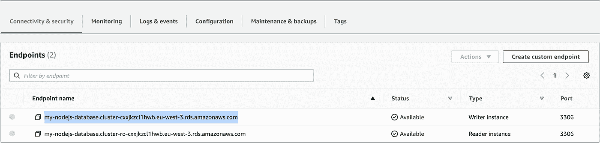

使用正确的值执行以下命令:

`mysql -u <user-name> -p<password> -h <host-endpoint>`

在这里，我的命令如下所示:

`mysql -u admin -padmin1234 -h [my-Nodejs-database.cluster-cxxjkzcl1hwb.eu-west-3.rds.amazonAWS.com](http://my-nodejs-database.cluster-cxxjkzcl1hwb.eu-west-3.rds.amazonaws.com/)`

一旦连接到 Amazon RDS Aurora 实例，执行以下命令创建一个“users”表。

```
show databases;
use main;
CREATE TABLE IF NOT EXISTS users(id int NOT NULL AUTO_INCREMENT, username varchar(30), email varchar(255), age int, PRIMARY KEY(id));
select * from users;
```

请参考下面的截图来理解命令的执行。

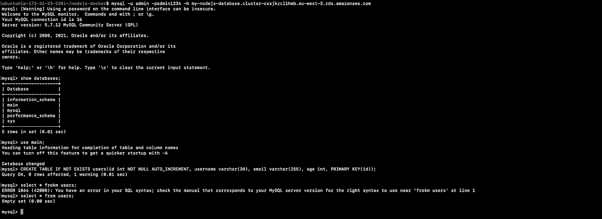

# 创建应用程序目录

现在，让我们创建一个目录，我们将在其中存储所有的代码库和配置文件。

`pwd
cd /home/ubuntu/
mkdir Nodejs-docker
cd Nodejs-docker`

# 在 EC2 实例上克隆代码库

克隆我的包含所有代码的 Github 库。这是一个可选步骤；我已经在这个文档中包含了所有的代码。

`pwd
cd /home/ubuntu/
git clone [https://github.com/shivalkarrahul/DevOps.git](https://github.com/shivalkarrahul/DevOps.git)
cp /home/ubuntu/DevOps/AWS/Nodejs-docker/* /home/ubuntu/Nodejs-docker`

**注意:**这是一个可选步骤。如果您将所有文件从存储库复制到应用程序目录，那么您不需要在接下来的步骤中创建文件；但是，您仍然需要进行必要的更改。

# 将 Nodejs 应用程序部署到 AWS EC2 实例，并使用域名访问它

## 为什么应该在 EC2 实例中使用 Docker？

Docker 是一个容器化工具，用于将我们的软件应用程序打包到一个映像中，该映像可用于创建 Docker 容器。Docker 有助于轻松构建、共享和部署我们的应用程序。

Docker 化的第一步是安装 Docker。

## 安装 Docker

1.  查看 Linux 版本
    `cat /etc/issue`
2.  更新 apt 包索引
    `sudo apt-get update`
3.  安装软件包以允许 apt 通过 HTTPS
    `sudo apt-get install apt-transport-https ca-certificates curl gnupg lsb-release`使用存储库
4.  添加 Docker 官方 GPG 键:
    `curl -fsSL [https://download.docker.com/linux/ubuntu/gpg](https://download.docker.com/linux/ubuntu/gpg) | sudo gpg –dearmor -o /usr/share/keyrings/docker-archive-keyring.gpg`
5.  设置稳定知识库
    `echo “deb [arch=amd64 signed-by=/usr/share/keyrings/docker-archive-keyring.gpg] [https://download.docker.com/linux/ubuntu](https://download.docker.com/linux/ubuntu) $(lsb_release -cs) stable” | sudo tee /etc/apt/sources.list.d/docker.list > /dev/null`
6.  更新 apt 包索引
    `sudo apt-get update`
7.  安装最新版本的 Docker 引擎并包含
    `sudo apt-get install docker-ce docker-ce-cli containerd.io`
8.  检查 Docker 版本
    `docker –version`
9.  作为非根用户管理 docker
    创建“Docker”组
    `sudo groupadd docker`
    将您的用户添加到 Docker 组
    `sudo usermod -aG docker <your-user-name>`
10.  退出。
    `exit`
11.  重新登录到终端
12.  验证您可以在没有`sudo
    docker run hello-world`的情况下运行 docker 命令
13.  执行上面的 run 命令后，您应该会看到如下输出:

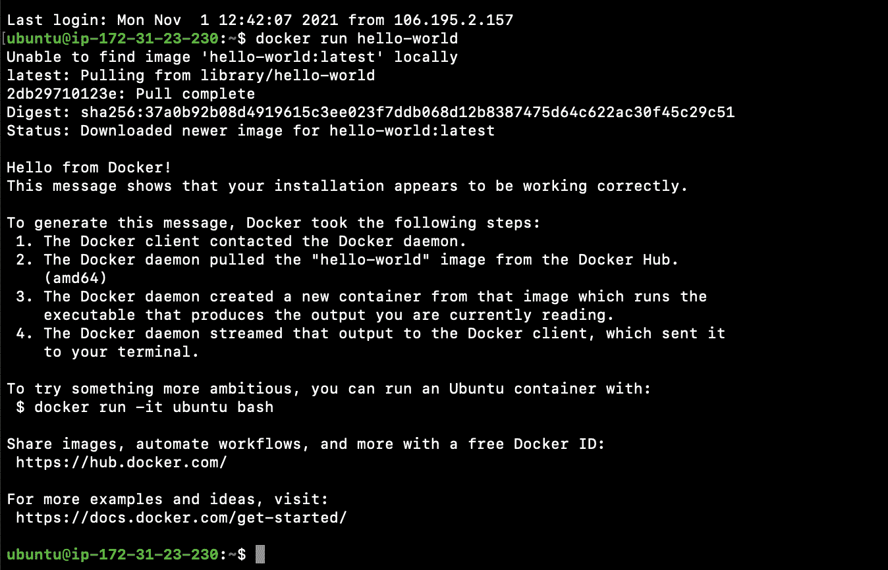

1.  参考下面的截图，看看我已经执行的命令。

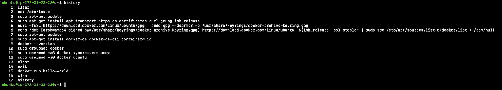

# 将 Node.js 应用程序停靠在 EC2 实例中

一旦你安装了 Docker，下一步就是对应用程序进行 Docker 化。将 Nodejs 应用程序 Docker 化意味着用一组指令编写 Docker 文件来创建 Docker 映像。

让我们创建 Dockerfile 和一个示例 Nodejs 应用程序。

`pwd
cd /home/ubuntu/Nodejs-docker`

创建 Dockerfile 并将以下内容粘贴到其中。或者，你可以从[这里](https://github.com/shivalkarrahul/DevOps/blob/master/aws/nodejs-docker/Dockerfile)复制内容。

`vim Dockerfile`

4.创建`index.js`并粘贴以下内容。或者，您可以将[中的内容复制到此处](https://github.com/shivalkarrahul/DevOps/blob/master/aws/nodejs-docker/index.js)。这将是我们的样本 Nodejs 应用程序。

`vim index.js`

在上面的文件中，使用适用于 RDS Amazon Aurora 实例的值来更改以下变量的值:

*   主持人:"[my-Nodejs-database . cluster-cxxjkzcl 1 hwb . eu-west-3 . rds . Amazon AWS . com](http://my-nodejs-database.cluster-cxxjkzcl1hwb.eu-west-3.rds.amazonaws.com/)"
*   用户:“管理员”
*   密码:“admin1234”

5.创建`package.json`，并将以下内容粘贴到其中。或者，您可以将[中的内容复制到此处](https://github.com/shivalkarrahul/DevOps/blob/master/aws/nodejs-docker/package.json)。

`vim package.json`

# 更新 AWS 安全组

为了访问应用程序，我们需要在安全组中添加一个规则，以允许在`port 3000`上的连接。前面说过，我们可以在`port 3000`上访问应用，但不推荐。继续阅读了解我们的推荐。

1.  转到 EC2 仪表板，选择实例，切换到“Security”选项卡，然后单击 Security groups 链接。

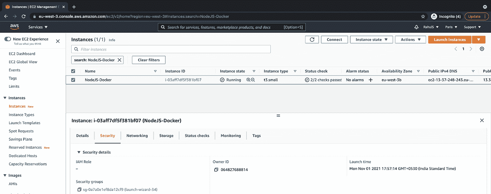

2.选择“入站规则”选项卡，然后单击“编辑入站规则”按钮。

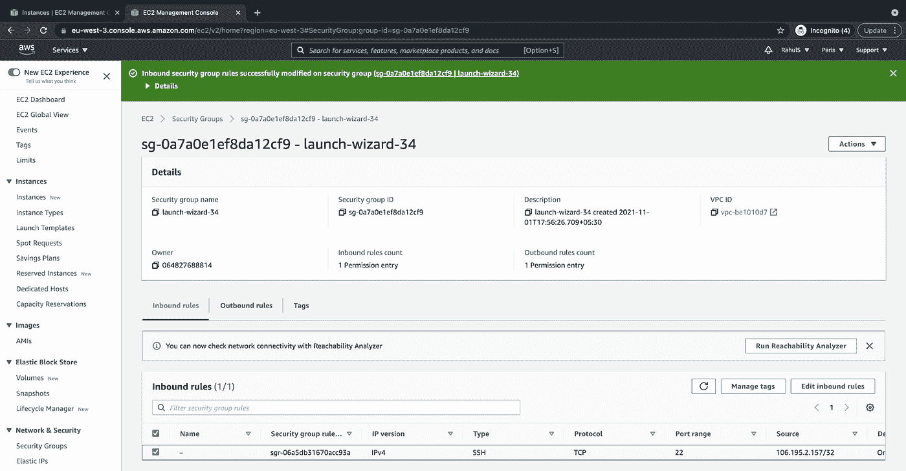

3.添加一条新规则，允许从`3000`端口上的“MyIp”进行外部连接。

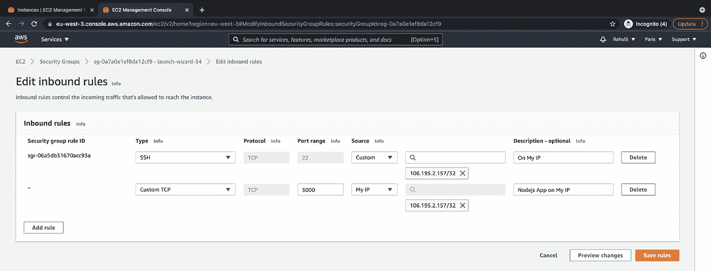

# 在 EC2 服务器(实例)上部署 Node.js 服务器

1.  让我们从现有的代码中构建一个 docker 映像。
    `cd /home/ubuntu/Nodejs-docker
    docker build -t Nodejs`

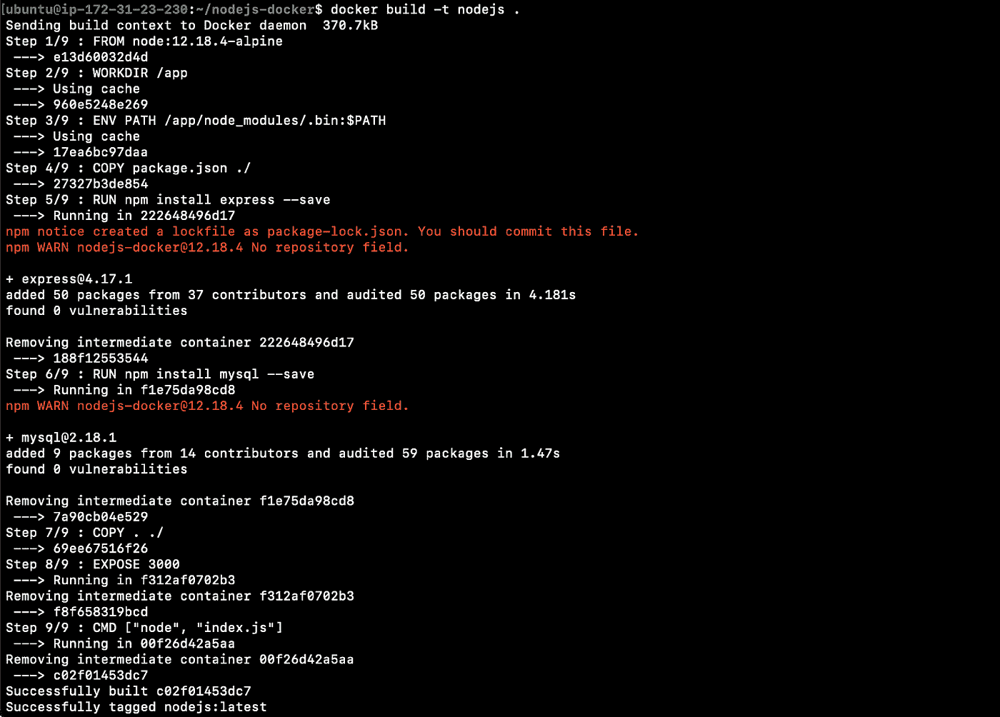

2.使用我们刚刚构建的映像启动一个容器，并在`port 3000`上公开它。

`docker run –name Nodejs -d -p 3000:3000 Nodejs`

3.您可以看到容器正在运行。
`docker ps`

4.您甚至可以检查容器的日志。
`docker logs Nodejs`


现在我们已经运行了 Nodejs 应用 Docker 容器。

5.现在，您可以在`port 3000`上从浏览器访问该应用程序。

*   使用浏览器在`/status api`上检查应用程序的状态:http://<public-IP-of-ec2-instance>:3000/status

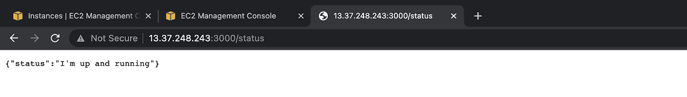

*   您可以使用[邮递员](https://www.postman.com/product/what-is-postman/)应用程序通过 POST 请求在 `/insert api`上的应用程序中插入一些数据。
    http://<public-IP-of-ec2-instance>:3000/insert？用户名= ABC&email=abc@abc.com&年龄=2 岁

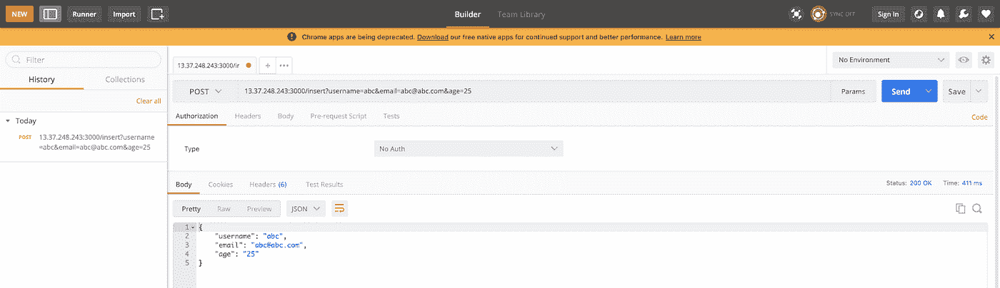

*   您可以在浏览器中使用`/list api`列出应用程序中的数据:
    http://<public-IP-of-ec2-instance>:3000/list

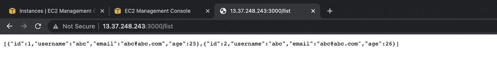

6.或者，您可以在 EC2 实例中使用 curl 命令来检查状态、插入数据和列出数据。
`curl -XGET “http://<public-ip-of-ec2-instance>:3000/list”
curl -XPOST “http://<public-ip-of-ec2-instance>:3000/insert?username=abc&email=[abc@abc.com](mailto:abc@abc.com)&age=26″`

7.停止并移除容器
和`docker stop Nodejs
docker rm Nodejs`

在本节中，我们试图使用 EC2 实例的`Public IP:Port`直接访问应用程序可用的 API。但是，完全不建议在安全组中向外界公开非标准端口。

此外，我们尝试通过 HTTP 协议访问应用程序，这意味着从浏览器到应用程序的通信是不安全的，攻击者可以读取网络数据包。

为了克服这种情况，建议使用 Nginx。

# Nginx 设置

让我们创建一个 Nginx `conf`，它将通过 Docker 卷在 Nginx 容器中使用。创建一个文件，并将以下内容复制到文件中。或者，您可以将[中的内容复制到](https://github.com/shivalkarrahul/DevOps/blob/master/aws/nodejs-docker/nginx-conf/nginx.conf)中。

`cd /home/ubuntu/Nodejs-docker
mkdir nginx-conf
vim nginx-conf/nginx.conf`

在上面的文件中，对下面提到的三行进行修改。将 my subdomain.domain(即 Nodejs.devopslee)替换为您想要的域名:

1.  `server_name [Nodejs.devopslee.com](http://nodejs.devopslee.com/) [www.Nodejs.devopslee.com](http://www.nodejs.devopslee.com/);`
2.  `ssl_certificate /etc/letsencrypt/live/Nodejs.devopslee.com/fullchain.pem;`
3.  `ssl_certificate_key /etc/letsencrypt/live/Nodejs.devopslee.com/privkey.pem;`

# Node.js 服务前面为什么需要 Nginx？

我们的 Nodejs 应用程序运行在非标准的`port 3000`上。Nodejs 提供了一种使用 HTTPS 的方法。但是，我们不应该关心在应用程序代码库中配置协议和管理定期过期的 SSL 证书。

为了克服这些情况，我们需要在它前面有 Nginx 和 SSL 终端，并将用户请求转发给 Nodejs。Nginx 是一种特殊类型的 web 服务器，可以充当反向代理、负载平衡器、邮件代理和 HTTP 缓存。这里，我们将使用 Nginx 作为反向代理，将请求重定向到 Nodejs 应用程序，并终止 SSL。

# 为什么不是阿帕奇？

Apache 也是一个 web 服务器，可以充当反向代理。它还支持 SSL 终止。然而，Nginx 和 Apache 有一些不同之处。由于以下原因，Nginx 通常比 Apache 更受欢迎:

1.  Nginx 只有一个或很少的进程，并且是异步的和基于事件的。Apache 试图为每个连接中的每个请求创建新的进程和新的线程。
2.  Nginx 是轻量级的，可伸缩的，易于配置。另一方面，Apache 很棒但是学习门槛更高。

# docker-撰写

接下来，让我们安装 docker-compose。

1.  下载 Docker Compose
    `sudo curl -L “[https://github.com/docker/compose/releases/download/1.29.2/docker-compose-$](https://github.com/docker/compose/releases/download/1.29.2/docker-compose-$)(uname -s)-$(uname -m)” -o /usr/local/bin/docker-compose`的当前稳定版本
2.  将可执行权限应用于我们在上一步中刚刚下载的 docker-compose 二进制文件。
    `sudo chmod +x /usr/local/bin/docker-compose`
3.  通过检查 docker-compose 版本
    `docker-compose –version`测试安装是否成功
4.  创建一个`docker-compose.yaml`文件。或者，您可以将[中的内容复制到此处](https://github.com/shivalkarrahul/DevOps/blob/master/aws/nodejs-docker/docker-compose.yml)。这将用于旋转我们的应用技术堆栈的 docker 容器。
    `cd /home/ubuntu/Nodejs-docker
    vim docker-compose.yml`

在上面的文件中，对下面提到的行进行修改。把我的 subdomain.domain，也就是 Nodejs.devopslee 替换成你想要拥有的。更改您个人电子邮件的 IP 地址。

`–email EMAIL`。用于注册和恢复联系的电子邮件。

1.  命令:`certonly –webroot –webroot-path=/var/www/html –email my@email.com –agree-tos –no-eff-email –staging -d [Nodejs.devopslee.com](http://nodejs.devopslee.com/) -d [www.Nodejs.devopslee.com](http://www.nodejs.devopslee.com/)`

# 更新 AWS 安全组

这一次，在附加到 EC2 实例的安全组中公开`ports 80`和`443`。此外，删除`3000` ，因为它是不必要的，因为应用程序通过`port 443`工作。

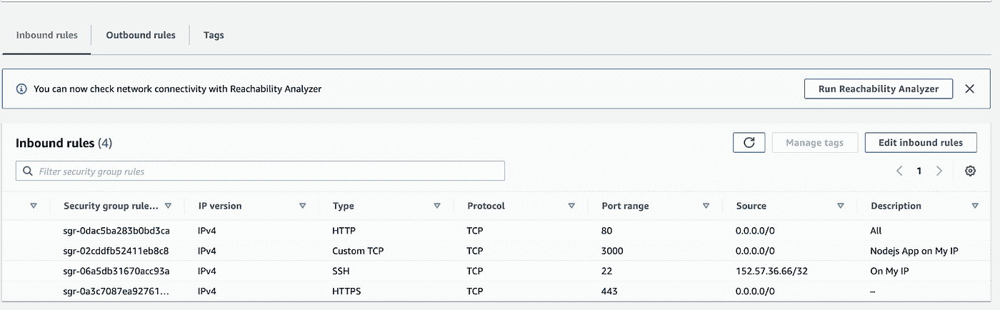

# 包括 DNS 更改

在这里，我创建了一个子域“[Nodejs.devopslee.com](http://nodejs.devopslee.com/)”，它将用于使用域名访问示例 Nodejs 应用程序，而不是使用 IP 访问。

如果您已经有了自己的域名，您可以在 AWS 上创建自己的子域。

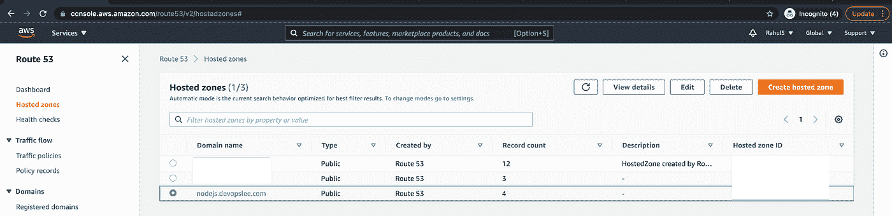

在托管区域中创建两个“类型 A 记录集”,其值为 EC2 实例的公共 IP。

一个记录集将是[subdomain.domain.com](http://subdomain.domain.com/)，另一个将是[www.subdomain.domain.com](http://www.subdomain.domain.com/)。

这里，我创建了[Nodejs.devopslee.com](http://nodejs.devopslee.com/)和[www.Nodejs.devopslee.com](http://www.nodejs.devopslee.com/)，两者都指向 EC2 实例的公共 IP。

**注意:**我没有给 EC2 实例分配任何弹性 IP。建议分配一个弹性 IP，然后在记录集中使用它。当您重新启动 EC2 实例时，您不需要更新记录集中的 IP，因为公共 IP 在 EC2 实例重新启动后会发生变化。

现在，复制“NS 类型记录集”的值在接下来的步骤中，我们将需要这些。

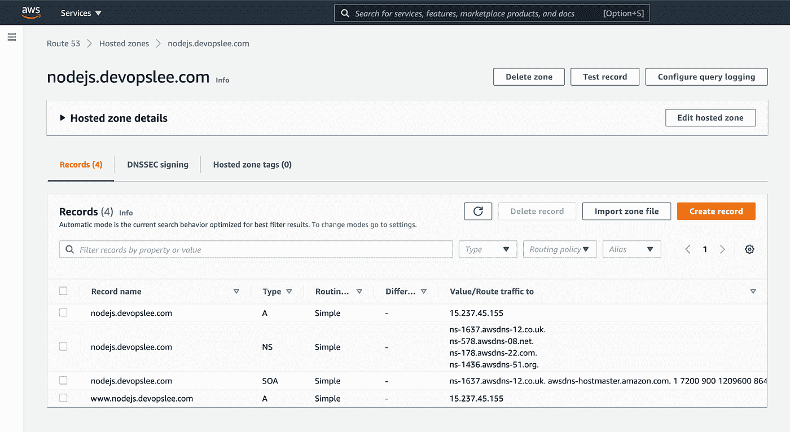

转到您的域的托管区域，使用您的[subdomain.domain.com](http://subdomain.domain.com/)创建一个新的“记录”，添加您在上一步中复制的 NS 值。

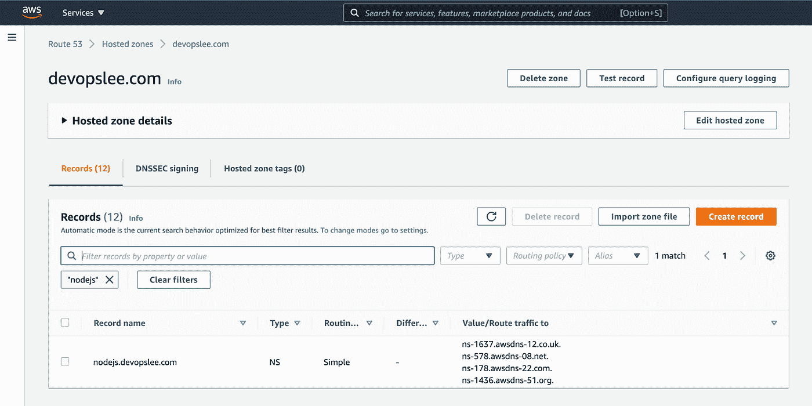

现在，您有了一个可以用来访问应用程序的子域。

在我的例子中，我可以使用 Nodejs.devopslee.com 的 T21 来访问 Nodejs 应用程序。我们还没完。下一步是保护我们的 Nodejs web 应用程序。

# 包括 SSL 证书

让我们为 Nginx 生成密钥。

1.  `cd /home/ubuntu/Nodejs-docker`
2.  `mkdir views`
3.  `mkdir dhparam`
4.  `sudo openssl dhparam -out /home/ubuntu/Nodejs-docker/dhparam/dhparam-2048.pem 2048`

# 将 Nodejs 应用程序部署到 EC2 实例

我们已经准备好使用 docker-compose 启动 Nodejs 应用程序。

这将在`port 3000`上启动我们的 Nodejs 应用，在`port 80`和`443`上使用 SSL 启动 Nginx。当使用域访问时，Nginx 会将请求重定向到 Nodejs 应用程序。它还将有一个 Certbot 客户端，使我们能够获得我们的证书。

1.  docker-排版

点击上面的命令后，您将看到如下输出。您必须看到一条消息，显示为“已成功接收证书”

**注意:**上面的 docker-compose 命令将启动容器，并保持与终端的连接。我们没有使用`-d`选项将其从终端上拆下。

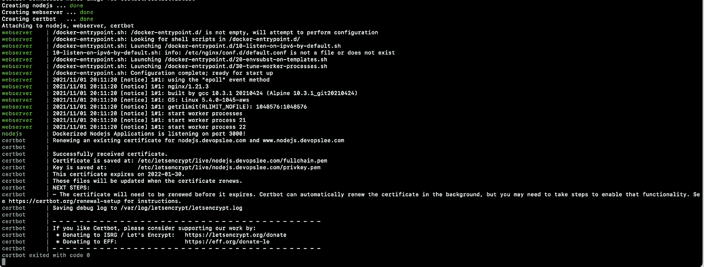

你都准备好了。现在点击浏览器中的 URL，您应该可以在 HTTPS 上使用 Nodejs 应用程序了。

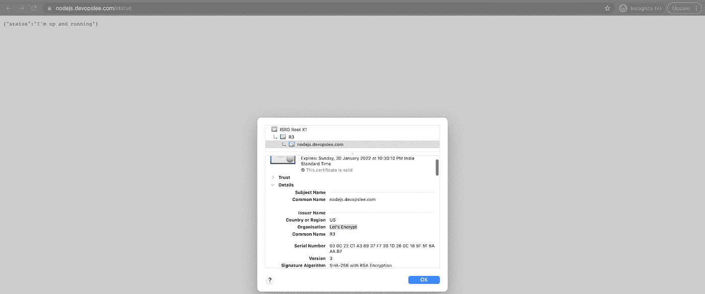

您也可以尝试使用`curl`命令来运行应用程序:

1.  列出来自应用程序
    的数据`curl [https://Nodejs.devopslee.com/list](https://nodejs.devopslee.com/list)`
2.  在应用程序中插入一个条目
    `curl -XPOST “[https://Nodejs.devopslee.com/insert?username=abc&email=abc@abc.com&age=28](https://nodejs.devopslee.com/insert?username=abc&email=abc@abc.com&age=28)“`
3.  再次列出数据以验证数据是否被插入
    `curl [https://Nodejs.devopslee.com/list](https://nodejs.devopslee.com/list)`

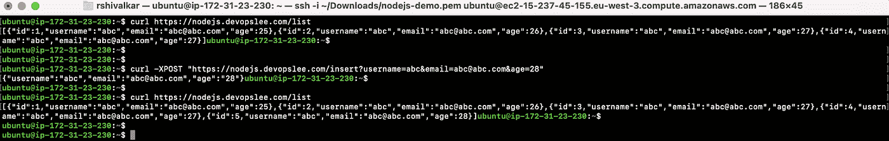

4.检查申请的状态
[https://Nodejs.devopslee.com/status](https://nodejs.devopslee.com/status*)

5.点击浏览器中的 URL 以获得数据库中的条目列表。
[https://Nodejs.devopslee.com/list](https://nodejs.devopslee.com/list)

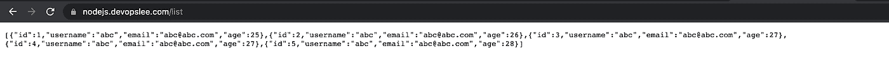

# SSL 证书的自动续订

我们使用 Let's Encrypt 生成的证书有效期为 90 天。因此，我们需要有一种方法来自动更新我们的证书，这样我们就不会以过期的证书而告终。

为了自动化这个过程，让我们创建一个为我们更新证书的脚本和一个 cronjob 来安排这个脚本的执行。

1.  用`–dry-run`创建一个脚本来测试我们的脚本
    `vim renew-cert.sh`

```
#!/bin/bashCOMPOSE="/usr/local/bin/docker-compose --no-ansi"
DOCKER="/usr/bin/docker"cd /home/ubuntu/Nodejs-docker/
$COMPOSE run certbot renew --dry-run && $COMPOSE kill -s SIGHUP webserver
$DOCKER system prune -af
```


2.更改脚本的权限，使其可执行。
`chmod 774 renew-cert.sh`

3.创建一个 cronjob
`sudo crontab -e`

```
*/5 * * * * /home/ubuntu/Nodejs-docker/renew-cert.sh >> /var/log/cron.log 2>&1
```

4.列出 cronjobs。
`sudo crontab -l`

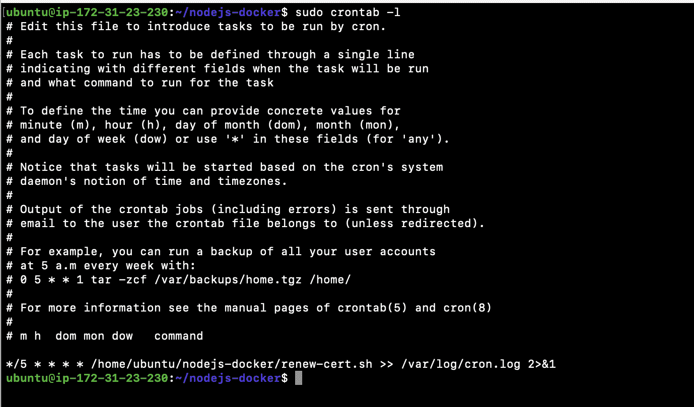

5.五分钟后检查 cronjob 的日志，因为我们已经设置了每五分钟执行一次 cron job
`tail -f /var/log/cron.lo`

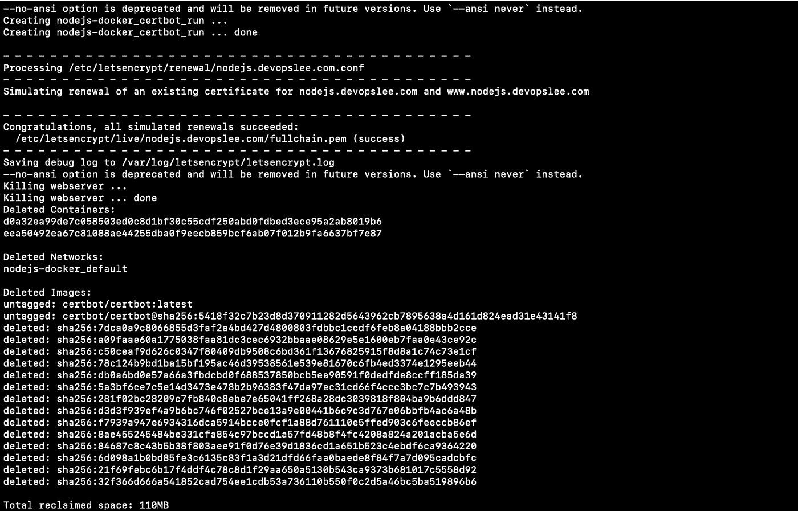

您可以看到“模拟现有证书的续订…”在上面的截图中。这是因为我们在脚本中指定了`–dry-run`选项。

6.让我们从脚本中删除`–dry-run`选项。
`vim renew-cert.sh`

```
#!/bin/bashCOMPOSE="/usr/local/bin/docker-compose --no-ansi"
DOCKER="/usr/bin/docker"cd /home/ubuntu/Nodejs-docker/
$COMPOSE run certbot renew && $COMPOSE kill -s SIGHUP webserver
$DOCKER system prune -af
```

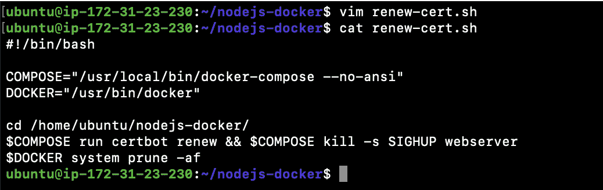

这一次，您将不会看到“模拟现有证书的续订”消息。现在，脚本将检查是否需要更新证书。如果需要，它将更新证书。如果没有，它将忽略并说，“证书尚未到期，需要更新。”

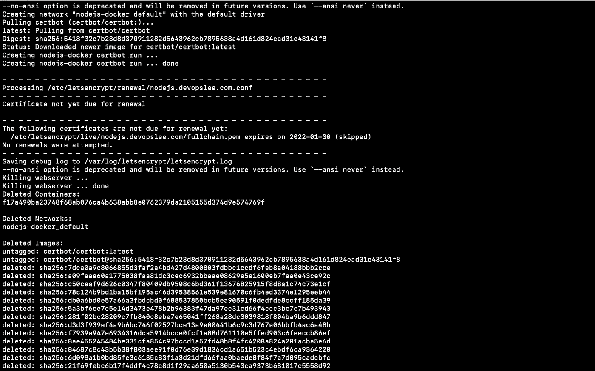

# 下一步如何将 Nodejs 应用程序部署到 AWS？

我们已经在 AWS EC2 实例上使用 Docker 完成了 Nodejs 应用程序的设置。然而，当您想要为生产和其他环境部署一个高度可用的应用程序时，还需要考虑其他因素。

下一步是使用 ECS 或 EKS 这样的 orchestrator 在生产级别管理我们的 Nodejs 应用程序。Docker 和 Docker-Compose 并没有提供复制、自动扩展、负载平衡、流量路由和监控容器健康状况等功能。为了大规模管理容器和微服务架构，您需要一个像 ECS 或 EKS 这样的容器编排工具。

此外，我们没有使用任何 Docker 存储库来存储我们的 Nodejs 应用程序 Docker 映像。您可以使用 AWS ECR，这是一个完全托管的 AWS 容器注册中心，提供高性能托管。

如果您想创建云原生架构，请查看我们的视频[什么是云原生架构以及如何采用它？](https://www.youtube.com/watch?v=RhcvIXwkr_4)

另读:[亚马逊 ECS vs EKS:最好的 AWS 容器服务](https://www.clickittech.com/aws/amazon-ecs-vs-eks/)

# 结论

将 Nodejs 应用程序部署到 AWS 并不意味着仅仅创建一个 Nodejs 应用程序，并将其部署到带有自管理数据库的 AWS EC2 实例上。当您希望加快软件开发、部署、安全性、可靠性和数据冗余时，有许多方面需要考虑，如容器化 Nodejs 应用程序、SSL 终端和应用程序的域。

在本文中，我们回顾了 dockerize 示例 Nodejs 应用程序的步骤。我们使用 AWS RDS Amazon Aurora，并使用 Docker 和 Docker-Compose 将 Nodejs 应用程序部署到 EC2 实例。我们启用了我们的子域的 SSL termination 来访问 Nodejs 应用程序。

此外，我们还看到了使用 Certbot 自动执行域验证和 SSL 证书创建的步骤，并发现了一种自动执行证书更新过程的方法，该过程的有效期为 90 天。

这足以让您开始使用一个示例 Nodejs 应用程序。然而，当涉及到管理您的实时应用、数百个微服务、数千个容器、卷、网络、秘密和出入口时，您需要一个容器编排工具。

有各种各样的工具，如自托管的 Kubernetes、AWS ECS 和 AWS EKS，您可以利用它们来管理现实应用程序中的容器生命周期。

```
**Want to connect with the author?**[Article originally posted at ClickIT](https://www.clickittech.com/devops/deploy-nodejs-app-to-aws/?utm_source=deply+nodejs+app&utm_id=Blogs)
```