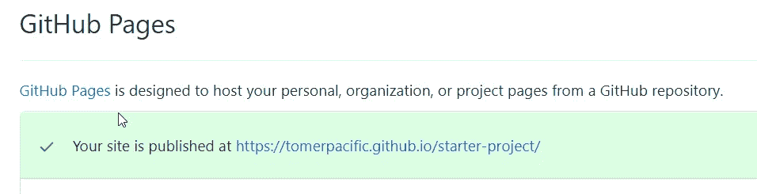

# 如何将路由的 React 应用程序部署到 GitHub 页面

> 原文：<https://betterprogramming.pub/how-to-deploy-a-routed-react-app-to-github-pages-9a40a31a0afc>

## 告别域名购买


照片由[你好，我是尼克🎞](https://unsplash.com/@helloimnik?utm_source=unsplash&utm_medium=referral&utm_content=creditCopyText) on [Unsplash](https://unsplash.com/s/photos/lego-rocket?utm_source=unsplash&utm_medium=referral&utm_content=creditCopyText)

当我们建立项目时，我们希望在网上展示它们。与其购买域名并花时间配置它，不如使用 [GitHub Pages](https://pages.github.com/) 托管它更简单。

一个只使用 JavaScript、HTML 和 CSS 的项目很容易在 GitHub 页面上托管。然而，在 React、Vue 或 Angular 中构建的项目需要一些配置。这使得任何在线访问您的应用程序的人都能获得与您在本地构建应用程序时相同的体验。

在本文中，我将向您展示如何创建一个使用路由的简单 React 应用程序，然后我们将学习如何将它上传到 GitHub 页面。我们将特别关注路由部分，因为理解和实现它非常重要。

# 先决条件

你需要在你的机器上安装 Node，Yarn 和 npm。若要检查它们是否已安装，请打开终端窗口并键入以下内容:

```
npm -v
yarn -v
node -v
```

如果这些命令在终端中打印出一个版本号，就可以了。如果没有，您需要安装缺少的部分。

*   [节点](https://nodejs.org/en/download/)(包含 npm)
*   [纱线](https://classic.yarnpkg.com/en/docs/install/#windows-stable)

我们还需要在 GitHub 上创建一个存储库。转到您的帐户，创建一个新的存储库。选择您认为适合这个项目的名称，但是在本文的其余部分，我将使用`starter-project` 。

为了创建我们的项目，我们将使用`create-react-app`。这是一个可以让你轻松创建单页应用程序的包。要创建项目，您需要在终端中键入以下内容:

```
npx create-react-app starter-project
```

一旦操作完成，您将拥有一个准备就绪的样板 React 项目。要查看它是否正常工作，请转到项目目录(在我们的示例中是`starter-project`)并运行以下命令:

```
yarn start
```

如果一切运行正常，您将在终端中看到一条消息，说明您的应用程序正在这个地址的本地服务器上运行:`[http://localhost:3000](http://localhost:3000)`。

如果你打开浏览器，你会看到这个:


# 如何将您的项目部署到 GitHub

您可能已经注意到，我们没有在 GitHub 中创建任何存储库。所以在我们继续之前，我们必须把我们的项目上传到那里。转到您的 GitHub 帐户，创建一个与 React 项目同名的存储库。

*注意:确保将您的存储库标记为 public。如果您将其标记为私有，您将无法使用 GitHub 页面。*

我们将把这个存储库作为远程设备添加到我们的项目中。为此，请在终端中键入以下内容:

```
git remote add <name-of-remote> <url-of-repository>
```

因此，在我们的例子中，命令看起来像这样:

```
git remote add origin [https://github.com/TomerPacific/starter-project](https://github.com/TomerPacific/starter-project)
```

*注意:调用遥控器* `origin` *很重要，因为它将在我们的部署过程中使用。*

在执行了上面的命令之后，我们仍然不能推送我们的代码。首先，我们需要配置一个上游分支，并将远程设置为起点:

```
git push --set-upstream origin master
```

现在，我们可以将所有项目文件推送到我们的存储库中。

为了能够将我们构建的应用程序上传到 GitHub Pages，我们首先需要安装 [gh-pages 包](https://www.npmjs.com/package/gh-pages):

```
yarn add gh-pages
```

这个包将帮助我们将代码部署到`gh-pages`分支，该分支将用于在 GitHub 页面上托管我们的应用程序。

为了允许我们正确使用`gh-pages`包，我们需要在`package.json`文件中为我们的脚本值添加两个键:

接下来，我们需要通过添加主页字段来修改我们的`package.json`文件。React 使用这个字段来计算构建的 HTML 文件中的根 URL。在这里，我们放入 GitHub 库的 URL:

要部署我们的应用程序，请在终端中键入以下内容:

```
npm run deploy
```

运行上面的命令负责构建您的应用程序，并将其推送到一个名为`gh-pages`的分支，GitHub 用它来链接 GitHub 页面。

*注意:如果你没有将你的遥控器命名为* `origin` *，你会得到一个错误提示* `Failed to get remote.origin.url (task must either be run in a git repository with a configured origin remote or must be configured with the “repo” option).`

如果您在过程结束时看到单词`Published`，您将知道该过程成功。我们现在可以进入设置下的 GitHub 库，向下滚动到 GitHub 页面部分。



如果您看到类似上面的消息，这意味着您的应用程序现在成功托管在 GitHub 页面上。


# React 中的路由

到目前为止，一切顺利:

*   我们有一个托管在 GitHub 页面上的基本 React 应用程序
*   当我们想要进行更改时，我们也有一个简化的流程来部署它

但是本文的目的是展示一个比我们最初创建的应用程序更复杂的应用程序，所以现在我们需要讨论路由。

我们的应用程序中缺少的一个组件是导航。我们的应用程序不会只有一页，它可能会有很多页。用户将如何在它们之间导航？

路由是为网络中的流量选择路径的实践。或者，用更基本的术语来说，定义当你点击网页内部的链接时会发生什么，以及你会被重定向到哪里。

React 是一个库——它不包含开箱即用的应用程序所需的一切(在我们的例子中是路由)。因此，我们将需要安装[反应路由器](https://reactrouter.com/web/guides/quick-start)。

React router 为 web 应用程序和本地应用程序提供了不同的组件。因为我们正在构建一个 web 应用程序，所以我们将使用`react-router-dom`。

```
yarn add react-router-dom
```

为了在我们的应用程序中使用路由，让我们创建一个导航元素，它将在应用程序的顶部可见。我们将把它添加到 App.js 文件中，并替换那里当前的 HTML 标记。

通常，在非 React 项目中，我们会为每个部分放置一个到 HTML 页面的相对路径。这样，浏览器知道从哪里加载数据。

然而，在我们的项目中，我们不会为每个部分设置不同的 HTML 页面——我们只是加载不同的组件。以前在 App.js 中的标记现在可以在一个名为`Home`的组件中找到。

Home.jsx

因为我们已经在导航中创建了三个部分，并且已经处理了 home 部分，所以让我们用 About 部分再举一个例子。

我们将创建一个名为`About.jsx`的新文件，它将保存我们的模板和 About 部分的代码:

您可能会问，一旦用户点击了 about 链接，应用程序如何知道要重定向用户呢？为此，我们使用一个名为`Route`的组件。

`Route`是`react-router`中最重要的组件之一，因为它让你根据 URL 的路径呈现不同的组件。对于我们的项目，我们将使用 App.js 中导航标记下面的代码。

您可以看到，我们已经创建了两条路线 Home 和 About。开关组件允许我们将路由组件组合在一起—它将只匹配其中一个。

我们合并的 App.js 文件如下所示:

App.js

我们应该做的最后一件事是将整个项目包装在路由器组件中。我们需要这样做，因为它使我们能够在应用程序中使用路由。我们将使用`BrowserRouter` 组件，因为它使用 HTML5 的历史 API。

索引. js

如果我们在本地运行，一切似乎都正常。让我们将我们的增强项目部署到 GitHub 页面，看看结果如何。

# 如何使用 HashRouter 处理路由

乍一看，一切似乎都很好。但是当你尝试刷新页面或浏览浏览器本身时，你会不断得到 404 错误。

为什么会这样？因为 GitHub Pages 不像你的浏览器那样支持浏览器历史。在我们的例子中，路由[https://tomerpacific.github.io/starter-project/about](https://tomerpacific.github.io/starter-project/about)并不能帮助 GitHub 页面理解将用户指向哪里(因为它是一个前端路由)。

为了克服这个问题，我们需要在我们的应用程序中使用散列路由器而不是浏览器路由器。这种类型的路由器使用 URL 的散列部分来保持 UI 与 URL 同步。

索引. js

你可以在这里阅读更多关于这个[的内容。](https://create-react-app.dev/docs/deployment/#github-pages-https-pagesgithubcom)

再次部署您的应用程序，您会对结果感到满意。不再有 404 错误！

您可以从下面获得我们的初始项目的源代码:

[](https://github.com/TomerPacific/MediumArticles/tree/master/starter-project) [## 太平洋/地中海

### 这个项目是用 Create React App 引导的。在项目目录中，您可以运行:在…中运行应用程序

github.com](https://github.com/TomerPacific/MediumArticles/tree/master/starter-project) 

这篇文章的灵感来自于我的一个项目。您可以在下面查看:

[](https://github.com/TomerPacific/julOnSaleReact) [## TomerPacific/julOnSaleReact

### 查看 7 月份的特价商品🎒 💻 🚿 🍼 🍸 🍞 🍌 🍅Permalink 无法加载最新的提交信息。julOnSaleReact 参见…

github.com](https://github.com/TomerPacific/julOnSaleReact)