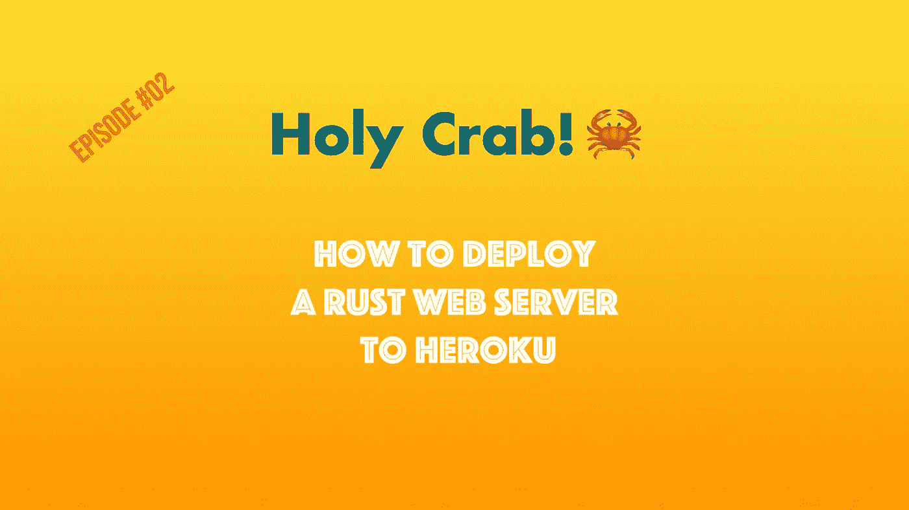

# 如何使用 Axum、Docker 和 GitHub 操作将 Rust Web 服务器部署到 Heroku

> 原文：<https://betterprogramming.pub/how-to-deploy-a-rust-web-server-to-heroku-using-axum-docker-and-github-actions-6cddb442ea7e>

## 编写生产就绪代码的技巧



作者图片

你好。今天，我们将使用 Axum 作为我们的 web 框架。

因此，首先，我们需要添加 Axum 和 Tokio 作为对`Cargo.toml`的依赖。

Cargo.toml

在`main.rs`上，我们将添加 Axum 官方文档中的 hello world 版本:

main.rs

这是一个好的开始，但是我们需要使服务器监听的端口更加灵活，以便在 Heroku 上工作。我们需要使用环境变量`PORT`，如下所示:

main.rs

好，现在我们检查`PORT`是否存在。如果没有，我们默认使用`3000`，这样我们仍然可以轻松地在`localhost`上运行它。

接下来，让我们用下面的代码创建一个 docker 文件:

Dockerfile 文件

这个 Dockerfile 文件有两个阶段来生成一个较小的图像。

在第一阶段，它安装所有依赖项并编译代码，在第二阶段，它将二进制文件复制到一个较小的基础映像。如果您将所有内容都保留在映像上，结果大约是 70MB 而不是 2GB。较小的图像更酷。

我们正在到达那里。现在我们将使用 Github 操作，您可以在下面看到:

。github/workflows/main.yml

我们需要两个秘密来实现它:

对于`HEROKU_API_KEY`，我们需要一个长期令牌，您可以使用以下命令生成它:

```
heroku authorizations:create
```

它将生成一个令牌，您需要它来执行 Github 操作:

*您的回购>设置>机密>操作>新建仓库机密*

另一个变量将是你在 Heroku 上的应用程序的名称。您可以从 Heroku UI 或使用命令行界面通过以下小命令获取它:

```
heroku apps
```

如果您还没有 Heroku 应用程序，您可以通过以下方式生成:

```
heroku apps:create
```

找到名字后，继续用添加`HEROKU_API_TOKEN`的方法创建`HEROKU_APP`。

好的，我们都准备好了。现在，你需要把你的代码推给 Heroku。之后，它会触发一个新的 GitHub 动作工作流程。

它将构建 Docker 映像，将其推送到 Heroku 容器注册中心，并发布到生产环境。耶！

如果你更喜欢视频而不是文章，[你可以在我的 Rust 频道，Holy Crab 这里观看。](https://www.youtube.com/watch?v=ZF1WQGur_NA)