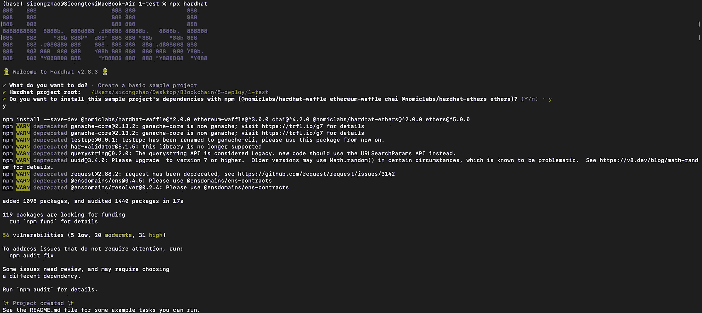
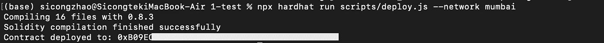

# 如何在 5 分钟内部署智能合同

> 原文：<https://betterprogramming.pub/how-to-deploy-a-smart-contract-in-5-minutes-8c924bb702aa>

## 区块链开发教程 01 —使用安全帽


部署智能合约有多种方式。在本文中，我将分享使用 [hardhat](https://hardhat.org/) 部署智能合约的方法。没有先决条件。

## 部署智能合同的 5 个步骤

1.  设置环境
2.  启动一个安全帽项目
3.  配置
4.  部署代码
5.  部署

## 第一步。设置环境

第一步，在你的终端上运行代码。

我们首先创建一个项目文件夹，并使用`npm init -y`来生成一个 npm 项目。`-y`表示对每个提示说是。

然后我们安装`hardhat`库。Hardhat 是一个以太坊开发环境。它有助于测试、编译、部署和调试智能合同。

请记住安装基于您的项目的所有依赖项。例如，在 NFT 智能合约的情况下，您可能想要添加`npm install [@openzeppelin/contracts](http://twitter.com/openzeppelin/contracts)`。

## 第二步。启动一个安全帽项目

留在项目文件夹中，使用命令`npx hardhat`创建一个基本的样本安全帽项目。为每个提示问题选择默认选项。您的终端将如下所示:



图 1“npx hard hat”命令的终端输出

现在，在您的项目文件夹中，合同文件夹下有许多带有示例智能合同的文件夹。我们来删除以下文件:`test/sample-test.js`、`script/sample-script.js`、`contracts/Greeter.sol`。

然后将您的智能合同保存在`\contracts`文件夹下。

## 第三步。配置网络和私钥

让我们使用 Mumbai，Polygon 的 Testnet 作为演示。打开`hardhat.config.js`，用以下代码替换现有代码。

确保你选择了正确的 solidity 版本，添加你的私钥和 Mumbai RPC。你可以在官方文档中找到一个 RPC 列表。由于该文件包含您的私钥，您可能希望将它保存在本地计算机上。

您可以在 networks 部分配置其他网络，在第 5 步中，您可以选择要使用的网络。

不熟悉 RPC？我也很迷茫。[这篇文章](https://www.anyblockanalytics.com/blog/what-is-a-blockchain-rpc-node-api/)帮了我大忙。简而言之，RPC 就像 Web2.0 中的 API 地址。

## 第四步。部署代码

现在，我们设置了环境和配置文件，让我们处理将有助于部署智能合约的代码。

在`\scripts`文件夹下创建一个文件`deploy.js`，复制以下内容:

代码是不言自明的。本质上，我们只是使用`hre.ethers`来获得我们的合同并部署它。以下是一些建议:

*   在第 2 行中，`your-contract-name`不应包含'.索尔。如果你的合同文件名是`myContract.sol`，就在这里用`myContract`。
*   在第 3 行，提供智能合约的`constructor`所需的所有参数。
*   从第 7 行到第 11 行，您可以通过调用智能合约的函数来尝试与智能合约进行交互。

## 第五步。部署

最后一步是最简单的，只需使用命令:`npx hardhat run scripts/deploy.js --network mumbai`

预期的终端输出如下所示:



图 2 合同部署命令的终端输出

记住您的智能合同地址，您将在构建前端时使用它。

## 离别赠言

你有它！我希望本教程能够帮助您部署您的智能合同。如果您有任何问题或建议，请随时发表评论。如果你想让我写其他关于区块链发展的话题，也请告诉我！

```
**Want to Connect?**Please feel free to reach out ([my LinkedIn](https://www.linkedin.com/in/zhaosicong/)) if you have any questions, feedback, or even just a random chat.
```