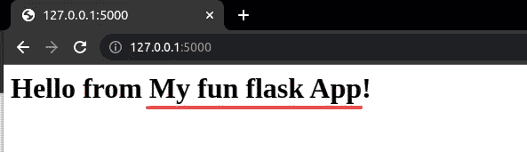
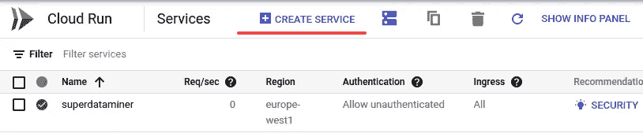
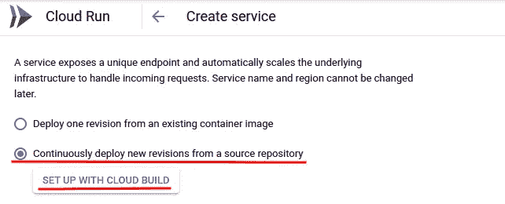
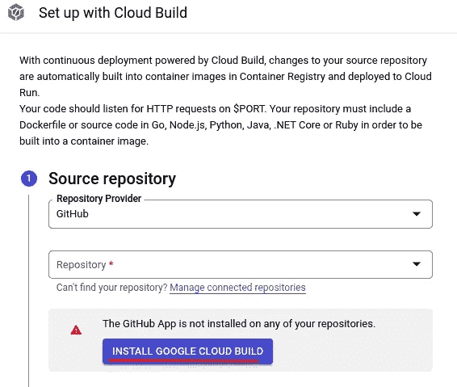
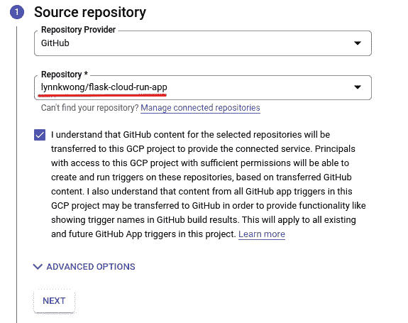
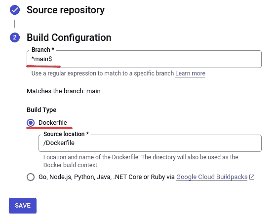
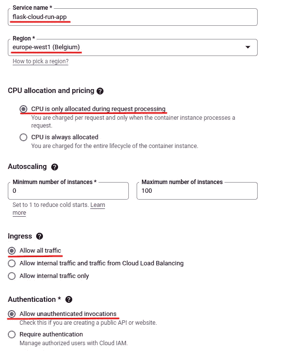
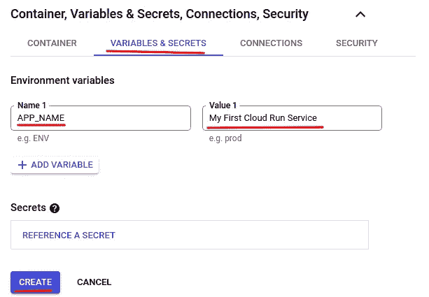
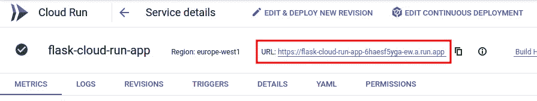
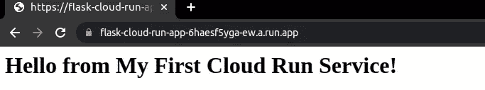

# 如何将 Web 应用程序部署到自动运行的云

> 原文：<https://betterprogramming.pub/how-to-deploy-a-web-application-to-cloud-run-automatically-6967d7c7d42a>

## 将 CI/CD 应用于您的 web 应用程序


图片由 Pixabay 的 [kreatikar](https://pixabay.com/illustrations/cloud-computer-hosting-3406627/) 拍摄

使用一些 web Python web 框架，如 Flask、Django 或 FastAPI，可以很容易地用 Python 开发 API 或 web 应用程序。作为一个 Python 开发者，这些框架都是原生的，很容易上手，因为你不需要学习 JavaScript 这样的全新前端语言加上它的 React、Angular、Vue 等框架。

本文不是关于如何用 Python 框架开发 API 或 web 应用程序。然而，它关注的是如何将 web 应用程序部署到持续运行的云上。之所以选择 Flask 框架，是因为它使用简单，并且有一个很大的社区。这篇文章中介绍的过程适用于所有 Python 框架。

## 本地安装烧瓶

在生产环境中将我们的代码部署到云中之前，我们需要在本地开发它，并做好一切准备。

第一步是在你的计算机上安装框架。建议在虚拟环境中安装 Flask，这样它就不会干扰系统库。此外，您可以在不同的虚拟环境中安装不同版本的 Flask。

我们可以使用 Python native `venv`库来管理您的虚拟环境。或者，你可以使用 [conda](https://docs.conda.io/en/latest/) ，因为你可以方便地用 conda 安装不同版本的 Python。此外，您可以从任何地方激活虚拟环境，无需担心虚拟环境的元数据。如果您想了解更多关于康达的信息，请点击此处的[。](https://lynn-kwong.medium.com/how-to-create-virtual-environments-with-venv-and-conda-in-python-31814c0a8ec2)

```
(base)$ **conda create --name flask python=3.10** (base)$ **conda activate flask** (flask)$ **pip install Flask==2.1.1**
```

除了 Flask 之外，Flask 需要的几个依赖项是自动安装的。现在我们可以开始在本地创建一个 Flask 应用程序。

## 在本地准备烧瓶应用程序

我们将创建一个超级简单的“Hello World！”Flask 应用程序，因为重点是即将推出的持续部署(CD)配置。

创建一个名为`my_app`的文件夹，并导航到其中。然后创建一个名为`app.py`的文件。你可以给它起任何你喜欢的名字，但是通常把它命名为`app.py`或者`wsgi.py`，这样一些本地的网络服务器可以很容易地找到它。将以下代码添加到`app.py`:

因为我们从环境变量中读取应用程序的名称，所以让我们先设置它:

```
$ **export APP_NAME='My fun flask App'**
```

稍后我们将看到如何在云运行中设置环境。

```
$ **python app.py**# OR$ **export FLASK_ENV=development**
$ **flask run -p 5000**
```

如果使用端口 5000，如果需要，您可以找到并停止当前应用程序:

```
$ **sudo lsof -i -P -n | grep -ie '\b5000\b'** $ **kill <PID>**
```

或者，您可以为`app.run`或`flask run`指定不同的端口，如上所示。当 Flask 运行时，您可以在控制台中看到以下信息:

如果您访问 [http://127.0.0.1:5000，](http://127.0.0.1:5000,)您将看到来自我们应用程序的问候:



## 本地测试 gunicorn

因为我们稍后将使用`[gunicorn](https://gunicorn.org/)`在云运行中服务我们的 Flask 应用程序，所以让我们在本地安装它，并确保应用程序可以由`gunicorn`服务。

`gunicorn`可以在您的虚拟环境中安装 pip:

```
$ **pip install gunicorn==20.1.0**
```

现在，我们可以使用`gunicorn`为应用程序提供服务:

```
$ **gunicorn --bind :5001 app:app**
```

如果您没有停止上面运行的 Flask 应用程序，您需要在这里指定一个不同的端口。`--bind`选项采用 **IP:port** 的形式。请注意，IP 可以省略，但冒号必须存在。如果 IP 被省略，那么`gunicorn`被绑定到 127.0.0.1。

此外，应用程序以`APP_MODULE:APP_INSTANCE_NAME`的形式指定。在我们的应用程序中，模块和应用程序实例都被命名为`app`，但是在您的应用程序中它们可以是不同的。特别是，如果您通过应用程序工厂创建应用程序实例，如 [Flask 教程](https://flask.palletsprojects.com/en/2.1.x/tutorial/factory/)所示，您将需要以`APP_MODULE:APP_FACTORY_FUNC()`的形式启动应用程序，也就是说，您需要显式调用应用程序工厂来创建应用程序实例。

## 创建需求. txt

我们已经在本地虚拟环境中安装了一些库。这些库也需要安装在 Cloud Run 中，这样 Flask 才能在那里正常工作。为此，我们需要将所有需要的库放在一个名为`requirements.txt`的文件中，这是 Python 指定库依赖关系所需的标准文件。

我们需要将烧瓶和`gunicorn`放入`requirements.txt`:

```
# requirments.txt
Flask==2.1.1
gunicorn==20.1.0
```

如果您的应用程序需要其他库，也应该添加它们。此外，如果您需要在本地虚拟环境(如 mypy 和 pylint)中安装一些助手库，但不想在生产环境`requriements.txt`中安装它们，您可以创建一个名为`requirements-dev.txt`的附加文件并将它们放在那里。这个文件的名字并不重要，但是`requirements-dev.txt`是一个常用的名字。

## 创建 Dockerfile 文件

Cloud Run 与 [Cloud Build](https://lynn-kwong.medium.com/build-a-docker-image-with-cloud-build-in-google-cloud-platform-5f6840af2c05) 紧密合作，后者从你的 GitHub 库自动构建 Docker 映像。Cloud Run 使用 Cloud Build 构建的 Docker 映像来加速您的应用程序。因此，要使用云运行，您还应该启用云构建 API。

Cloud Run 的[官方文档](https://cloud.google.com/run/docs/quickstarts/build-and-deploy/deploy-python-service)提供的 Dockerfile 就是一个很好的例子，在大多数情况下都可以这样工作:

这个 Dockerfile 文件有很好的文档，并且简单易懂。尤其是**端口**虚拟环境会被云运行自动传入，我们很快就会看到我们设置云运行的时候。

此外，指定一个`.dockerignore`文件从 Docker 映像中排除一些元数据或临时文件也很有帮助。可以让你的形象变小，看起来更干净。一个样本`.dockerignore`文件可以包含以下内容:

## 部署到云运行

您可以使用以下命令在本地部署 Flask 应用程序:

```
$ **gcloud run deploy**
```

只需按照说明逐步部署您的应用程序。

但是，如果您想对部署过程有更多的控制，最好使用 GCP 控制台。如果您想建立一个连续部署(CD)管道，在控制台中完成会简单得多。

因此，让我们前往 GCP 控制台中的云运行页面。你可以在左侧导航栏找到 Cloud Run，也可以直接在顶部搜索框搜索。然后点击“创建服务”以创建新的云运行服务:



在打开的页面上，由于我们想要设置一个连续的部署管道，点击第二个选项“从一个源存储库中连续地部署新的修订”:



然后点击“使用云构建设置”来为云运行选择 GitHub 存储库。这个存储库将包含构建和部署应用程序的源代码和配置。

如果你想继续，你可以把这个库的[分支到你的 GitHub 账户，然后继续下面的步骤。或者，您可以将如上所示的 Dockerfile 文件添加到您自己的存储库中。](https://github.com/lynnkwong/flask-cloud-run-app)

如果是第一次从 GitHub 仓库部署云运行服务，您需要在 GitHub 仓库中安装“Google Cloud Build”工具:



当你点击“安装 Google Cloud Build”时，会打开一个新窗口，提示你在你所有的 GitHub 库或者一个特定的库中安装“GOOGLE CLOUD BUILD”。选择您想要的，然后单击“安装”进行安装:


您将被要求验证您的 GitHub 帐户。之后，您将能够在 Cloud Build 中看到您的 GitHub 存储库。选择它并接受在 GCP 项目中使用 GitHub 库的协议:



单击“下一步”指定“构建配置”。您需要选择运行云构建的分支。此外，您需要指定一个构建类型。我们将使用 docker 文件来构建我们的应用程序。在大多数情况下，这两个选项都可以保留为默认值。



单击“保存”保存云构建的配置。

然后需要指定一些云运行的基本配置。同样，默认配置在大多数情况下已经足够:



这些选项是不言自明的，也有有用的提示。这就是为什么推荐部署控制台的原因，尤其是对于初学者。你可以对你正在做的事情有更多的理解和更多的控制，而不是把它当作一个黑箱。

尤其是“CPU 分配和定价”选项会大幅增加账单。如果您选择默认的可选“CPU 仅在请求处理期间分配”，那么通常情况下，如果您没有很多流量，您就不必为此付费。然而，如果你选择“CPU 总是被分配”，你将需要每月支付相当多的费用。请务必查看[谷歌云定价计算器](https://cloud.google.com/products/calculator)了解更多详情。

您可能还记得，我们在 Flask 应用程序中读取了一个环境变量`APP_NAME`。让我们为它设置一个值，看看这个值是否能被 Cloud Run 读取。为此，展开“容器、变量&机密、连接、安全”并单击“变量&机密”选项卡。添加一个你喜欢的值的环境`APP_NAME`，说“我的第一个云运行服务”。



然后点击“创建”来创建您的服务。Cloud Build 将在不到一分钟的时间内构建您的 Docker 容器，然后才能在您的云运行服务中使用它。

部署完成后，您将进入如下所示的页面。您可以在此页面上检查指标、日志、修订等。如果您的服务有问题，日志总是第一个检查的地方。



现在，如果您点击该页面上的 URL，您应该能够打开由 Flask 构建的简单网站:



恭喜你！Flask web 应用程序的 CI/CD 管道已经构建在云运行中。现在如果你在主分支上做了一些改动，把代码推送到 GitHub 上，一个新的 Docker 镜像会自动构建，一个新版本的 Cloud Run 会自动为你部署。