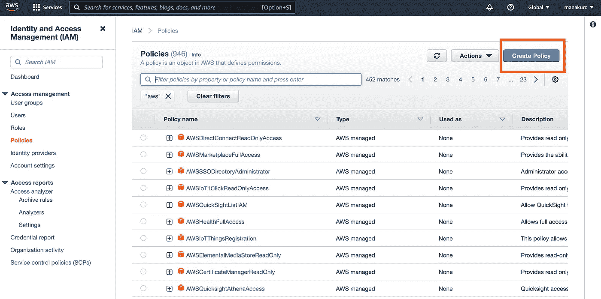
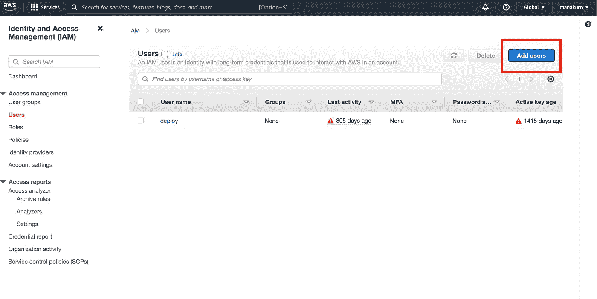
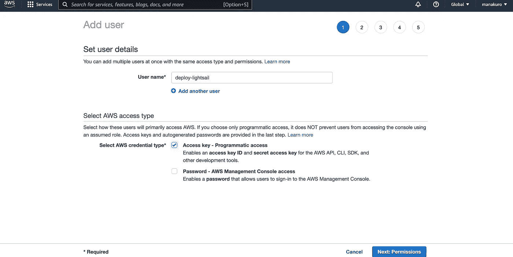
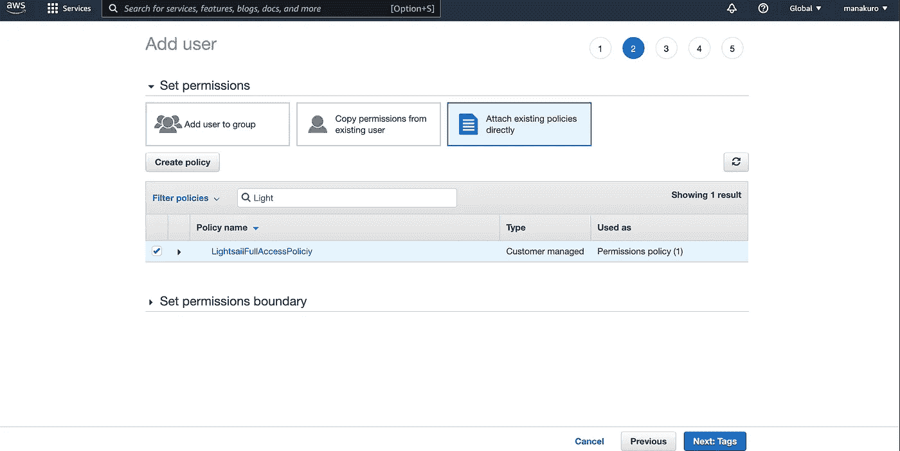
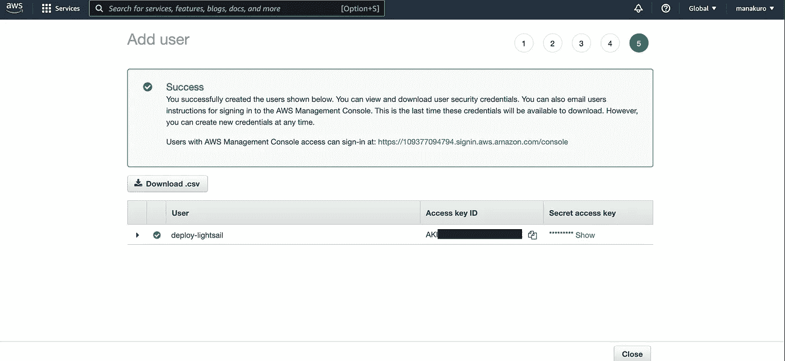
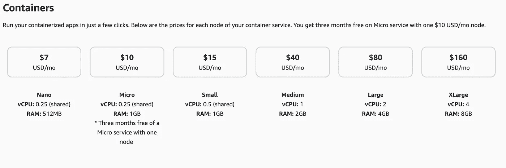

# 如何将 WebSocket 应用部署到 Amazon Lightsail

> 原文：<https://betterprogramming.pub/how-to-deploy-a-websocket-app-to-amazon-lightsail-63ec29edd2e0>

## 将 WebSocket 应用程序部署到云中


照片由 [Maxime VALCARCE](https://unsplash.com/@maximevalcarce) 在 [Unsplash](https://unsplash.com/?utm_source=medium&utm_medium=referral) 上拍摄。

亚马逊 Lightsail 提供轻量级虚拟服务器，易于使用，价格非常划算，并自动配置网络和安全环境。

使用案例可能包括:

*   一个简单的 web 应用程序
*   测试环境
*   个人项目，如作品集或博客

Amazon Lightsail 也适用于 WebSocket 应用程序。其他云服务器也支持 WebSocket，如 Heroku 和 Google App Engine，以实现灵活的环境(非标准)。但是 Heroku for a free plan 在性能方面是不够的。从成本角度来看，Google App Engine 对于小项目来说可能很贵。亚马逊 Lightsail 提供起价为 7 美元的容器计划，服务器规格也足够了。我使用 Golang 和 GraphQL 构建了一个[应用程序](https://project-management-demo.manatoworks.me/)，并将其部署在一个微型容器中。这个使用 WebSocket 进行实时通信，性能足够好。

这篇文章将指导你使用 AWS CLI 部署 Lightsail。

# 先决条件

下载 WebSocket 应用程序以部署到 AWS Lightsail。

```
$ git clone [https://github.com/manakuro/golang-websockets-example](https://github.com/manakuro/golang-websockets-example)
```

如果你想知道 WebSocket 是如何工作的，可以看看[之前的帖子](/implementing-websocket-with-go-and-react-b3ee976770ab)。

# 示例存储库

这是 GitHub 的最终代码库

# 概观

*   配置 AWS CLI
*   创建 Lightsail 服务
*   创建 Docker 图像
*   推动容器
*   部署

# 配置 AWS CLI

首先，安装 AWS CLI。

```
$ brew install awscli
```

您也可以按照 [AWS 说明](https://docs.aws.amazon.com/cli/latest/userguide/install-cliv2.html)进行安装。

## 创建策略

要从`awscli`访问 Lightsail，请创建一个策略。

进入左侧导航中的 [IAM 控制台](https://console.aws.amazon.com/iam/)和`Policies`。单击创建策略按钮。



在创建策略中，单击 JSON 选项卡，然后越过它:

```
{
    "Version": "2012-10-17",
    "Statement": [
        {
            "Effect": "Allow",
            "Action": [
                "lightsail:*"
            ],
            "Resource": "*"
        }
    ]
}
```

该策略授予对所有 Lightsail 操作和资源的访问权限。

## 添加用户

接下来，转到左侧导航栏中的`Users`，点击`Add Users`。



用户

并填写用户名和勾选`Access key`像这样:



添加用户

接下来，像这样附加 Lightsail 策略:



添加用户

最后，创建用户并记下访问密钥 ID 和秘密访问密钥。我们稍后会用到它。



添加用户

## 配置 awscli

设置上面的用户，使其能够从命令行访问您的 AWS 帐户。

```
$ aws configure --profile deploy-lightsail AWS Access Key ID [None]: xxxxxAWS Secret Access Key [None]: xxxxxDefault region name [None]: ap-northeast-1Default output format [None]:
```

配置完成后，凭据文件应该如下所示:

```
cat ~/.aws/credentials [default]aws_access_key_id = xxxaws_secret_access_key = xxx[deploy-lightsail]aws_access_key_id = xxxaws_secret_access_key = xxx
```

## 安装 Lightsail 插件

接下来，安装 Lightsail 插件，以便能够推送 Docker 的容器图像。

```
$ brew install aws/tap/lightsailctl
```

# 创建 Lightsail 服务

现在我们已经准备好从命令行访问 AWS Lightsail 了。

在本帖中，我们将创建一个每月花费 10 美元但包含三个月免费的微容器服务。



从命令创建一个微型容器。这里的服务名是`websocket-lightsail`。

```
$ aws lightsail create-container-service --service-name project- websocket-lightsail --power micro --scale 1
```

# Docker 图像

我们现在可以将容器图像推送到 Lightsail。接下来，创建一个 docker 文件来部署我们的应用程序。

在根目录下创建`Dockerfile`。

然后，构建名为 app 的映像:

```
$ docker build . -t app
```

Docker 图像应该是这样的:

```
$ docker images -a 

REPOSITORY                TAG       IMAGE ID       CREATED         SIZE
app   latest    87961c0073de   5 seconds ago   14.5MB
```

# 推动容器

我们已经创建了 docker 图像`app`，将图像推送到容器中。

```
$ aws lightsail push-container-image --service-name websocket-lightsail --label app --image app
```

由于一个容器服务可以有多个容器，我们通过添加`--label app`来标记它，并通过在最后添加`--image app`来指定要推送的图像。

创建后，响应显示的内容是这样的。图像名称将用于拉动 Lightsail 中的容器。

```
Refer to this image as ":websocket-lightsail.app.1" in deployments.
```

# 部署

要部署我们的应用程序，告诉 Lightsail 应该通过配置运行哪个容器。

为了发送配置选项，我们创建了一个 json 文件。

所以首先，安装 jq。jq 是一个灵活的命令行 JSON 处理器。

```
$ brew install jq
```

然后，像这样创建一个模板文件`conatiner.tmpl.json`:

```
{
  "containers": {
    "app": {
      "image": "",
      "ports": {
        "8080": "HTTP"
      }
    }
  },
  "publicEndpoint": {
    "containerName": "app",
    "containerPort": 8080,
    "healthCheck": {
      "healthyThreshold": 2,
      "unhealthyThreshold": 2,
      "timeoutSeconds": 5,
      "intervalSeconds": 10,
      "path": "/",
      "successCodes": "200"
    }
  }
}
```

`app.image`应该是被推送的容器图像的名称。为了动态获取名称，我们可以像这样使用`get-container-image`命令。

```
$ aws lightsail get-container-images --service-name websocket-lightsail | jq -r '.containerImages[0].image' :websocket-lightsail.app.1
```

然后创建一个由这个运行的`container.json`:

```
$ jq --arg image `aws lightsail get-container-images --service-name websocket-lightsail| jq -r '.containerImages[0].image'` '.containers.app.image = $image' container.tmpl.json > ./container.json
```

生成的文件应该如下所示:

```
{
  "containers": {
    "app": {
      "image": ":websocket-lightsail.app.1",
      "ports": {
        "8080": "HTTP"
      }
    }
  },
  "publicEndpoint": {
    "containerName": "app",
    "containerPort": 8080,
    "healthCheck": {
      "healthyThreshold": 2,
      "unhealthyThreshold": 2,
      "timeoutSeconds": 5,
      "intervalSeconds": 10,
      "path": "/",
      "successCodes": "200"
    }
  }
}
```

最后，通过像这样运行`create-container-service-deployment`来部署我们的应用程序:

```
$ aws lightsail create-container-service-deployment --service-name websocket-lightsail --cli-input-json file://$(pwd)/container.json
```

运行该命令后，响应将打印到控制台，如下所示。您现在可以访问该 URL。

```
{
    "containerService": {
        "containerServiceName": "websocket-lightsail",
        "url": "https://xxxx.xxxx.ap-northeast-1.cs.amazonlightsail.com/"
    }
}
```

要自动部署最新的映像，创建一个`Makefile`并放入如下脚本:

我们现在可以通过运行以下命令来部署新版本的应用程序:

```
$ make build push deploy
```

为了通过 WebSocket 连接到服务器，使用`wss`协议，如下所示:

# 结论

在这篇文章中，我们已经介绍了如何部署和连接 Amazon Lightsail。要点如下:

*   构建 Docker 映像
*   推送容器图像
*   部署它

仅此而已。非常简单易用。