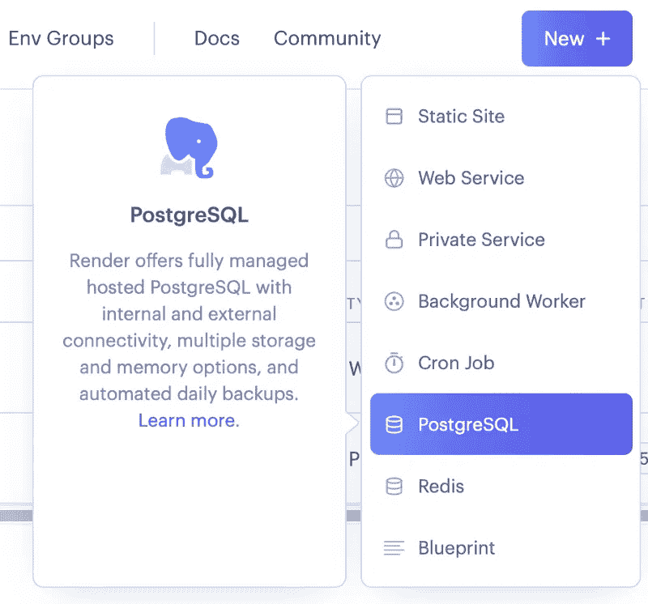
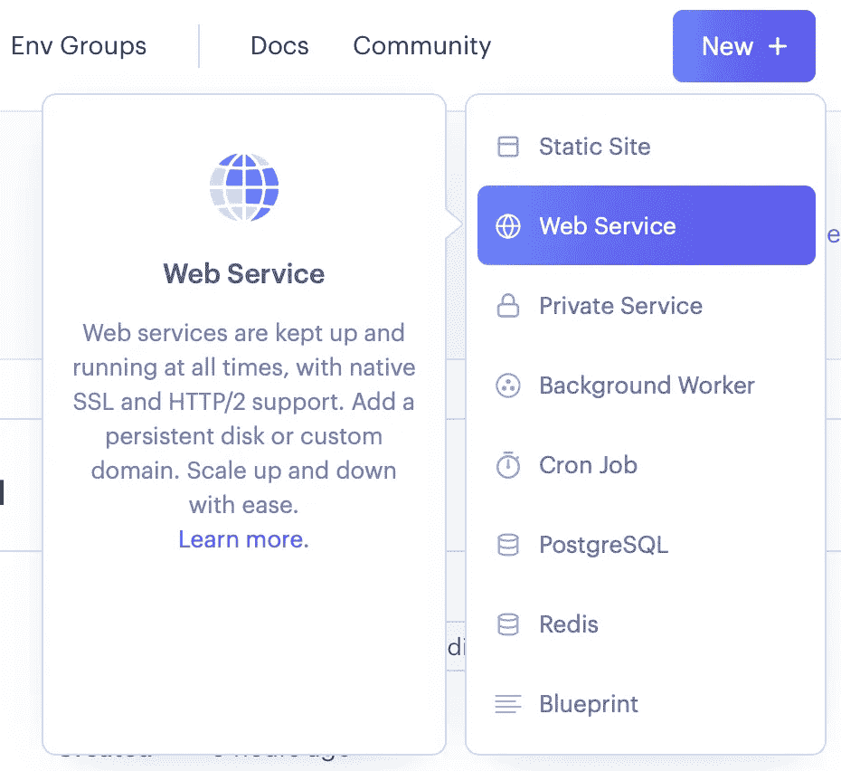
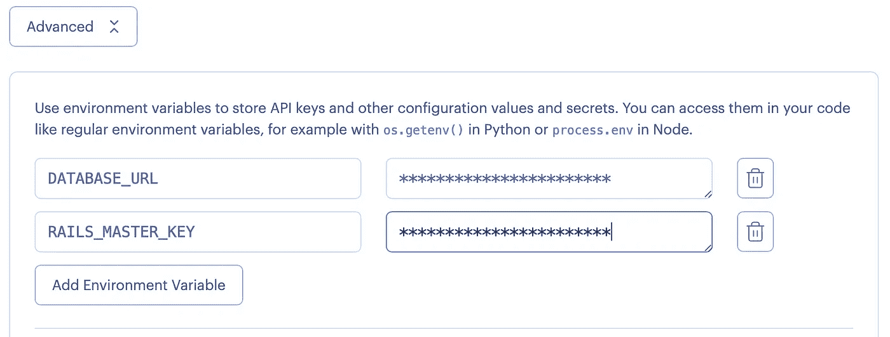
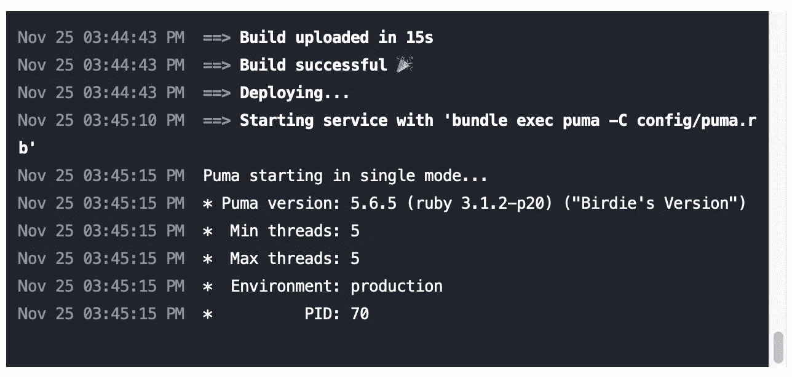

# 如何部署一个只支持 API 的 Ruby on Rails 应用程序来呈现

> 原文：<https://betterprogramming.pub/how-to-deploy-an-api-only-ruby-on-rails-application-to-render-6012a19ba2cd>

## Heroku 的替代品


马丁·桑切斯在 [Unsplash](https://unsplash.com?utm_source=medium&utm_medium=referral) 上的照片

由于 Heroku 的免费层不再可用，您需要考虑将您的应用程序部署到允许您免费部署的其他提供商。

Heroku 部署 RoR 应用程序的过程非常简单，无论是全栈还是纯 API，如果你能负担每月费用，我会说这是值得的。

然而，对于像我这样刚开始职业生涯的开发人员来说，如果您知道每个服务都有其独特的配置，那么还有其他服务可以免费部署 RoR 应用程序。一个这样的服务是 Render.com，考虑到部署全栈应用程序的过程已经在 Render 的[文档](https://render.com/docs/deploy-rails)中进行了解释，本文的目的是展示部署纯 API 应用程序的过程。

## 使用 PostgreSQL 设置存储库

Ruby on Rails 默认配置了 SQLite3，因此您需要在应用程序中安装 PostgreSQL。

如果您正在从头开始创建新项目，您应该使用:

```
rails new mysite --database=postgresql
```

如果您正在部署一个现有的存储库，您需要确保在您的 gem 文件中:

```
gem 'sqlite3'
```

替换为:

```
gem 'pg'
```

然后，要安装依赖项，您需要运行:

```
bundle install
```

您应该将您的更改推送至 GitHub，因为 Render 允许您在推送已配置的分支时进行部署。

注意:如果您的项目部署在不同的服务中，并且您认为以下配置可能会与之冲突，请考虑创建一个单独的分支。

最后，您需要检查`config/database.yml`文件是否包含默认部分中的`postgresql`适配器，如下所示:

```
default: &default
  adapter: postgresql
  encoding: unicode
  # For details on connection pooling, see Rails configuration guide
  # https://guides.rubyonrails.org/configuring.html#database-pooling
  pool: <%= ENV.fetch("RAILS_MAX_THREADS") { 5 } %>
```

而在生产部分，通常在文件的末尾，你需要替换缺省值:

```
production:
  <<: *default
  database: mysite_production
  username: mysite
  password: <%= ENV['MYSITE_DATABASE_PASSWORD'] %>
```

添加到以下配置中，以便可以包含 DATABASE_URL 环境变量:

```
production:
  <<: *default
  url: <%= ENV['DATABASE_URL'] %>
```

## 修改项目配置

打开`config/puma.rb` ，取消工人行和`preload_app`行的注释:

```
 Puma can serve each request in a thread from an internal thread pool.
# The `threads` method setting takes two numbers: a minimum and maximum.
# Any libraries that use thread pools should be configured to match
# the maximum value specified for Puma. Default is set to 5 threads for minimum
# and maximum; this matches the default thread size of Active Record.
#
max_threads_count = ENV.fetch("RAILS_MAX_THREADS") { 5 }
min_threads_count = ENV.fetch("RAILS_MIN_THREADS") { max_threads_count }
threads min_threads_count, max_threads_count

# Specifies the `port` that Puma will listen on to receive requests; default is 3000.
#
port        ENV.fetch("PORT") { 3000 }

# Specifies the `environment` that Puma will run in.
#
environment ENV.fetch("RAILS_ENV") { "development" }

# Specifies the `pidfile` that Puma will use.
pidfile ENV.fetch("PIDFILE") { "tmp/pids/server.pid" }

# Specifies the number of `workers` to boot in clustered mode.
# Workers are forked web server processes. If using threads and workers together
# the concurrency of the application would be max `threads` * `workers`.
# Workers do not work on JRuby or Windows (both of which do not support
# processes).
#
workers ENV.fetch("WEB_CONCURRENCY") { 4 }

# Use the `preload_app!` method when specifying a `workers` number.
# This directive tells Puma to first boot the application and load code
# before forking the application. This takes advantage of Copy On Write
# process behavior so workers use less memory.
#
preload_app!

# Allow puma to be restarted by `rails restart` command.
plugin :tmp_restart
```

打开`open/environments/production.rb` ，找到下面一行:

```
# Disable serving static files from the `/public` folder by default since
# Apache or NGINX already handles this.
config.public_file_server.enabled = ENV['RAILS_SERVE_STATIC_FILES'].present?
```

然后追加`RENDER`变量如下:

```
# Disable serving static files from the `/public` folder by default since
# Apache or NGINX already handles this.
config.public_file_server.enabled = ENV['RAILS_SERVE_STATIC_FILES'].present? || ENV['RENDER'].present?
```

## 创建 PostgreSQL 数据库

Render 允许用户在免费层创建一个持续 90 天的 PostgreSQL 数据库。旧的过期后，您可以随时创建新的。创建一个的过程如下:

1.  登录到[render.com](https://dashboard.render.com)或者创建一个新账户，如果你还没有的话。您可以使用您的 GitHub 帐户来允许您的存储库被部署在 push 上。
2.  在导航栏中，单击“新建”按钮并选择 PostgreSQL 选项:
3.  选择名称和地区。如果需要，还可以自定义数据库名称、用户和版本。
4.  选择自由计划类型，然后单击创建数据库
5.  等到新创建的数据库被部署，然后复制它的**内部数据库 URL** 并保存它以备后用。



## 创建构建脚本

现在，我们需要创建一个构建脚本。在部署仅支持 API 的应用程序时，该脚本与 Render 文档中的说明不同，这可能会导致很多麻烦。对于纯 API 应用程序，您需要创建一个名为`bin/render-build.sh`的文件，并粘贴以下内容:

```
#!/usr/bin/env bash
# exit on error
set -o errexit

bundle install
bundle exec rake db:migrate
```

如果要为数据库加载种子值，应该在文件末尾添加以下行:

```
bundle exec rake db:seed
```

接下来，通过在控制台中运行以下命令，确保脚本是可执行的:

```
chmod a+x bin/render-build.sh
```

然后，推送更改，您就可以开始部署了。

## 创建 Web 服务

现在您可以通过点击 New >> Web Service 在 Render 中创建一个 Web 服务。



在下一个窗口中，如果您还没有配置您的 GitHub 帐户，请进行配置。然后，您可以选择想要部署的存储库。找到它并点击连接。

之后，如果您不想部署默认的 GitHub 分支，您可以配置一个惟一的名称、区域和想要部署的分支。

**重要提示:**

确保环境设置为 Ruby。确保清除 Build 命令，并将其设置为:

```
./bin/render-build.sh
```

它调用先前创建的脚本。另外，清除 Start 命令并将其设置为:

```
bundle exec puma -C config/puma.rb
```

您的配置应该如下所示:


接下来，您可以检查计划类型并确保设置为自由。然后，您应该单击高级按钮。

现在，您需要添加应用程序需要的所有环境变量。两个强制变量是:

```
DATABASE_URL => The internal database URL that you saved above form you PostgreSQL service
RAILS_MASTER_KEY => Paste contents of the config/master.key file
```



最后，您可以单击 Create Web Service，并且可以检查部署的进度。我建议您检查日志，以确保一切工作正常。如果您遵循这些步骤，您的应用程序应该能够成功部署。



我希望这篇文章对你有用。我意识到，本文可能没有涵盖您可能使用的所有 Rails 实现，但它肯定可以在您面临这一挑战时为您提供指导。我已经用我的几个库成功地测试了这个过程，但是小心总是好的。编码快乐！