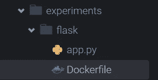
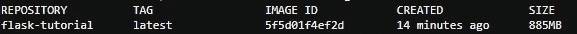
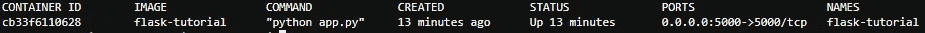
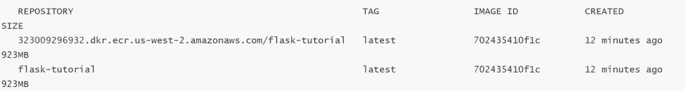

# 如何使用带有 Docker 的 Elastic Beanstalk 将应用程序部署到 AWS

> 原文：<https://betterprogramming.pub/how-to-deploy-an-app-to-aws-using-elastic-beanstalk-with-dockers-72a38a161d7e>

## 使用 Elastic Beanstalk 将 Flask API 部署到 AWS 容器中的教程


照片由 [Aditya Vyas](https://unsplash.com/@aditya1702?utm_source=medium&utm_medium=referral) 在 [Unsplash](https://unsplash.com?utm_source=medium&utm_medium=referral) 上拍摄。

[](https://jorgepit-14189.medium.com/membership) [## 用我的推荐链接加入媒体-乔治皮皮斯

### 阅读乔治·皮皮斯(以及媒体上成千上万的其他作家)的每一个故事。您的会员费直接支持…

jorgepit-14189.medium.com](https://jorgepit-14189.medium.com/membership) 

让我们假设我们正在开发 AWS，并且我们已经构建了一个想要部署的 [Flask](https://flask.palletsprojects.com/en/1.1.x/api/) API。我们正在使用 [Cloud9](https://aws.amazon.com/cloud9/) IDE，我们的项目结构如下:



我们的目标是与 Docker 合作。Dockerfile 会是这样的:

# 建立形象

您可以在带有您喜欢的标签的终端中键入`docker build`命令:

```
docker build --tag flask-tutorial .
```

现在，您可以通过键入以下命令来验证该映像是否存在:

```
docker images
```



# 运行图像

您可以通过键入以下命令来运行映像:

```
docker run -d --name flask-tutorial -p 5000:5000 flask-tutorial
```

请注意，`-d`标志意味着将它运行到后台，而不占用您的终端。我们可以通过键入以下命令来检查容器是否正在运行:

```
docker ps
```



让我们提供一些有用的 Docker 命令。

## ps 命令

用`ps`命令重申一下，您可以列出 Docker 容器。一个常见的标志是`--no-trunc`，它不会截断输出。另一个需要记住的有用标志是`-a`，它将允许我们看到所有运行和停止的容器(我们上面提到过)。`--filter`命令在搜索特定命令时也很有用。因此，如果我们有了正在运行的`flask-tutorial`容器，我们可以运行下面的代码来过滤掉它:

```
docker ps --filter "name=flask-tutorial"
```

## exec 命令

尽管我们没有使用`exec`命令，但需要注意的是。`exec`命令将允许我们在运行容器中运行命令。例如，如果我们有一个正在运行的`flask-tutorial`容器，我们想在其中运行一个命令，下面的命令将在`/tmp`目录的后台创建一个名为`test`的新文件:

```
docker exec -d flask-tutorial touch /tmp/test# output
Verify:docker exec -it flask-tutorial /bin/ls -l /tmptotal 0-rw-r--r-- 1 root root 0 Aug 21 16:56 test
```

## 停止命令

使用这个命令按名称停止我们的容器(因此之前使用了`--name`标志):

```
docker stop flask-tutorial
```

验证它是否已停止:

```
docker ps
```

您应该看到以下内容:

```
CONTAINER ID IMAGE COMMAND CREATED STATUS PORTS NAMES
```

一切都停止了，我们现在可以考虑如何存储我们漂亮的新 Flask 图像。

# 将您的 Docker 图像存储在 ECR 上

如常见问题解答[中所述，“Amazon Elastic Container Registry(ECR)是一个完全托管的 Docker 容器注册服务，可以轻松存储、管理和部署 Docker 容器映像。”它与 Elastic Beanstalk 和 ECS 集成在一起，这也简化了部署到生产环境的过程。](https://www.amazonaws.cn/en/ecr/faqs/)

为了能够将我们的 Docker 映像推送到`ECR`，我们将使用 CLI。我们首先需要用 AWS CLI 的`ecr get-login`命令授权我们的 Cloud9 Docker 客户机:

```
aws ecr get-login --region us-west-2 --no-include-email
```

您应该会看到类似这样的内容:

```
docker login -u AWS -p eyJwYXlsb2FkIjoiWnc4NUs2K3dkNVhySXJvQWVlZE8xZUpHOVhaUmNaTEdYTXBrU2U0Y1BYb3NLTit4a1B3c3RteXhwWkNXcDZ0TkxLLzNpRjdZV2JvckxHczZIQmhsSGFwNlh6ZEU2K0tQOGRIRk8vNTl2enZpNDIybGpBTnlHdURHYjdYNHdZczU4TTZSaDVLbEVrUW80VFZDaXFRTzdkS0hnY0YyaTVlZ1c1RjYweVozZllSSHlWdVQvQngrQ2FQV1ZQVlJ1RndMa3RPOThaajBOd3grMDRJdURUQ2pFMzY5dFAxdzVhYjgzOEpjR0JUWFJWVCs3MG1TYUIwTXY3WWJIMCt4VE9ETDhWTEVzaHNuQTh2M1JQLzlUd2gyMFpnalcyRjNKTmpTd2l6dnptbVpDblh3dDZxa2lwNEowM0ZCLzZ5MEtBTHlFYkk3WmlqSFYzem5oSFJRTmVWMVdBR1FoSjdmV1RucHZwSDRqUGNCdndLZWI4aWpKSGs5L2VaUzFSbUlLZU1HS0UzU3FmRks0a2lYbEY2bkNLVEtRRnNLeGpCYnllVDdWbTJHaXJLMENOT0ZQVksrWS9jSlZ3SDJTaFc4VjBEYjdjeG9vK3pXQjFiYlAvNS9XQ0pXeUM2ZHMrM3dSMW1tdnUwdUVEV2U3b0lNdklpVDIrVHMrRTZ6cmxibVVObFhJaTYzUXdXNTJmRGVHZjFEeDFGOTJqU0dCL3hFd3ZYTzVweVZzMEZPYUcrV054cndlc3ZTL293TFJKcElrOHBtOVlwUVBxRzl4NGd2bnNrdFh3QlJOQkZJc0lkbDVDanQzVmxGWXdJaklOZXR4Zlo4M2tzUGNFekxVbW9kOEJtdVNCaGttMU9zeWZhY0RCa1J2QWs3UkVJL21vbXZBdFlYOW03T3A1VHo2V3ExZ3ZSanh5NkQrT2lWUWVHYVJLSlZGK3dpWEp4eWpDM2FwYTYzaTkyRXJ2V2lwd1p4cUQ4QlkzWG40cEtpQzRQUU9ZTGo2WTdMM3l4STVuZDQ1Zm9kL2I4aFBMREszeFlIbHRkMkhFWGJGOFkyd05qcXdld2FzYWw3bXRPTUJ5VzdKOWJJWW5ORm96SVY4TDQ1WitJYUNxN29QRDhrV3crK0lZSU91bit3WExnZ3lMNjFiM3FhRUs3dW04VjRRRWdNZTdtWVd4TnZta1JtWUc3aGFJUHJjTlh3aHZxRjNaQmNNOWVZNlljeENQdnVyYUlSY3BoYjJoWjQrdjFYbDVOL0hUS3UzajNRb1ZQVGtCYnFVNENTTXIyYURtd052LytHRUNxQ2tkSHpFQlE0TlZqcXZtR2dZaFVEcGpSZktIWGp0ajdlQ1hnSHhpb0ZSajdCdnFVZmdtQXlGVWxwZXQ0MklxeXVSSDlTMWpBYzk4VkE3aC9UcEgwd3phOWI3QmNRSnVIbFZVQTJkZDZkM2hvM2RMOU1pQkRtaTF4NHdHUGVTazRweG8zZUhkSWFIZXZlYjROcTdFeEV0OWZwZ3lvajlPRHJNcWw5dzNLbURidG4wVXNDVjJHWHlGalZMSkZITk5RWlFES1VGU2VZQVNUcFNzUFJROHVhR0hJNi9XUTNxUnh1Qk4xWnA0ZSt3cU1oWVV0ME9SNGxBNFFzZExlcVdzMFJqcVFpMDRWdE1yZkhDTVpZd1FGd2diek1xTGdzU29zSnZRSnJVQWEyOWJiZU5TL0xQaUliOTlLbUFjaVRHTE11cXRDZHhkMlBzV3ZCN1k3NU1Wc1NXU2ZBckl1WWh1cjZHSE1TQk9mNTdDbG9ZV0NQVlV2bzNVNnFHUEIwOVAwSUNEczc4ajNGY0x4K1QvSHJpaGNBTjZhZzUwaFdEV0I1TU9nT2dHRDdrRW5VTGxMSkRBRnp4c3l2Q252N2pwcFo5R2RlSTBINWtiR1hIZFRwQXJEZzZYeUlLYXVMQVFMczdWcUF4TUNwU3djdmluQXNDR0dWQ3M4MUtGUjZjQTA5bmVrYWgvUVpxQkhhdHA0QW1scGNDQlJSMGEvTFVRPT0iLCJkYXRha2V5IjoiQVFFQkFIajZsYzRYSUp3LzdsbjBIYzAwRE1lazZHRXhIQ2JZNFJJcFRNQ0k1OEluVXdBQUFINHdmQVlKS29aSWh2Y05BUWNHb0c4d2JRSUJBREJvQmdrcWhraUc5dzBCQndFd0hnWUpZSVpJQVdVREJBRXVNQkVFRERJWDFaUm1YUmR5QmZtM1VBSUJFSUE3UldmRHhZSW1zdDhOejdVM01KREpjMlRVbSszSE13RXIyMWUzZ0lEOWI1QnhPZXptNnhRL3JNTjRMejV6UGxnM3RhTFRUMzNlWEEwS3d6MD0iLCJ2ZXJzaW9uIjoiMiIsInR5cGUiOiJEQVRBX0tFWSIsImV4cGlyYXRpb24iOjE1NzIwNzgxMTV9 [https://323009296932.dkr.ecr.us-west-2.amazonaws.com](https://323009296932.dkr.ecr.us-west-2.amazonaws.com)
```

复制并粘贴上面的全部输出。将其粘贴回终端，然后按回车键。您应该看到以下内容(您可以忽略警告):

```
WARNING! Using --password via the CLI is insecure. Use --password-stdin. WARNING! Your password will be stored unencrypted in /home/ec2-user/.docker/config.json. Configure a credential helper to remove this warning. See [https://docs.docker.com/engine/reference/commandline/login/#credentials-store](https://docs.docker.com/engine/reference/commandline/login/#credentials-store) ​ Login Succeeded
```

我们需要创建一个 ECR 存储库来推动我们的形象:

```
aws ecr create-repository --repository-name flask-tutorial
```

您应该会看到类似于以下输出的内容:

```
{ "repository": { "repositoryUri": "323009296932.dkr.ecr.us-west-2.amazonaws.com/flask-tutorial", "registryId": "323009296932", "imageTagMutability": "MUTABLE", "repositoryArn": "arn:aws:ecr:us-west-2:323009296932:repository/flask-tutorial", "repositoryName": "flask-tutorial", "createdAt": 1572035197.0 } }
```

如果我们在将来的部署中需要引用我们的映像，这就是我们需要使用的`repositoryUri`。

## 标签命令

我们将`re-tag`我们的形象，包括我们的`registryId`。如果我们有很多账户，或者与 Docker Hub 等其他注册服务商合作，这就更容易管理了。

```
docker tag flask-tutorial:latest 323009296932.dkr.ecr.us-west-2.amazonaws.com/flask-tutorial:latest
```

请注意，您的 ECR 的`repositoryUri`会有所不同。

如果我们重新运行 Docker 图像，我们会看到新的图像。

```
docker images
```



## 推送命令

现在我们可以推出图像:

```
docker push 323009296932.dkr.ecr.us-west-2.amazonaws.com/flask-tutorial:latest
```

完成此操作后，您应该会看到类似如下的内容:

```
The push refers to repository [323009296932.dkr.ecr.us-west-2.amazonaws.com/flask-tutorial]
ff4ff4b2b471: Pushed 
cd1f247135f6: Pushed 
dcea7e243648: Pushed 
d431d6bc3307: Pushed 
ff19fb54200e: Pushed 
69168fb9b7b0: Pushed 
31f78d833a92: Pushed 
2ea751c0f96c: Pushed 
7a435d49206f: Pushed 
9674e3075904: Pushed 
831b66a484dc: Pushed 
latest: digest: sha256:8e9ab6d360fb225cde3d5f4adad29c4d0bee5097a951d32aa15ccbe8560200d2 size: 2636
```

现在烧瓶图像存储在 ECR 中。使用`aws ecr list-images`命令，您将在屏幕上看到类似这样的内容:

```
{ "imageIds": [ { "imageTag": "latest", "imageDigest": "sha256:8e9ab6d360fb225cde3d5f4adad29c4d0bee5097a951d32aa15ccbe8560200d2" } ] }
```

# 使用弹性 Beanstalk 控制台部署到云中

现在，我们将把 Flask 应用程序部署到 Elastic Beanstalk。我们会做所谓的 ZIP 部署。我们进入工作目录并键入:

```
zip flask_application.zip app.py Dockerfile
```

在左侧面板上，展开`flask`文件夹，右键单击`flask_application.zip`，并选择“下载”

1.  选择“AWS Cloud9”和“转到您的仪表板”选择“服务”和“弹性豆茎”
2.  在右上角，选择“创建应用程序”
3.  粘贴`flask-app`作为“应用名称”
4.  对于“平台”，选择“Docker”保持 Docker 设置不变。
5.  对于“应用程序”代码，选择“上传您的代码”保持“本地文件”选中状态。选择“选择文件”并浏览到下载`flask_application.zip`的位置。
6.  选取“创建应用程序”
7.  最后，您应该看到运行状况变为“OK ”,带有一个绿色圆圈和一个勾号，表示一切正常。
8.  在顶部，您应该可以看到您的应用程序以及 URL。单击它，在顶部，您应该会看到环境 ID 和 URL。复制网址。
9.  选择 URL(应该会在新的浏览器选项卡中打开)，您应该会看到示例 Flask 应用程序。

瞧，你的应用程序启动了！

# 参考

*   [在 Coursera 的 AWS 上构建容器化应用](https://www.coursera.org/learn/containerized-apps-on-aws/home/welcome)

*最初发表于*[T5【https://predictivehacks.com】](https://predictivehacks.com/how-to-deploy-an-app-to-aws-using-elastic-beanstalk-with-dockers/)*。*