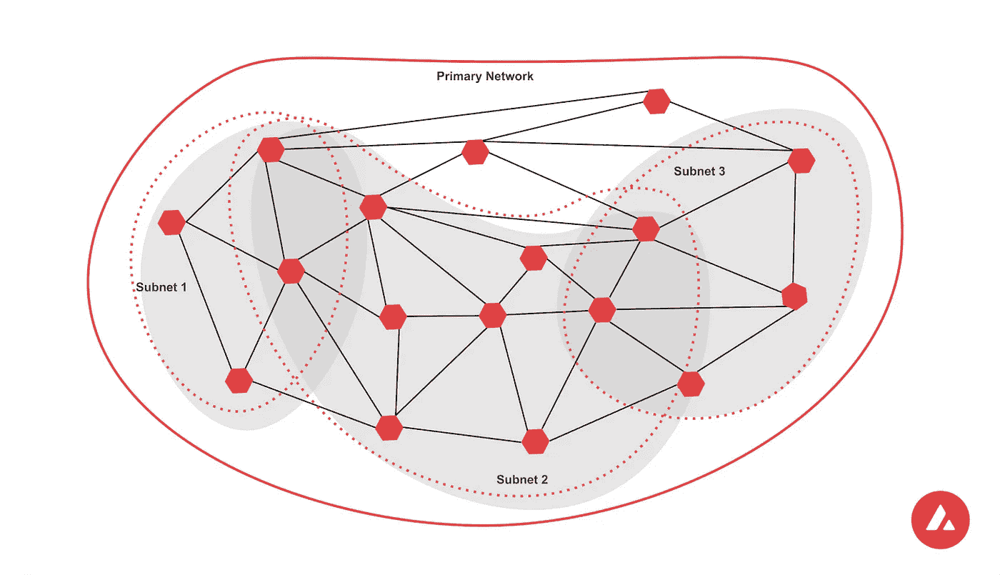
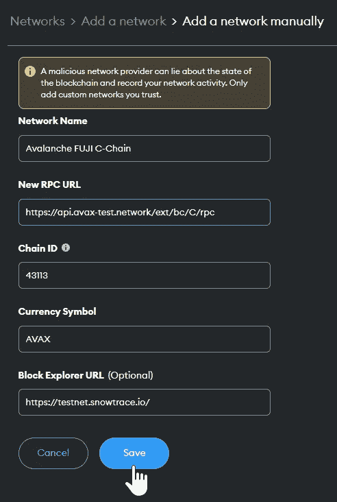
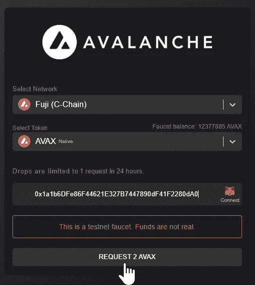
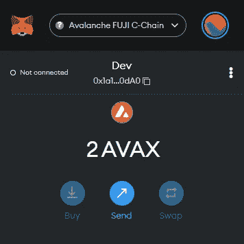
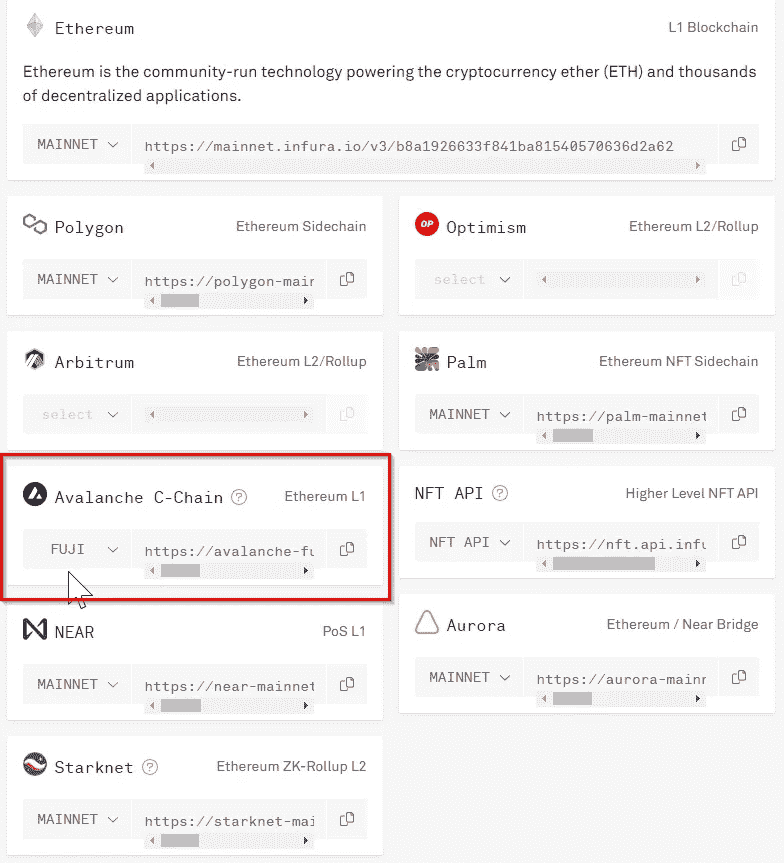
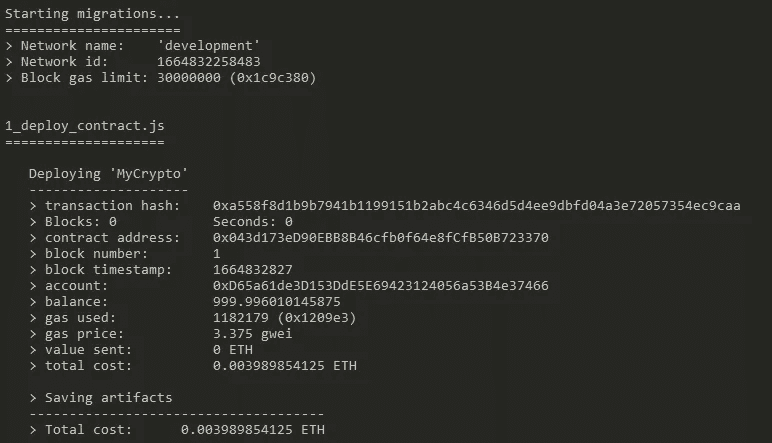
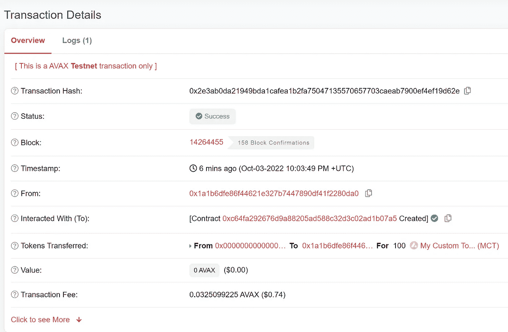
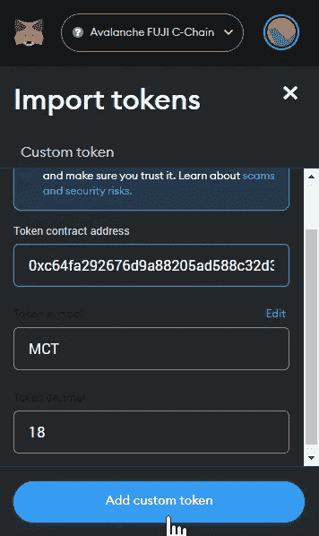
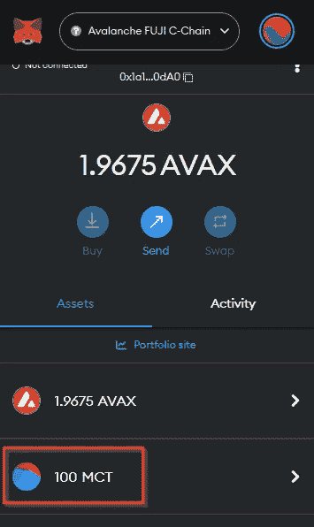

# 如何使用 Infura 在 Avalanche 上部署 ERC-20 智能合约

> 原文：<https://betterprogramming.pub/how-to-deploy-an-erc-20-smart-contract-on-avalanche-with-infura-3214cc0812f0>

## 对 Infura 特性的深入探索


尽管以太坊已经牢牢确立了自己作为能够运行智能合约的领先区块链平台的地位，但它也不是没有缺陷。它已经解决了它的一些问题，例如通过切换到利害关系证明共识协议的巨大能量消耗。然而，缩放问题仍然存在。以太坊的交易吞吐量较低(大约每秒 15 个交易)，交易结束较慢(大约 1 分钟)，并且在网络紧张时有时会产生较高的燃气费。

Avalanche 是一个独立的区块链平台，旨在克服上面提到的一些可伸缩性障碍。在本文中，我们将探讨什么是 Avalanche，以及它相对于其他区块链平台的优势。我们还将使用 Infura 从头开始创建一个关于 Avalanche 的 ERC-20 智能合约。

# 什么是雪崩？

根据其网站，按结束时间衡量，Avalanche 是区块链行业最快的智能合约平台。与以太坊或比特币不同，Avalanche 由几个链组成，每个链执行一个特定的任务。

雪崩网络的三个最重要的链是 C 链、X 链和 P 链。

C-Chain 是 EVM 兼容的区块链，能够运行智能合约。X 链负责令牌交易。最后，P 链维护子网间的一致性，这可以说是 Avalanche 最关键的组件。

通过[子网](https://docs.avax.network/subnets)，Avalanche 允许任何人在生态系统中构建自己的区块链实例。此外，用户可以定制这些区块链来满足自己的需求。这些自定义区块链可以使用不同的一致协议(工作证明或利益证明)，每秒钟可以处理超过 4，500 笔交易，而不会对网络的其他部分造成任何额外的压力。每一个都是一个主权网络，定义了自己的规则。

子网是雪崩提供的最独特的功能之一。不仅任何人都可以构建自己的定制区块链网络作为子网，每个子网都可以与雪崩网络的其余部分完全互操作。这使得子网成为创建定制解决方案的强大工具，同时仍然是更大网络的一部分。



# 使用雪崩的好处

通过使用子网和新型共识协议，Avalanche 可以提供以下优势:

1.  理论上每秒无限事务
    由于可以创建的子网数量没有上限，并且子网相当独立地运行，Avalanche 可以提供非常高的 tps 速率。
2.  低交易完成率
    Avalanche 的交易完成时间是业内最低的，交易确认不到两秒钟。
3.  高能效
    Avalanche 使用利益证明来保护其网络，这使其具有极高的能效。它还允许无法访问高端 GPU 的验证者参与进来。
4.  极度分散的
    超过数千个验证器确保雪崩。而且不像以太坊或者比特币，少数的池并不能控制绝大多数的网络。

# 使用雪崩创建 ERC-20 令牌

如前所述，Avalanche C 链完全与 EVM 兼容。这意味着很容易将以太坊和其他 EVM 连锁店的项目移植到 Avalanche 上。这也意味着以太坊开发的成熟工具如 devnet、Truffle 和 top API suite、Infura 可以在 Avalanche 上进行开发。

在本文的这一部分，我们将创建一个 ERC-20 契约，在 Avalanche 上实现一种加密货币。我们将使用 Solidity、Infura、Truffle 和 Truffle 仪表板来实现。

# 步骤 1:安装元掩码扩展

如果你还没有为你的浏览器安装 [MetaMask 扩展](https://metamask.io/download/)，按照 MetaMask 提供的说明创建你的钱包。

# 步骤 2:将 Avalanche 和 Fuji Testnet 添加到 MetaMask

默认情况下，MetaMask 只配置了以太坊 mainnet 和 Goerli testnet。为了添加 Avalanche C-Chain 和 Fuji testnet，请遵循本文件中[的说明。](https://docs.avax.network/quickstart/fuji-workflow)



# 第三步:从水龙头中取出 AVAX

前往 Avalanche 网站上的[富士水龙头页面](https://faucet.avax.network/)，为你的钱包申请一个免费测试 AVAX。如果一切顺利，您应该会在 MetaMask 钱包中看到两个 AVAX。



# 第四步:获得 Infura 雪崩/富士网址

在我们开始构建项目之前，让我们先获取将要使用的端点。转到 infura.io，注册一个帐户或登录，然后执行以下操作:

*   单击 Create New Key 按钮，创建一个新的 Web3 API 项目。
*   导航到端点选项卡，向下滚动到 Avalanche C-Chain。
*   将端点从 MAINNET 切换到 FUJI。
*   复制端点以供将来在此项目中使用。



# 步骤 5:安装 NPM 和节点

我们将使用 node 和 npm 来构建我们的项目。如果您的本地机器上没有安装这些，您可以在这里[安装](https://nodejs.org/en/download/)。

要确保一切正常运行，请运行以下命令:

```
$ node -v
```

如果一切顺利，您应该会看到 node 的版本号。

# 步骤 6:创建一个节点项目并安装依赖项

让我们通过运行以下命令来设置一个空的项目存储库:

```
$ mkdir my-crypto && cd my-crypto
$ npm init -y
```

我们将使用 Truffle——EVM 智能合约的世界级开发环境和测试框架——来构建和部署我们的智能合约。通过运行以下命令安装 Truffle:

```
$ npm install -g truffle
```

我们现在可以通过运行以下命令来创建一个准系统 Truffle 项目:

```
$ npx truffle init
```

要检查一切是否正常，请运行:

```
$ npx truffle test
```

我们现在已经成功配置了块菌。接下来让我们安装 OpenZeppelin 合同包。这个包将让我们获得 ERC-20 实现(可替换令牌和加密货币的标准)，在此基础上，我们将建立我们的合同。

```
$ npm install @openzeppelin/contracts
```

最后，让我们安装`hdwallet-provider`包，它将允许 Infura 使用从 12 或 24 个单词的助记符派生的地址代表我们签署交易。为此，我们将使用步骤 1 中元掩码钱包中的助记符。

```
$ npm install @truffle/hdwallet-provider
```

# 步骤 7:撰写 ERC-20 智能合同

在您喜欢的代码编辑器(例如 VS Code)中打开存储库。在`contracts`文件夹中，创建一个名为`MyCrypto.sol`的新文件。

我们将编写一个非常简单的 ERC-20 契约，创建一个带有无上限供应的令牌。我们还会在钱包里铸造 100 枚代币。将以下代码添加到文件中:

```
// SPDX-License-Identifier: MIT
pragma solidity ^0.8.4;import "@openzeppelin/contracts/token/ERC20/ERC20.sol";contract MyCrypto is ERC20 {
    constructor() ERC20("My Custom Token", "MCT") {
        _mint(msg.sender, 100 * 10 ** ERC20.decimals());
    }
}
```

# 步骤 8:将智能合同部署到 Ganache & Fuji

为了将契约部署到 Fuji testnet，我们将需要一个 RPC 端点。幸运的是，Infura 提供了免费的、速度极快的雪崩 C 链端点。这是我们在步骤 4 中获得的端点 URL 的位置。

接下来，在`truffle-config.js`文件中，用以下内容替换文件内容:

分别用您的 Infura Fuji API 密钥和 MetaMask wallet 的助记符替换第 2 行和第 3 行中的占位符。(后者是你第一次设置钱包时给你的那串 12 个字。)注意不要公开分享这个密钥或助记符。

或者，你可以用你钱包的私人密钥代替助记符。当您单击导出私钥时，可以在 MetaMask wallet 的帐户详细信息选项卡中找到它。

让我们通过运行以下命令来确保合同正确编译:

```
npx truffle compile
```

如果没有错误，我们就可以执行合同了。有了智能契约，我们现在可以编写一个简单的部署脚本。在`migrations`目录中，创建一个名为`1_deploy_contract.js`的文件，并添加以下代码:

```
const myCryptoContract = artifacts.require("MyCrypto");module.exports = function(deployer) {
   deployer.deploy(myCryptoContract);
};
```

现在，在我们部署到 Fuji 网络之前，我们应该确保它的部署没有任何问题。我们可以通过首先将我们的契约部署到一个本地 Ganache 区块链实例来做到这一点。要运行 Ganache，请打开一个新的终端并键入以下命令:

```
ganache
```

现在，我们可以通过键入以下命令来测试 Ganache 的部署:

```
npx truffle migrate --network development
```

这应该会在我们的控制台中产生类似如下的输出:



现在我们知道我们的合同将成功部署，我们都准备好将我们的合同部署到 Fuji。从终端运行以下命令:

```
npx truffle migrate --network fuji
```

如果一切顺利，您的终端将在 Fuji 网络上显示交易散列和已部署合同的地址。前往[https://testnet.snowtrace.io/](https://testnet.snowtrace.io/)，搜索您的合同地址查看您的合同。



# 步骤 9:将令牌添加到元掩码中

既然我们的令牌存在于真实的区块链上，我们可以将它添加到我们的元掩码钱包中。将 MetaMask 上的网络切换到 Fuji，并在“资产”选项卡上选择“导入令牌”。在这里，您可以通过输入令牌的合同地址、名称和符号来导入自定义令牌。



如果一切顺利，您应该可以在 Assets 选项卡下看到您的令牌和 100 英镑的余额。



# 结论

在极短的时间内，雪崩已经成为以太坊及其生态系统最强大的替代品之一。它的子网网络保证了更快的交易速度和更低的成本。

正如我们在本文中创建的令牌所证明的，Avalanche 使用以太坊使用的相同工具。所以，如果你是以太坊开发者，默认也是雪崩开发者。

要开始使用 Infura，[构建 Avalanche，请查看这里的文档](https://docs.infura.io/infura/networks/avalanche-c-chain)。

祝你今天过得愉快！