# 如何用 Vercel 部署现有的应用程序

> 原文：<https://betterprogramming.pub/how-to-deploy-an-existing-application-with-vercel-cfcd314e5396>

## 快速、经济、简单


乔纳森·里德利在 [Unsplash](https://unsplash.com?utm_source=medium&utm_medium=referral) 上的照片

在过去的几年里，我们从精通多种能力(全栈)的专业人员转变为专注的开发人员。范围的限制导致效率的人越来越多。

无论如何，虽然在过去全栈能够构建一个完整的项目，但现在前端或后端开发人员发现很难覆盖所有的栈。这在企业项目中并不是一个真正的问题，因为您通常有一个多学科的团队，在这个团队中您拥有您需要的所有能力。

但是对于创业公司或者个人项目这样的小公司呢？

幸运的是，云和新技术帮助了我们。现代工具提供了托管和部署应用程序的机会，只需点击几次配置，即可保持流程顺畅并缩短学习时间。

在本文中，我们将学习如何使用 [Vercel](https://vercel.com/) 解决所有这些问题，这是一个简单易用的平台，适用于任何前端技术，并且支持无服务器功能来实现您使 SPA 工作所需的 API。这是路线图:

1.  什么是 Vercel
2.  在 Vercel 上创建项目
3.  修复您的项目，并在您的本地测试它

开始吧！

# 什么是 Vercel

Vercel 是一个为前端开发人员设计的云平台，使开发人员能够托管即时部署、自动扩展且无需人工维护的网站和应用程序。Vercel 还有一个免费层，让您可以免费开始，并提供部署无服务器功能来实现后端的机会(包含在免费层中)。

使用 Vercel 的其他优势:

*   从任何 GitHub 存储库(公共或私有)进行一键式部署
*   一个免费层，内置了托管后端的选项
*   免费层中可用的自定义域名
*   包括 DevOps:每次推送至您的 repo 都会启动构建流程并自动部署应用程序
*   集成第三方服务(如数据库或 SMTP 服务)的市场

酷，不是吗？让我们看看如何在其上部署应用程序。

# 在 Vercel 上创建项目

首先，你得创建一个账户。然后，如果您从头开始一个项目，Vercel 本身可以使用其目录中的一个模板启动一个存储库。然而，您已经有了一个项目，并且希望在 Vercel 上部署它，这种情况很常见。没问题:我们将在本文中看到这个过程。

下一步是创建一个项目。在我的例子中，我使用了名称`crudit-demo`，因为这是 [CrudIt](https://www.npmjs.com/package/crudit) 的公开演示，它是我的 Nodejs 框架，用于在不是后端开发人员的情况下实现后端。

创建项目后，您将看到如下页面:

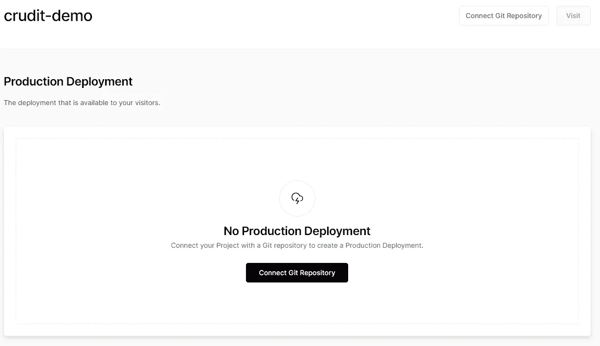

连接回购之前的项目

如前图所示，您需要在开始部署之前连接 repo。这很简单:只需点击“连接 Git 存储库”按钮。您将被要求授予查看您的存储库的权限(您可以逐个或全部允许)，然后您将看到类似下图的内容:

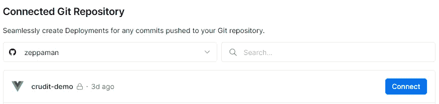

选择存储库

从上图可以看出，Vercel 了解项目类型(见项目名称附近的 Vue 图标)，你只需点击 connect 即可。然后，您将看到正在部署，完成后，您将看到类似于以下屏幕截图的内容:

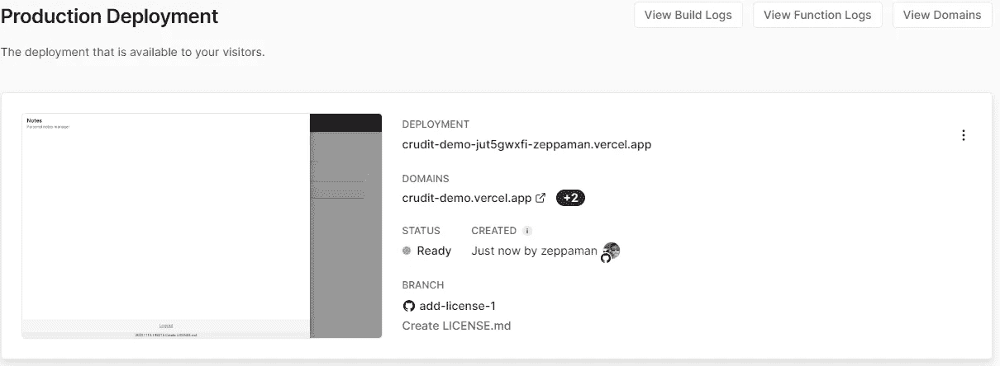

Vercel 已部署

您的网站或应用程序现已上线，可以访问！无论如何，大多数应用程序需要一些额外的配置步骤，我们将在下一节看到。此外，并没有告诉您您的应用程序与 Vercel 部署 100%兼容:在这种情况下，您可以使用 Vercel cli 在本地调试它。我们将在下一节中看到这一点。

## Vercel 面板概述

在这一节中，我将展示一组你可能需要知道的管理面板的常见部分。

**部署**

在这一部分，您将看到您已经完成的所有部署的历史记录。您可以一个接一个地阅读编译日志并查看状态(每个部署都与产生它的源代码相关)。

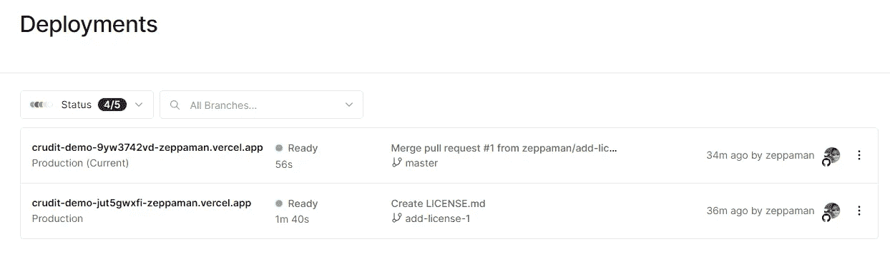

部署科

如果您单击 deployment 部分，您将进入一个显示构建详细信息的页面。而且，从下一张图可以看到，和 app 连接的网址列表。每个部署有自己的网址，此外，你可以添加多少自定义域你想要的。

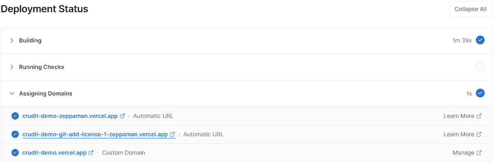

建筑详图

可以通过“域”部分更改域列表。在我的例子中，我有一个默认的域名，它是项目名称下的第三级域名。具有部署名称和 git repo 名称的域被自动添加(请参见上图中标记为“自动 URL”的域)。

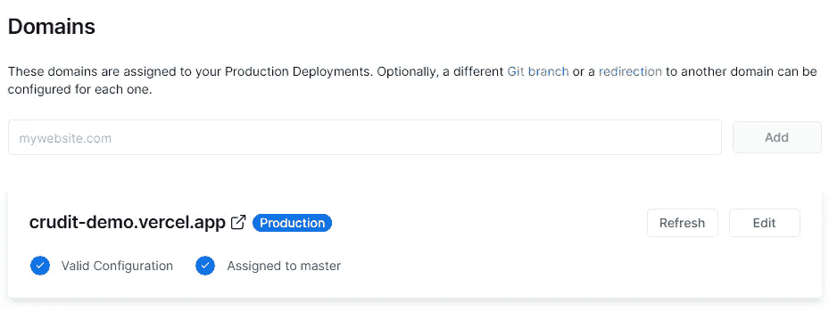

域列表

如果您有多个分支，您可以在应用程序中定义发起新部署的分支。请参见下图中的配置:

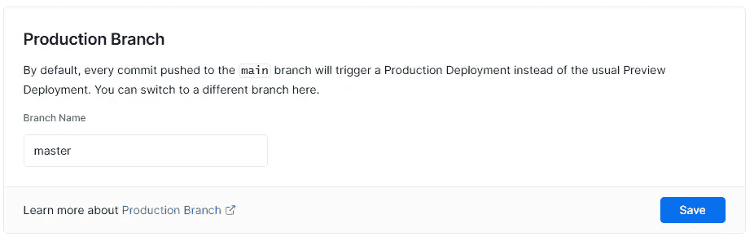

分支选择

在文章的开始，我谈到了无服务器功能:嗯，你可以选择他们运行的位置来满足立法的需要，比如 GDPR 或者离用户最近的地方。

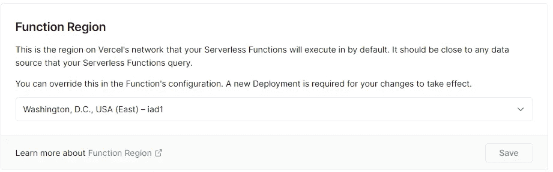

选择功能位置

最后，大多数应用程序需要基于编译过程和运行时环境的不同设置。它可以是关于前端 SPA 的 API 后端的一些参数，或者是函数的数据库连接字符串。Vercel 本身支持变量:你必须像下图那样输入它:

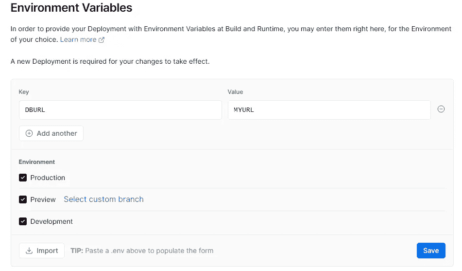

添加环境变量

在上图中，我们有一个值为`MYURL`的`DBURL`变量，它对所有环境都有效。如果你有现成的`.env`文件，你可以导入它。

当然，您可以随时通过点击铅笔来编辑这些值。你会在下图中看到类似这样的东西:

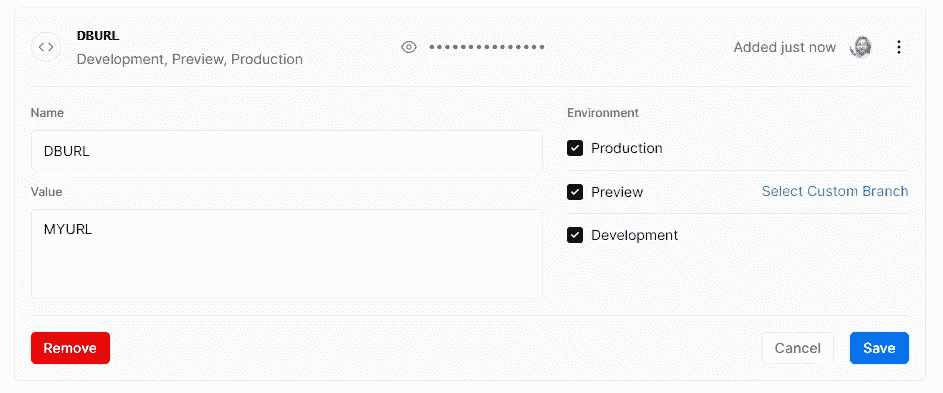

改变环境变量

好了，现在关于配置的一切都清楚了，让我们看看如何在本地配置项目！

# 修复您的项目，并在您的本地测试它

Vercel 提供了一个 cli 来连接您的云帐户，并模拟您在云中的工作行为。为此，首先下载并安装 cli:

```
npm i -g vercel
```

现在，我们可以进入项目文件夹并运行:

```
vercel dev
```

该命令是一个交互过程，需要登录。第一次执行时，会要求您将本地文件夹链接到一个远程项目，提示如下图所示。

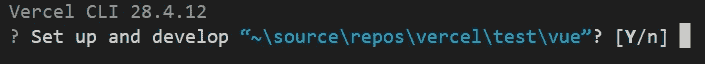

开始项目

然后，您必须选择您的项目范围，最后，您可以输入项目名称以链接到先前从 UI 创建的项目。

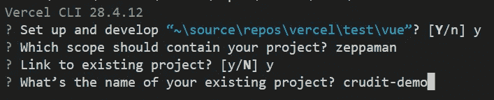

项目连接

作为最后一步，我们可以创建。env 文件，它基于我们对开发环境的配置。这可以通过键入以下命令来完成:

```
vercel env pull dev
```

结果是创建了一个`.env file confirmed by this message.`

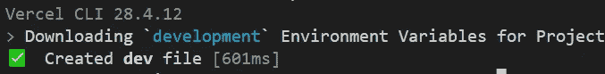

环境创造

现在您已经准备好在本地运行您的应用程序并开始调试了！

# 总结

在本文中，我们发现了什么是 Vercerl，以及它如何帮助我们使部署过程更加顺利。

此外，我们现在有机会以可承受的成本托管我们的应用程序。

Vercel 的采用非常简单，也可以应用到现有的项目中，本教程就是证明。