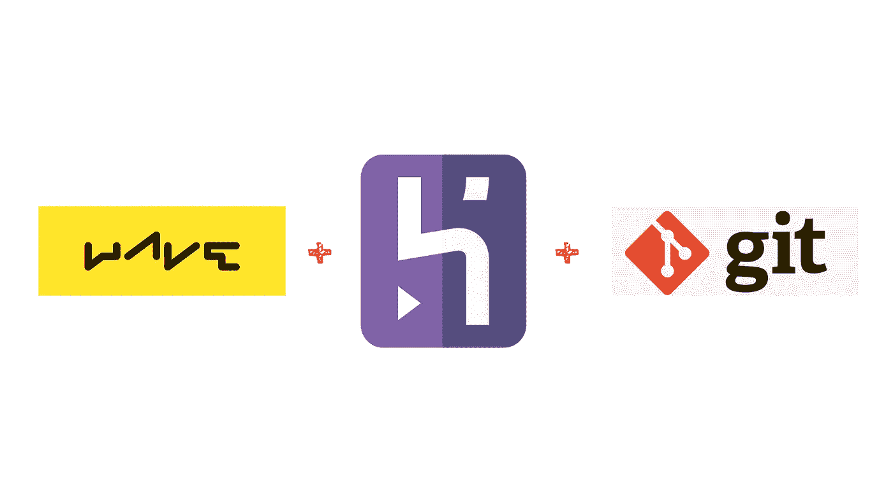
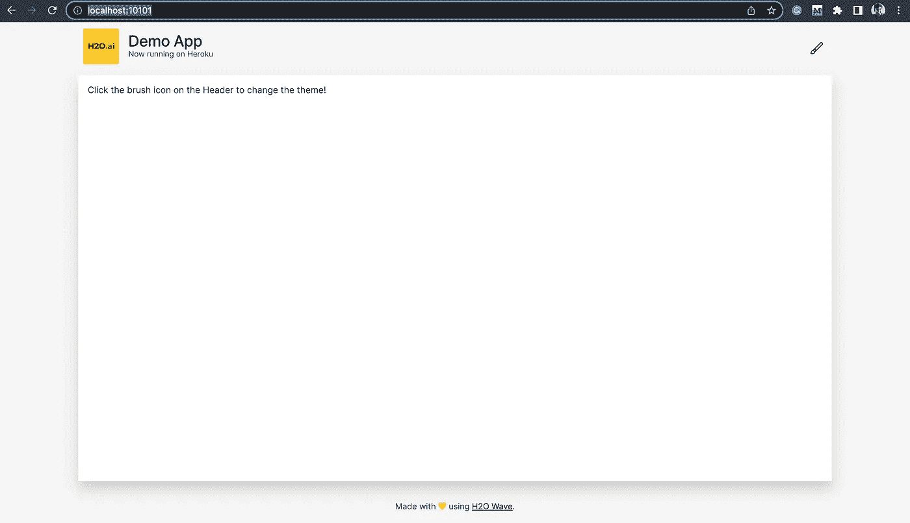
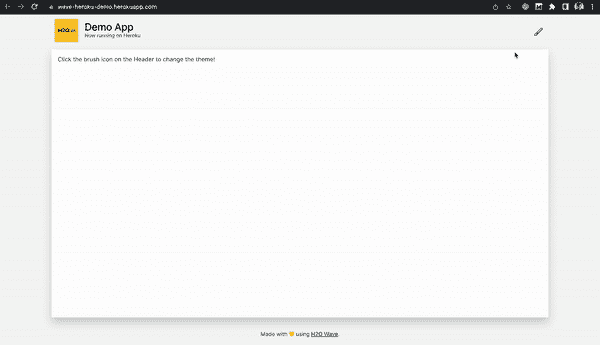

# 如何在 Heroku 上部署 H2O Wave App

> 原文：<https://betterprogramming.pub/how-to-deploy-h2o-wave-app-on-heroku-2abe2240731c>

## 使用**“Heroku Git”**方法在 Heroku 上部署 H2O Wave 应用程序



PC:作者

**H2O 波**是一个开源的 python 开发框架，用于开发具有复杂可视化的实时交互式 web 应用。它的特别之处在于，您不需要事先了解任何前端技术。H2O wave 的创建是为了克服数据科学家、机器学习工程师、研究人员&以及其他正在努力通过漂亮的仪表盘或网络应用程序展示自己辛勤工作的人的障碍。如果你擅长 Python 或 R，那么你可以像其他任何使用 H2O wave 的 web 开发者一样快速构建你的 web 应用。[看到这里，用 H2O 波弄脏你的手。](https://wave.h2o.ai/)

Heroku 是一个基于容器的云 PaaS，它帮助开发者部署、管理和扩展他们的 web 应用。Heroku 提供了一个**“Free and Hobby”**包，可用于部署非商业 web 应用，如概念证明、MVP 和个人项目。要了解更多关于 Heroku 的信息，请点击这里。

这两个惊人的产品可以帮助我们许多人建立和分享/演示我们的网络应用程序。有三种不同的方式可以在 Heroku 上部署应用程序。今天让我向你展示如何使用`Heroku Git`来部署你的 wave 应用。我们会看到，

1.  先决条件
2.  在本地构建和测试你的 wave 应用
3.  准备您的 Wave 应用程序的代码库，以便在 Heroku 中部署
4.  部署和共享

## 先决条件

要部署您需要的 wave 应用程序，

1.  Heroku 免费帐户，如果你没有一个[创建它](https://signup.heroku.com/dc)。
2.  Git CLI，很可能每个开发者都有，如果你没有安装它的话。
3.  Heroku CLI，[参考此处安装](https://devcenter.heroku.com/articles/heroku-cli)。
4.  H2O Wave 应用程序，如果你有自己的应用程序，请继续使用它，[或者在这里随意使用我的演示应用程序](https://github.com/Mathanraj-Sharma/wave-heroku-demo)。

## 在本地构建和测试你的 wave 应用

希望您已经检查了所有先决条件，让我们开始行动吧。

首先，让我们检查我们的应用程序是否在本地工作。这里我将使用我创建的演示应用程序。如果你有自己的应用程序，跳过下一步，并确认它按预期工作。

*   克隆演示应用程序

```
$ git clone [https://github.com/Mathanraj-Sharma/wave-heroku-demo.git](https://github.com/Mathanraj-Sharma/wave-heroku-demo.git)
$ cd wave-heroku-demo
$ tree
```

你应该能够看到下面的应用程序回购文件结构

```
.
├── LICENSE
├── Makefile
├── Procfile
├── README.md
├── demo_app
│   ├── __init__.py
│   └── app.py
├── requirements.txt
├── runtime.txt
└── static
    └── h2o_logo.svg2 directories, 9 files
```

*   在本地检查应用程序，运行

```
# to setup virutal environment with app dependencies
$ make setup--------------# start the app in no-reload mode
$ .venv/bin/wave --no-reload demo_app/app.pyOR simply you can use my make target
$ make run
```

从这个日志中你可以看到应用程序开始运行良好

```
./.venv/bin/wave run --no-reload demo_app/app.py
params: []2022/07/01 05:44:23 #
2022/07/01 05:44:23 # ┌────────────────┐ H2O Wave
2022/07/01 05:44:23 # │  ┐┌┐┐┌─┐┌ ┌┌─┐ │ 0.22.0 20220531173625
2022/07/01 05:44:23 # │  └┘└┘└─└└─┘└── │ © 2021 H2O.ai, Inc.
2022/07/01 05:44:23 # └────────────────┘
2022/07/01 05:44:23 # ┌──────────────────────────────────────┐
2022/07/01 05:44:23 # │  Running at [http://localhost:10101/](http://localhost:10101/)  │
2022/07/01 05:44:23 # └──────────────────────────────────────┘
2022/07/01 05:44:23 # {"address":":10101","base-url":"/","t":"listen","web-dir":"/Users/mathanraj/Desktop/contribs/wave-heroku-demo/.venv/www"}
INFO:     Started server process [2959]
INFO:     Waiting for application startup.
2022/07/01 05:44:23 # {"host":"[http://127.0.0.1:8000](http://127.0.0.1:8000)","route":"/","t":"app_add"}
INFO:     Application startup complete.
INFO:     Uvicorn running on [http://127.0.0.1:8000](http://127.0.0.1:8000) (Press CTRL+C to quit)
```

如果你去[http://localhost:10101/](http://localhost:10101/)你可以看到这个应用在工作。



PC:作者

## 准备您的 Wave 应用程序的代码库，以便在 Heroku 中部署

为了使用`Heroku Git`在 Heroku 上部署你的 wave 应用程序，你需要三个文件。

*   `runtime.txt`:这个文件将被用来告诉 Heroku 你想在哪个 python 版本上运行你的应用。它将只包含您需要的 python 版本。`python-3.8.13`
*   `requirements.txt`:它包含成功运行应用程序所需的所有依赖项。当我们部署我们的应用程序时，Heroku 的 python 依赖管理器将寻找这个文件来为你的应用程序设置运行时环境。你可以看看我的演示报告中的样本文件来了解这个文件的内容。
*   `Procfile`:这是一个特殊的文件，用来声明启动你的应用需要执行的命令。为了成功启动你的 wave 应用，你需要在你的`Procfile`中有这个`web`过程

```
web: WEB_CONCURRENCY=1 H2O_WAVE_ADDRESS="http://127.0.0.1:${PORT}" H2O_WAVE_LISTEN=":${PORT}" wave run --no-reload demo_app/app.py
```

让我们花几分钟时间来理解这个命令的作用。

`wave run -no-realod demo_app/app.py`是我们平时用来启动 wave app 的命令。

`H2O_WAVE_LISTEN`是用来告诉 wave 服务器应该监听哪个端口的环境变量。默认值为`10101`。

`H2O_WAVE_ADDRESS`是一个环境变量，我们用它来告诉 wave app 哪个是 wave 服务器的公共主机/端口。默认值为`http://127.0.0.1:10101`。

当我们在 Heroku 上部署一个 app 时，它会在运行时随机指定一个端口号。该值可通过`PORT`环境变量获得。因此，当我们部署应用程序时，我们的服务器应该绑定到指定的端口地址&,我们的应用程序应该通过该端口寻找我们的服务器。这就是为什么我们设置这两个环境变量。

最后一个变量是`WEB_CONCURRENCY`，我们设置它告诉我们的服务器只启动我们应用程序的一个实例。

[在此了解更多关于环境变量的信息。](https://github.com/h2oai/wave/blob/master/website/docs/configuration.md)

这就是我们部署一个基本的 wave 应用程序所需的全部内容，[你可以根据自己的需要使用 proc file](https://devcenter.heroku.com/articles/procfile)。

**部署&共享**

所有设置让我们开始部署我们的应用程序

*   打开一个终端，进入 wave app 的 repo，运行下面的命令，在 heroku 上创建一个 app，接收你的源代码。

```
$ heroku apps:create wave-heroku-demoCreating ⬢ wave-heroku-demo... done
[https://wave-heroku-demo.herokuapp.com/](https://wave-heroku-demo.herokuapp.com/) | [https://git.heroku.com/wave-heroku-demo.git](https://git.heroku.com/wave-heroku-demo.git)
```

当应用程序名称已被使用时，它会询问另一个名称。请使用您选择的名称继续前进。

该命令将在 heroku 上为您的应用程序创建一个 git repo，并将在您的本地项目上添加一个名为`heroku`的 git remote。

*   接下来将你的源代码推送到你创建的 Heroku 应用程序中

```
$ git push heroku mainEnumerating objects: 17, done.
Counting objects: 100% (17/17), done.
Delta compression using up to 8 threads
Compressing objects: 100% (13/13), done.
Writing objects: 100% (17/17), 9.79 KiB | 668.00 KiB/s, done.
Total 17 (delta 1), reused 0 (delta 0), pack-reused 0
remote: Compressing source files... done.
remote: Building source:
remote:
remote: -----> Building on the Heroku-20 stack
remote: -----> Determining which buildpack to use for this app
remote: -----> Python app detected
remote: -----> Using Python version specified in runtime.txt
remote: -----> Installing python-3.8.13
remote: -----> Installing pip 22.1.2, setuptools 60.10.0 and wheel 0.37.1
remote: -----> Installing SQLite3
remote: -----> Installing requirements with pip
...
......
remote: Verifying deploy... done.
To [https://git.heroku.com/wave-heroku-demo.git](https://git.heroku.com/wave-heroku-demo.git)
 * [new branch]      main -> main
```

应用程序现已部署。确保至少有一个应用程序实例正在运行

```
$ heroku ps:scale web=1
```

*   在浏览器上打开你的应用

```
$ heroku open
```

这将在您的浏览器上打开您的应用。或者，你可以去你的 [Heroku 仪表板](https://dashboard.heroku.com/apps)打开你的应用程序。



PC:作者

我们已经看到了一个关于 how 波和 Heroku 的简短介绍，以及我们如何使用这两种令人敬畏的技术来克服在零前端知识的情况下构建复杂的 web 应用程序的障碍。希望这对你有帮助！

参考资料:

*   [了解更多关于 Wave 的信息](https://docs.h2o.ai/)
*   [在 Heroku 上部署 python 应用](https://devcenter.heroku.com/articles/getting-started-with-python)
*   [使用 Heroku Docker 方法在 Heroku 上部署 Wave App](https://medium.com/@srini.x/deploy-your-wave-app-in-5-minutes-bd440d00917f)