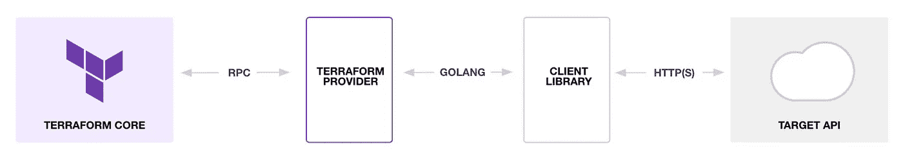
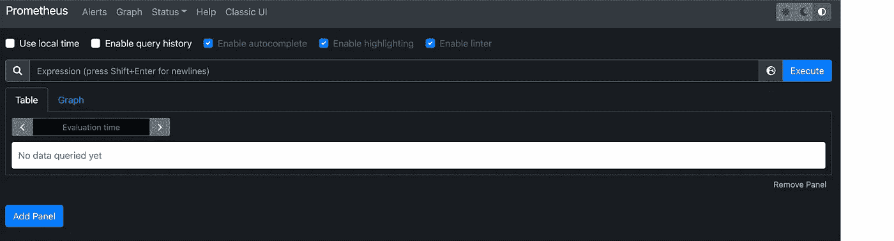
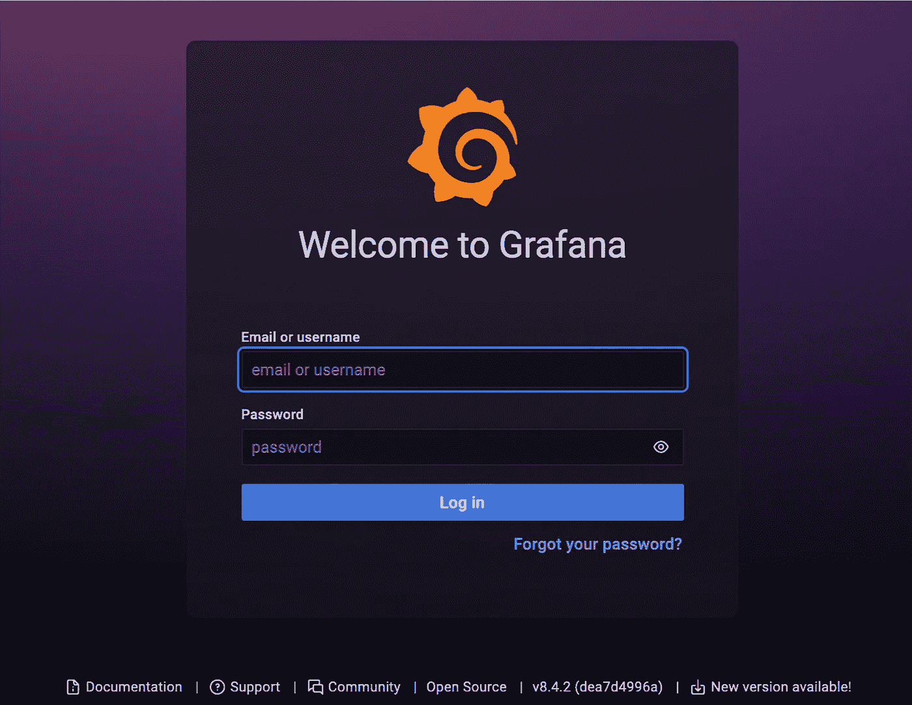
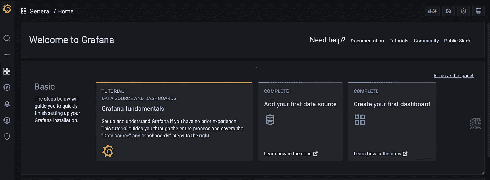
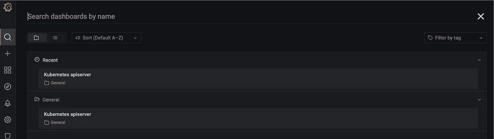
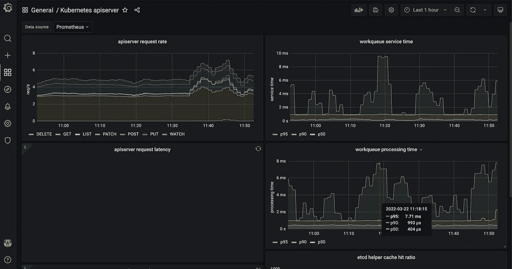

# 如何使用 Terraform 部署舵图

> 原文：<https://betterprogramming.pub/how-to-deploy-helm-charts-with-terraform-2b0a9bbb187e>

## 你知道你可以像其他地形资源一样部署头盔图表吗？在这个 Terraform 教程中边做边学！


马特·阿特兹 / [Unsplash](https://unsplash.com/?utm_source=ghost&utm_medium=referral&utm_campaign=api-credit) 摄影

今天，我们将了解如何使用 Helm 部署软件组件。这将允许您以代码的形式管理 Kubernetes 之上的应用程序。您将能够在您的云原生基础设施中端到端地使用 Terraform。

本 Terraform 教程主要关注以下几点:

*   快速回顾什么是地形和头盔。
*   官方头盔供应商介绍
*   边做边学——使用 [Prometheus](https://prometheus.io/) 和 [Grafana](https://grafana.com/) 部署现代监控基础设施

准备好了吗？用头盔和地形在库伯内特斯上部署！

# 什么是 Terraform？


来自 https://www.terraform.io/[的 Terraform 标志](https://www.terraform.io/)

Terraform 是 DevOps 生态系统中一个众所周知的工具。它允许你用代码描述你的整个基础设施。这个过程被称为基础设施代码( *IaC* ):

> IaC 是通过机器可读的定义文件，而不是物理硬件配置或交互式配置工具来管理和调配计算机数据中心的过程

Terraform 可以管理来自许多不同云提供商或服务的资源。您编写代码，Terraform 将其翻译成对目标的 API 调用。它还将确定资源的关系和创建顺序。

Terraform 还在状态文件中跟踪基础设施的状态。这个文件允许 Terraform 将现有的基础设施与您的代码进行比较。知道了 Terraform 决定为同步创建/更新/删除哪些资源。

# 什么是头盔？


来自 [https://helm.sh](https://helm.sh) 的 Helm logo

Helm 是一个包管理工具，用于在 Kubernetes 集群中部署应用程序。Linux 发行版中的 YUM 和 APT 命令也管理包。Helm 也做同样的事情，但是是针对 Kubernetes 上的软件。在 Helm 术语中，包是一张图表。

Helm charts 帮助您定义、安装和更新 Kubernetes 应用程序。这里就不一一考察赫尔姆的所有信息了。但是，我邀请你查阅这个头盔教程，以便更熟悉它:

[](/what-is-helm-a-quickstart-tutorial-for-kubernetes-beginners-24fecce1b0eb) [## 什么是头盔？Kubernetes 初学者快速入门教程

### 教你如何处理应用程序包，升级和回滚

better 编程. pub](/what-is-helm-a-quickstart-tutorial-for-kubernetes-beginners-24fecce1b0eb) 

# Terraform 头盔提供商

Terraform 提供商允许用户管理各种外部 API:云提供商、数据库和服务。下图显示了提供商如何与 Terraform 核心和目标 API 进行交互:



平台提供商是如何工作的

Terraform 提供商使用 Golang 客户端库进行通信。在您这边，您必须在 Terraform 代码中声明提供者。然后，您将能够定义资源并获取远程数据。

维护 Terraform 的公司 Hashicorp 为 Helm 分配了一个提供商。在本文的下一篇文章中，我们将使用[舵提供程序](https://registry.terraform.io/providers/hashicorp/helm/latest/docs)来部署舵图表。该提供程序需要在您的机器上安装 Terraform 和 Helm 二进制文件才能工作。

## 安装 Terraform

```
$ brew install terraform
```

> 不在 Mac 上工作？查看 [Terraform 下载](https://www.terraform.io/downloads)

## 安装舵

```
$ brew install helm
```

> 不在 Mac 上工作？查看[头盔下载](https://github.com/helm/helm/releases)

## 声明舵供应商

您还需要提供正确的凭证来连接到 Kubernetes 集群。很多选择都是可能的。最简单的方法是指定 kubeconfig 路径:

```
provider "helm" {
  kubernetes {
    config_path = "~/.kube/config"
  }
}
```

# 使用 Helm+Terraform 部署监控基础设施

在 GitHub 资源库中检索本教程的完整代码:

[](https://github.com/guivin/terraform-helm-example/tree/0.1.0) [## GitHub-guivin/terra form-helm-0 . 1 . 0 版示例

### 这个库展示了如何使用官方 Helm 提供者将 Helm 与 Terraform 结合使用。这将部署一个监控…

github.com](https://github.com/guivin/terraform-helm-example/tree/0.1.0) 

## 地形变量

Terraform 变量有助于避免重复值:

*   `kube_config`是 kubeconfig 文件的路径。它将用于连接到 Kubernetes 集群。
*   `namespace`是格拉夫纳和普罗米修斯将带着头盔部署的逻辑地点。

## Kubernetes &头盔供应商

我们将管理 Kubernetes 的资源，并用 Terraform 掌舵。我们宣布 [Kubernetes 提供者](https://registry.terraform.io/providers/hashicorp/kubernetes/latest/docs)和 Helm 提供者继续进行:

## Kubernetes 名称空间

Kubernetes 中的名称空间是用于部署的逻辑隔离。我们为新的监控组件创建了一个`monitoring`名称空间:

## 普罗米修斯头盔释放

[helm_release](https://registry.terraform.io/providers/hashicorp/helm/latest/docs/resources/release) 是来自 helm 提供者的地形资源。它允许您发布一个舵图，并使用 Terraform 对其进行自定义。您可以用`set`块覆盖原始`values.yaml`的默认设置:

## 格拉夫纳头盔释放

值可以通过文件传递给`helm_release`资源:

上面的代码片段定义了访问 Grafana 的 Kubernetes 秘密。凭证是由 Terraform 生成的随机密码。`values.yaml`由 Terraform 模板化并传递给`helm_release.grafana`。

# 进入普罗米修斯服务器

创建到 Prometheus 服务器的端口转发会话:

```
$ kubectl port-forward --namespace monitoring svc/prometheus-server 8080:80
```

转到 [http://localhost:8080](http://localhost:8080/) 访问 Prometheus UI:



Prometheus 服务器 web 界面

# 访问 Grafana 用户界面

创建到 Grafana 的端口转发会话:

```
$ kubectl port-forward --namespace monitoring svc/grafana 3000:80
```

获取 Grafana 管理员用户名:

```
$ kubectl get secret --namespace monitoring grafana -o jsonpath="{.data.admin-user}" | base64 --decode
```

获取 Grafana 管理员密码:

```
$ kubectl get secret --namespace monitoring grafana -o jsonpath="{.data.admin-password}" | base64 --decode
```

转到 [http://localhost:3000](http://localhost:3000/) 访问 Grafana UI。重复使用以前的凭据登录:



Grafana 登录页面



格拉夫纳主页



Grafana 仪表板

在`values-grafana.yaml`文件中提供了 [Kubernetes API 服务器仪表板](https://grafana.com/grafana/dashboards/12006)。仪表板在 Grafana UI 中可见:



Kubernetes API 服务器 Grafana 仪表板

# 结论

我们在本教程中发现了如何使用 Terraform 和头盔与官方头盔供应商。掌舵图通过`helm_release`资源调用。可以使用`set`块或`values.yaml`模板定制部署值。

此处的示例使用 Prometheus 和 Grafana 部署了完整的监控。堆栈:

*   普罗米修斯收集集群指标
*   Grafana 允许我们在漂亮的仪表板上可视化指标

将 Terraform 与 Helm 相结合是非常好的，因为您可以将 Helm chart 部署和依赖项与所有基础架构组件协调起来。舵图最终被认为是任何其他类型的资源。