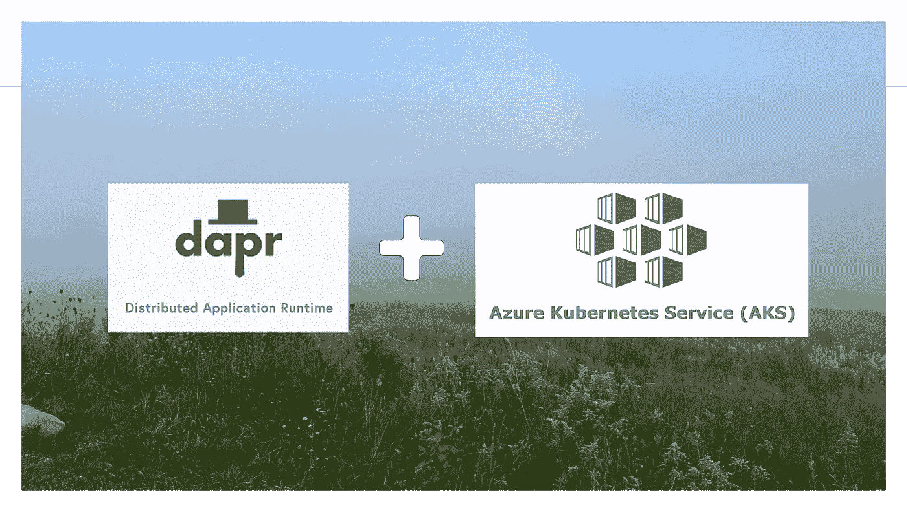
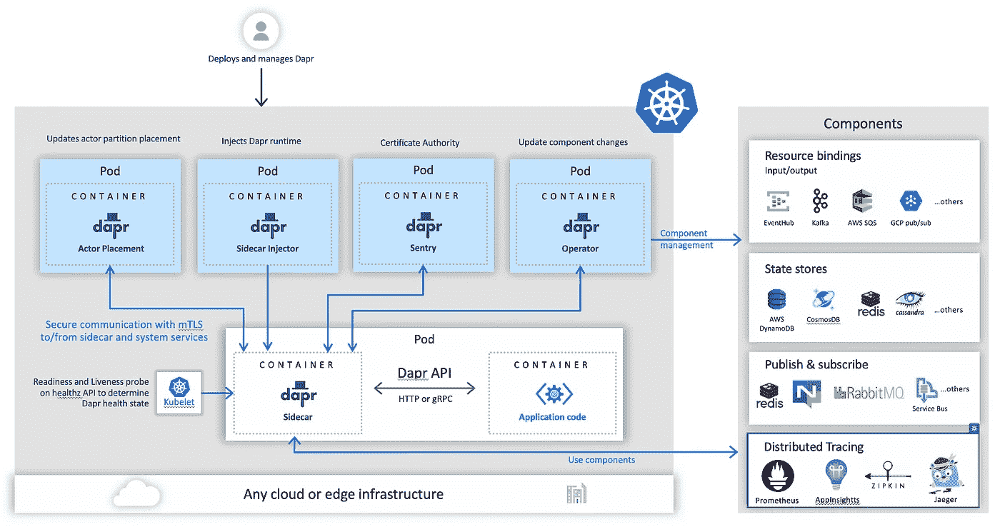
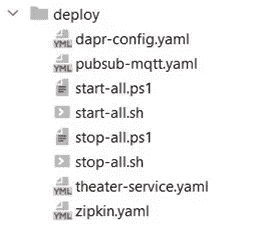
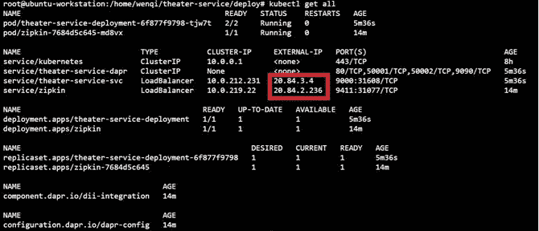

# 如何在 Azure Kubernetes 服务中使用 Dapr 部署微服务

> 原文：<https://betterprogramming.pub/how-to-deploy-microservice-using-dapr-in-azure-kubernetes-service-da75319dd0ea>

## 在您的 AKS 集群中部署 Spring Boot 应用程序



作者的图像背景。

几个月前，我用 Dapr 发表了[事件驱动编程。要更深入地了解 Dapr 是什么和做什么，请查看这个故事。](https://medium.com/codex/event-driven-programming-with-dapr-db96ac855a2d)

在这个故事中，我们将深入探讨如何在 AKS 中部署 Spring Boot 微服务(`theater-service`，使用 Dapr 来消费发行商发布的`TheaterCreatedEvent` )。

在 Azure Kubernetes Service (AKS)中部署使用 Dapr 的微服务时，需要一些额外的步骤。下面提供了分步说明。

```
[Prerequisite](#8d3e)
[Step 1: Create an AKS Cluster](#61b7)
[Step 2: Install Dapr in AKS Cluster](#9cfd)
[Step 3: Deploy Dapr Pub/Sub Component in your AKS Cluster](#911b)
[Step 4: Create Database in Azure SQL](#0c00)
[Optional (Recommended!)](#e600)
[Step 5: Deploy Spring Boot App in your AKS Cluster](#e1da)
[Optional (Recommended!)](#397e)
[Launch the App from AKS](#ae60)
[Troubleshooting](#e5f6)
```

# 先决条件

*   创建一个 Ubuntu VM 作为工作站来使用 AKS 集群，如果你还没有创建的话。在工作站上安装 Azure CLI，并登录 Azure:

```
curl -sL [https://aka.ms/InstallAzureCLIDeb](https://aka.ms/InstallAzureCLIDeb) | sudo bash
az login
```

*   假设已经创建了应用程序映像并将其推送到 Azure 容器注册表(ACR)。如果没有，请参考下面的 docker 命令示例来构建映像，标记它，并将其推送到 ACR。在`docker tag`和`docker push`中，用您的实际图像 id 和 ACR 名称和 repo 替换图像 id 和 ACR 名称/repo。此外，用您在`az acr login`中的值替换 ACR 用户名。

```
mvn clean install
docker-compose build
docker images
docker tag 6ffef5a4f738 demo.azurecr.io/theater-service
az acr login --name demo
docker push demo.azurecr.io/theater-service
```

# 步骤 1:创建一个 AKS 集群

如果您还没有创建 AKS 集群，有几种方法可以创建它:

*   按照[http://portal.azure.com](http://portal.azure.com)上的 UI 向导创建一个 AKS 集群。
*   按照[https://docs . Microsoft . com/en-us/Azure/aks/kubernetes-walk through](https://docs.microsoft.com/en-us/azure/aks/kubernetes-walkthrough)中列出的说明使用 Azure CLI 创建集群，直到“运行应用程序”部分。

还要在工作站上安装`kubectl` ，并配置`kubectl` 连接到您的 Kubernetes 集群。

```
sudo su
az aks install-cli
az aks get-credentials --resource-group <YOUR RESOURCE GROUP> --name <YOUR AKS CLUSTER NAME>
```

# 步骤 2:在 AKS 集群中安装 Dapr

此步骤仅适用于第一次在 AKS 集群中安装 Dapr。一旦安装完毕，就不需要在同一个集群中再次执行这个步骤。Dapr 在集群级别工作，这意味着 Dapr 组件可以在同一个名称空间内工作，也可以在同一个集群内的多个名称空间之间工作。要在 AKS 集群中安装 Dapr，请运行以下命令在 AKS 集群中安装 Dapr。

```
wget -q [https://raw.githubusercontent.com/dapr/cli/master/install/install.sh](https://raw.githubusercontent.com/dapr/cli/master/install/install.sh) -O - | /bin/bash
```

将 Dapr 部署到 AKS 的最简单方法是使用 Dapr CLI `init`命令，如下所示。这个命令查看您的`kubectl`配置，并将 Dapr 安装到您的配置定义的集群中。

```
dapr init --kubernetes
```

在 Dapr 安装和部署之后，您应该看到五个 Dapr pods 在`dapr-system`名称空间中运行:

*   `dapr-sidecar-injector`
*   `dapr-placement-server`
*   `dapr-sentry`
*   `dapr-operator`
*   `dapr-dashboard`

您可以使用`dapr status`命令来验证您的安装:

```
dapr status -k
```

验证安装的另一种方法是使用`kubectl`工具在`dapr-system`名称空间下列出集群中正在运行的服务。

```
$ kubectl get pods -n dapr-system -w
```

安装后，任何部署到 Kubernetes 的新吊舱都将通过`dapr-sidecar-injector`连接一个 Dapr 边车。



*图片来源:*[https://docs.dapr.io/concepts/security-concept/](https://docs.dapr.io/concepts/security-concept/)

# 步骤 3:在 AKS 集群中部署 Dapr 发布/订阅组件

假设您已经在您的 Ubuntu 工作站上克隆了您的代码，并且您的 Dapr 发布/子组件 YAML 文件位于您的项目根目录下的文件夹“deploy”中，`theater-service`使用组件文件`pubsub-mqtt.yaml`，运行以下命令在您的 AKS 集群中部署 Dapr 发布/子组件。

如果您的应用程序的相应 pub 或子应用程序的 Dapr 组件已经部署在同一个群集中，则无需再次运行此步骤。

即使您运行此步骤，您也只会收到一条消息通知您`component.dapr.io/<your Dapr component name> unchanged`。没有伤害。

这是因为 pub 和子应用程序共享同一个 Dapr pub/子组件 YAML。一旦在集群中为一个应用程序部署了 Dapr 组件，其他相应的应用程序一旦启动，就会自动注入 Dapr 组件。

```
kubectl apply -f deploy/pubsub-mqtt.yaml
```

您的 Dapr 发布/子组件文件如下所示，带有“`Kind: Component`”:

# 步骤 4:在 Azure SQL 中创建数据库

此步骤仅适用于首次在 Azure SQL 中为应用程序创建 SQL 服务器和数据库。

一旦 SQL server 和数据库在 Azure SQL 中启动并运行，就没有必要为同一个应用程序再次执行这一步骤。数据库迁移更新可以在步骤 5 中指示的应用程序部署中执行。

按照以下步骤创建 SQL server、配置防火墙规则和创建数据库，或者选择“可选”部分中的 bash 脚本来填充占位符，然后通过 Azure CLI 执行该脚本来创建 SQL server、数据库和配置防火墙规则。

我强烈推荐参考下面的“可选”部分，运行 bash 脚本来创建`db`服务器和模式，更简单！`az sql`是可重新运行的，这意味着如果已经创建了数据库服务器或模式，该命令不会抛出错误，只是运行而不做任何事情。

创建 SQL Server:

```
az sql server create -l eastus -g <resource group> -n <SQL server name> --admin-user <admin username> --admin-password <admin password>
```

配置防火墙规则:

```
az sql server firewall-rule create -g <resource group> -s <SQL server name> --name AllowAllIps --start-ip-address 0.0.0.0 --end-ip-address 223.255.255.255
```

创建 SQL 数据库:

```
az sql db create -g <resource group> -s <SQL server name> -n <database name> --service-objective Basic
```

获取数据库连接字符串，在你的应用程序的`application.yml`中使用。

```
az sql db show-connection-string --client jdbc --name <database name>
```

对于 Spring Boot 应用，我们使用`jdbc`驱动，对于其他驱动的连接字符串，请参考 Azure SQL 中数据库设置下的“连接字符串”。

根据上述命令的输出修改 application.yml 中的`db`连接字符串，以检索`db`连接字符串。

```
jdbc-url: jdbc:sqlserver://<SQL server name>.database.windows.net:1433;database=<Database name>;user=<admin username>@<SQL server name>;password=<admin password>;encrypt=true;trustServerCertificate=false;hostNameInCertificate=*.database.windows.net;loginTimeout=30
```

通过这一代码更改，您将需要按照先决条件一节中的说明来重新构建您的应用程序映像并将其推送到 ACR。

## 可选(推荐！)

为了简化 Azure SQL 中的`db`创建，我们可以在 bash 脚本中包含上述步骤:

参考:[https://spring . io/blog/2019/01/07/booti ful-azure-SQL-based-data-access-with-Microsoft-SQL-server-2-6](https://spring.io/blog/2019/01/07/bootiful-azure-sql-based-data-access-with-microsoft-sql-server-2-6)

# 步骤 5:在您的 AKS 集群中部署 Spring Boot 应用

通过运行以下命令在集群中部署 Spring Boot 应用程序(以 theater-service 为例),假设您的 Kubernetes 部署`yaml`文件位于项目根目录下的`deploy`文件夹中。

```
kubectl apply -f deploy/theater-service.yaml
```

Kubernetes 部署 YAML 文件包含部署和服务两个部分，参见下面的样例部署 YAML。

请注意，Dapr 注释(第 17–22 行)已添加到部署中，以确保将注入 Dapr 边车。

*   第 22 行`dapr.io/sidecar-liveness-probe-delay-seconds: "60"`，连同第 32-35 行，覆盖 Kubernetes 的默认活性探测和就绪探测配置。该值应该根据应用程序启动时间进行调整。例如，`theater-service` app 需要大约 50 秒才能启动，如果将活性探测和就绪探测的默认配置值保留为初始延迟，即只有 5 秒，则在初始延迟后，`kubelet`将继续探测 app 容器并失败，最终触发 pod 重新启动。通过将初始延迟设置为等于或稍长于 app 启动时间，可以避免`kubelet`发出活性/准备就绪探测失败的错误信号并重启 app 容器。
*   第 36–42 行定义了最小/最大 CPU 和内存的资源使用。在应用部署 YAML 中定义资源被认为是最佳实践，这样 Kubernetes 调度程序就知道如何准确地分配 pod。请务必在 Insights 中进行监控，以确保定义的最大值对于您的应用程序来说不会太低，否则，需要进行相应的调整。

使用以下任一选项验证应用程序部署状态:

```
kubectl get pods
kubectl describe pod <your app pod name>
```

或者:

```
kubectl get all
```

## 可选(推荐！)

您可以将应用程序的部署 YAML、dapr 组件 YAML、配置 YAML 等分组到 bash 或 PowerShell 脚本中，以便一起部署(全部启动)或一起删除(全部停止)。

如果您选择运行 bash 或 Powershell 脚本来部署您的应用程序及其 Dapr 组件，您可以跳过上面的步骤 2 和步骤 3。这些脚本和 YAML 文件可以分组到项目根目录下名为“deploy”的文件夹中，如下所示:



`start-all.sh`:

`stop-all.sh`:

对于执行脚本时出现的权限被拒绝错误，通过在您尝试执行的特定脚本上运行`chmod +x`来相应地修改权限，例如:

```
chmod +x start-all.sh
```

# 从 AKS 启动应用程序

部署完成后，通过运行`kubectl get all`获取应用的外部 IP:



该应用程序可在:[http://20.84.3.4:9000/swagger-ui.html](http://20.84.3.4:9000/swagger-ui.html)启动

Zipkin 也可以在:[http://20.84.2.236:9411/zipkin/](http://20.84.2.236:9411/zipkin/)发布

注意:您可能需要等待几分钟，直到容器完全启动并运行，然后才能启动应用程序。

# 解决纷争

这些`kubectl`命令在我们需要深入容器/容器来验证日志时会派上用场:

```
kubectl describe pod <your app pod name>kubectl logs <your app pod name> <container>
```

例如，pod `theater-service-deployment-558bb6bbfd-9gkv5`部署了两个容器`daprd` 和`theater-service`，要查看每个容器的日志，请运行以下命令:

```
kubectl logs theater-service-deployment-558bb6bbfd-9gkv5 daprdkubectl logs theater-service-deployment-558bb6bbfd-9gkv5 theater-service
```

请注意，使用 CLI 不支持非默认名称空间。如果我们需要一个非默认的名称空间，必须使用 Helm。建议在生产环境中使用 Helm。

本故事中提到的`theater-service`应用程序的源代码位于[https://github.com/wenqiglantz/theater-service-dapr.git](https://github.com/wenqiglantz/theater-service-dapr.git)。

编码快乐！手工制作快乐！

# **参考文献**

*   [https://docs . dapr . io/operations/hosting/kubernetes/kubernetes-overview/](https://docs.dapr.io/operations/hosting/kubernetes/kubernetes-overview/)
*   [https://docs.microsoft.com/en-us/azure/aks](https://docs.microsoft.com/en-us/azure/aks/kubernetes-walkthrough)
*   https://docs.dapr.io/concepts/security-concept/
*   [https://spring . io/blog/2019/01/07/booti ful-azure-SQL-based-data-access-with-Microsoft-SQL-server-2-6](https://spring.io/blog/2019/01/07/bootiful-azure-sql-based-data-access-with-microsoft-sql-server-2-6)