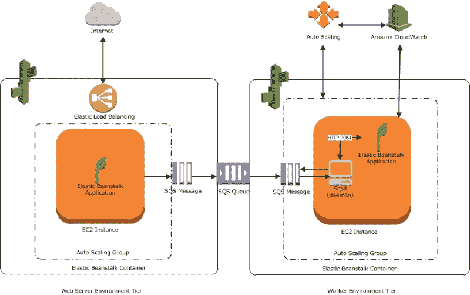
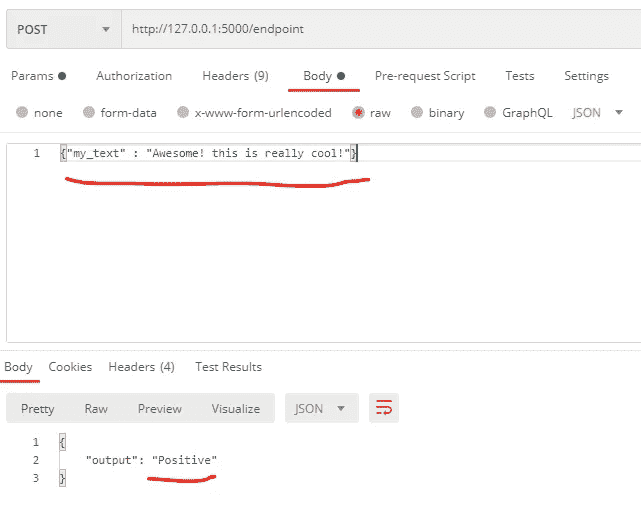
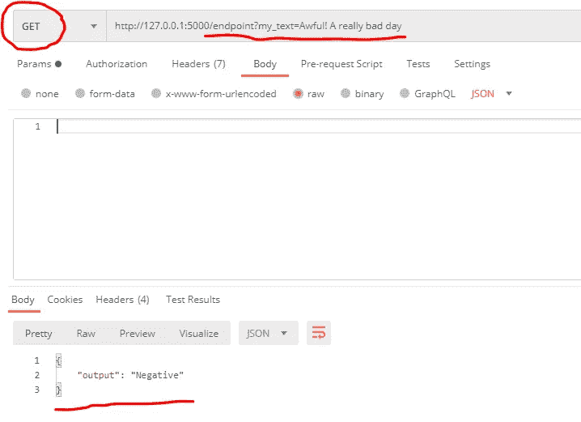
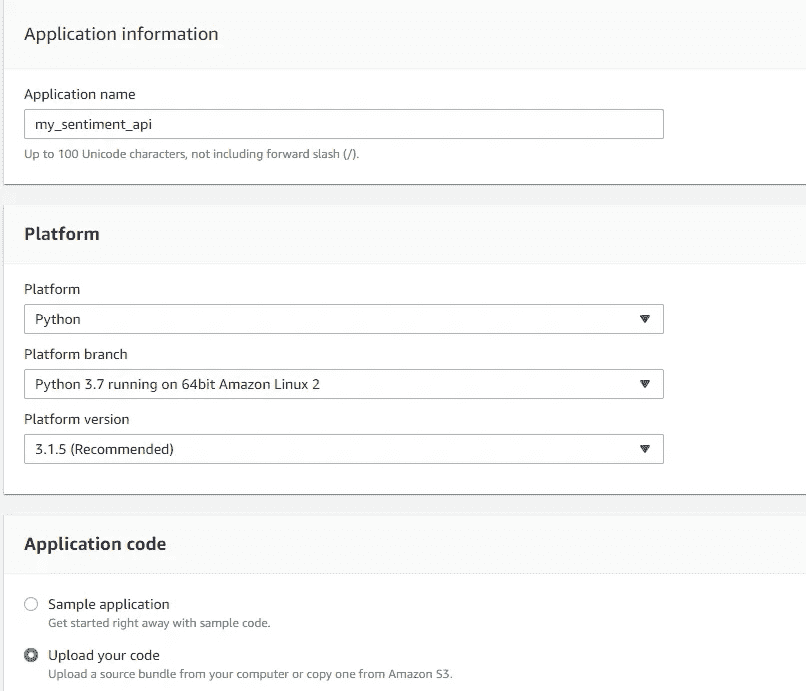
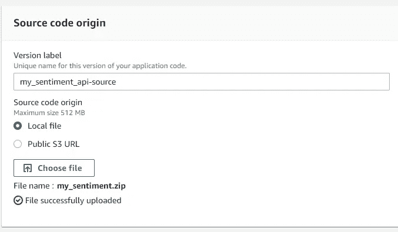
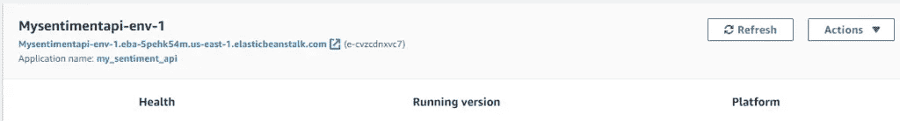
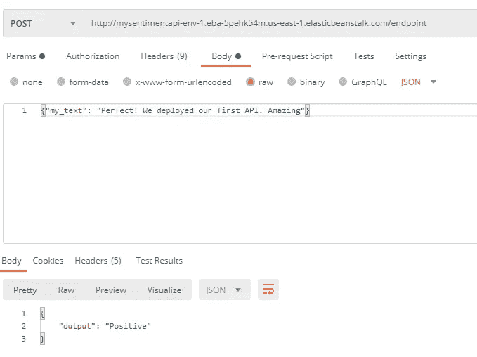
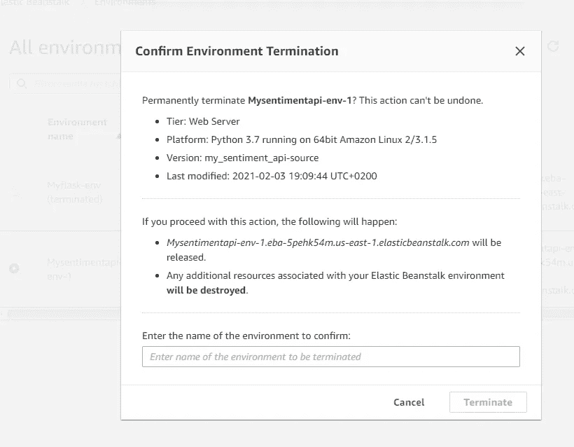

# 如何使用弹性 Beanstalk 在 AWS 上部署 ML 模型

> 原文：<https://betterprogramming.pub/how-to-deploy-ml-models-into-aws-with-elastic-beanstalk-f1364e8d1238>

## 在 AWS Elastic Beanstalk 上构建和部署 Python Flask API



图片来自 [AWS](https://docs.aws.amazon.com/elasticbeanstalk/latest/dg/concepts-worker.html) 。

在之前的文章中，我们提供了[如何构建 Flask Rest API](https://predictivehacks.com/python-rest-api-example/) 、[如何构建和部署机器学习 web app](https://predictivehacks.com/practical-guide-build-and-deploy-a-machine-learning-web-app/) ，以及[如何用](https://predictivehacks.com/how-to-deploy-a-flask-api-the-easiest-fastest-and-cheapest-way/)[数字海洋](https://www.digitalocean.com/?refcode=2c0731159639&utm_campaign=Referral_Invite&utm_medium=Referral_Program&utm_source=CopyPaste)部署 Flask API 的例子。今天，我们将提供一个实际操作的例子，说明如何使用 [Elastic Beanstalk](https://aws.amazon.com/elasticbeanstalk/) 在 AWS 上部署机器学习模型的 Flask 应用。

# 用例

让我们假设你是一名数据科学家，你建立了一个机器学习模型，并希望与其他人分享。共享模型最常见的方式是使用 Flask Restful API，但是您需要一个服务器。你可以用弹性豆茎:

> “Elastic Beanstalk 是在 AWS 上部署应用程序的最快、最简单的方式。您只需使用 AWS 管理控制台、Git 存储库或集成开发环境(IDE)如 Eclipse 或 Visual Studio 来上传您的应用程序，而 Elastic Beanstalk 会自动处理容量供应、负载平衡、自动伸缩和应用程序健康监控的部署细节。几分钟之内，您的应用程序就可以投入使用，无需您进行任何基础架构或资源配置工作。”— [AWS 弹性豆茎](https://www.amazonaws.cn/en/elasticbeanstalk/)

# 构建 Flask API

在之前的一篇文章中，我们提供了一个[如何在 Python](https://predictivehacks.com/how-to-run-sentiment-analysis-in-python-using-vader/) 中运行情感分析的例子。假设我们被要求构建一个 API，该 API 将文本作为输入，并返回情感是`Positive`、`Negative`还是`Neutral`。对于这个任务，您应该[创建一个新环境](https://predictivehacks.com/working-with-anaconda-environments/)，然后通过创建`requirements.txt`文件来冻结它。

`application.py`文件是这样的:

因此，让我们看看我们的 API 在本地是否如预期的那样工作。

# 使用 Postman 测试 POST 请求

我们给出“太棒了！这真是太酷了！”作为输入，得到“正”作为输出。



# 使用 Postman 测试 GET 请求

我们给“可怕！“非常糟糕的一天”作为输入，而“消极”作为输出。



# 要求

既然我们确认了 API 可以工作，我们就准备好部署它了。我们需要做的最后一件事是在我们的环境中创建与命令相关的`requirements.txt`文件:

```
pip freeze > requirements.txt
```

`requirements.txt`文件看起来像这样:

最后，我们需要创建一个包含`application.py`和`requirements.txt`文件的 zip 文件，并将它上传到 Beanstalk。

*注意:zip 文件中不应该有任何其他子文件夹，因为 Beanstalk 将无法找到这些文件。*

# 在弹性豆茎上展开

我们将需要登录到 AWS 控制台并转到 Elastic Beanstalk。单击橙色的“创建应用程序”按钮。对于应用程序名称，我们可以键入`my_sentiment_api`。对于平台，选择 Python。对于应用程序代码，上传您在上面创建的`.zip`文件。



然后点击“创建应用程序”,等待大约五分钟。然后，API 将运行，我们将获得 API URL:



让我们看看是否可以使用 URL 发送请求。我们将和邮递员一起测试它。让我们试试这段文字:“完美！我们部署了第一个 API。太神奇了。”



# 用 Python 调用 Flask API

因为我们已经部署了一个 API，这意味着每个人都可以使用它。让我们看看如何用 Python 调用 API(例如 POST 请求)。

我们会得到以下三句话的感悟:

*   “这太酷了。”
*   “这太可怕了。”
*   “这是我的博客。”

输出:

```
Positive
Negative 
Neutral
```

# 删除您的弹性豆茎环境

你也知道，AWS 弹性豆茎不是免费的。因此，为了避免任何额外的费用，您需要删除环境:



# 外卖

Elastic Beanstalk 提供了一种简单的方法来部署快速而肮脏的 Flask APIs。您可以在[入门](https://aws.amazon.com/getting-started/hands-on/launch-an-app/)指南中找到我们上面描述的步骤。查看[文档](https://docs.aws.amazon.com/elasticbeanstalk/latest/dg/Welcome.html)了解更多信息。

【https://predictivehacks.com】最初发表于[](https://predictivehacks.com/how-to-deploy-ml-models-into-aws-with-elastic-beanstalk/)**。**