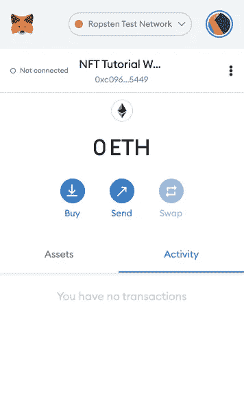
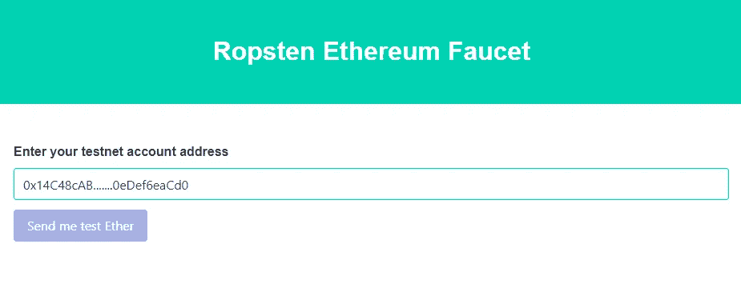
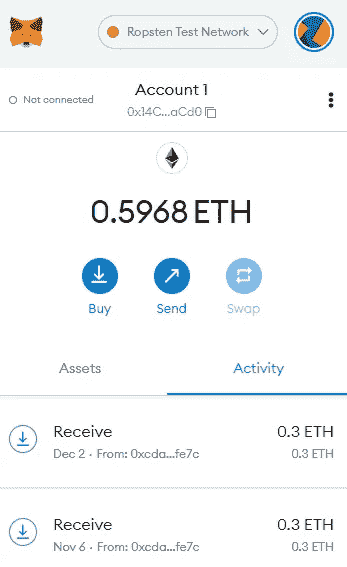
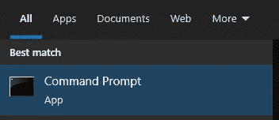
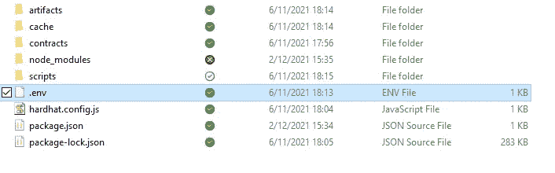
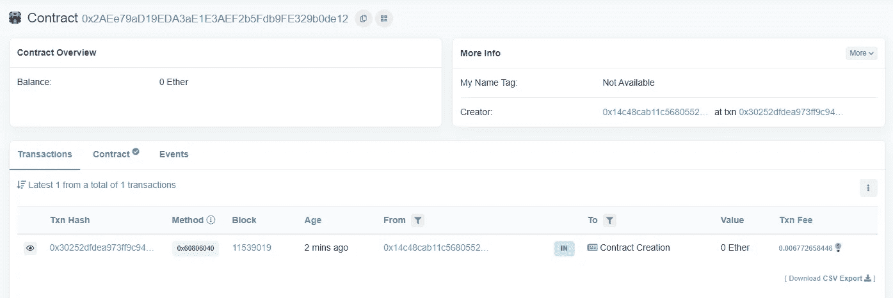
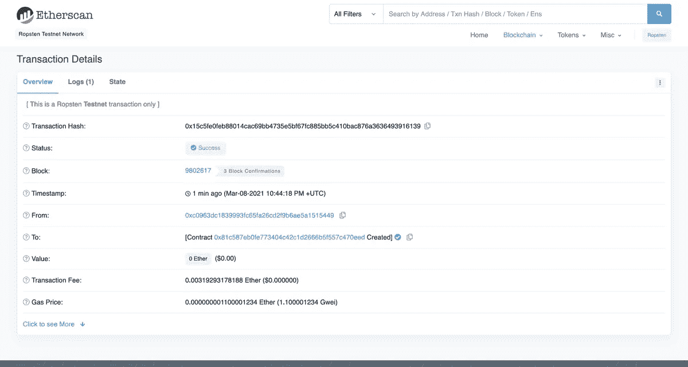

# 如何部署 NFT 智能合同

> 原文：<https://betterprogramming.pub/how-to-deploy-nft-smart-contracts-9271ce5e91c0>

## 编写和部署 NFT 智能合同指南


NFT sub punk # 41 创造了这个系列

这是由四部分组成的 NFT 创造者系列的第三部分:

1.  [*用 Python 创建自己的 NFT 集合*](/create-your-own-nft-collection-with-python-82af40abf99f)
2.  [创建 NFT 元数据 ](/generate-your-nft-metadata-11a878c082b9)
3.  [***部署 NFT 智能合约***](/how-to-deploy-nft-smart-contracts-9271ce5e91c0)
4.  [*NFT 明廷*](/mint-your-own-nfts-with-web3-js-f32f7b1cd8cc)


NFT 创造者系列的第三部分

如果您想继续编写代码，可以在本系列的第一部分和第二部分中找到必备的代码。

# 什么是智能合同？

智能合约是一个运行在以太坊区块链上的程序。它的代码和数据位于以太坊区块链的一个特定地址。

NFT 由智能合同驱动，处理可转让性并验证所有权。

你将使用 ERC-721 标准。这是一个为智能合约提供功能的 NFT 标准。

# 环境设置

## 魔力

在[炼金术](https://alchemy.com/?r=412182baad6a02fd)上创建一个账号。

Alchemy 是一个区块链开发者平台，致力于简化以太坊的开发。这使得我们可以跳过许多困难的技术区块链编程。

创建您的帐户后，点击“创建应用程序”并填写以下参数:

*   名称:您的 NFT 项目的名称
*   环境:暂存
*   链条:以太坊
*   网络:Ropsten


我们使用 **Ropsten 测试网络**，因为它可以免费使用，非常适合本次培训的目的。

## 元掩码

你需要一个可以收发交易的数字钱包。

最近最流行的钱包是 [Metamask](https://metamask.io/) 。

请务必切换到“ **Ropsten 测试网络**”，因为我们不想按照这个指南花费真正的以太坊。



## 添加以太坊

将智能合同部署到测试网络需要花费 ETH。

幸运的是，你正在测试网络(Ropsten)中运行，这允许你获得假的免费 ETH。

前往 [Ropsten 水龙头](https://faucet.ropsten.be/)并输入您的 Metamask 帐户地址。您的帐户地址应该类似于“0x14C…d0”。



正常情况下，你应该会看到假以太坊出现在你的 metamask 账号里。



# 项目创建

创建一个保存所有项目文件的目录。

在 windows 搜索中键入“cmd ”,打开命令提示符



使用“cd”命令切换到要创建项目文件夹的目录。

*在命令行中写:*

```
cd C:\YOURDIRECTORY
```

创建 NFT 项目文件夹，并切换到该目录。

*在命令行中写:*

```
mkdir nft
cd nft
```

在项目文件夹中，初始化 npm。

如果没有安装 NPM: **下载** [**Node.js**](https://nodejs.org/en/download/)

*在命令行中写入:*

```
npm init
```

按回车键，然后像我下面做的那样回答:

*在命令行:*

```
Package name: (nft-creator)2version: (1.0.0)3description: My first NFT!4entry point: (index.js)5test command:6git repository:7keywords:8author:9license: (ISC)10About to write to /Users/thesuperb1/Desktop/my-nft/package.json:1112{13  "name": "nft-creator",14  "version": "1.0.0",15  "description": "My first NFT!",16  "main": "index.js",17  "scripts": {18    "test": "echo \"Error: no test specified\" && exit 1"19  },20  "author": "",21  "license": "ISC"22}
```

# 安装安全帽


建筑工人

Hardhat 开发环境有助于在将智能合约部署到活动链之前在本地构建智能合约。想了解更多关于 Hardhat 的信息，你可以访问他们的[网站](https://hardhat.org/getting-started/#overview)。

*运行命令行:*

```
npm install --save-dev hardhatnpx hardhat
```

npx hardhat 命令创建一个 hardhat 项目。

当被问到:*“你想做什么？”、*回答*“创建一个空的 hard hat . config . js”*

```
888    888                      888 888               888 888    888                      888 888               888 888    888                      888 888               888 8888888888  8888b.  888d888 .d88888 88888b.   8888b.  888888 888    888     "88b 888P"  d88" 888 888 "88b     "88b 888 888    888 .d888888 888    888  888 888  888 .d888888 888 888    888 888  888 888    Y88b 888 888  888 888  888 Y88b. 888    888 "Y888888 888     "Y88888 888  888 "Y888888  "Y888 
👷 Welcome to Hardhat v2.0.11 👷‍ 
? What do you want to do? … 
Create a sample project 
❯ Create an empty hardhat.config.js 
Quit
```

# 组织项目

您创建了两个文件夹:

*   `Contracts`:您的 NFT 智能合约代码的位置
*   `Scripts`:部署脚本并与您的智能合同交互的位置

在命令行中运行以下命令(确保您位于 NFT 根目录下):

```
mkdir contracts
mkdir scripts
```


项目结构示例

# 撰写您的智能合同

最后，设置完成了！

让我们进入编码部分。我使用 [VSCode](https://code.visualstudio.com/) 作为我的首选编辑器。

在这一部分中，您将在 Solidity 中编写智能合同。

[Solidity](https://docs.soliditylang.org/en/v0.8.10/) 是一种面向对象的高级语言，专门用于实现智能合约。

在命令行中运行以下命令:

```
npm install @openzeppelin/contracts
```

这将在我们的文件夹中安装`openzeppelin`库。你以后需要这些课程。

在您的编辑器中(例如 VScode):

导航到`contracts`文件夹并创建一个新文件`MyNFT.sol`

将以下代码复制到文件中:

一位智者曾经告诉我，你不需要重新发明轮子。

因此，在我们智能合约的顶部，您正在导入三个 [OpenZeppelin](https://openzeppelin.com/) 智能合约类。

```
@openzeppelin/contracts/token/ERC721/ERC721.sol
```

上述导入声明包含 ERC-721 标准的实现。通过导入这个语句，我们的智能契约继承了 ERC-721 标准的所有方法。更多信息[点击这里](https://eips.ethereum.org/EIPS/eip-721)。

```
@openzeppelin/contracts/utils/Counters.sol
```

上述导入声明是必需的，因为您的智能合同需要一个计数器来跟踪制造的 NFT 的总数，并在我们的新 NFT 上分配唯一的 ID。

```
@openzeppelin/contracts/access/Ownable.sol
```

为了只允许智能合约的所有者创建 NFT，我们导入了`Ownable.sol`。这是通过使用[访问控制](https://docs.openzeppelin.com/contracts/3.x/access-control)完成的。如果你想让任何人都能使用你的智能合约制造 NFT，删除第 10 行的单词`Ownable`和第 17 行的单词`onlyOwner`。)

```
constructor() public ERC721 ("MyNFT" , "NFT)
```

在我们的 ERC-721 构造函数中，你会注意到我们传递了两个字符串，`NFTCreator`和`NFTC`。第一个变量是智能合约的名称，第二个变量是它的符号。您可以根据自己的喜好随意更改！

```
mintNFT(address recipient, string memory uri)
```

上述功能允许你铸造一个 NFT。两个变量用作输入:

*   `address recipient`:NFT 应发往的地址
*   `string memory tokenURI`:NFT 元数据的 URI(统一资源标识符)。请阅读系列文章的[第 2 部分，以创建元数据。](/generate-your-nft-metadata-11a878c082b9)

# 连接 Metamask、Alchemy 和您的项目

您希望创建一个环境文件，在其中可以安全地存储 Alchemy API 密钥和元掩码私钥。

这是需要能够与你的项目相互联系的两个。

在您的项目目录中安装 [dotenv](https://www.npmjs.com/package/dotenv) 包。这个包允许你从`.env`文件中加载环境变量。

在命令行中运行以下命令:

```
npm install dotenv --save
```

创建名为“”的. env 文件。env ",并添加以下内容:

*   [元掩码私钥](https://metamask.zendesk.com/hc/en-us/articles/360015289632-How-to-Export-an-Account-Private-Key)
*   HTTP Alchemy API URL


你的。env 文件应该如下所示:

您的项目结构示例:



# 安装 Ether.js

您可以利用 Ether.js 库进行契约部署。

*在命令行中写:*

```
npm install --save-dev [@nomiclabs/hardhat-ethers](http://twitter.com/nomiclabs/hardhat-ethers) "ethers@^5.0.0"
```

# 更新安全帽

许多依赖项已经更新，这要求我们的 hardhat.config.js 也相应地更新。

# 编辑我们的合同

您通过调用“编译”任务来编译合同。

*在命令行中写入:*

```
npx hardhat compile
```

# 编写部署脚本

导航到脚本文件夹并创建一个名为“deploy.js”的文件。

如果你想知道更多关于具体做了什么的细节，请看这里。

deploy.js 中最重要概念的分解:

```
const MyNFT = await ethers.getContractFactory("MyNFT")
```

`ethers.js`中的`ContractFactory`是用于部署新智能契约的抽象，所以这里的`MyNFT`是我们的 NFT 契约实例的工厂。当使用安全帽-以太插件时，默认情况下`ContractFactory`和`Contract`实例连接到第一个签名者。

```
const myNFT = await MyNFT.deploy()
```

在`ContractFactory`上调用`deploy()`将启动部署，并返回解析为`Contract`的`Promise`。这个对象为我们的每个智能契约函数提供了一个方法。

# 准备，就位，起飞！

让我们部署我们的智能合约吧！

在命令行中运行以下命令(确保您位于根目录中):

```
npx hardhat run scripts/deploy.js --network ropsten
```

您应该会看到以下结果，但地址不同:

```
Contract deployed to address: 0x81c587EB0fE773404c473DFQDCQ1327C470eED
```

您可以使用 [Ropsten etherscan](https://ropsten.etherscan.io/) 查看您部署的合同。

该事务将类似于以下内容:



在`From`字段中，您将看到您的元掩码帐户地址。

在`To`地址中，将显示“合同创建”。

您可以点击“Txn Hash”了解交易的更多详情:



合同现已部署。

在下一篇文章中，您将学习如何使用部署的智能契约铸造您的 NFT。

# 路标

1.  [*用 Python 创建自己的 NFT 收藏*](/create-your-own-nft-collection-with-python-82af40abf99f)
2.  [*创建 NFT 元数据*](/generate-your-nft-metadata-11a878c082b9)
3.  [**部署 NFT 智能合约**](/how-to-deploy-nft-smart-contracts-9271ce5e91c0)
4.  [*NFT 明廷*](/mint-your-own-nfts-with-web3-js-f32f7b1cd8cc)

# 参考

本教程来源于炼金术团队的以下[帖子](https://ethereum.org/en/developers/tutorials/how-to-write-and-deploy-an-nft/)。炼金术团队功不可没，请务必查看！

[](https://www.alchemy.com/) [## 炼金术-区块链 API 和节点服务|以太坊、多边形、流量、Crypto.org+更多

### 炼金术超节点炼金术超节点是应用最广泛的区块链 API，用于以太坊，多边形，预言，乐观…

www.alchemy.com](https://www.alchemy.com/) [](https://en.wikipedia.org/wiki/Smart_contract) [## 智能合同-维基百科

### 智能合同是一种计算机程序或交易协议，旨在自动执行、控制或…

en.wikipedia.org](https://en.wikipedia.org/wiki/Smart_contract) [](https://ethereum.org/en/) [## 首页| ethereum.org

### 以太坊是数字货币、全球支付和应用的发源地。社区建立了一个…

ethereum.org](https://ethereum.org/en/)