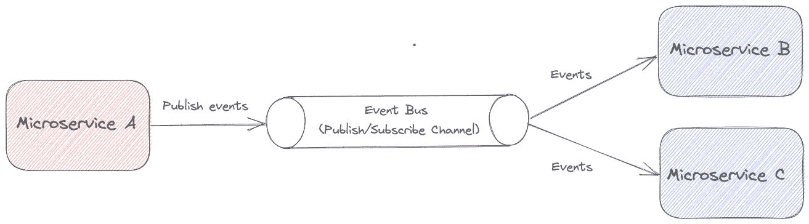
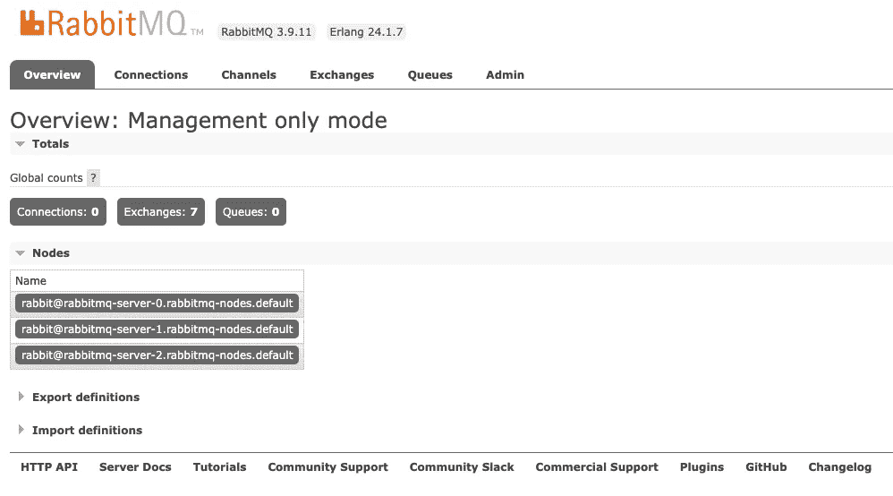

# 如何用 Kubernetes 操作符部署 RabbitMQ

> 原文：<https://betterprogramming.pub/how-to-deploy-rabbitmq-with-the-kubernetes-operators-687a2bb9f648>

## 利用 Kubernetes 运营商的力量部署您自己的 RabbitMQ 集群


汉斯·艾斯科宁 / [Unsplash](https://unsplash.com/?utm_source=ghost&utm_medium=referral&utm_campaign=api-credit) 摄影

[RabbitMQ](https://www.rabbitmq.com/) 是部署最广泛的开源消息代理。在谈论 RabbitMQ 之前，我们先定义一下什么是消息代理。简而言之，它允许应用程序和服务相互通信并交换数据。下图展示了使用消息代理的事件总线的用例:



带有消息代理(事件总线)的软件通信中心

消息代理对于分离组件之间的通信非常有用。它让你有机会创建完全分布式的现代架构。在 message broker 家族中，你可以找到其他流行的名字，比如 [Apache Kafka](https://kafka.apache.org/) 、 [Apache ActiveMQ](https://activemq.apache.org/) 。

RabbitMQ 是轻量级的，易于在内部或云中部署。它提供了有趣的功能:

*   它支持多种消息协议，如 AMQP、STOMP、MQTT 等
*   它可以部署在分布式和联合配置中，以满足高可扩展性和高可用性要求。
*   它提供了用于管理的 UI 和用于监控的 HTTP API。
*   它可以用许多可用的插件来扩展。
*   有很多编程语言实现的客户端:Python、Javascript、Java、Go、Ruby 等。

在本教程中，我们将重点介绍如何在 Kubernetes 集群中部署高可用性 RabbitMQ 集群。选择将是使用 Kubernetes 运营商来有效地实现这一目标。我们将看到使用它们的优势，以及如何一步步部署 RabbitMQ 资源。

# 为什么使用 Kubernetes 操作符？

> *“Operators 是 Kubernetes 的软件扩展，它利用* [*自定义资源*](https://kubernetes.io/docs/concepts/extend-kubernetes/api-extension/custom-resources/) *来管理应用程序及其组件。”*[*https://kubernetes . io/docs/concepts/extend-kubernetes/operator/*](https://kubernetes.io/docs/concepts/extend-kubernetes/operator/)

Kubernetes 中的操作符允许您扩展集群的行为，而无需修改 Kubernetes 本身的代码。在我们的例子中，RabbitMQ 的行为将被委托给操作者。这将为我们节省大量时间。

RabbitMQ 团队开发并维护了两个 Kubernetes 运营商:

*   *RabbitMQ Cluster Kubernetes Operator*自动化运行在 Kubernetes 上的 rabbit MQ 集群的供应、管理和操作。
*   *RabbitMQ 消息传递拓扑操作符*管理集群的拓扑(权限、用户等)

操作员通过 CRDs ( *自定义资源定义*)安装在 Kubernetes 集群中。安装后，集群中的新资源是已知的，如传统资源(Pod、部署等)。您只需创建 YAML 清单来调用它们。

# 部署 RabbitMQ 集群 Kubernetes 操作符

CRD 在[存储库版本](https://github.com/rabbitmq/cluster-operator/releases)中可用。用`kubectl`命令安装它:

```
$ kubectl apply -f "https://github.com/rabbitmq/cluster-operator/releases/latest/download/cluster-operator.yml"
```

新资源位于`rabbitmq-system`名称空间中:

```
$ kubectl get all -n rabbitmq-system
NAME                                             READY   STATUS    RESTARTS   AGE
pod/rabbitmq-cluster-operator-7cbf865f89-9pq6n   1/1     Running   4          2d21h

NAME                                        READY   UP-TO-DATE   AVAILABLE   AGE
deployment.apps/rabbitmq-cluster-operator   1/1     1            1           2d21h

NAME                                                   DESIRED   CURRENT   READY   AGE
replicaset.apps/rabbitmq-cluster-operator-7cbf865f89   1         1         1       2d21h
```

确保资源都已准备好，可以开始下一步了。

# 创建 RabbitMQ 集群

RabbitMQ 集群操作符提供了一种`RabbitmqCluster`。现在，您可以在 Kubernetes 集群中创建任意数量的 RabbitMQ 集群。您只需在 YAML 清单中定义它们，如下所示:

```
apiVersion: rabbitmq.com/v1beta1
kind: RabbitmqCluster
metadata:
  labels:
    app: rabbitmq
  name: rabbitmq
spec:
  replicas: 3
  image: rabbitmq:3.9.11
  service:
    type: ClusterIP
  persistence:
    storageClassName: hostpath
    storage: 10
  resources:
    requests:
      cpu: 256m
      memory: 1Gi
    limits:
      cpu: 256m
      memory: 1Gi
  rabbitmq:
    additionalPlugins:
      - rabbitmq_management
      - rabbitmq_peer_discovery_k8s
    additionalConfig: |
      cluster_formation.peer_discovery_backend = rabbit_peer_discovery_k8s
      cluster_formation.k8s.host = kubernetes.default.svc.cluster.local
      cluster_formation.k8s.address_type = hostname
      vm_memory_high_watermark_paging_ratio = 0.85
      cluster_formation.node_cleanup.interval = 10
      cluster_partition_handling = autoheal
      queue_master_locator = min-masters
      loopback_users.guest = false
      default_user = guest
      default_pass = guest
    advancedConfig: ""
```

让我们回顾一下上面清单的内容:

*   我们创建了一种资源`Rabbitmqcluster`。它是由我们在前一部分中安装的 CRD 定义的。
*   该集群有 3 个副本，以实现高可用性和容错。
*   每个 pod 都有明确定义的资源。
*   新增插件:管理 UI 的`rabbitmq_management`和集群形成的`rabbitmq_peer_discovery_k8s`。你可以在这里找到其他插件:[https://www.rabbitmq.com/plugins.html](https://www.rabbitmq.com/plugins.html)。
*   集群配置在`additionalConfig`字段完成:[https://www.rabbitmq.com/configure.html#config-file](https://www.rabbitmq.com/configure.html#config-file)。
*   使用的服务类型是`ClusterIP`。如果您的应用程序在集群之外，您可以配置一个`LoadBalancer`类型。
*   持久性已配置。给定的示例运行在本地 Kubernetes 集群上，因此存储类是`hostpath`。您可以查看 Kubernetes 中符合您需求的可用类:[https://Kubernetes . io/docs/concepts/storage/storage-classes/](https://kubernetes.io/docs/concepts/storage/storage-classes/)

```
$ kubectl create -f rabbitmq.yaml
$ kubectl get pods -l app.kubernetes.io/name=rabbitmq
NAME                READY   STATUS    RESTARTS   AGE
rabbitmq-server-0   1/1     Running   0          4m41s
rabbitmq-server-1   1/1     Running   0          4m41s
rabbitmq-server-2   1/1     Running   0          4m41s
```

# 部署 RabbitMQ 拓扑操作符

现在让我们来讨论 RabbitMQ 拓扑运算符。它允许您管理 RabbitMQ 特定的资源，如用户和权限，例如:[https://www . rabbit MQ . com/kubernetes/operator/using-topology-operator . html](https://www.rabbitmq.com/kubernetes/operator/using-topology-operator.html)。

该操作员需要证书管理器才能工作。部署它并确保所有 pod 都正常运行:

```
$ kubectl apply -f https://github.com/jetstack/cert-manager/releases/download/v1.3.1/cert-manager.yaml
$ kubectl get pods -n cert-manager
NAME                                       READY   STATUS    RESTARTS   AGE
cert-manager-7dd5854bb4-vt5jn              1/1     Running   0          47s
cert-manager-cainjector-64c949654c-j2npq   1/1     Running   0          47s
cert-manager-webhook-6b57b9b886-f6gwt      1/1     Running   0          47s
```

安装 CRD:

```
$ kubectl apply -f https://github.com/rabbitmq/messaging-topology-operator/releases/latest/download/messaging-topology-operator-with-certmanager.yaml
```

下面是一个清单示例，用于为来宾用户配置权限，以便使用身份验证进行测试:

```
apiVersion: rabbitmq.com/v1beta1
kind: Permission
metadata:
  name: rabbitmq-guest-permission
spec:
  vhost: /
  user: guest
  permissions:
    write: ".*"
    configure: ".*"
    read: ".*"
  rabbitmqClusterReference:
    name: rabbitmq
```

# 安装 RabbitMQ 集群操作器 Kubectl 插件

RabbitMQ 团队还提供了一个`kubectl`插件来使用 RabbitMQ 集群操作符。这个插件将自动化许多与 Kubernetes API 和 RabbitMQ 集群操作符的交互。

插件需要安装`krew`插件管理器(这里的安装是针对 MacOSX 的，查看[文档](https://krew.sigs.k8s.io/docs/user-guide/setup/install/)并适应你的操作系统)

```
(
  set -x; cd "$(mktemp -d)" &&
  OS="$(uname | tr '[:upper:]' '[:lower:]')" &&
  ARCH="$(uname -m | sed -e 's/x86_64/amd64/' -e 's/\(arm\)\(64\)\?.*/\1\2/' -e 's/aarch64$/arm64/')" &&
  KREW="krew-${OS}_${ARCH}" &&
  curl -fsSLO "https://github.com/kubernetes-sigs/krew/releases/latest/download/${KREW}.tar.gz" &&
  tar zxvf "${KREW}.tar.gz" &&
  ./"${KREW}" install krew
)
```

用`krew`的位置更新您的`PATH`环境变量:

```
$ export PATH="${KREW_ROOT:-$HOME/.krew}/bin:$PATH"
```

检查安装是否正常:

```
$ kubectl krew
```

安装 RabbitMQ 插件:

```
$ kubectl krew install rabbitmq
```

检查 RabbitMQ 插件:

```
$ kubectl rabbitmq help
```

您可以在列表中检索您的集群:

```
$ kubectl rabbitmq list                          
NAME       ALLREPLICASREADY   RECONCILESUCCESS   AGE
rabbitmq   True               True               4d20h
```

您也可以直接打开管理界面:

```
$ kubectl rabbitmq manage rabbitmq
```


RabbitMQ 管理登录界面



RabbitMQ 管理界面

# 结论

通过本教程，我们看到了使用运营商部署 Kubernetes 的优势。

它们允许 RabbitMQ 集群的透明性和供应。它自动化了大部分管理，并允许通过 YAML 清单定义 RabbitMQ 拓扑。最后，我们已经看到了如何设置 kubectl 插件来与操作者交互。