# 如何在几分钟内将 Angular 应用程序部署到 Heroku

> 原文：<https://betterprogramming.pub/how-to-deploy-your-angular-9-app-to-heroku-in-minutes-51d171c2f0d>

## 部署听起来令人生畏，但事实并非如此


由[都铎·巴休](https://unsplash.com/@baciutudor?utm_source=unsplash&utm_medium=referral&utm_content=creditCopyText)在 [Unsplash](https://unsplash.com/s/photos/angular?utm_source=unsplash&utm_medium=referral&utm_content=creditCopyText) 拍摄

[Heroku](https://www.heroku.com/) 是基于容器的云平台即服务(PaaS)。它让开发人员可以构建、交付、监控和扩展他们的应用程序，而无需担心基础设施问题。

在本帖中，我们将部署一个用版本 9 构建的 Angular 应用程序，这是目前最新的稳定版本。但是，配置与 angular 版本无关，您可以使用本教程部署旧版本或新版本。

Heroku 说:

> “我们是从创意到 URL 的最快途径。”

关于这一点，他们是对的。作为一名 web 应用程序开发人员，我有机会看到了部署应用程序的几种方法，我可以说 Heroku 是所有方法中最快的。

现在让我们开始我们的 Angular 9 项目，并为部署做好准备。你可以点击这篇文章底部的 repo 链接来获得部署就绪项目。

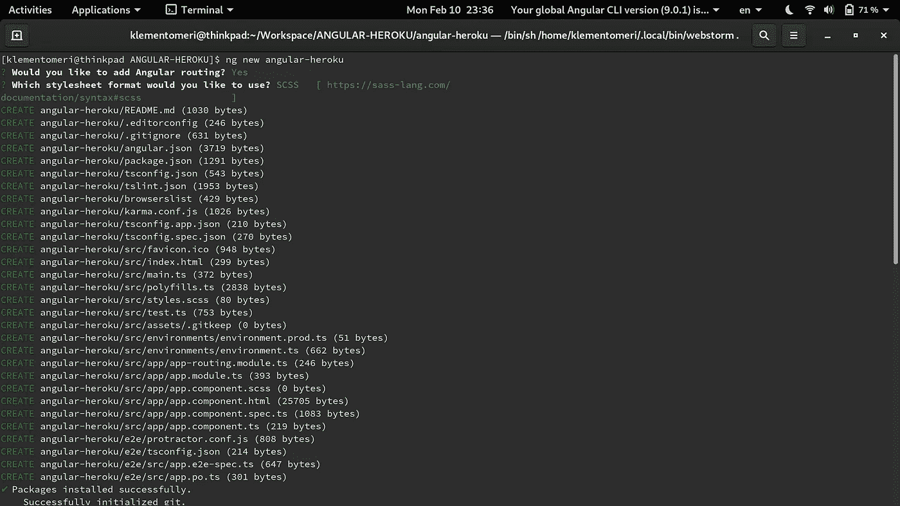

我们使用最新的 CLI 启动了一个新的 Angular 应用程序。这是我们得到的结果:

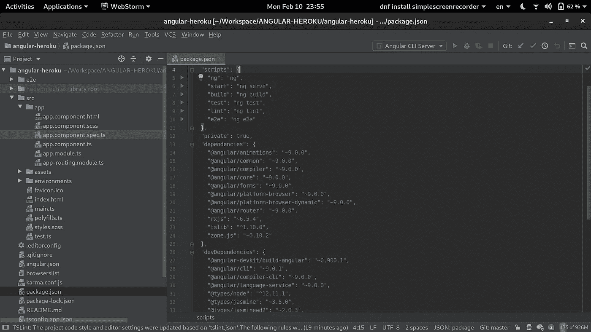

让我们运行`ng serve`以确保我们的应用程序正常。

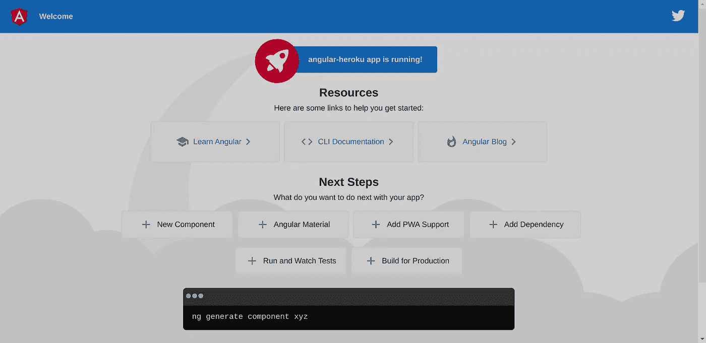

应用程序是好的，所以现在让我们把重点放在部署上。我们现在需要做的是知道我们能对 Heroku 做什么，以及如何去做。

# 入门指南

第一步是在 Heroku 中创建新的应用程序。因此，一种简单的方法是转到您的仪表板，使用为此创建的 UI。

点击右上角的“创建新应用”。

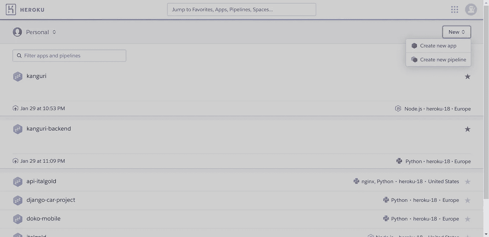

让我们为我们的应用程序命名，选择地区，然后单击“创建应用程序”。

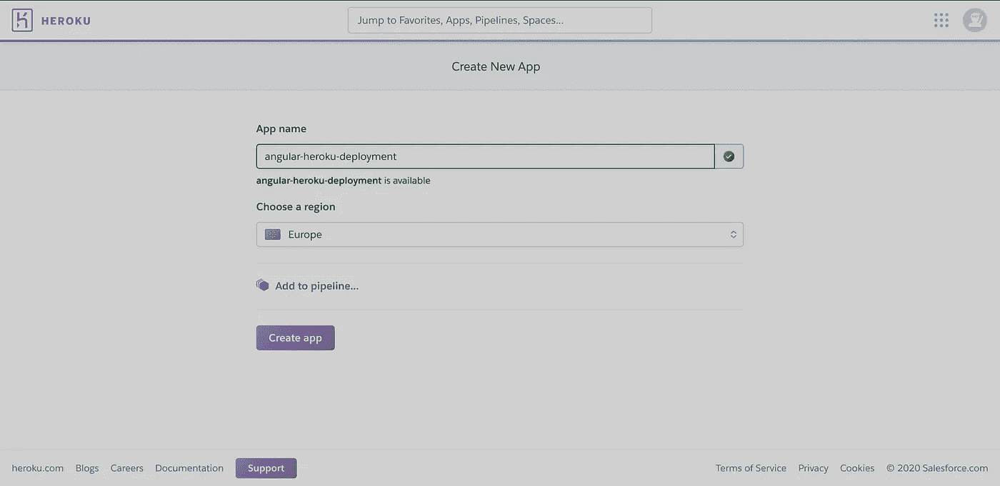

我们将被重定向到如下页面，该页面向我们展示了如何部署的选项。选项包括:

*   Heroku Git
*   GitHub 集成
*   集装箱登记处

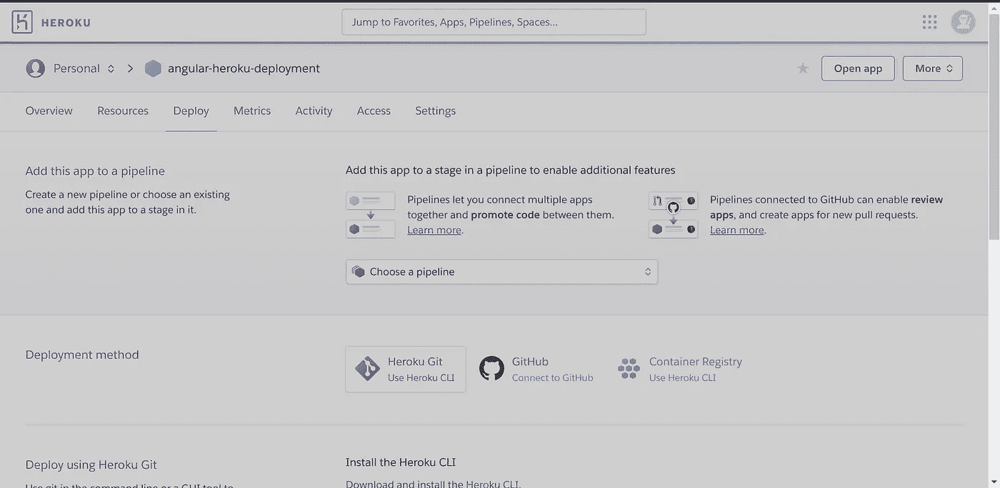

在本帖中，我们将使用 *Github 集成*。在 GitHub 上为我们的应用程序创建了存储库之后，我们就可以开始了。点击 Github 选项，搜索我们的回购。

Heroku 找到我们的回购后，我们只需点击*连接*按钮，将回购与 Heroku 连接。这将帮助我们在每次推送至主分支时进行自动部署。

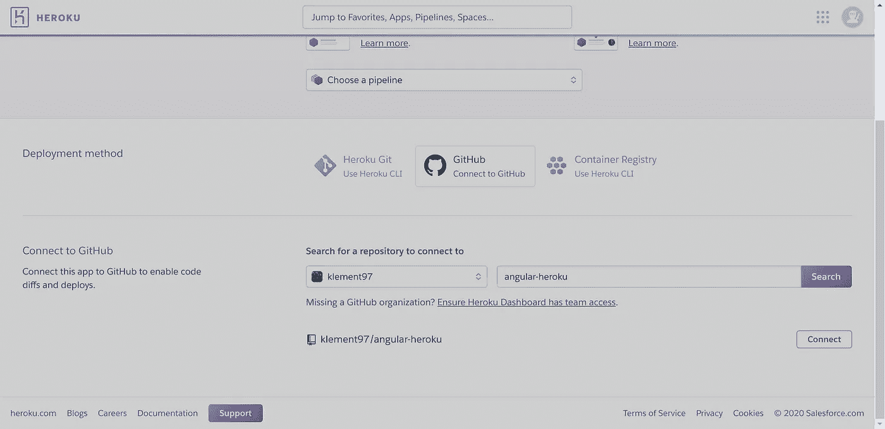

连接建立后，您将看到这样一个页面。我们在这里看到的是，我们可以从一个分支中选择“启用自动部署”选项。如果那是你想要的，你所需要做的就是点击那个按钮。

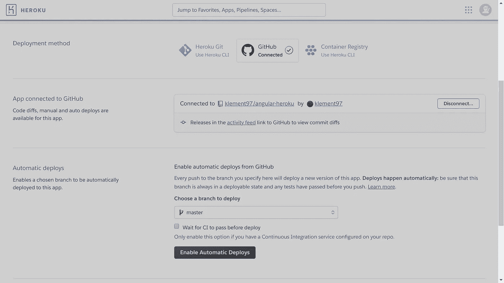

现在，我们已经用一个可用的应用程序创建了我们的 repo，将它连接到 Heroku，并启用了自动部署。因此，每次我们向我们的主分支推送时，Heroku 都会为我们启动一个部署流程。

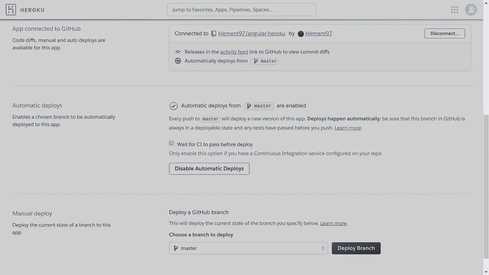

现在一切都好了，我们所需要的只是一些部署配置和对 GitHub 的提交和推送。让我们从这些配置开始。

现在，Heroku 擅长的是他们的 buildpack 概念。基本上，要将您的应用程序从本地主机带到一个真实的 URL，您需要向远程机器发出一些指令来执行发布和部署。

## 我们需要告诉机器的是

1.  安装我们的依赖项。
2.  对我们的应用程序进行生产构建。
3.  在 Heroku 上部署我们的生产版本。
4.  部署后，为我们的 dist 文件夹提供服务。
5.  在给定的 URL 上启动生产。

谢天谢地，Heroku 已经有了一个 buildpack，它可以告诉机器做我们需要的事情，它叫做**node . js build pack*。我们所要做的就是帮助构建包一点点。*

*首先，我们的应用程序需要一个服务器，我们将要使用的是 Express server，这是一个轻量级服务器，可以帮助我们为应用程序提供服务。*

*让我们安装它。*

```
*npm i express --save*
```

*现在我们需要一个 JS 中的脚本来告诉 Express 做什么。*

*在项目的根目录下创建一个文件。我喜欢叫它`server.js`。*

*这里需要更改的只是应用程序的名称。它必须与您的`package.json`中的`name`属性相同。*

*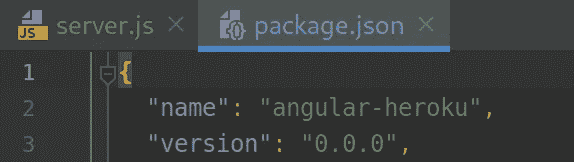*

*这里需要注意的重要一点是，`server.js`文件必须在项目的*根目录*下。*

# *我们在 server.js 文件中做什么？*

*基本上说，在`[server.js](https://github.com/klement97/angular-heroku/blob/master/server.js)`文件中，我们正在做的是使用 Express 服务器来:*

1.  *将所有流量从 http 重定向到 https。*

```
*function requireHTTPS(req, res, next) {
    // The 'x-forwarded-proto' check is for Heroku
    if (!req.secure && req.get('x-forwarded-proto') !== 'https') {
        return res.redirect('https://' + req.get('host') + req.url);
    }
    next();
}const ***express*** = require('express');
const app = ***express***();
const app = ***express***();
app.use(requireHTTPS);*
```

*2.为我们的静态文件服务。*

```
*app.use(express.static(’./dist/**<name-on-package.json>**’));*
```

*3.等待任何路径的请求，并将所有请求重定向到`index.html`。*

```
*app.get(’/*’, function(req, res) {
  res.sendFile(’index.html’, {root: 'dist/**<name-on-package.json>**/’}
);
});*
```

*角度路由器将根据用户请求的路径来处理应该向用户显示哪个组件。*

*4.在由`env`变量指定的`PORT`或默认的 Heroku 端口(8080)监听请求。*

```
*app.listen(*process*.env.PORT || 8080);*
```

# *测试一切正常*

*在 heroku 中测试脚本是否一切正常的一个很好的技巧是在本地运行它，这样如果有任何错误，我们可以节省一些时间。运行 ***ng build — prod*** 之后，我们可以在终端中做一些非常简单的事情:*

*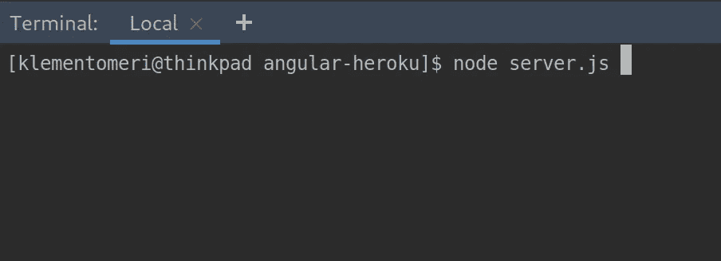*

*`node server.js`命令将运行`server.js`文件中的内容，我们可以在将文件部署到 Heroku 之前检查它是否有问题。*

*注意，我的工作目录是我的项目的根目录，我的`server.js`文件就在那里。*

*之后，我们可以转到 [localhost:8080](/localhost:8080) 并查看从 dist 文件夹提供的应用程序。*

*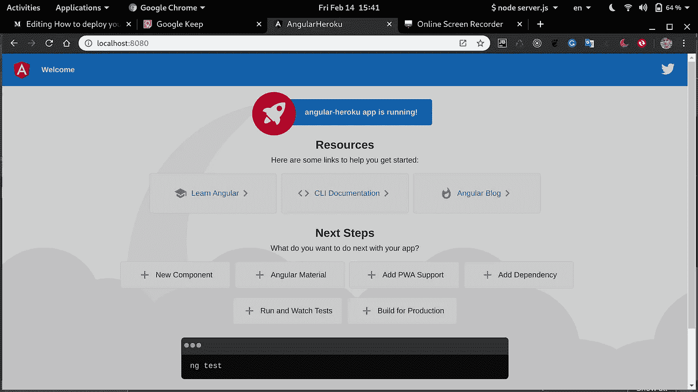*

# *Package.json*

*现在我们已经确定文件工作正常，让我们继续在`package.json`中进行所需的更改。*

*将开始脚本更改为`node server.js`。*

*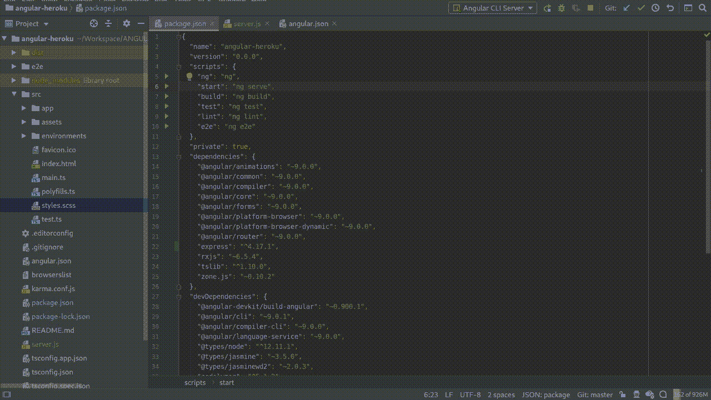*

*因此，我们不想使用`ng serve`命令，因为它仅用于开发，我们需要一个真正的服务器用于我们的生产环境。*

*将构建脚本更改为`ng build --prod`*

*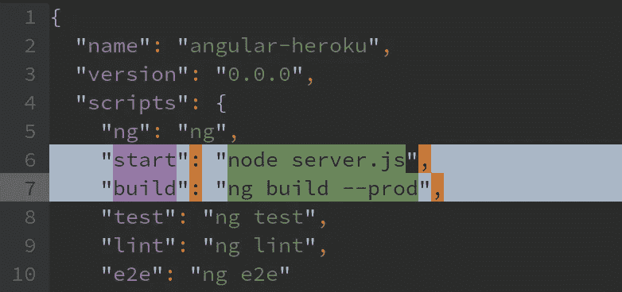*

*package.json*

*这里需要注意的是，您只需要在您的生产环境中进行这种更改，这意味着只在主分支上进行，否则，我们将在每次运行启动脚本时都运行 Express 服务器。*

# *结论*

*仅此而已。我们已经完成了在 Heroku 的首次部署。现在，我们将对 Heroku 进行提交和推送，以触发部署。*

*如果您尚未选择自动部署，您需要做的是进行推送，然后转到页面末尾的 Heroku Dashboard >选择您的应用程序>部署>部署分支。*

*部署过程如下所示:*

*节点构建包的 Heroku 构建阶段*

*如果构建过程已经成功，你的应用程序在 Heroku 给定的域上启动，访问它以确保一切正常。*

*正如你在下面看到的，我们的应用现在由 Heroku 托管和服务。 [Angular-Heroku app](https://angular-heroku-deployment.herokuapp.com/) 。*

**

*现在，我们完成了部署过程，我们的应用程序已经上线。在我的第一次尝试中，我花了大约四个小时来处理我遇到的所有错误，并进行我的第一次成功部署。不要让失败阻止你上线你的应用。*

# *奖金*

*如果你正面临 Heroku H10-App 崩溃错误，那么这可能是你的脚本和配置有问题的迹象。本文[这里](https://dev.to/lawrence_eagles/causes-of-heroku-h10-app-crashed-error-and-how-to-solve-them-3jnl)可以帮你解决这个问题。*

# *资源*

*   *[我的 GitHub 回购本文](https://github.com/klement97/angular-heroku)*
*   *[Heroku H10-App 崩溃错误的原因](https://dev.to/lawrence_eagles/causes-of-heroku-h10-app-crashed-error-and-how-to-solve-them-3jnl)*

*请随意问我任何问题，我很乐意回答你的问题。*

*感谢阅读。*