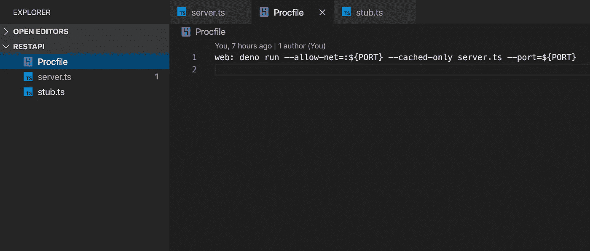
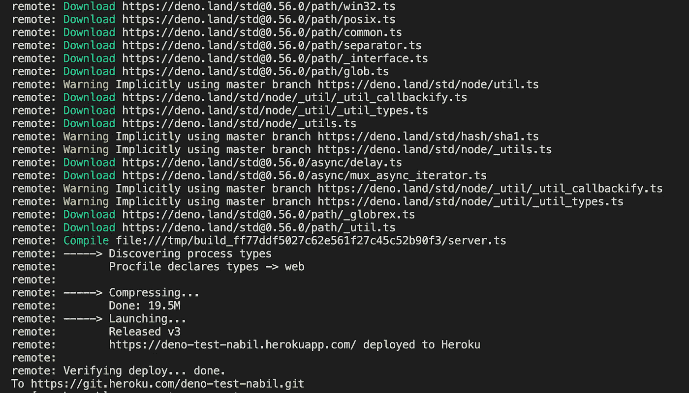

# 如何部署您的第一个 Deno 应用程序

> 原文：<https://betterprogramming.pub/how-to-deploy-your-first-deno-app-998b50089fd6>

## 在不到五分钟的时间内将您的第一个 Deno 应用程序上线


背景图片由 [Leone Venter](https://unsplash.com/@fempreneurstyledstock?utm_source=unsplash&utm_medium=referral&utm_content=creditCopyText) 在 [Unsplash](https://unsplash.com/s/photos/coffee-desk?utm_source=unsplash&utm_medium=referral&utm_content=creditCopyText) 上拍摄。

Deno 已经进入了开发者社区，与它的前身(花了一段时间才起步)不同，它正在掀起波澜。互联网上已经充斥着将它与 Node.js 进行比较的文章，有些人甚至说 Node 已经永远消亡了。好吧，我不想跳进这个讨论，但德诺是在这里停留。

尽管人们开始在生产中使用它以及流行的云提供商开始为 Deno 提供开箱即用的运行时还需要一段时间，但这并不意味着我们不能开始尝试所有的新功能。所以这里有一篇文章解释了如何将 Deno 应用程序部署到 Heroku 项目中。让我们跳进来。

# 1.创建您的 Deno 应用程序

在这个项目中，我们将使用一个非常简单的 Deno 应用程序，它包含一个单独的`get` API，返回一组样本待办事项。`server.ts`的代码很像样板文件，但是让我们浏览一下与 Heroku 项目相关的代码行:

*   第 3 行:我们正在为 Deno 导入一个命令行参数解析器，我们将使用它来传递端口号。
*   第 7 行:我们将运行时从 CL 传递的参数存储在这个常量中。
*   第 8 行:我们定义了一个默认端口，以防我们的参数没有定义。
*   第 9-10 行:我们从 Deno 命令传递的参数中检索端口值，检查它是否未定义，并将其分配给应用程序使用的端口变量。

剩下的就很简单了。如果您对端口变量感到困惑，请稍等。一会儿就说得通了。

# 2.创建 Heroku 应用程序

Heroku 是一个平台即服务(PaaS ),使开发人员能够完全在云中构建、运行和操作应用程序。完全免费使用。由于这是一个 Heroku 教程，我将从基础开始。如果你已经知道如何连接 Heroku 应用程序，你可以跳到最后一节。

*   在 [Heroku](https://www.heroku.com/) 上创建一个账户。
*   如果您还没有安装 Heroku CLI ，请在您的系统上安装。
*   从您的终端运行`heroku login`来授权您的 Heroku 帐户。
*   从项目文件夹中的终端运行`heroku create <app-name>`。这将创建一个 Heroku 应用程序，并将其连接到一个 Heroku git 遥控器。
*   这可能是本教程中最重要的命令。创建应用程序后，在命令行中运行
    `heroku buildpacks:set [https://github.com/chibat/heroku-buildpack-deno.git](https://github.com/chibat/heroku-buildpack-deno.git)`。

最后一步，我们配置我们的应用程序使用第三方的 Deno buildpack，因为正式的 Deno build pack 在 Heroku 中还不可用。

# 3.创建 Procfile

现在，在项目的根目录下，创建一个名为`Procfile`的文件，没有任何扩展名。这是一个指定 Heroku 应用程序在启动时执行的命令的文件。在 Procfile 中添加这一行代码:

```
web: deno run --allow-net=:${PORT} --cached-only server.ts --port=${PORT}
```

这里，除了 Deno `run`命令，我们还添加了`PORT` 变量，该变量将包含 Heroku dynos 为您的应用程序绑定的动态端口。

这非常重要，因为 Heroku 不允许我们在代码中定义端口。



这是示例项目结构的样子。

# 4.向 Heroku 推进

现在你的应用程序被配置为在 Heroku 上运行，你所要做的就是提交所有文件并从命令行运行`git push heroku master`。成功部署后，您将在命令行中看到如下消息:



部署 Heroku 应用程序

现在只需导航到消息末尾给出的 Heroku 应用程序 URL，然后是您的 API 端点，您将能够看到您的响应。如果你想监控你的应用程序的实时日志，你可以从你的命令行这样做。只需打开一个新的命令行实例并运行命令`heroku logs — tail`。

# 结论

您可以在 [GitHub 资源库](https://github.com/nabilnalakath/deno-heroku)中找到完整的源代码。特别感谢 [Chibat](https://github.com/chibat/) 创造了 Heroku Deno buildpack。