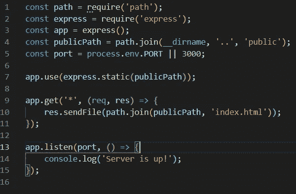

# 如何将 React 应用部署到 Heroku

> 原文：<https://betterprogramming.pub/how-to-deploy-your-react-app-to-heroku-aedc28b218ae>


[胖子 Bytyqi](https://unsplash.com/@fatosi?utm_source=medium&utm_medium=referral) 在 [Unsplash](https://unsplash.com?utm_source=medium&utm_medium=referral) 上的照片

因此，您开始使用[C](https://github.com/facebook/create-react-app)reate React App 开发您的第一个 React 应用程序，并且您已经到了最终部署您的应用程序的开发阶段。如果您选择的工具是 Heroku，您可能会做一些研究，并意识到关于这个主题的文档包含的信息很少。因为我最近在构建自己的 React 应用程序时遇到了类似的情况，所以我想我应该充实一下我所经历的步骤，以便完成这项工作。

我将从一开始就提到，我决定采用 use-a-simple-Express-server 的方式，因此如果您喜欢其他方式，您可能会在 [React 部署文档](https://create-react-app.dev/docs/deployment)中找到有用的文档。

# 步骤 1:创建您的 React 应用程序(如果您还没有)


[反应](https://reactjs.org/)标志

如果您正在阅读这篇文章，您很可能已经有了一个正常运行的 React 应用程序。但是如果你没有，你只是想经历整个过程(从创建它到部署它)，我将从创建一个非常基本的 React 应用程序所需的步骤开始。

1.  确保您已经安装了 [Node.js](https://www.google.com/url?sa=t&rct=j&q=&esrc=s&source=web&cd=1&cad=rja&uact=8&ved=2ahUKEwjj7JrN3IrkAhXRI1AKHZGzDe8QFjAAegQICRAC&url=https%3A%2F%2Fnodejs.org%2F&usg=AOvVaw1tY2p-vJFWJmxWlq4sTxCn) 和 [npm](https://www.google.com/url?sa=t&rct=j&q=&esrc=s&source=web&cd=1&cad=rja&uact=8&ved=2ahUKEwihgb7U3IrkAhVGalAKHRHJCLwQFjAAegQIBxAC&url=https%3A%2F%2Fwww.npmjs.com%2F&usg=AOvVaw3X687KpYu1DK9666uZ55b8) 。
2.  打开您选择的终端，通过用您的应用程序的名称替换`my-app`来运行下面的命令。

```
npx create-react-app my-app
```

3.该过程完成后，将目录(cd)切换到为您的应用程序创建的文件夹，并启动开发服务器快速预览您创建的内容。

```
cd my-app
npm start
```

4.将您的代码推送到 Github。我假设您已经知道如何做到这一点，所以我不会深入这些细节。

# 步骤 2:创建 Express 服务器

在项目的根目录下，创建一个名为“server”的新文件夹(例如)，并在其中添加一个名为“server.js”的文件。

我用来创建服务器的工具叫做 [Express](https://www.google.com/url?sa=t&rct=j&q=&esrc=s&source=web&cd=1&cad=rja&uact=8&ved=2ahUKEwjEkYS13orkAhUCZ1AKHbIeDwkQFjAAegQIBhAC&url=https%3A%2F%2Fexpressjs.com%2F&usg=AOvVaw2dzc6U9bu173R4s1d9BYhT) ，这是一个很棒的用 Node 创建 web 服务器的工具。为了学习这个工具，你可以浏览网上的许多教程，但是在我们的例子中，你只需要写几行代码就可以生成你自己的服务器。

所以让我们开始吧！

1.  安装最新版本的 Express。

```
npm install express --save
```

2.导入 Express，并创建一个新的 Express 实例。

```
const express = require('express');
const app = express();
```

3.告诉 Express 提供公共文件夹和其中的所有内容。

```
**const path = require('path');**
const express = require('express');
const app = express();**const publicPath = path.join(__dirname, '..', 'public');****app.use(express.static(publicPath));**
```

基本上，我们传入路径的所有部分，然后`path.join`将它们放在一起。然后将结果传递到`app.use(express.static())`中，这样 Express 就会知道应该提供哪些文件。

4.通过告诉服务器使用哪个端口来启动服务器。我在本地环境中使用端口 3000；但是，Heroku 会在部署后为您的应用程序分配一个端口，因此这两种情况都应该包括在内。

```
const path = require('path');
const express = require('express');
const app = express();
**const port = process.env.PORT || 3000;**
const publicPath = path.join(__dirname, '..', 'public');app.use(express.static(publicPath));**app.listen(port, () => {
   console.log(`Server is up on port ${port}!`);
});**
```

5.确保您的`index.html`文件被提供，以防用户请求当前不在*公共*文件夹中的资源。

```
const path = require('path');
const express = require('express');
const app = express();
const publicPath = path.join(__dirname, '..', 'public');
const port = process.env.PORT || 3000;app.use(express.static(publicPath));**app.get('*', (req, res) => {
   res.sendFile(path.join(publicPath, 'index.html'));
});**app.listen(port, () => {
   console.log('Server is up!');
});
```

此时，如果一切顺利，您应该能够在本地测试您的服务器，以确保一切设置正确。然后你就可以在 Heroku 进行实际部署了。

为了做到这一点，您只需要通过运行`npm run build`来创建您的生产构建。然后转到您的终端并运行`node server/server.js`，这将启动您的服务器，使您的应用程序可以在 [http://localhost:3000 上使用。](http://localhost:3000.)

这基本上是您的服务器文件应该包含的所有内容:



# 步骤 3:在 Heroku 上部署


[Heroku](https://brand.heroku.com/) 标志

1.  如果您还没有 Heroku 帐户，请在此创建一个[。](https://signup.heroku.com/)
2.  同样，如果你还没有这个，安装`heroku-cli`。更多细节请点击。
3.  转到您的终端，运行`heroku login`并在提示时输入您的凭证，登录 Heroku。
4.  通过在终端中运行以下命令来创建 Heroku 应用程序(当然，用您自己的应用程序名称替换`my-app`)。

```
heroku create my-app
```

此时，您的应用程序应该有两个 Git 遥控器:原始的和 Heroku 创建的。为了检查这一点，只需运行`git remote`。

5.当 Heroku 启动您的应用程序时，它将尝试运行您的`package.json`中的启动脚本。因此，该脚本应改为:

```
"start": "node server/server.js"
```

6.将您的代码推送到 Heroku 远程存储库。

```
git push heroku master
```

就是这样！您的 React 应用程序现在应该部署到 Heroku 了！

你可以通过运行`heroku open`直接从终端打开它。

# 就这些了，伙计们！

请让我知道，如果你尝试这样做并遇到任何麻烦，或者如果我在这里写的任何东西不清楚或不容易理解。我总是乐于接受反馈。