# 如何免费部署您的静态站点

> 原文：<https://betterprogramming.pub/how-to-deploy-your-static-sites-for-free-aeeb3d3ff0f6>

## 使用 Netlify 和 Buddy 的快速教程


西蒙·佩莱格里尼在 [Unsplash](https://unsplash.com/?utm_source=unsplash&utm_medium=referral&utm_content=creditCopyText) 上的照片

对于本教程，我将使用 React 和 Gatsby，因为它支持一些开箱即用的非常棒的特性(如 GraphQL、图像压缩和渐进式 web 应用程序)。然而，你可以使用任何你喜欢的东西:

*   [Gridsome](https://gridsome.org/) —使用 Vue.js。
*   Nextjs —使用 React，甚至支持服务器端渲染和 AMP 页面。

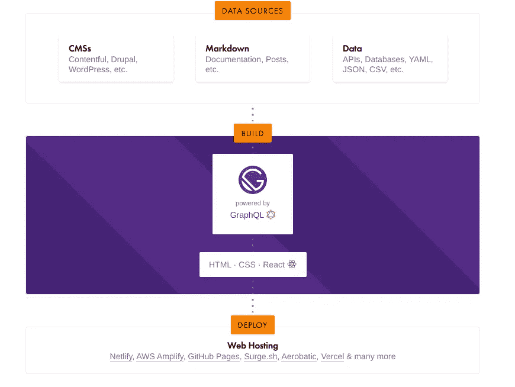

一个基本的 React 博客。

首先，您需要安装`gatsby-cli`并创建一个基本项目:

```
npm i -g gatsby-cli
gatsby new my-blog [https://github.com/gatsbyjs/gatsby-starter-blog](https://github.com/gatsbyjs/gatsby-starter-blog)
cd my-blog
```

如果您想在本地运行项目，请使用`npm start`。这将在`8000`港启动您的项目:

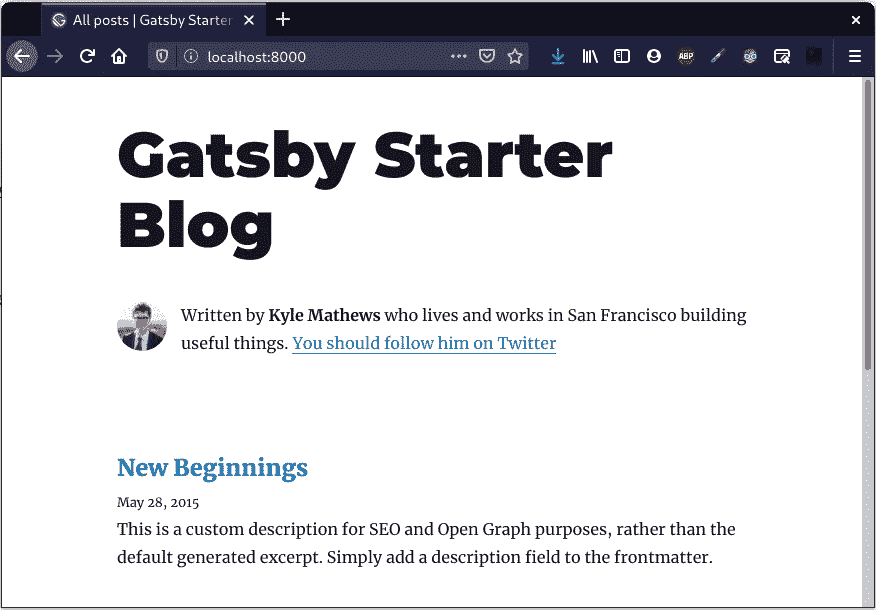

你可能想对它做一些修改，然后将项目上传到 GitHub 你可以在这里找到我的[的链接。](https://github.com/d0minikt/blog-tutorial)

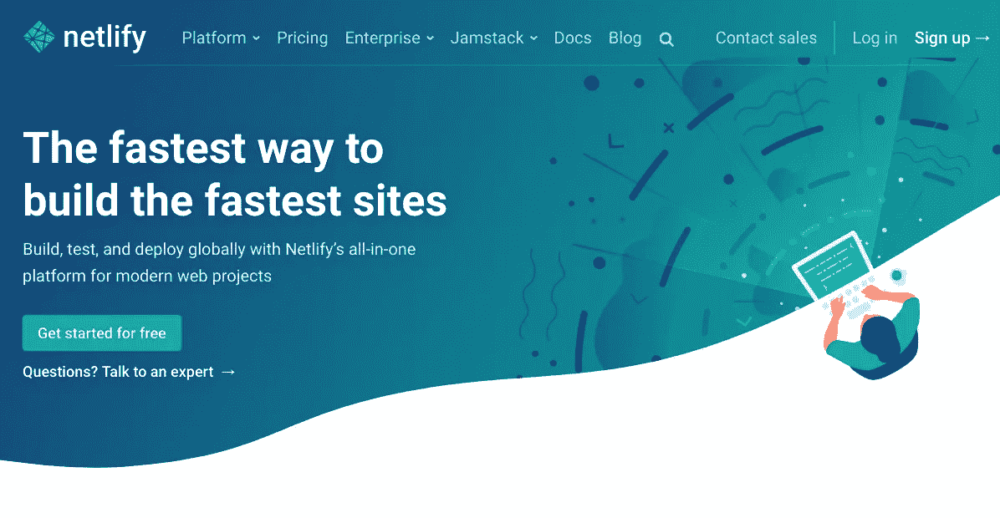

[https://netlify.com](https://netlify.com)

# 网络生活

你可以在 [Netlify](https://netlify.com) 上免费建立和托管你的静态站点，尽管如果你确实需要一些更好的特性(比如提交表格、分析等等)。)你需要支付 9 美元/月的费用。

登录后，创建一个新项目并选择您的 Git 存储库。它会要求您输入用于构建项目的命令；您需要指定以下内容:

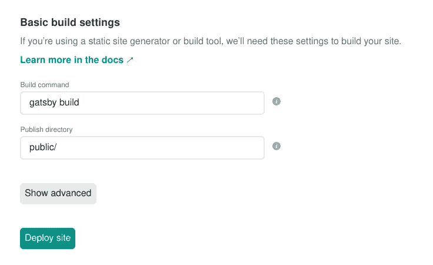

完成后，点击“部署站点”。它会为你生成一个随机的 URL，就像[这个](https://goofy-mahavira-27ba58.netlify.app/)。

耶！所以您已经部署了您的静态站点！不仅如此，每当您将更改推送到存储库时，它还会重新构建自己。

# 网络生活的替代品

Netlify 可能是一个简单的、一体化的解决方案，可以用来托管静态站点，但是一旦你开始考虑对你的站点做一些小的调整，它就过时了。

如果你的网站也有一个用 Go、Java、Nodejs、Python 或你选择的任何其他语言编写的后端会怎么样？

您不能将它部署到 Netlify，因为它只能托管静态站点。

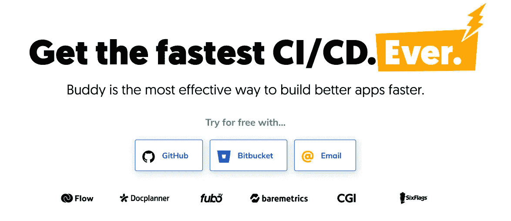

[https://buddy.works](https://buddy.works/?utm_source=medium&utm_medium=referral&utm_campaign=dt1_rp)

# 好朋友

我个人用 [Buddy](https://buddy.works/?utm_source=medium&utm_medium=referral&utm_campaign=dt1_rp) 部署自己的站点。这是什么？

Buddy 是一个交付自动化平台，可以让你在 Git 上构建、测试和部署 web 项目。你可以使用任何你喜欢的语言和框架，并把它部署到你能想到的任何托管服务上。

巴迪也有一个相当慷慨的免费层，他们都声称自己很快，所以让我们看看哪个更快。首先，我将创建一个新项目并链接我的 GitHub 存储库。

Buddy 自动识别出我们在用 React，会自动选择 Node.js Docker 图片。

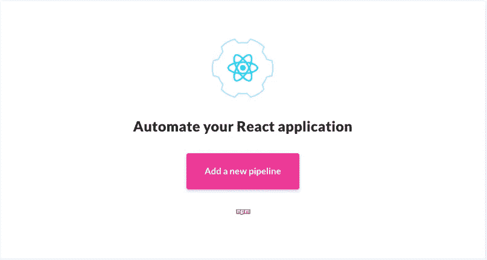

当添加管道时(简单地说，就是由`git push`触发的一系列动作)，我们可以指定如何构建应用程序:

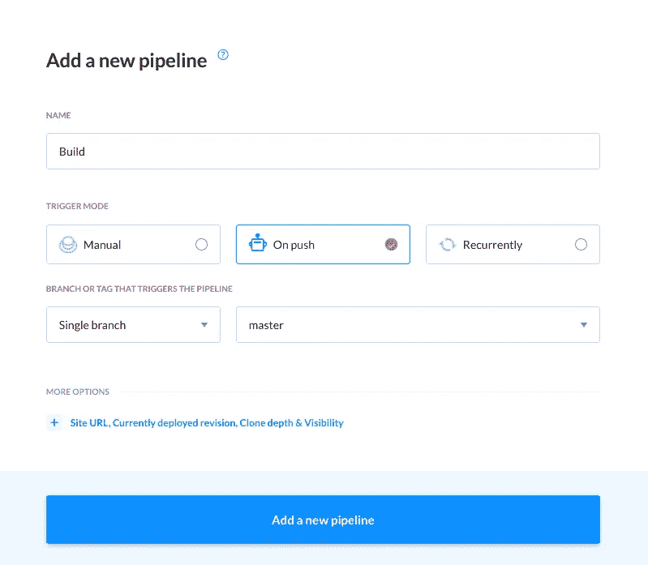

如您所见，也有用于应用程序构建的服务器端解决方案，您甚至可以通过指定要使用的 Docker 映像来添加自己的定制解决方案。

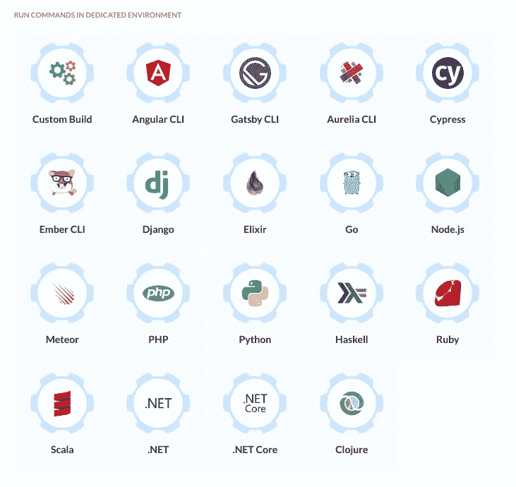

选择 Gatsby CLI

您需要确保运行`npm install`然后运行`gatsby build`来构建您的应用程序:

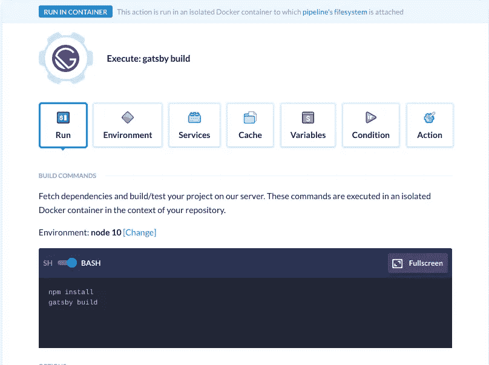

现在，您需要指定网站将如何托管。有许多自定义选项，包括数字海洋、Azure、Google Cloud 和 AWS。

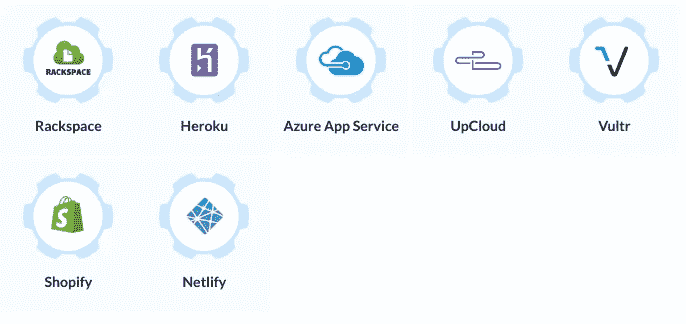

为了简单起见，因为我们不需要托管服务器，所以我将使用 Netlify 托管它:

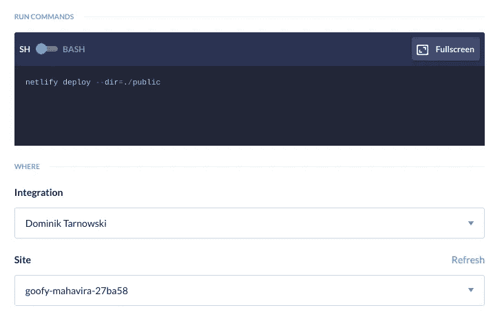

您需要指定输出目录，在本例中是。/public "

当您的构建脚本失败时，您还可以添加自定义挂钩。例如，我让它在未能完成任何任务时向我发送一封包含错误日志的电子邮件:

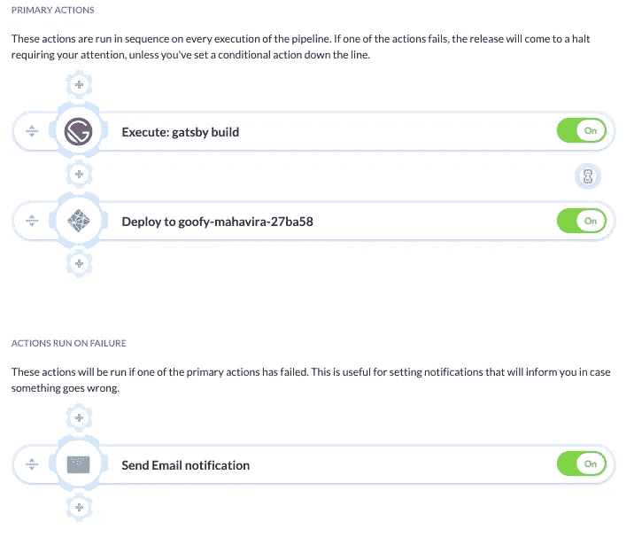

# 构建性能比较

下面是构建同一个项目所需的时间:

*   **Netlify:** 1m 35s
*   **好友:** 36s

我还决定将我的[个人博客](https://tdom.dev)(用 Gridsome 构建)切换到 Buddy，看看构建时间如何变化:

*   **网络寿命:** 2m 25s
*   **好友:** 35s

# 结论

现在，你几乎可以在任何地方免费托管你的静态站点，使用 CI/CD 服务，比如 Buddy，可以让你不必手工构建和上传它；相反，您所做的只是推送您的 Git 存储库。如果你愿意每月花费几美元，你甚至可以用数据库托管你自己的服务器，并在你做`git push`的时候运行单元测试，这样你就不会不小心搞乱你的生产环境。

我目前正致力于建立一个简单的电子邮件订阅服务，可以用于静态博客订阅。如果你想了解我将如何集成它(提示:CI/CD HTTP GET request on push)以及如何在你自己的博客上使用它，请跟我来。

另外，帮你自己一个忙，把你的站点放在一个自定义域名上。例如，如果你使用`netlify.app`下的一个网站，不仅它看起来不专业，而且你也限制了自己只能使用一个服务。域名便宜；谷歌提供的域名起价为 10 美元，价格不会逐年上涨。

*   [Netlify](https://netlify.com)
*   [哥们儿](https://buddy.works/?utm_source=medium&utm_medium=referral&utm_campaign=dt1_rp)