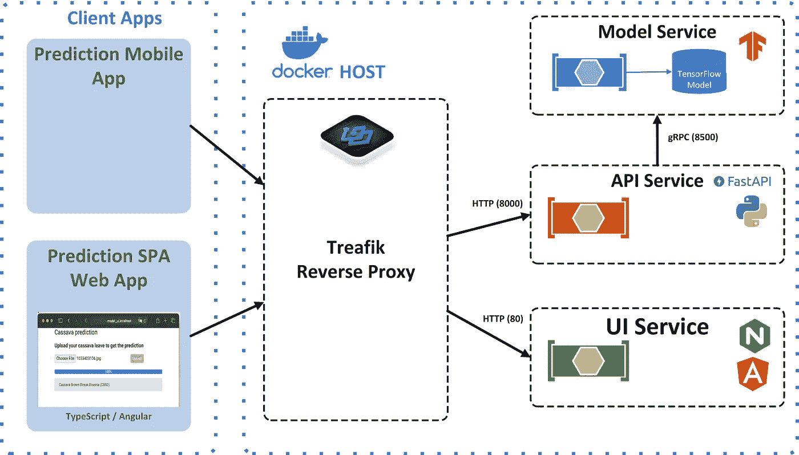
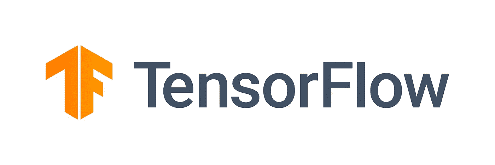
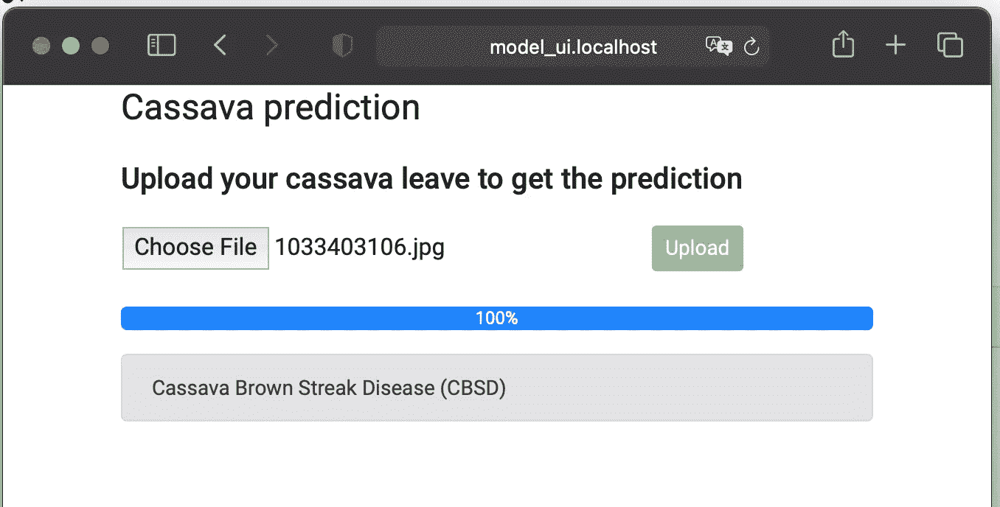
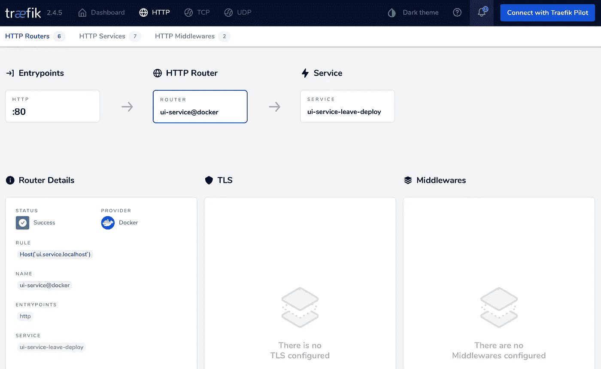

# 如何在生产环境中部署 TensorFlow 模型

> 原文：<https://betterprogramming.pub/how-to-deploy-your-tensorflow-model-in-a-production-environment-23a9572e94d3>

## 使用 TensorFlow 服务、Python、Traefik、FastAPI 和 Docker 创建稳定的预测引擎


照片由 [Pexels](https://www.pexels.com/photo/person-looking-at-phone-and-at-macbook-pro-1181244/?utm_content=attributionCopyText&utm_medium=referral&utm_source=pexels) 的 [Christina Morillo](https://www.pexels.com/@divinetechygirl?utm_content=attributionCopyText&utm_medium=referral&utm_source=pexels) 拍摄。

如果你一直在关注的[，你就会知道我一直在忙着建立一个深度学习模型。有了这个模型，木薯农民可以检测出作物上的疾病。农民给他们怀疑有问题的木薯拍了张照片。然后，应用程序显示疾病的类型，以便农民可以采取适当的措施。](https://towardsdatascience.com/increase-the-accuracy-of-your-cnn-by-following-these-5-tips-i-learned-from-the-kaggle-community-27227ad39554)

为了在农民的手机上获得应用程序，我们必须将这个 [TensorFlow](https://www.tensorflow.org/) 模型转换成实际的应用程序。我将把应用程序分成四个不同的服务。这些服务将在 Docker 容器中运行。选择 Docker 的原因应该很清楚:Docker 容器是任何基于服务器的应用程序的标准部署单元。

我将在本文中解释这四种服务背后的基本原理以及它们是如何交互的。下图显示了最终的架构:



解决方案的架构。作者照片。

每个服务的源代码和 Dockerfile 都可以在 [GitHub](https://github.com/PatrickKalkman/leave-deploy) 上获得。在文章的最后，我将告诉您如何让服务在您的本地工作站上运行。

但是首先，我们将讨论服务的细节以及如何将它们转换成 Docker 容器。

# 模特服务

谷歌开发了一个特殊的模块，用于在生产环境中服务 TensorFlow 模型，称为 [TensorFlow Serving](https://www.tensorflow.org/tfx/guide/serving) 。因此，我们的模型服务将使用 TensorFlow 服务。



图片来自 [TensorFlow](https://www.tensorflow.org/) 。

在训练期间，我们以 h5 格式保存我们的模型。这种格式将模型和权重包含在一个文件中。但是，我们不能使用带 TensorFlow 服务的 h5。我们必须将其转换为 SavedModel 格式。

您可以使用以下 Python 脚本将 h5 文件转换为 SavedModel 格式:

将 TensorFlow H5 格式文件转换为 SavedModel 格式

在第 4 行，我们为 SavedModel 构造了导出路径。有了路径中的`1`,我们将这个模型版本化。

一旦我们有了 SavedModel 格式的模型，我们就可以开始使用 TensorFlow 服务了。

我们将使用 TensorFlow 团队为我们创建的 [TensorFlow 服务 Docker](https://hub.docker.com/r/tensorflow/serving) 容器。注意，这个容器有多个版本(一个使用 GPU，另一个用于 CPU)。我们将使用最新版本的 CPU。

我们使用 CPU 而不是 GPU 版本，因为 GPU 版本需要一个特殊的 Docker 插件。这使得容器依赖于 Docker 安装，这是不希望的。

## 用于创建模型服务的 docker 文件

我们没有直接使用 TensorFlow 服务 Docker 映像，而是创建了一个包含我们的模型的 Docker 映像。docker 文件为模型服务创建图像。

用于创建自定义 TensorFlow 服务图像的 docker 文件

在使用 TensorFlow 服务图像时，我注意到它不能正确处理默认的信号处理程序。

这意味着当你试图用 ctrl-c 停止正在运行的容器时，它不会停止。发生的情况是 Docker 会等待十秒钟(默认超时)等待一个应用程序响应。如果你的应用在这段时间内没有响应，它会停止容器。

你可以做的是将[天尼](https://github.com/krallin/tini)添加到你的 Docker 图片中。我在 Dockerfile 的第 3-6 行就是这么做的。Tini 然后确保它正确地处理默认的信号处理程序，比如 SIGTERM，这样您就不必等待十秒钟。

## 用于创建 Docker 图像的脚本

我总是使用一个小的助手脚本来构建 Docker 映像。该脚本创建并标记图像:

使用 BASH 构建模型服务 Docker 映像

我还创建了一个在 Windows 上运行的 PowerShell 脚本:

使用 PowerShell 构建模型服务映像

# API 服务

我创建了 API 服务，因为我不希望 web 或移动应用程序直接与模型服务对话。这有两个原因:

*   模型服务的输入和输出特定于 TensorFlow 和模型。我不希望 web 或移动应用程序了解这些格式。
*   TensorFlow Serving 提供的 REST 接口并不支持所有 TensorFlow 数据结构。比如`[DT_HALF](https://github.com/tensorflow/serving/pull/1753)` [不支持](https://github.com/tensorflow/serving/pull/1753)。gRPC 接口确实支持所有的数据结构，但是我确实想在 web 或移动应用程序中使用 HTTP REST。

API 服务公开了一个 REST 接口。这个 REST 接口有一个方法，它接受图像(jpg 或 png ),并通过 gRPC 将其发送给模型服务。然后，模型服务生成预测并将其返回给 API 服务。API 服务将预测转换成 JSON 并返回给调用者。


图片来自 [FastAPI](https://fastapi.tiangolo.com/) 。

我使用 Python 和 [FastAPI](https://fastapi.tiangolo.com/) 实现了预测服务。FastAPI 是一个现代的高性能 web 框架，用于使用 Python 构建 API。

下面实现了`predict`功能。当您在`/predict/image`端点上执行 HTTP POST 时，它被 FastAPI 触发。您想要预测的图像应该包含在 HTTP 消息的正文中。

如果我们看源代码，我们看到我们首先检查提供的图像是否正确。然后，在第 10 行，我们将图像转换为预测函数可以接受的格式。在第 11 行，我们通过 gRPC 将图像发送给模型服务。

使用快速 API 处理 POST 请求

`read_convert_image`读取图像并将其转换为一个 1x150x150x3 的四维数组。它还通过将每个像素值除以 255 来标准化图像。

`predict`功能使用 gRPC 连接到模型服务。

通过 TensorFlow 服务与 TensorFlow 模型通信需要 gRPC 和 TensorFlow 特定的 protobuffs。PyPI 上的`tensorflow-serving-apis`包提供了这些接口，但是需要`tensorflow`。TensorFlow Python 包的大小约为 700MB。

## 使用最小 tfs 客户端

我们使用来自 [min-tfs-client](https://github.com/zendesk/min-tfs-client) 的`TensorServingClient`，而不是使用 TensorFlow 来连接 TensorFlow 服务。这个包不包括 TensorFlow 作为依赖项，这将整个包的大小减少到 1MB 以下。

预测功能的实现

第 7 行中输入字典的名称和输出键是特定于模型的。我们选择具有最高预测的类别，并将其映射到适当的木薯叶疾病。然后通过 REST API 以 JSON 的形式返回。

## 用于创建 API 服务的 docker 文件

我们使用 python:3.8-slim-buster 作为 API 服务的基础映像。我尝试使用 Alpine，但无法安装所有需要的软件包。

我们在第 5 行创建一个非 root 用户，并在第 17 行安装所需的软件包。这产生了一个大约 300MB 的图像，我认为还是有点大。

用于创建预测 API 的 docker 文件

# UI 服务


照片来自[角度](https://angular.io/)。

UI 服务由一个使用 Angular 创建的网页组成。该网页允许用户上传图像并获得预测的木薯叶疾病，如下图所示:



上传图像并获得预测的小网页

我们创建了一个角度组件来定义上传组件。上传组件使用 Angular 服务，该服务使用`HttpClient`来执行对我们的 API 服务的 POST 请求。你可以在下面的源代码中看到 Angular `upload-service`:

Angular 中的上传服务

## 用于创建 UI 服务的 docker 文件

我使用官方 NGINX Docker 图像来服务于 Angular 应用程序。下面的 Docker 文件用 NGINX 和 Angular 应用程序创建了一个 Docker 图像。

它将本地的`dist`文件夹复制到 NGINX HTML 文件夹中。通过使用`ng build --prod`命令编译 Angular 应用程序来创建`dist`文件夹。

UI 服务的 Dockerfile

# 反向代理 Docker 容器

最后一个 Docker 容器是提供反向代理的容器。反向代理由 Traefik 代理实现。 [Traefik Proxy](https://traefik.io/traefik/) 是一个开源的反向代理和负载均衡器，可以轻松部署微服务。


照片来自 [Traefik 代理](https://traefik.io/traefik/)。

Traefik 的配置是动态的。启动 Traefik 后，它连接到 Docker 并监听容器事件。当容器启动或停止时，Traefik 会自动重新配置自身。我们用的是 Traefik 2.4。

在我们的例子中，Traefik 帮助我们服务之间的通信。我们可以不用 IP 地址和端口进行通信，而是使用域名和 URL 进行连接和通信。

比如 Angular 应用中的`upload-file.service`使用[http://api . service . localhost](http://api.service.localhost)而不是 [http://127.0.0.1:8000](http://127.0.0.1:8000) 与 API 服务进行通信。Traefik 将请求路由到 API 服务的 Docker 容器的端口 8000。

Traefik 有很多其他有用的函数，我们不会在这个项目中使用。例如，您可以配置 Traefik 使用 ACME provider(比如 Let's Encrypt)来自动生成证书。

# 使用 Docker Compose 启动所有容器

我们将使用 Docker Compose 来配置和启动所有容器。我将讨论每个服务的配置。

先说 Traefik 吧。

## 特拉菲克

我们用的是`traefik:v2.4`，是写作时的最新版本。通过将`api.insecure`设置为`true`，我们可以在端口 8080 上访问 Traefik API。第 14 行中的卷配置将 Traefik 连接到 Docker。通过这种方式，Traefik 接收所有 Docker 请求。

docker-compose.yml 中的 Traefik 配置

## 模特服务

TensorFlow 服务在启动时需要模型的名称。这就是我们设置环境变量`MODEL_NAME`的原因。模型服务连接到`pred-network`。我们只能通过其他容器访问模型服务，因此缺少端口映射。

模型服务的服务定义

## API 服务

API 服务是第一个为 Traefik 提供附加信息的服务。您可以使用标签来提供这些信息。首先，在第 9 行，我们启用 Traefik。其次，在下一行，我们设置这个服务的主机名。

这意味着 Traefik 将创建一个路由器，将`api.service.localhost`的传入流量重定向到端口 8000 上该服务容器的 IP 地址。使用第 7 行中的`expose`指定端口 8000。

API 服务将通过 gRPC 与模型服务通信。这是可行的，因为我们将模型服务和 API 服务连接到同一个网络。

API 服务的服务定义

## UI 服务

UI 服务使用 Traefik 的方式与 API 服务相同。Traefik 将创建一个路由器，将`ui.service.localhost`的传入流量重定向到端口 80 上该服务容器的 IP 地址。我们在第 10 行对此进行了配置。

UI 服务将把 Angular 应用程序交付给浏览器。然后，Angular 应用程序将使用 URL `[http://api.service.localhost](http://api.service.localhost)`连接到 API 服务。Traefik 会将请求路由到 API 服务容器的端口 8000。

Docker-Compose.yml 中的 UI 服务定义

## Traefik UI

当所有的服务都在运行时，您可以使用 Traefik 仪表板来验证所有的配置是否正确。您可以了解所有路由器的概况，并深入了解每台路由器。



UI 服务路由器的详细信息。作者照片。

# 在本地运行

在运行 Docker Compose 之前，您必须为每个服务构建单独的 Docker 映像。我已经向每个服务文件夹添加了一个 shell 和 PowerShell 脚本，可以构建该服务的映像。


应用程序的文件夹结构。作者照片。

在每个服务文件夹中，执行`./docker-build.sh`或`./docker-build.ps1`脚本来构建该服务的 Docker 映像。

一个例外是`ui.service`。在为这个服务构建 Docker 映像之前，必须先构建应用程序。在构建应用程序之前，您必须安装所需的包。首先，通过执行`npm install -g @angular/cli`安装 Angular。

然后通过调用`npm install`安装项目的所有依赖项。最后，执行`ng build — prod`来构建应用程序。然后您可以调用`./docker-build.sh`来构建`ui.service`的 Docker 映像。

一旦构建了所有三个 Docker 映像，就可以使用以下命令在前台启动应用程序:

```
docker-compose up
```

如果您想在后台运行它，您可以添加`-d`标志:

```
docker-compose up -d
```

这将启动所有容器，包括反向代理。如果你随后使用浏览器，进入[http://ui.service.localhost/](http://ui.service.localhost/)，你会看到用户界面，让你上传图像并获得预测。

# 结论

本文总结了一个由三部分组成的系列。它始于[进入一场追逐赛](https://towardsdatascience.com/helping-african-farmers-increase-their-yields-using-deep-learning-93a8d70dff36)。比赛的目标是创建一个可以对木薯叶上的疾病进行分类的模型。在第一篇文章中，我们创建了一个准确率为 88.9%的模型。

在第二篇文章中，目标是[提高模型的准确性](https://towardsdatascience.com/increase-the-accuracy-of-your-cnn-by-following-these-5-tips-i-learned-from-the-kaggle-community-27227ad39554)。我们使用了来自 Kaggle 社区的五种不同的优化技术。通过结合使用这些技术，我们将准确率提高到了 89.35%

在最后一篇文章中，我们看到了如何在生产环境中使用该模型。我们使用 TensorFlow 服务于我们的模型，并通过 gRPC 访问它。我们创建了一个 REST API 来使用 REST 进行预测。为了便于创建预测，我们添加了一个使用这个 REST API 的 Angular UI。

所有的服务都在 Docker 容器中运行。我们选择 Docker 是因为它是任何基于服务器的应用程序的标准部署单元。我们使用 Docker Compose 部署了该应用程序。通过一些修改，Docker Compose 的 YAML 配置可以用于真实的生产环境，如 Docker Swarm 或 Kubernetes。

谢谢你的阅读，记住永远不要停止学习！