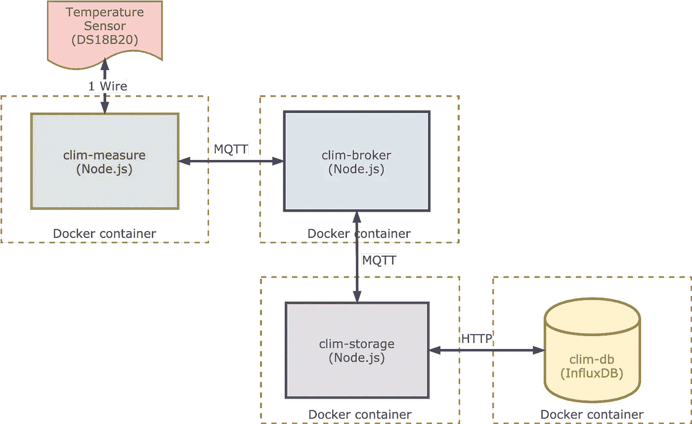
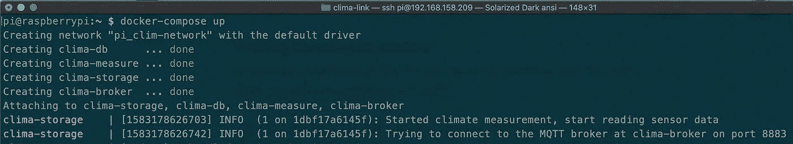

# 如何使用 Node.js 设计完整的物联网解决方案

> 原文：<https://betterprogramming.pub/how-to-design-a-complete-iot-solution-using-node-js-674787409e57>

## 使用 Node.js、MQTT 和 InfluxDB 来测量、传递和存储温度读数


利用物联网控制温室气候。图片由作者提供。

本文描述了一个使用新的 Raspberry Pi 4B 的物联网(IoT)实验。

它从一个连接到树莓皮的传感器开始，测量温度。服务使用 MQTT 将测量结果安全地传递给 MQTT 代理。最后，另一个服务检索测量结果并将其存储在数据库中

完整的解决方案可在 GitHub 上获得，并在 Docker 容器中运行。你可以使用 [Docker Compose](https://github.com/PatrickKalkman/clima-link/blob/master/docker-compose.yml) 来启动它。

# 体系结构

生产就绪的物联网解决方案必须能够每秒处理超过 100，000 个样本。因此，我的解决方案的设计应该能够处理这些类型的数字。

为了使解决方案能够每秒处理如此多的事务，它应该是可伸缩的。因此，我将解决方案分成四个不同的服务。



clima-link 物联网架构

每个服务都运行在 Docker 容器中，负责特定的功能。在实验过程中，我在 Raspberry Pi 上运行了所有 Docker 容器。

我选择容器，因为这使得在开发期间在单个节点上或者在生产期间在多个节点上扩展和运行完整的解决方案变得更加容易。

这个解决方案的瓶颈是存储所有输入测量值的数据库。因此，我使用了一个专门的数据库，一个时间序列数据库。时间序列数据库是专门为存储带时间戳的数据而设计的。根据设计，这些数据库能够读写大量数据。

我将该解决方案分为以下四种服务:

## 气候测量

[clim-measure](https://github.com/PatrickKalkman/clima-link/tree/master/clima-measure) 服务处理从传感器检索测量温度。它使用 MQTT 协议发布温度。

## clim-broker

clim-broker 服务是解决方案的 MQTT 代理。它负责接收和路由所有 MQTT 消息。

## clim-存储

clim-storage 服务负责通过 MQTT 接收温度事件，并将它们发送到数据库。

## clim-db

clim-db 服务负责将温度传感器数据保存在数据库中。

# 选择正确的传感器(clim-measure)

为了方便使用，我选择了 Dallas [DS18B20](https://datasheets.maximintegrated.com/en/ds/DS18B20.pdf) 数字传感器来测量温度。它使用一根导线来传递温度，不需要总净转换。它直接以双精度形式返回测得的温度。

我将传感器连接到 Raspberry Pi 4B 的一个通用输入/输出(GPIO)端口。Raspberry Pi 运行的是 Raspbian Lite。

在使用 DS18B20 之前，必须在 Pi 上启用单线协议。Raspberry PI 教程创建了一个[优秀教程](https://tutorials-raspberrypi.com/raspberry-pi-temperature-sensor-1wire-ds18b20/)，解释了如何启用它。

启用单线协议后，您可以执行以下脚本来读取温度。

```
cat /sys/bus/w1/devices/28-00000ab45db8/w1_slave | sed -n 's/^.*\(t=[^ ]*\).*/\1/p' | sed 's/t=//' | awk '{x=$1}END{print(x/1000)}'
```

在我的树莓派上，脚本输出的是`13.812`，当时房间里的温度。

## 自动化温度读数

启用传感器后，我们可以创建 clim-measure 服务。这是一个 Node.js 应用程序，它读取传感器并使用 MQTT 发布它。

我使用了 [ds18b20-raspi](https://github.com/thisdavej/ds18b20-raspi) ，这是 Dave Johnson 创建的一个 npm 包，有助于读取传感器数据。我将它包装在一个名为`sensor.js`的模块中。

sensor.js 模块，用于从 DS18B20 传感器读取温度

第 13 行的`if`语句检查程序是否在生产模式下运行。如果它在生产模式下运行，它会从传感器读取温度。否则，它会生成一个随机数。这让我可以在我的笔记本电脑上开发和测试解决方案。

## 使用 MQTT 发布温度读数

传感器读取温度后，应用程序使用 MQTT 协议发布温度。 [MQTT](http://mqtt.org/) 是用于物联网解决方案的轻量级发布-订阅协议。

MQTT 将客户机分为发布者和订阅者。中央 MQTT 代理负责将消息从发布者路由到订阅者。

消息被分成多个主题。如果您想要接收某个主题的消息，您可以向 MQTT 代理表明您想要订阅这个主题。

另一方面，如果您想要发布特定主题的消息，您可以直接将它发送给 MQTT 代理。

clim-measure，读取温度的服务，是一个 MQTT 客户机。我使用 npm 模块 [MQTT.js](https://github.com/mqttjs/MQTT.js) 来实现 MQTT 客户端。MQTT.js 是 Node.js 的 MQTT 客户端库。

服务启动后做的第一件事是连接到 MQTT 代理。

启动时连接到 MQTT 代理

MQTT 代理使用用户名和密码来验证 MQTT 客户机。

使用`mqtt`客户端库的`publish`方法发送温度。我构造了一个包含温度和时间戳的对象。就在发送之前，我使用`JSON.stringify`将对象转换成 JSON 字符串。

这将把这个消息发送给 MQTT 代理。它使用了主题`house/bedroom/temperature`。

## MQTT 主题

MQTT 使用主题作为一种寻址形式，为连接的客户端过滤消息。主题本身是由一个或多个字符组成的区分大小写的 UTF-8 字符串。

您可以使用正斜杠(/)作为分隔符来定义主题中的层次结构。以下都是有效的 MQTT 主题。

*   `house/bedroom/temperature`
*   `house/bathroom/relativehumidity`
*   `house/bathroom/temperature`
*   `house/garage/temperature`

**多级通配符**

订阅时，可以使用通配符来订阅多个主题。使用散列符号定义多级通配符。哈希符号必须是主题的最后一个字符。

例如，当 MQTT 客户机订阅主题`house/bathroom/#`时，它将接收所有以`house/bathroom`开头的主题。

所以看前面的题目列表，这个会是`house/bathroom/relativehumidity`，还有`house/bathroom/temperature`。

**单级通配符**

通过使用加号，单级通配符可以替换单个主题级别。

例如，当 MQTT 客户机订阅主题`house/+/temperature`时，它将接收以`house`开始并以`temperature`结束的所有主题。所以看前面的题目列表，这个会是`house/bathroom/temperature`、`house/bedroom/temperature`、`house/garage/temperature`。

# MQTT 代理(clim-broker)

clim-broker 是负责接收 MQTT 消息并将其路由到 MQTT 客户机的服务。在启动过程中，服务打开一个套接字并监听传入的 MQTT 消息。

我希望 MQTT 客户机和 MQTT 代理之间有安全的通信。这在使用 TLS 的 MQTT 中是可能的。要使用 TLS，您必须使用 SSL 证书。

我创建了一个自签名证书和一个私钥，以便在 MQTT 代理中使用它。如果您在创建自签名证书方面需要一些帮助，请参阅我以前的文章。

[](https://medium.com/better-programming/how-to-create-ssl-certificates-for-development-861237235933) [## 如何为开发创建 SSL 证书

### 自动生成 SSL 证书

medium.com](https://medium.com/better-programming/how-to-create-ssl-certificates-for-development-861237235933) 

## Aedes，一个基本的 MQTT 经纪人

为了实现 MQTT 代理，我使用了 npm 包 [Aedes](https://github.com/moscajs/aedes) 。Aedes 是一个 MQTT 代理，具有基本的功能，可以使用扩展进行扩展。

在 clim-broker 服务启动期间，它创建一个`aedes`的实例，启动服务器，并开始监听指定端口上的 MQTT 消息。

创建服务器时，私钥和公钥都被添加到`options`中。

## 认证客户端

除了使用 TLS，MQTT 客户机还必须经过身份验证。这是使用用户名和密码完成的。你必须实现一个认证功能，并将其分配给伊蚊。

`broker.js`中的`setupAuthentication`方法设置当 MQTT 客户机连接到代理时执行的函数。

当 MQTT 客户机连接到 MQTT 代理时处理身份验证

# 接收和存储温度样本(clim 存储)

clim-storage 服务负责接收温度事件并将它们存储在数据库中。

clim-storage 服务就像 clim-measure——一个 MQTT 客户机。但是它没有发布，而是订阅了`house/bedroom/temperature`主题来接收温度信息。

在启动过程中，clim-storage 服务连接到 MQTT 代理。

## 接收温度信息

为了接收消息，clim-storage 服务首先订阅第 4 行的`house/bedroom/temperature`主题。然后，它使用`client.on('message', ...)`接收消息。

传入的`message`是 Node.js `Buffer`类的一个实例。

我在转换收到的邮件时遇到了一些问题。在我发现传入的`message`实际上是一个`Buffer`之后，我可以将它转换成一个字符串。

所以我首先将它转换成一个字符串，然后使用`parseJsonToObject` helper 函数将 JSON 字符串转换回一个对象。

## 存储温度样本

收到温度样品后，我们必须将其储存起来。所有的样本都使用一个 [InfluxDB 数据库持久化。](https://github.com/influxdata/influxdb)

**连接到数据库** 为了与 InfluxDB 交互，我使用了 npm 包 [node-influx](https://github.com/node-influx/node-influx#readme) 。要连接到数据库，您必须创建 InfluxDB 类的一个实例，同时提供主机、端口和模式。

连接到 InfluxDB 并指定一个模式

如果数据库不存在，connect 函数也会创建它。

**保存样本** 收到的消息包含温度和测量时间。函数`save`在数据库中保存一条记录。

将收到的消息保存到 InfluxDB 中

# 存储测量值(clima-db)

InfluxDB 是一个开源的时间序列数据库(TSDB)。我使用官方的 [InfluxDB Docker 映像](https://hub.docker.com/_/influxdb)来运行数据库。

TSDBs 是专门为存储大量带时间戳的数据而设计的。大多数物联网解决方案提供商都使用它们。在我们的例子中，我们用它们来存储特定时间的室内温度。

更详细地描述 TSDBs 将是以后文章的主题。

如果你等不及了，那就看看泰德·邓宁的精彩演讲吧。Ted Dunning 是 MapR 的首席应用架构师。MapR 是一个数据平台，也提供时间序列数据库。

Ted Dunning 解释了 TSDBs

# 码头细节

clima-link 中的每个服务都在 Docker 容器中运行。您可以使用 Docker Compose 启动完整的解决方案。我将所有 Docker 图像基于 Arm32 基本图像，因为我希望能够在 Raspberry Pi 上运行所有服务。

每个服务的源代码都存储在 [GitHub 库](https://github.com/PatrickKalkman/clima-link)的一个文件夹中。每个文件夹都包含该特定服务的 docker 文件。我使用了下面文章中的清单来创建生产就绪的 docker 文件。

[](https://medium.com/better-programming/docker-for-node-js-in-production-b9dc0e9e48e0) [## 生产中 Node.js 的 Docker

### 在生产环境中使用 Docker 运行 Node.js 应用程序的清单

medium.com](https://medium.com/better-programming/docker-for-node-js-in-production-b9dc0e9e48e0) 

我使用 bash 脚本自动创建 Docker 图像。这为我节省了开发时间。下面的脚本创建并上传 clim-broker 服务的 Docker 映像。

用于生成 Docker 图像的 Bash 脚本

## 运行完整的解决方案

如果你有一个 Raspberry Pi 并且想要运行这个解决方案，你必须在 Pi 上安装 [Docker 和 Docker Compose](https://dev.to/rohansawant/installing-docker-and-docker-compose-on-the-raspberry-pi-in-5-simple-steps-3mgl) 。

安装后，将下面的内容复制到一个名为`docker-compose.yml`的文件中。使用`docker-compose up`，Docker 图像将被下载并启动。

用于启动完整解决方案的 docker-compose.yml 文件



使用 Docker Compose 启动物联网解决方案

# 结论

本文展示了使用开源组件创建可扩展的物联网解决方案的可能性。通过将解决方案拆分成服务并在 Docker 容器中运行它们，它可以用于开发和生产中的扩展。

感谢您的阅读。