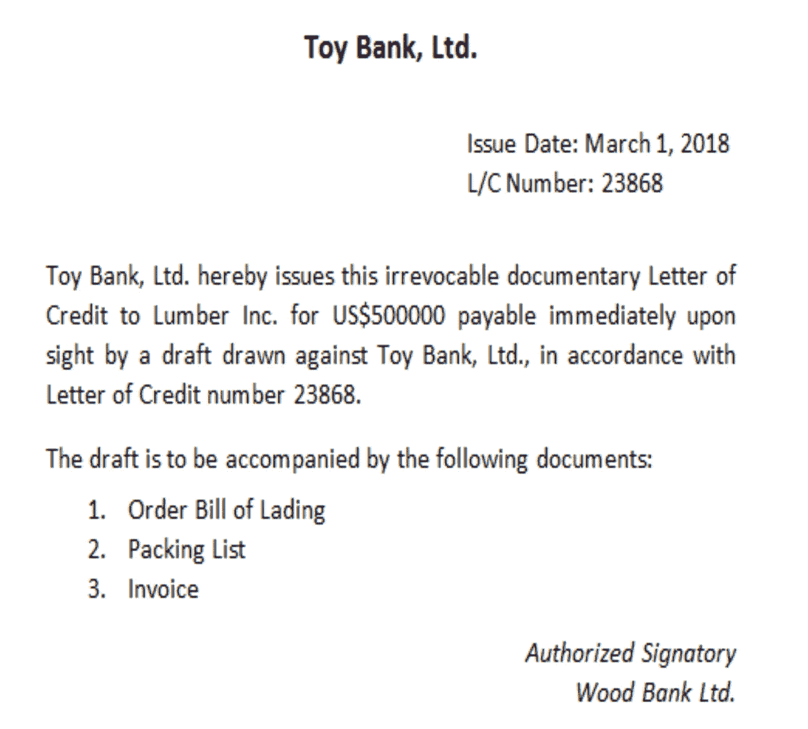
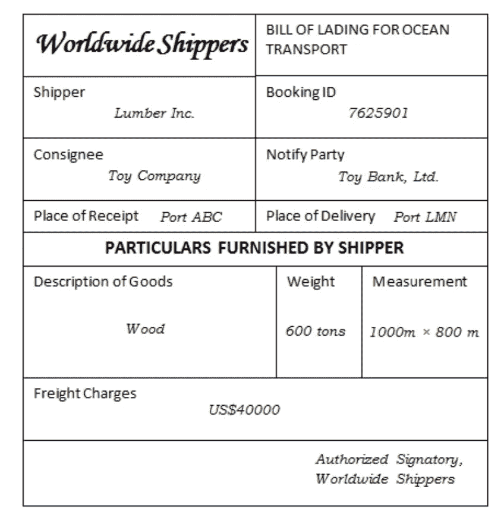
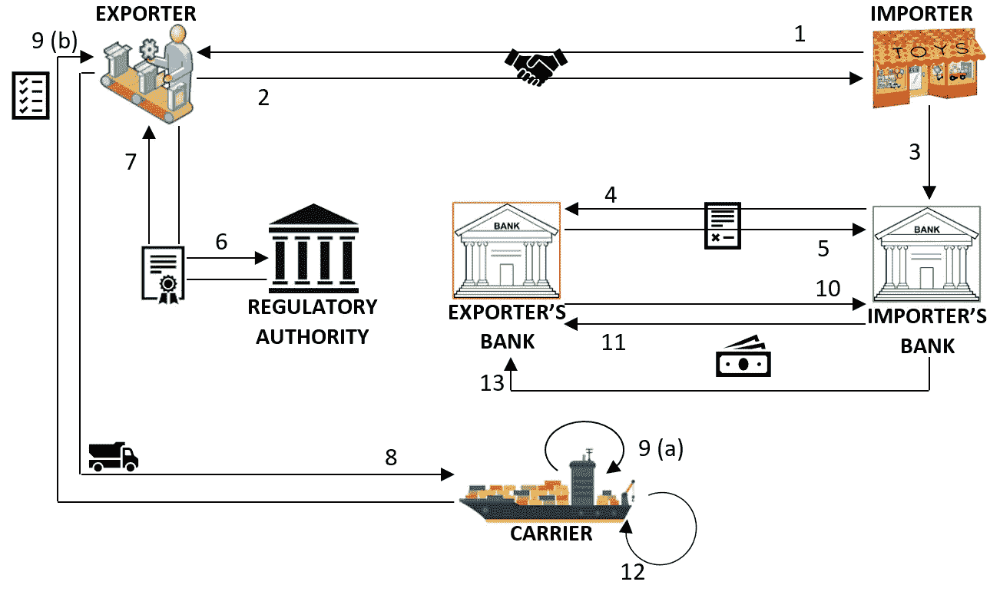
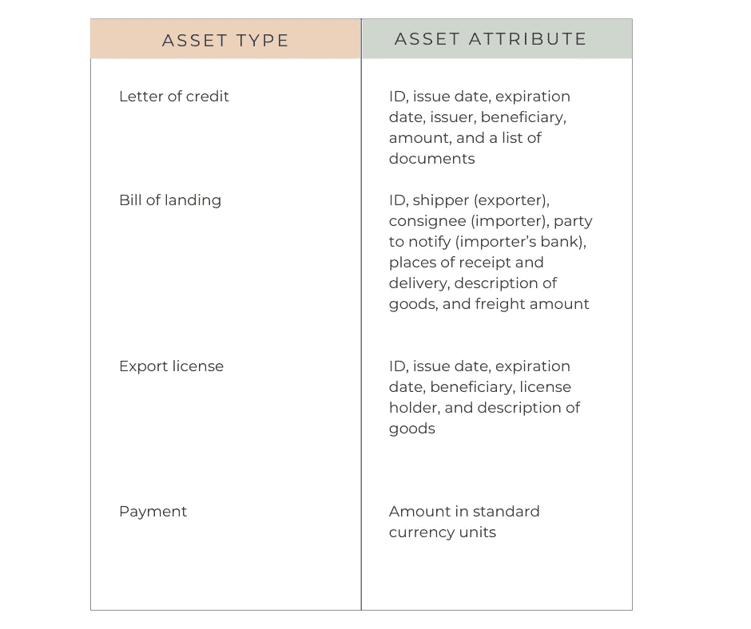
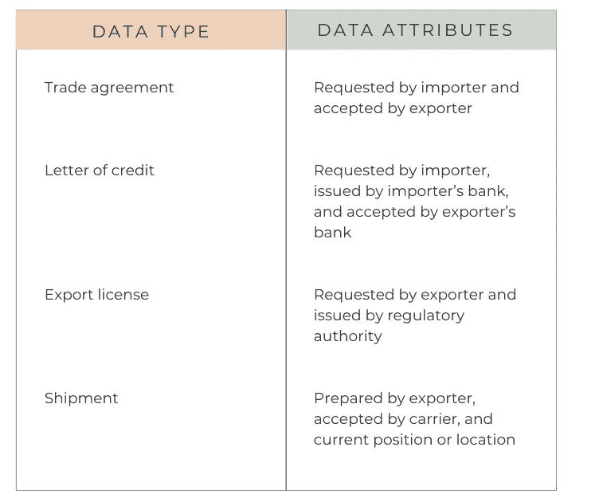
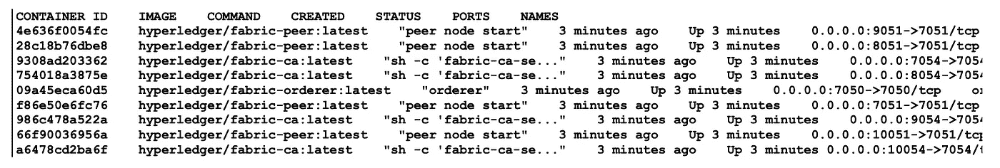

# 为企业设计和运输区块链解决方案的完整指南

> 原文：<https://betterprogramming.pub/how-to-design-a-real-world-blockchain-solution-91463b8e31a6>

## 通过为物流公司创建专业的区块链网络解决方案来学习。


图片来源:[阿克塞尔·阿霍伊](https://unsplash.com/@axelahoi)

由于物流和供应链的复杂性，很难准确、实时地了解货物的状态，因为物流和供应链通常涉及多个参与者(如商品消费者、零售商、分销商、制造商、供应商和经纪人)，每个参与者都有自己的交易记录。这些记录往往不同步，因此很难全面了解情况。然而，以区块链为基地的供应链网络可以提供更大的可见性和透明度，提高效率和增加价值。

# 贸易融资和物流术语

贸易融资和物流中使用的许多术语可能会让行业新人感到困惑。以下术语指的是在我们的交易场景中使用的某些工具和人工制品。我们将在本文中构建的应用程序使用这些工具的简化形式:

信用证:信用证基本上是银行的一种说法，“我们承诺向这个人支付他们运送的货物，只要他们能向我们证明他们确实运送了货物。”这是一份相当重要的文件，进口商的银行会应其客户——进口商——的要求签发一份。

信用证概述了证明货物已经装运的文件、需要支付的金额以及谁将得到这笔钱(在我们的案例中，是出口商)。信用证样本如下所示:



信用证

出口许可证:出口许可证是监管机构对装运特定货物的批准。在这个博客中，我们将简称为 E/L。下面的截图展示了一份 E/L 样本:


出口许可证

提单:提单是证明承运人已经占有货物的文件。它还充当承运人和出口商之间的合同，证明出口商拥有货物。

*   发货收据
*   承运人同意将货物运输到指定目的地并收取费用的合同
*   货物的所有权

提单也列在信用证中，并作为将自动触发支付结算的装运证明。



提单

# **流程工作流程**

我们的工作流程包括将交易分解为更简单的步骤，以使流程更高效、更易于遵循。通过将不同实体集合之间的交互分解成更小、更易管理的部分，我们可以简化测试过程，并使其更有效。



交易工作流程

1.  进口商向出口商要求货物以换取金钱
2.  出口商接受交易
3.  进口商要求其银行开立以出口商为受益人的信用证
4.  进口商的银行向出口商提供信用证，并向后者的银行付款
5.  出口商的银行代表出口商接受信用证
6.  出口商向监管机构申请信用证
7.  监管机构向出口商提供信用证
8.  出口商准备好货物，并将其交给承运人
9.  承运人在确认 E/L 后接受货物，然后向出口商提供提单
10.  出口商银行要求进口商银行支付一半的货款
11.  进口商的银行将一半的金额转到出口商的银行
12.  承运人将货物运送到目的地
13.  进口商银行向出口商银行支付剩余金额

# 共享资产和数据

先前工作流中的参与者必须共享一些信息，以便所有各方在任何给定时刻都了解贸易安排及其进展。这包括共享资产，如单据和货币资产，如下表所示:



资产类型和属性



数据类型和属性

# 参与者的角色和能力

在我们的例子中，有 6 种类型的参与者:出口商、进口商、出口商银行、进口商银行、航运公司和一些监管机构。每个人都有不同的能力和局限性，列举如下:

*   只有进口商可以申请信用证
*   只有进口商的银行可以提供信用证
*   只有出口商的银行可以接受信用证
*   只有出口商可以申请信用证
*   只有监管机构可以提供信用证
*   只有出口商可以准备装运
*   只有承运人可以提供提单
*   只有承运人可以更新装运地点
*   只有进口商的银行可以汇款，只有出口商的银行可以收款

# 设置环境

## **安装先决条件**

现在我们已经设计好了网络，让我们安装必备工具:

1.  使用 https://docs.docker.com/install/的[和 https://docs.docker.com/compose/install/的](https://docs.docker.com/install/)确保你有最新版本的 Docker 和 Docker-Compose
2.  安装商业网络所需的软件示例:[https://hyperledger.github.io/composer/latest/installing/](https:// hyperledger.github.io/composer/latest/installing/)安装-先决条件。
3.  Fabric 是使用 Go 编程语言实现的。注意，Go 的语法类似于 C++。我们还将使用 Go 来编写我们的链码。Go 可以通过链接[https://golang.org/](https://golang.org/)进行安装。
4.  设置我们的环境变量。`GOPATH`指向`go`源代码的工作区，例如:

```
$ export GOPATH=$HOME/go
```

`PATH`需要包含 Go `bin`目录来存储库和可执行文件。这可以在下面的代码片段中看到:

```
$ export PATH=$PATH:$GOPATH/bin
```

6.检查你是否需要在你的系统上安装`make`。在 Debian/Ubuntu 系统上，你可以使用`sudo apt-get install make`来安装它。

# 分叉和克隆贸易-金融-物流知识库

重要的是，我们首先在 GitHub 上派生出库，这样我们就有了原始源代码的副本。然后，我们可以按照以下步骤将源代码克隆到本地机器目录中:

*   在 GitHub 中，导航到以下存储库:[https://GitHub . com/hyperledger handson/trade-finance-logistics . git](https://github.com/HyperledgerHandsOn/trade-finance-logistics.git)

```
$ cd $GOPATH/src
$ git clone [https://github.com/YOUR-USERNAME/trade-finance-logistics](https://github.com/YOUR-USERNAME/trade-finance-logistics)
```

我们现在有了所有贸易-金融-物流教程材料的本地副本。

# 准备网络

要构建`Fabric`和`Fabric-CA`，可能需要先安装一些依赖项，比如`gcc`、`libtool`和`ltdl`库。(在 Ubuntu 系统上，您可以通过运行`sudo apt install libltdl-dev`来安装所有必要的先决条件，在 mac 上，您可以通过运行`brew install libtool`来安装)。在生成网络加密材料之前，我们需要执行以下步骤:

1.  通过添加参数`-b release-1.1`克隆 Fabric([https://github.com/hyperledger/fabric/tree/release-1.1](https://github.com/hyperledger/fabric/tree/release-1.1))源代码库。确保克隆的 fabric 文件夹在`$GOPATH/src/github.com/hyperledger/`中存在或象征性链接。这是必要的，以便当您尝试构建 Fabric 时，它会在此路径中查找所需的库。
2.  运行`make docker`为对等方和订购方构建 Docker 映像
3.  运行`make configtxgen cryptogen`生成必要的工具来运行本节描述的网络创建命令
4.  从[https://github.com/hyperledger/fabric-ca/tree/release-1.1](https://github.com/hyperledger/fabric-ca/tree/release-1.1)克隆 Fabric-CA。确保克隆的`fabric-ca`文件夹在`$GOPATH/src/github.com/hyperledger/`中存在或被象征性链接。这是必要的，以便当您尝试构建 Fabric-CA 时，它会在此路径中查找所需的库。
5.  运行`make docker`为托管服务提供商(MSP)构建 Docker 映像。

# 生成网络加密材料

网络配置的第一步包括为每个对等方和订购方组织的 MSP 以及基于 TLS 的通信创建证书和签名密钥。我们还需要为每个对等节点和订购节点创建证书和密钥，以便能够相互通信以及与它们各自的 MSP 通信。

这个设置必须在我们代码库的网络文件夹中的`crypto-config.yaml`中进行标识。例如，看一下文件中进口商组织的定义:

```
PeerOrgs:
- Name: ImporterOrg
  Domain: importerorg.trade.com
  EnableNodeOUs: true
  Template:
    Count: 1
  Users:
    Count: 2
```

这个配置表明`ImporterOrg`组织将有一个对等体。此外，还将创建两个非管理员用户。还定义了对等体可以使用的组织域名。

要为所有组织创建加密材料，运行`cryptogen`命令，如下所示:

```
cryptogen generate --config=./crypto-config.yaml
```

输出保存在`crypto-config`文件夹中。

# 生成通道伪像

要建立一个准确反映组织结构的网络，建立一个渠道，需要以下材料:

*   起源块包含初始化结构区块链的特定于组织的证书。
*   通道配置信息
*   每个组织的锚定对等配置确保区块链得到适当维护。

`[crypto-config.yaml](https://github.com/HyperledgerHandsOn/trade-finance-logistics/blob/master/network/crypto-config.yaml)`文件包含渠道属性，而`configtx.yaml`文件位于网络文件夹中，定义了我们贸易网络的高级结构，如`Profiles`部分所示:

正如我们所看到的，我们将要创建的通道被命名为`FourOrgsTradeChannel,`，它是在概要文件中定义的。参与该通道的 4 个组织被标记为`ExporterOrg`、`ImporterOrg`、`CarrierOrg`和`RegulatorOrg`，每个组织指的是在`Organisations`部分中定义的一个子部分。订购者属于自己的组织`TradeOrdererOrg`。

下面列出的每个组织都包含有关其 MSP (ID 以及加密材料的位置，如密钥和证书)的信息，以及其锚定对等体的主机名和端口信息。例如，`ExporterOrg`部分包含以下内容:

```
- &ExporterOrg
  Name: ExporterOrgMSP
  ID: ExporterOrgMSP
  MSPDir: crypto-config/peerOrganizations/exporterorg.trade.com/msp
  AnchorPeers:
    - Host: peer0.exporterorg.trade.com 
    Port: 7051
```

如您所见，本规范中的`MSPDir`变量(代表一个文件夹)引用了我们之前使用`cryptogen`工具生成的加密材料。

`configtxgen`工具用于生成通道伪像。要生成 genesis 块，从`network`文件夹运行以下命令:

```
configtxgen -profile FourOrgsTradeOrdererGenesis -outputBlock ./channel-artifacts/genesis.block
```

`FourOrgsTradeOrdererGenesis`关键字对应于`Profiles`部分中的配置文件名。genesis 块将保存在`channel-artifacts`文件夹的`genesis.block`文件中。若要生成通道配置，请运行以下代码:

```
configtxgen -profile FourOrgsTradeChannel -outputCreateChannelTx ./channel-artifacts/channel.tx -channelID tradechannel
```

我们将创建的通道命名为`tradechannel`，其配置存储在`channel-artifacts/channel.tx`中。要为导出者组织生成锚点对等配置，请运行:

```
configtxgen -profile FourOrgsTradeChannel -outputAnchorPeersUpdate ./channel-artifacts/ExporterOrgMSPanchors.tx -channelID tra
```

在前面的命令中更改组织名称时，应该对其他三个组织重复相同的过程。

> 您需要将环境变量`*FABRIC_CFG_PATH*`设置为包含`*configtx.yaml*`文件的文件夹，以便`*configtxgen*`工具工作。脚本文件`*trade.sh*`有一行确保`*YAML*`文件是从运行命令的文件夹中加载的:`*export FABRIC_CFG_PATH=${PWD}*`

# 在一个操作中生成配置

`trade.sh`脚本被配置为使用前面描述的命令和配置文件生成通道工件和加密材料。为此，只需在`network`文件夹中运行以下命令:

```
./trade.sh generate -c tradechannel
```

尽管您可以在这里随意命名任何通道，但需要注意的是，本文后面用于开发中间件的配置将取决于该名称。

> *将运行对等体的容器中的* `GOPATH` *变量设置为* `/opt/gopath` *。*

# 构建一个示例贸易网络

前面的命令还创建了一个网络配置文件`docker-compose-e2e.yaml`，可以使用 docker-compose 工具将它作为一组 Docker 容器来启动网络。该文件基于静态配置文件`base/peer-base.yaml`和`base/docker-compose-base.yaml`。

这些文件一起工作来指定服务及其属性，这允许我们在 Docker 容器中运行我们需要的所有服务。这与必须在一台或多台机器上手动运行每个单独的服务相反。我们需要运行的服务有:

*   一个`Fabric`对等体的四个实例，每个组织一个
*   一个`Fabric`订购的实例
*   一个`Fabric CA`的五个实例，对应每个组织的 MSP

每个组件的 Docker 图片可以在 Docker Hub([https://hub.docker.com/u/hyperledger/](https://hub.docker.com/u/hyperledger/))的 Hyperledger 项目中找到。对于对等方、订购方和认证机构(ca)，图像分别为`hyperledger/fabric-peer`、`hyperledger/fabric-orderer`、`hyperledger/fabric-ca`。

对等体的基本配置如下(见`base/peer-base.yaml`):

您可以在这里配置 fabric 设置，但是如果您为`fabric-peer`使用预构建的 Docker 映像，默认设置通常足以运行一个对等服务。启动对等服务的命令通常在配置的最后一行指定为`peer node start`。此外，确保使用`CORE_LOGGING_LEVEL`变量配置日志记录级别。

在我们的配置中，变量被设置为`INFO`，这意味着只记录信息性、警告性和错误性消息。但是，如果您希望调试一个对等体并需要更广泛的日志记录，您可以将这个变量设置为`DEBUG`。

> 在`*network*`文件夹的`*.env*`文件中，变量`*IMAGE_TAG*`被设置为“最新的”,但是如果你想提取旧的图像，你可以设置一个特定的标签。

我们必须为每个对等体配置主机名和端口，并将生成的加密材料(使用`cryptogen`)同步到容器文件系统。在`base/docker-compose-base.yaml`中，导出方组织中的对等方配置如下:

如`extends`参数所指定的，该配置继承自基本配置。请注意，ID ( `CORE_PEER_ID`)与`configtx.yaml`中指定的对等方 ID 相对应。这个身份将被用作在导出组织中运行的对等体的主机名，并将在本文后面的中间件代码中被引用。

volumes 部分建立了将在`crypto-config`文件夹中生成的加密材料复制到容器中的协议。对等服务本身监听端口`7051`，客户端可以用来订阅事件的端口被指定为`7053`。

> 在这个文件中，您会注意到容器内端口在所有对等体中都是相同的。但是，它们被映射到主机上的不同端口。此外，请注意此处指定的 MSP ID 与`configtx.yaml`中的对应。

订购者服务的配置类似于下面来自`base/docker-compose-base.yaml`的片段:

```
orderer.trade.com:
  container_name: orderer.trade.com
  image: hyperledger/fabric-orderer:$IMAGE_TAG 
  environment:
    - ORDERER_GENERAL_LOGLEVEL=INFO 
  …… command: orderer 
  ……
```

如代码所示，启动订购者的命令很简单`orderer`。可以使用`ORDERER_GENERAL_LOGLEVEL`变量定制日志记录级别，并在我们的配置中设置为`INFO`。

我们将使用的网络配置基于一个名为`docker-compose-e2e.yaml`的文件。该文件不在存储库中，而是由命令`./trade.sh generate -c tradechannel`生成的，我们之前运行该命令来生成通道和加密材料。这个文件使用了`base/docker-compose-base.yaml`(间接使用了`base/peer-base.yaml`)，通过检查文件内容可以看到这一点。

它是从一个名为`docker-compose-e2e-template.yaml`的 YAML 模板文件生成的，这个文件可以在网络文件夹中找到。模板文件包含变量，当生成`docker-compose-e2e.yaml`时，这些变量被替换为`crypto-config`文件夹中的实际文件名。

例如，考虑`docker-compose-e2e-template.yaml`中的 exporter-ca 部分:

```
exporter-ca:
 image: hyperledger/fabric-ca:$IMAGE_TAG 
 environment:
   …… - FABRIC_CA_SERVER_TLS_KEYFILE=/etc/hyperledger/fabric-ca-server-config/EXPORTER_CA_PRIVATE_KEY 
 …… command: sh -c ‘fabric-ca-server start — ca.certfile /etc/hyperledger/fabric-ca-server-config/ca.exporterorg.trade.com-cert.pem
```

现在，看看生成的文件`docker-compose-e2e.yaml`中的相同部分:

```
exporter-ca:
 image: hyperledger/fabric-ca:$IMAGE_TAG 
 environment:
   ……
   - FABRIC_CA_SERVER_TLS_KEYFILE=/etc/hyperledger/fabric-ca-server-config/ cc58284b6af2c33812cfaef9e40b8c911dbbefb83ca2e7564 
 …… command: sh -c ‘fabric-ca-server start — ca.certfile /etc/hyperledger/fabric-ca-server-config/ca.exporterorg.trade.com-cert.pem
```

如您所见，变量`EXPORTER_CA_PRIVATE_KEY`已经被替换为`cc58284b6af2c33812cfaef9e40b8c911dbbefb83ca2e7564e8fbf5e7039c22e_sk`，在 env 和命令中都是如此。如果您现在检查`crypto-config`文件夹的内容，您会注意到在文件夹`crypto- config/peerOrganizations/exporterorg.trade.com/ca/`中有一个名为`cc58284b6af2c33812cfaef9e40b8c911dbbefb83ca2e7564e8fbf5e7039c22e_sk`的文件。该文件包含导出组织的 MSP 私有(秘密)签名密钥。

> 之前的代码片段包含了测试运行的结果。每次运行加密工具时，主文件名都会不同。

现在，更详细地查看 MSP 的配置，以出口组织 MSP 为例，如`docker-compose-e2e.yaml`中所述:

将在 MSP 中运行的服务是`fabric-ca-server`，它侦听端口`7054`，使用使用`cryptogen`创建的证书和密钥进行引导，并使用在 fabric-ca 映像中配置的默认登录和密码(分别为`admin`和`adminpw`)。启动`Fabric CA`服务器实例的命令是`fabric-ca-server start`，正如您在前面的代码中看到的。

如前面的配置所示，对等体和 ca 被配置为基于 TLS 的通信。读者必须注意，如果 TLS 在一个中被禁用，那么它在另一个中也必须被禁用。

同样，通过检查`docker-compose-e2e.yaml`可以观察到，我们没有为订购者的组织创建`Fabric CA`服务器(和容器)。对于我们将在本书中完成的练习，为订购者静态创建的管理员用户和凭证就足够了；我们不会动态注册新的订购者组织用户，所以不需要`Fabric CA`服务器。

# 网络组件的配置文件

我们已经演示了如何在 docker-compose YAML 文件中配置对等方、订购方和 ca。但是这种配置意味着覆盖已经在组件各自的图像中默认进行的设置。虽然对这些配置的详细描述超出了本书的范围，但我们将列出各自的文件，并提到用户如何对它们进行更改。

对于对等体来说，`[core.yaml](https://github.com/hyperledger/fabric/blob/release-1.1/sampleconfig/core.yaml)`文件包含所有重要的运行时设置，包括但不限于地址、端口号、安全性和隐私以及 gossip 协议。您可以创建自己的文件，并使用定制的 docker 文件将其同步到容器，而不是默认情况下由`hyperledger/fabric-peer`图像使用的文件。如果您登录到一个正在运行的对等容器(让我们从我们刚刚启动的网络中取出出口组织的对等容器):

```
docker exec -it f86e50e6fc76 bash
```

然后你会在文件夹`/etc/hyperledger/fabric/`中找到`core.yaml`文件。

类似地，订购者的默认配置位于`[orderer.yaml](https://github.com/hyperledger/fabric/blob/release-1.1/sampleconfig/orderer.yaml)`中，它也同步到运行`hyperledger/fabric-orderer`映像的容器上的`/etc/hyperledger/fabric/`。请记住，`core.yaml`和`orderer.yaml`文件都被同步到对等容器和订购者容器，因此如果您希望创建定制文件，您将需要将这些 YAML 文件同步到这两个容器。

一个`Fabric CA`服务器也有一个名为`[fabric-ca-server-config.yaml](https://hyperledger-fabric-ca.readthedocs.io/en/latest/serverconfig.html)`的配置文件，它被同步到运行`hyperledger/fabric-ca`映像的容器上的`/etc/hyperledger/fabric-ca-server/`。您可以创建和同步定制配置，就像您为对等方或订购方所做的那样。

# 启动一个样本贸易网络

因此，现在我们已经有了网络的所有配置，以及运行网络所需的通道工件和加密材料，我们需要做的就是使用`docker-compose`命令启动网络，如下所示:

```
docker-compose -f docker-compose-e2e.yaml up
```

如果您愿意，可以将它作为后台进程运行，并将标准输出重定向到日志文件。否则，您将在控制台上看到各种容器的启动和日志显示。

> *在某些操作系统配置上，设置* `*Fabri*` *c 可能会比较棘手。如果遇到问题，请查阅文档。在*[https://hyperledger-Fabric . readthedocs . io/en/release-1.1/samples . html](https://hyperledger-fabric.readthedocs.io/en/release-1.1/samples.html)中提供了关于如何安装光纤网络的详细说明和示例。

也可以使用我们的`trade.sh`脚本在后台启动网络。只需运行以下命令:

```
./trade.sh up
```

从不同的终端窗口，如果您运行`docker ps -a`，您将看到如下内容:



我们有四个对等体、四个 MSP 和一个订购者运行在不同的容器中。我们的贸易网络已经准备好运行我们的应用程序了！

要查看给定容器的运行日志，请记下容器 ID(前面列表中的第一列),只需运行:

```
docker logs <container-ID>
```

> *要关闭网络，您可以使用 docker-compose 命令:* `docker-compose -f docker-compose-e2e.yaml down` *或我们的 trade.sh 脚本:* `./trade.sh down` *。*

# **总结**

在本文中，我们介绍了业务用例。我们还部署了第一个 Hyperledger 结构网络，现在已经从理论过渡到实践。干得好！