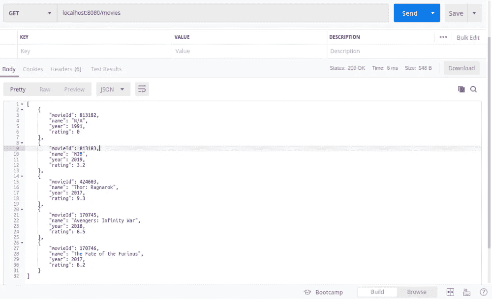
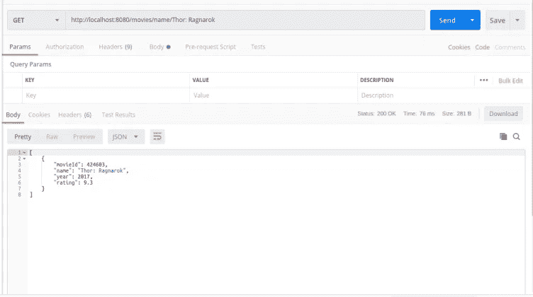
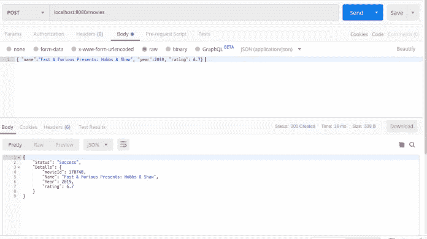
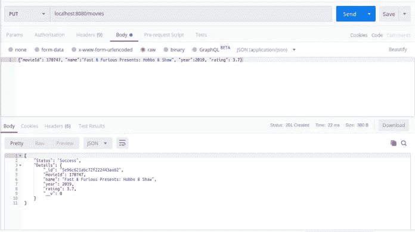
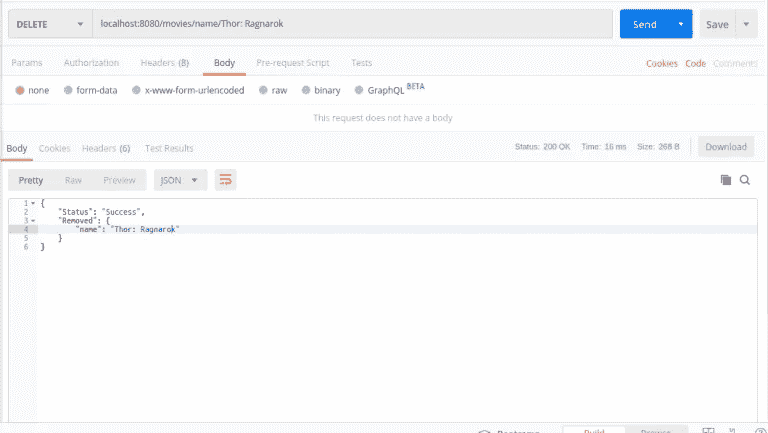

# 如何用 Node.js 和 Express 在 5 分钟内设计一个 RESTful API

> 原文：<https://betterprogramming.pub/how-to-design-a-restful-api-with-node-js-and-express-in-5-minutes-f0346b1a319d>

## 旋转一个简单的 CRUD 应用程序


由[萨曼莎·加德斯](https://unsplash.com/@srosinger3997?utm_source=medium&utm_medium=referral)在 [Unsplash](https://unsplash.com?utm_source=medium&utm_medium=referral) 上拍摄的照片。

在本文中，我们将设计一个基于 REST API 的应用程序来创建一个电影数据库。所有的操作，比如创建、更新、读取和删除(CURD ),都将使用 REST 调用来完成。

先决条件:我假设您对 Node.js、MongoDB 和 Express(node . js 平台)有相当好的了解。

如果你不了解 HTTP 协议，比如 GET、POST 等等，我强烈推荐你阅读这篇文章来更好地理解它们。

# 设置

## 确认节点安装

在继续操作之前，请使用以下命令确认您的系统中已经安装了节点和 npm 程序包:

```
$ node -v                                                          
$ npm -v
```

## 初始化新应用程序

太好了。现在让我们创建一个空目录，并在其中初始化一个新的应用程序:

```
$ mkdir CURD_using_node
$ cd CURD_using_node
$ npm init
```

完成设置后，一个名为`package.json`的文件将在您当前的文件夹中生成。默认的主文件名将是`index.js`，但是我们已经将它更新为`app.js`。

现在，我们需要将 Express 安装在我们当前的项目文件夹中:

```
$ npm install express --save
```

## 创建数据库

我假设您已经在操作系统上安装了 MongoDB。如果没有，请安装它。您可以使用以下命令检查是否安装了 MongoDB:

```
$ mongo
```

安装了 Mongo 吗？是的。完美。现在让我们在 Mongo 中创建新的数据库，名为`my_db`:

```
$ db my_db
```

# 1.创建应用程序

让我们首先创建一个名为`app.js`(或`index.js`)的文件，并创建一个 Express 服务器。将以下代码复制到`app.js`文件中:

如果您使用以下命令运行此代码，并尝试浏览到 [http://localhost:3000](http://localhost:3000,) ，如果一切正常，您将看到浏览器屏幕上显示“nlogn.in says hello ”:

```
$ node app.js
```

如果它不起作用，那么您的节点安装可能有一些问题。

假设一切正常，用下面的代码更新`app.js`文件的内容:

正如你从`app.js`文件中看到的，我们包含了一个名为`movies.js`的文件。这个文件将包含处理所有 REST 调用的代码。

创建`movies.js`并将以下代码复制粘贴到其中:

这是否显得势不可挡？让我来给你分析一下:

1.  正在连接 MongoDB。
2.  第一条语句是在我们的应用程序中导入[mongose 模块](https://mongoosejs.com/docs/)(用于在 Express 中连接到 MongoDB)。
3.  这就建立了到 Mongo 数据库的连接。mongodb://localhost/my_db 是连接 URL，`my_db`是您将在其中创建集合的数据库的名称。
4.  这为集合定义了一个模式。它指出了你将要存储的变量以及它们的数据类型。
5.  最后一行用前面提到的模式在`my_db`数据库中创建一个集合，并返回存储在`movies`变量中的连接实例。

# 2.设计 GET 方法

这个方法处理 [GET 请求](https://nlogn.in/http-request-methods-rest-api-verbs/)。每当用户访问 URL[http://localhost:3000/movies](http://localhost:3000/movies)时，都会返回 JSON 格式的所有电影及其相关信息。

`movies.find({},{‘_id’:0, ‘__v’:0})`对数据库进行查询，如果没有错误，它将获取所有记录并存储在响应变量中。这里，`‘_id’:0, ‘__v’:0`表示我们不希望这些参数出现在响应中。



这类似于上面的 GET 方法，除了现在我们在 URL 中传递参数以允许在结果中过滤。例如，您可以获得该年所有电影的详细信息。该应用程序支持基于电影 id、名称、年份和分级的过滤。

假设你想过滤掉所有评分为 8.3 的电影。为此，您将提出以下请求:

```
CURL -X GET localhost:3000/movies/rating/8.3 *results in all movies published in 1996*
 CURL -X GET localhost:3000/movies/year/1996 *results in all movies published in 1996*
```



# 3.设计 POST 方法

所以顾名思义，这个方法支持在数据库中创建新资源。但是它是如何工作的呢？

当用户使用电影名称、年份和评级等参数发出格式良好的 POST 请求时，我们从`Movies`模型创建一个`newMovie`文档，并使用`newMovie.save()`函数将其保存到我们的 DB 中。但是如果我们收到任何空字段或者没有收到任何字段，我们将发送一个错误响应。

注意:用户没有在参数中发送电影 id。我们自己在制造它。

对于成功的 POST 请求，用户收到的响应将是 JSON 格式的，包含电影 id、名称、年份和分级以及成功消息。



# 4.设计 PUT 方法

PUT 请求用于更新数据库中已经存在的文档(记录)。在 Express 中有许多方法可以更新数据库记录。这里，我们将使用`findOneAndUpdate`方法。

`findOneAndUpdate`方法(条件、更新、回调)接受三个参数:

*   一个条件。这里，我们将使用电影 id 来查找需要更新的文档。
*   update 参数包含一个用于`Movie`模型的文档，其中包含需要更新的参数。这里，我们正在更新电影名称、年份和等级，如果在更新的请求中没有提供参数，我们将它标记为 null/empty。
*   如果更新不成功，回调函数返回一个错误，或者返回一个包含 JSON 格式的更新结果的响应。



# 5.设计删除方法

到目前为止，我们已经讨论了创建、读取和更新。现在我们将设计一个从 MongoDB 中删除记录的方法。要删除一条记录，我们将使用`deleteOne()`方法。

`deleteOne`函数将接受两个参数(条件、回调)。第一个是删除条件(即删除成功应满足的条件)。可以基于电影 id、名称、年份或分级来执行删除。如果许多结果都符合删除条件，那么只有第一条记录会被删除。如果你想改变这种行为，你可以使用`deleteMany`(条件，回调)。

成功删除后，您将收到一个 200OK 状态和一个包含被删除条目的 JSON 响应。



# 结论

恭喜你，你在 Node.js 和 Express 中成功设计了一个基于 REST API 的应用。

我希望你喜欢这篇文章。完整的代码可以在 GitHub 上找到[。如果您发现任何不正确的地方或想补充一些东西，请评论。](https://github.com/dermayank/CURD-app-with-node-js)

感谢阅读！