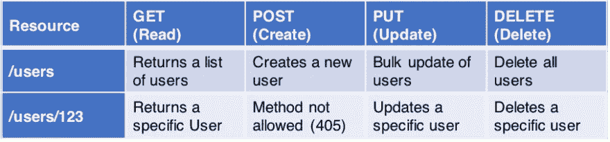

# 如何设计和开发开发人员喜欢使用的 API

> 原文：<https://betterprogramming.pub/how-to-design-and-develop-apis-that-developers-will-love-to-use-4bbd859d9fe5>

## 从设置正确的响应代码开始，您的开发人员会很高兴


照片由[萨法·萨法罗夫](https://unsplash.com/@codestorm?utm_source=unsplash&utm_medium=referral&utm_content=creditCopyText)在 [Unsplash](https://unsplash.com/s/photos/code?utm_source=unsplash&utm_medium=referral&utm_content=creditCopyText) 拍摄

如果你正在构建一个 API，它很可能会被另一个开发者使用。你的 API 必须易于理解和使用。下面是一些技巧，可以帮助你设计一个其他开发者会喜欢的 API。

# 端点路径必须是名词

理想情况下，端点路径应该包含名词，避免使用动词。HTTP 动词足以告诉消费者端点的用途。

```
Good Names
- /cars
- /books/1Bad Names
- /getCars
- /getBooks/1
```

如果您使用动词，您将需要为一个项目上的所有 CRUD 操作创建一个单独的端点。向名为`/getCars`的端点发出 PUT 请求确实令人困惑。

另一方面，如果您的端点路径是一个名词，那么您可以对不同的 CRUD 操作使用带有不同 HTTP 动词的同一个端点。向`/cars`发出 PUT 请求是有意义的，向`/cars`发出 GET 或 POST 请求也是有意义的。

# 端点的名称必须是复数

端点的名称必须是复数。当试图描述 URI 的等级制度时，这一点很重要。(我们会在下一段讲等级制度。)通常情况下，数据会存储为集合，表中会有多行。因此，在命名端点时，鼓励使用复数。

```
Good Names
- /cars
- /booksBad Names
- /car
- /book
```

# URI 必须描绘等级制度

端点路径必须以这样的方式命名，即它们告诉消费者它们试图访问的数据的层次结构。例如，假设我们有多个图书馆，每个图书馆都有多本书，我们希望创建一个端点来访问图书馆中的特定书。

```
A good endpoint would be
/libraries/2/books/10 A not so good endpoint would be 
/books/10
```

在这两种情况下，我们都试图访问 ID 为 10 的书。虽然第二个端点还不错，但是第一个端点为消费者提供了关于库 ID 和数据层次结构的信息。

# HTTP 动词应该只做它们的工作



*图片来源:“*[REST:API 设计的良好实践](https://medium.com/hashmapinc/rest-good-practices-for-api-design-881439796dc9)”

*   GET 请求用于读取多个项目或单个项目。它不应该改变数据库的状态，即创建新项目、删除项目或更新项目。
*   POST 请求只能创建一个或多个项目。应该没有其他副作用。
*   PUT 请求用于更新项目。它不应该删除或创建任何项目。
*   删除请求只能用于从表中删除项目。
*   确保这些请求没有任何副作用。

请求应该只对指定的数据起作用。例如，如果用户试图将一本书添加到一个不存在的图书馆，那么对图书端点的 POST 请求也不应该创建一个图书馆记录。相反，用户应该首先被重定向到库端点。成功创建库之后，它们应该被定向到图书端点。

# 为排序、筛选和分页提供支持

## 整理

应该在 API 中实现一个特性，允许它接受如下请求。

```
/cars?sort=+carName,-yearReleased
```

基本上，API 被要求返回所有的汽车，按字段`carName`升序排序，按`yearReleased`降序排序。

## 过滤

用户/开发人员应该能够获得基于指定字段的过滤数据。

```
/cars?carName="XYZ"&yearRealeased="2020"
```

如果发出类似上面的请求，API 应该只返回 2020 年发布的名为`“XYZ”`的汽车。

## 页码

API 应该能够批量或以页面的形式发送数据，而不是一次返回所有数据。

```
/cars?pageData=10&page=1
```

上面的请求告诉 API，用户正在请求包含十条记录的第一个页面，即前十辆汽车。如果参数`page`的值是`2`，API 应该发送接下来的十辆汽车(汽车 11 到汽车 20)。因此，如果用户有一个循环，并在每次迭代中不断增加值`page`，他们应该以十为一批获得所有数据。

# 使用正确的响应代码

如前所述，您的 API 很可能会被其他开发人员使用。有不同的响应代码是有原因的:它们帮助其他开发人员调试他们发出的请求中的错误。以下是标准响应代码。

*   200 —请求成功，返回了一些内容。
*   201-请求成功，资源已创建。
*   204-请求成功，没有内容返回。对于删除请求很有用。
*   400-由于缺少必需的参数，请求不正确。
*   401 —未经授权。用户无权访问请求，很可能是因为他们没有登录。
*   403 —禁止。用户已登录并通过身份验证，但无权查看资源。它可以是安全的端点/数据。
*   404 —未找到。找不到请求的资源/端点。
*   405-不允许使用方法。尝试在仅支持 GET 请求的端点上发出 POST 请求，反之亦然。
*   500 —一般错误。当上述代码都不是合适的响应代码时抛出。理想情况下，应该包括一个描述性的错误消息。

# 记录您的 API

具有良好文档的 API 使得其他开发人员更容易使用。理想情况下，您的 API 将安装类似于 [Swagger](https://swagger.io/solutions/api-documentation/) 的东西，这将允许用户向 API 发出请求，而实际上不需要编写任何代码。

确保所有终点都有完整的记录。

尝试为所有主要语言提供访问 API 端点的代码片段。

包括每个端点的示例请求对象和响应对象。

# 结论

总结以上内容:

*   端点路径必须是名词
*   端点的名称必须是复数
*   URI 必须描绘等级制度
*   HTTP 动词应该只做它们的工作
*   为排序、筛选和分页提供支持
*   使用正确的响应代码
*   记录您的 API

如果你有任何其他设计或开发 API 的规则/技巧，请在评论中告诉我。你用过哪些好的 API？你用过哪些 API？

# 资源

[](https://stackoverflow.blog/2020/03/02/best-practices-for-rest-api-design/) [## REST API 设计的最佳实践——堆栈溢出博客

### 关于如何将 REST APIs 设计得易于理解、面向未来、安全且快速的最佳实践。

stackoverflow.blog](https://stackoverflow.blog/2020/03/02/best-practices-for-rest-api-design/) [](https://www.vinaysahni.com/best-practices-for-a-pragmatic-restful-api) [## 设计实用的 RESTful API 的最佳实践

### 您的数据模型已经开始稳定下来，您可以为您的 web 应用程序创建一个公共 API 了。你意识到…

www.vinaysahni.com](https://www.vinaysahni.com/best-practices-for-a-pragmatic-restful-api)  [## API 设计的最佳实践

### 良好的 API 设计是那些试图完善 API 策略的团队经常提到的话题。在以前的…

swagger.io](https://swagger.io/resources/articles/best-practices-in-api-design/) 

我最近开始了一个修改版的#100daysofcode 挑战。我的目标是每天写与 Python、数据科学或编程相关的[内容](https://medium.com/daily-programming-tips)。

在 [LinkedIn](https://www.linkedin.com/in/rahulbanerjee2699/) 、 [Twitter](https://twitter.com/rahulbanerjee99) 上关注我

*原载于 2021 年 4 月 6 日 https://www.realpythonproject.com**的* [*。*](https://www.realpythonproject.com/how-to-develop-design-an-api-that-developers-want-to-use/)