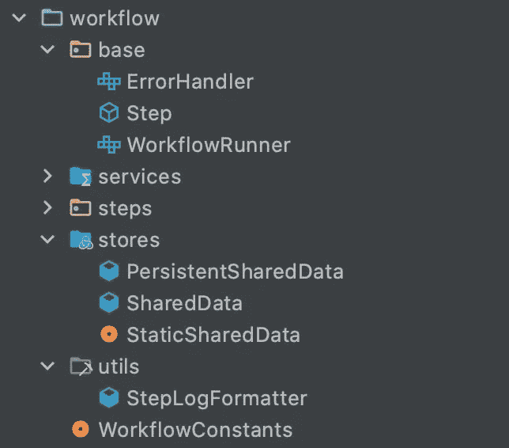

# 如何使用 RxJava 设计复杂的 Android 应用程序启动

> 原文：<https://betterprogramming.pub/how-to-design-complex-android-app-start-ups-using-rxjava-8e24aff27e93>

## 这种久经考验的方法比您想象的要简单

每一个哪怕是最简单的应用程序都有我喜欢称之为飞行前清单的东西。用户登录了吗？您是否需要达到运行状况检查端点并做出相应的响应？有没有需要跳过的初试体验？诸如此类看似无关的问题，需要在创业过程中一举解答。

经历过无数次这样的争论，我见过(也写过)初始化逻辑，从杂乱无章的代码到过于僵化和不灵活的结构，需要一本手册才能完全理解。

到目前为止，我和我的团队已经找到了一个灵活、优雅、可移植且经过战斗考验的范例，它已经在开发和生产的压力下茁壮成长。让我们看看它是什么样子的。

# 传统名称

当你思考一件足够长且困难的事情时，你倾向于发明(或挖掘)一些名字来为你的描述提供一个清晰的含义。以下是我在描述该解决方案时经常使用的名称:

*   **工作流程:**本文提出的问题的解决方案。它是应用程序在初始化期间从头到尾运行的一组协调步骤，以满足用户开始使用应用程序之前的所有要求。
*   **步骤:**为满足某项预发布要求而设计的一项或一组小型、完整的检查。
*   **Pipeline:** 用于组织和运行有序步骤集合的工具，以满足整体预发布需求。

请注意，工作流更多的是这个问题背后的概念性解决方案，体现了这个想法及其组成部分。管道和步骤是这些概念的具体的、编码的表现。我们很快就会看到他们的行动。

# 基础代码

根据你的应用程序的大小和你想要检查和初始化的组件的数量，你的代码库的这一部分将通过它的大小来反映复杂性。然而，对逻辑采取务实的方法将有助于确保您的初始化逻辑可以随着应用程序的成熟而扩展。

## 程序包结构

下面是我们使用的包装结构的直观图片:

整个工作流的包结构

请注意，所有东西都植根于名为`workflow`的包中。稍后我会解释所有这些类，但是在深入细节之前，我想给你一个 5000 英尺的视角。我有一个用于网络呼叫的`services`包和一个用于我的应用程序需要询问的每个具体问题的`steps`包。

## RxJava &管道

也许这个组件并不令人惊讶，因为标题已经泄露了它。 [RxJava](https://go.oliverspryn.com/rxjava) 作为整个初始化过程的主要驱动。我以此为管道，对各个步骤进行整体协调。事实上，它负责许多繁重的工作，从而使我的工作变得容易得多。

在继续之前，不要忘记将它包含在你的项目中。

## 工作流运行器

提前明确每个人的职责会有所帮助。因此，我创建了一个接口来声明我的项目中能够运行工作流的每个类。虽然这在技术上不是必需的，但它确实让事情变得更清楚了。

还记得我在文章开头说的这个解决方案是可移植的吗？这是我选择创建这个界面的一个原因。在我专业开发的应用程序中，有几个地方使用了它，在我的 IDE 中搜索`WorkflowRunner`会显示出每一个实例。

定义负责启动工作流的任何类的接口

## 错误处理程序

期望应用程序如此复杂的部分达到完美是不现实的。因此，每个步骤都有一个可重用的错误处理范例来抛出错误并做出相应的响应是一个好主意。稍后，您将看到每个步骤如何响应它们的错误。

应用程序工作流的通用错误处理程序

## 商店

偶尔，你需要保留一些数据。从工作流的生命周期到应用程序安装的整个过程中，这种内存都可以存在。我有一套专门为此设计的分层存储服务:

*   `SharedData`:对于任何下游步骤，从一个步骤传递到下一个步骤的类，该步骤需要知道从前面的步骤收集的任何相关信息。只要工作流结束，它就会被销毁。
*   `StaticSharedData`:和上面的类一样，除了它会一直存在，直到应用程序被关闭或明确清除。
*   `PersistentSharedData`:类似于静态数据，除了这些变化被写入磁盘并在应用程序关闭后继续存在。

## **共享数据**

当您只想看到数据持续到管道完成时，这里是存放数据的地方。当然，你可以在这个类中添加更多的属性，但是这里是我最起码的建议:

在工作流持续期间存储数据的最小位置

我提供并跟踪管道的名称，以便为它的每个表现形式提供一个惟一的标识符。我还跟踪每个步骤是否运行，以便在出现问题时可以调试我的代码。我的管道以一个可以提取和显示这些数据的服务结束。稍后会详细介绍。

## **StaticSharedData**

与上面的存储类一样，这个类将其属性放在不同的范围内。这样，您可以在以后参考保留的信息。

在应用程序运行期间或明确清除之前，存储数据的最小空间

## **PersistentSharedData**

这个类实际上是共享首选项的包装器。它与 Kotlin 的 getters 和 setters 一起工作。Java 实现看起来非常相似。这是一个你可以存储在持久数据中的例子。

用于在磁盘上存储最少数据的包装类

## 工作流常数

没有人喜欢在代码中寻找一个小的配置值来改变。因此，我们将所有的工作流、管道和与步骤相关的配置保存在一个名为`WorkflowConstants`的对象(或者对 Java 人来说是`static class`)中。随着工作流代码库的增长，拥有这种约定的价值将很快得到回报。

我的工作流的所有配置都被隔离在一个地方

## 步骤

这个类是从整体上回答一个启动问题的逻辑的具体实现。它有几个特定的功能:

*   决定它是否应该运行
*   如果它应该运行，这里是它应该做的
*   如果实现了`ErrorHandler`接口，处理它导致的任何错误
*   在`SharedData`中保留任何相关信息
*   记录其运行/不运行决策

最后一点很重要，尤其是在调试运行不正常的管道时。它提供了一个路线图，指出事情在哪里工作，然后突然出错。

一个抽象类来实现工作流的一个特定步骤

也许这并不奇怪，但是`Step`类是抽象的。当然，我们希望其他狭隘的类来处理所有的细节。这个基类移除了大部分样板文件来完成这个任务。

`shouldRunStep()`方法假设开发人员默认想要运行这个步骤。但是，如果希望将其执行限制在特定的情况下，可以在实现类中用自定义逻辑重写此方法。

请注意，我有一个方便的函数，它决定是否运行，并代表我收集所有的日志记录——下一个组件将详细介绍。

## StepLogFormatter

该格式化程序用于从内存中提取每个`Step`记录的运行日志，并打印出所发生事件的事后分析——无论是好是坏——以确保工程师能够深入查看每个细节。

从内存中提取每个已执行的步骤，并在调试控制台中显示它们

# 让它发挥作用

让我们通过创建一个基本管道来看看所有这些概念是如何工作的。

没有任何步骤的最基本的管道

对于精通 RxJava 的人来说，这并不深奥。我们只是应用了上面提到的结构:

*   `SharedData`在顶部注入一个工作流名称。
*   `subscribe()`方法中的`onNext()`处理程序是一条快乐的路径，其中每个`Step`都不间断地做了预期的事情。注意，`StepLogFormatter`类接收给定的数据，并将其发送到工程师的控制台。
*   当然，`onError()`处理程序从链中捕获致命错误。它提供了一种方法来停止整个流程，并将其返回到导致该流程的步骤进行适当的处理。这是最后的手段，可以被认为是一种纾困形式。这很有用的一个例子是，如果您的后端报告自己关闭或用户的应用程序版本不再受支持。
*   `onComplete()`方法是为了万一您想要提前终止管道，但不是因为一个错误。这对于每个会话只需要运行一次管道的情况非常有用。

## 简单的一步

基本步骤会是什么样的？这里有一个例子:

没有错误或可选条件的基本步骤

注意这个`Step`有多轻。这是一个简单的实现，允许您只关注手头的任务。

## 错误处理步骤

如何引发致命错误并停止管道来解决它？这里有一种方法，通过使用`ErrorHandler`接口。

具有条件逻辑的简单健康检查步骤，以及停止管道和处理手边错误的方法

## 提前终止流程的步骤

在我的生产应用程序中有一个例子，每个用户会话只需要运行一次管道。同样，由于这个解决方案是可移植的，我不仅仅是在应用程序启动时使用它。该应用程序的中央仪表盘有很多决策，这种方法允许我确保我只执行一次这个管道。

能够优雅地终止整个工作流程的步骤

## 更复杂的运行方法

有时候，你需要从外部世界获得比从`SharedData`对象获得更多的信息来执行`Step`。如果我不能将必要的对象注入到构造函数中，我会用自定义属性覆盖`runStep()`方法，调用者可以稍后注入所需的组件。

我将重用`HealthCheck`，在这种情况下，提供一个选项来重新运行工作流，以查看后端服务是否再次在线。

更复杂的健康检查步骤，可以重新启动整个启动过程，以查看后端是否再次在线

## 将步骤放入管道中

现在我有了四个示例步骤，然后我将它们集成到管道中。

一个包含所有示例步骤的管道

请注意我是如何在管道中不时切换线程的。以下是我在决定将任何给定的`Step`放在哪个线程上时使用的经验法则:

*   导航和 UI 变更`Step`类在 UI 线程上运行(即`mainThread()`)。我还确保我的`subscribe()`回调发生在 UI 线程上，因为所有的工作都已经完成。
*   所有其他情况都进入轻量级后台线程，比如 RxJava 的`io`线程池。

此外，请注意，异常是在 RxJava 的错误回调中处理的，并被直接抛出给导致该异常的类。这样，一切都保持整洁有序，以便管道可以专注于驱动步骤。

# 结论

经过几年的反复试验，这个模型不仅被证明是简单易懂的，而且还可以扩展和适应我们扔给它的任何东西。

也许它的主要优势之一是我们可以根据自己的需要构建和修改库的基础。

它的支持基类是轻量级的，易于理解。实现步骤遵循一个熟悉的范例。此外，它需要的唯一第三方库是 RxJava，这是一个使用非常好的工具，它已经面临了几乎所有可以想象的生产级的战斗。

如果您发现您的启动逻辑太难理解，移植性不够，或者变得太难驾驭，我鼓励您尝试这种方法。你可能会发现它对驯服应用程序的其他部分很有帮助。

这样做，你不仅会有一份可靠的飞行前清单，还会有一份可靠的飞行中清单，甚至可能是飞行后清单。飞行愉快。

# 喜欢你读的东西吗？

媒体上还有成千上万篇类似的文章。我是这个网站的付费会员，我完全认为这项投资是值得的。 [**点击这里加入**](https://go.oliverspryn.com/medium-membership) ，你将以你的一部分会员身份支持我的工作。

本文最初发表于 https://oliverspryn.com/[。](https://go.oliverspryn.com/how-to-design-complex-android-app-start-ups-using-rxjava) [**加入我的邮件列表。**](https://go.oliverspryn.com/medium-subscribe)