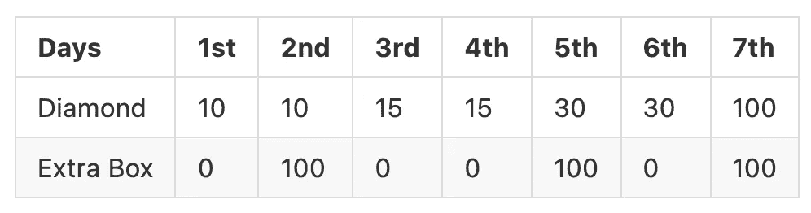
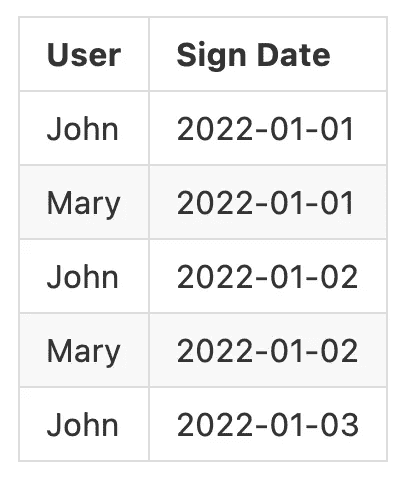
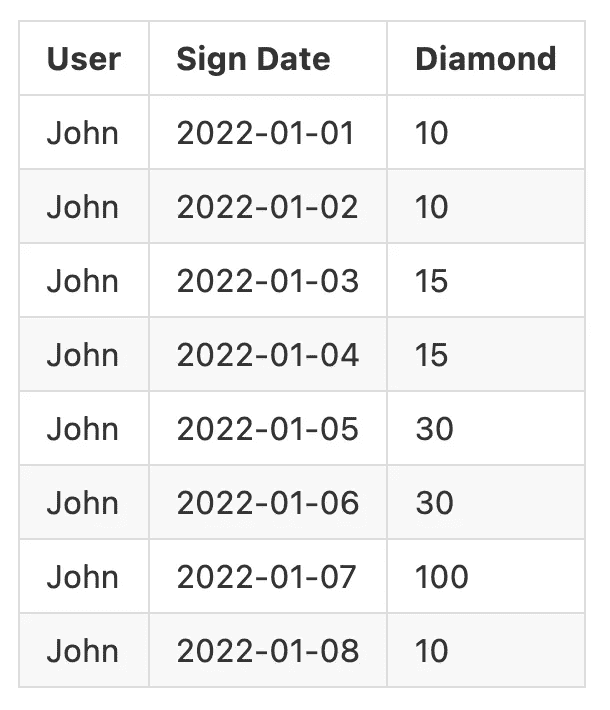

# 如何以一种干净的架构方式设计软件

> 原文：<https://betterprogramming.pub/how-to-design-in-clean-architecture-way-part-1-36c3e558517b>

## 看一下面向数据的设计方法

*   第一部分，[面向数据的设计](https://lazypro.medium.com/how-to-design-in-clean-architecture-way-part-1-36c3e558517b)
*   第二部分，[领域驱动设计](https://lazypro.medium.com/how-to-design-in-clean-architecture-way-part-2-8524e76f2720)

洋葱建筑

关于*清洁架构*的文章和书籍很多，但重点是为什么和什么，比如为什么要用一个洋葱架构，每一层代表什么，`SOLID`原理是什么。

但是开发者其实更想关注的是如何，也就是如何根据那些设计原则写出一个好的程序架构。

在本文中，我们试图用一种干净的架构方式来解决一个常见的架构问题。

很多手游或者商业网站，为了提高用户留存，都设计了签到任务。如果你签到，你会得到一些奖励。连续签到一定天数，会有额外的**礼盒**可以打开，打开后会有奖金。让我们一起努力实现这个要求。

# 问题域

连续登录的用户会得到钻石，如下表所示:

为了简化问题，让我们得到一个固定数量的 100 颗钻石，每次打开礼盒。比如用户连续四天签到，用户在签到的第五天就可以获得 30 和一个礼盒。

用户每次进入首页，都会看到一个签到图，告诉用户在这个周期内已经连续完成了多少次签到，获得了多少奖励。

# 设计阶段

有两种不同的设计方法，面向数据的设计和领域驱动的设计。我们将开始讨论面向数据的设计，并告诉你为什么它不是主流设计解决方案。

# 面向数据的设计(不能说是好方法)

面向数据的设计是指当我们看到一个问题时，我们首先考虑如何存储数据，然后操纵定义的数据格式来试图解决原始问题。

所以得到问题后，第一步就是要想好用什么数据库，会有什么模式，数据会以什么格式存在。

我们以签到任务为例。假设我们在一个小的整体上进行设计，通常带有一个关系数据库，所以我们首先定义一个表来实现我们的问题。定义一个签到表，存储每次签到的时间，这样你就可以根据之前的签到记录知道自己可以获得多少奖励。

从上表来看，如果今天是`2022-01-04`，那么约翰签到的时候可以获得 15 颗钻石，而玛丽因为没有连续签到，只能获得 10 颗钻石，所以会开始新的循环。

该任务的逻辑是过滤特定用户的登录日期，并按日期排序，然后检索最新的`N`记录。通过计算连续签到的总天数，然后就可以知道这次要获得什么奖励了。

这样的设计有一个问题。当用户的签到完全没有中断，即连续签到天数大于`N`时，那么数据量不足以决定当前的奖励。尽管如此，我们不希望扩展`N`,以避免拉太多数据使数据库成为瓶颈。因此，我们应该尝试对原始模式进行一些更改，比如添加一个新字段 diamond。

对于约翰来说，在`2022-01-09`上登录将获得 10 颗钻石，因为我们知道前一个周期的终点是`2022-01-07`。

故事还没有结束。当用户数量增加时，RDBMS 的性能将变得很差。每次进入首页都要从数据库中拉数据，运行复杂的计算，最后看到结果。这个过程效率很低。

为了提高主页的效率，大多数项目都会引入缓存来记录整个签到的状态。但是，如何知道缓存是否无效呢？或者说缓存其实不是无效的，而是扭曲的。我在以前的文章[弹性缓存](https://towardsdev.com/resilient-caching-in-redis-a5b3c1a49f14)中已经提到了这个问题。通过添加完整性，可以区分数据是否可靠。一旦数据损坏，我们将从 RDBMS 重建数据。

# 摘要

从上面的介绍中我们发现，即使是缓存也有很多方面需要考虑，整个面向数据的设计非常复杂，过程非常纠结。

因此，领域驱动设计诞生了。

在第 2 部分中，我们将从实体开始设计，涵盖用例，然后实现像 TDD 这样的单元测试，最后完成我们的使命。我会提供一个更好的设计过程，你可以按照步骤来简化你将遇到的每一个用户故事。今天到此为止吧。直到下次