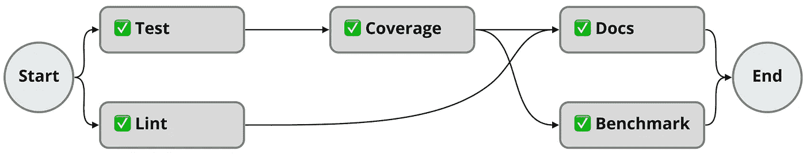

# 如何在 Python 中设计管道并按依赖关系排序

> 原文：<https://betterprogramming.pub/how-to-design-pipelines-and-sort-by-dependencies-in-python-ed876495a826>

## 用并行步骤对有向无环图(DAG)进行排序


照片由 [JJ 英](https://unsplash.com/@jjying?utm_source=medium&utm_medium=referral)在 [Unsplash](https://unsplash.com?utm_source=medium&utm_medium=referral) 上拍摄

最近，我不得不研究如何从配置文件构建管道。

棘手的部分总是如何简化如何编写配置文件，尤其是如何管理管道步骤的顺序并使其可读。我的目标是找到一种方法来对步骤进行排序，并优化可以并行完成的工作。

所以我看了看其他人在做什么，我喜欢用`needs`关键字在 [GitHub actions](https://docs.github.com/en/actions/learn-github-actions/managing-complex-workflows#creating-dependent-jobs) 中是如何做的。

它的作用是每当你创建一个步骤时，你定义哪个(些)步骤应该在这个步骤之前发生。

让我们以下面的例子为例:

```
jobs:
  **Lint**:
    *# ...* **Coverage**:
    needs: **Test**
    *# ...* **Docs:**    needs: [ **Coverage, Lint** ]    *# ...* **Benchmark:** needs: **Coverage**
    *# ...* **Test**:
    *# ...*
```

如果我们直观地表示它，它看起来会像下面的管道。
如你所见，我们有一些任务可以并行运行，而其他任务应该等待另一个任务的结果。



管道的可视化版本

# 有向无环图

像这样的流水线可以用一个[有向无环图(DAG)](https://en.wikipedia.org/wiki/Directed_acyclic_graph) 来表示，这是一个没有有向循环的有向图。这意味着如果一个步骤完成了，你就不能回到这个步骤。

知道您的管道是一个 DAG，您就可以开始根据您拥有的依赖关系树对您的图进行排序。

## 如何对 DAG 进行排序？

对 DAG 进行排序的自然方式是使用[拓扑排序](https://en.wikipedia.org/wiki/Topological_sorting)，但这不适用于并行步骤，因此我不得不放弃这个解决方案，转而使用自定义解决方案。

所以我们从在`Dict`中创建依赖结构开始:

```
dependencies = {
    "**Lint**": [],
    "**Test**": [],
    "**Coverage**": ["**Test**"],
    "**Docs**": ["**Coverage**", "**Lint**"],
    "**Benchmark**": ["**Coverage**"],
}
```

对于每个`job`，我们都有一个`List`依赖项。
在我们的例子中，这意味着`Test`应该在运行`Coverage`之前完成。

有了这个`Dict`，我们现在可以使用`[networkx](https://networkx.org/)`将其转换为`DiGraph`。

> NetworkX 是一个 Python 包，用于创建、操作和研究复杂网络的结构、动态和功能。—neuro.debian.net

```
g = **nx.DiGraph**(dependencies)
```

现在你有了`DiGraph`，我们可以排序了。为此，我们选取 0 度的节点，并对其进行迭代以找到下一步，如下所示:

你可以在下面看到排序的完整代码。👇

但是排序的结果将如下所示:

```
*# output result*
[**['Lint', 'Test']**, **['Coverage']**, **['Docs', 'Benchmark']**]
```

# ♺检测周期

如前所述，为了能够对 DAG 进行排序，我们应该没有循环依赖。因为我们已经创建了一个`networkx.DiGraph`，我们可以使用`simple_cycles`函数来检测在你的`dependencies`中是否有任何循环返回你的图的循环依赖列表。

```
*# detect cycling workflows*
cycles = list(**nx.simple_cycles**(g))
if **len(cycles) > 0**:
    raise CyclingPipeline(cycles=cycles)
```

在知道我们没有循环依赖之后，是时候根据图对依赖进行排序了。

# 👨‍💻完整源代码

# 结论

有了这样的设计，配置对于编写它的人来说是超级容易的，因为你不必考虑所有事情的完整顺序；你只需要把你的注意力集中在你的舞步上。

由`_sort_jobs`函数提供的输出顺序也被优化为并行运行任务，这使得你的输出更有性能。

您可以使用它来安排您自己的管道，这对于 CI 工具来说是完美的，但是如果您必须编排多个服务，也是如此。

像这样的算法有很多用途。