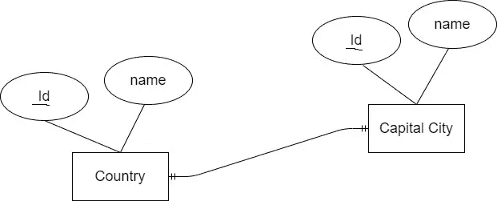
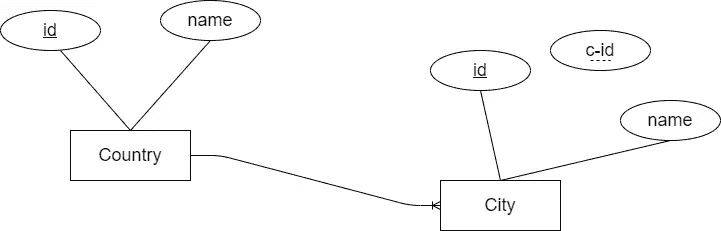
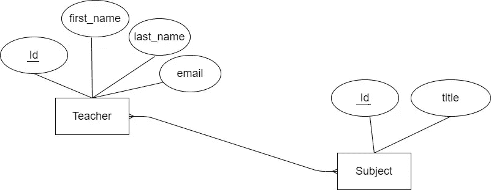

# 如何设计 Django 模型之间的关系

> 原文：<https://betterprogramming.pub/how-to-design-relationships-between-your-django-models-caa01bc17a5c>

## Django 中的一对一、一对多和多对多关系

来自[像素](https://www.pexels.com/photo/man-standing-while-holding-red-marker-pen-facing-marker-board-7369/?utm_content=attributionCopyText&utm_medium=referral&utm_source=pexels)的[创业股票照片](https://www.pexels.com/@startup-stock-photos?utm_content=attributionCopyText&utm_medium=referral&utm_source=pexels)

设计数据库是构建 web 应用程序最重要的部分之一。如果您使用关系数据库，维护表之间的正确关系是必须的。

一个 [Django](https://www.djangoproject.com/) 应用程序中的每个[模型](https://docs.djangoproject.com/en/3.2/topics/db/models/)代表一个数据库表。默认情况下，Django 模型在关系数据库管理系统(RDBMS)上运行。因此，您需要设计 Django 模型，维护它们之间的适当关系。

在本文中，我们将大致了解如何创建数据库表之间的关系。然后我们将看到如何在 Django 模型中实现这些关系。我们开始吧！

在关系数据库系统中，有三种类型的关系:

*   一对一的关系
*   一对多关系(或多对一)
*   多对多关系

Django 模型支持这三种类型的关系。我们先用例子来了解一下每一种关系。然后我们将看到如何在 Django 模型中应用它们。

# 一对一的关系

> “一对一关系意味着一个表中的一条记录恰好与另一个表中的一条记录相关联。” *— fmhelp*

一对一关系的真实例子可以是一个国家及其首都。每个国家只有一个首都。而且每个首都都是唯一一个国家的首都。这种关系可以用下图表示:

一对一关系|作者图片

现在让我们看看如何将它转换成 Django 模型。为了在 Django 中建立一对一的关系，使用了关键字`OneToOneField`。

这就是如何在两个模型`Country`和`Capital`之间建立一对一的关系。

让我们看另一个例子:

[Django 认证](https://docs.djangoproject.com/en/3.2/topics/auth/)有一个默认模型`User`。假设你正在建立一个电子商务平台，并想从`User`扩展你的`Customer`模型。您将执行如下操作:

在这里，也可以将一个用户添加为客户。一个用户不能是多个客户。

# 一对多关系

> 在一对多关系中，一个表中的一条记录可以与另一个表中的一条或多条记录关联 *— fmhelp*

我们可以再次回到一个国家的例子。考虑一个国家和它的城市之间的关系。一个国家有多个城市。另一方面，每个城市只在一个国家。所以一个国家和它的城市是一对多的关系。我们可以用下图来表示这种关系:

一对多关系|作者图片

我们可以这样翻译图表:一个国家可以有很多城市，每个城市只属于一个国家。

为了在 Django 模型中定义一对多的关系，我们需要使用关键字`ForeignKey`。

在这个一对多的关系中，`Country`是父节点，`City`是子节点。

现在让我们回到电子商务的例子。我们在`User`模型和`Customer`模型之间建立了一对一的关系。客户将在电子商务平台上下单。`Order`车型和`Customer`车型会是什么关系？一个客户可以下很多订单，但是一个订单只能与一个客户关联。这在`Customer`和`Order`之间创建了一个一对多的关系。

# 多对多关系

> 在多对多关系中，一个表中的多条记录可以与另一个表中的多条记录相关联 *— fmhelp*

让我们考虑一个学校数据库中教师和科目之间的关系。一个老师可以教一门或多门课程。一个科目也可以由一个或多个老师来教。这就在教师和学科之间形成了多对多的关系。我们可以使用下图来表示这种关系:

多对多关系|作者图片

为了在 Django 模型中定义多对多关系，我们需要使用关键字`ManyToManyField`。

需要注意的一点是，我们也可以在`Teacher`模型中使用`ManyToManyField`。这样的话，我们需要把`Subject`类放在第一位。

因为这是一个多对多的关系，所以无论哪种方式都适用。

多对多关系的另一个例子是博客网站中的博客帖子和标签之间的关系。一篇博客文章可以共享许多标签，一个标签可以在许多博客文章之间共享。

考虑这篇关于姜戈的文章。它可能有多个标签:编程、web 开发、Django、Python 等。另一篇与 Python 和 Django 相关的不同文章可能有类似的标签。所以这是一个多对多的关系。

设计数据库是 web 应用程序构建过程的一个重要部分。无论您使用什么堆栈，这都是您在计划构建 web 应用程序时应该做的第一件事。

在本文中，我描述了如何在 Django 应用程序中创建模型之间的关系。如果您在 Django 应用程序中使用关系数据库设计，您必须维护模型之间的正确关系。

我希望通过这篇文章，您能够清楚地了解数据库关系是如何工作的。以及如何在 Django 模型中应用它们。感谢阅读。

# 参考

*   [https://docs . django project . com/en/3.2/topics/db/examples/one _ to _ one/](https://docs.djangoproject.com/en/3.2/topics/db/examples/one_to_one/)
*   [https://docs . django project . com/en/3.2/topics/db/examples/many _ to _ one/](https://docs.djangoproject.com/en/3.2/topics/db/examples/many_to_one/)
*   [https://docs . django project . com/en/3.2/topics/db/examples/many _ to _ many/](https://docs.djangoproject.com/en/3.2/topics/db/examples/many_to_many/)