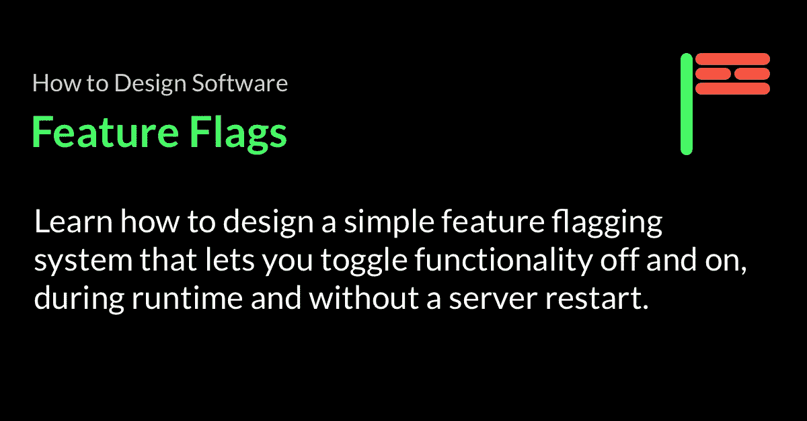
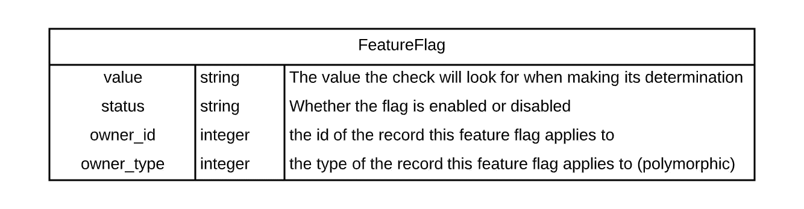
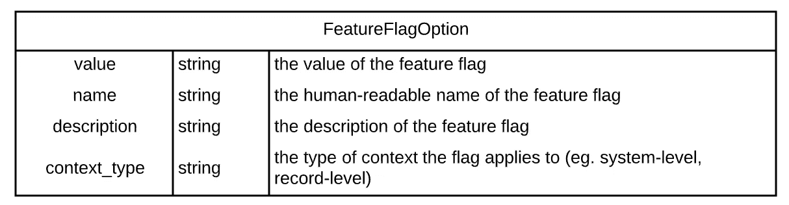
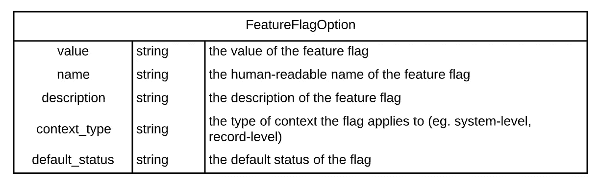
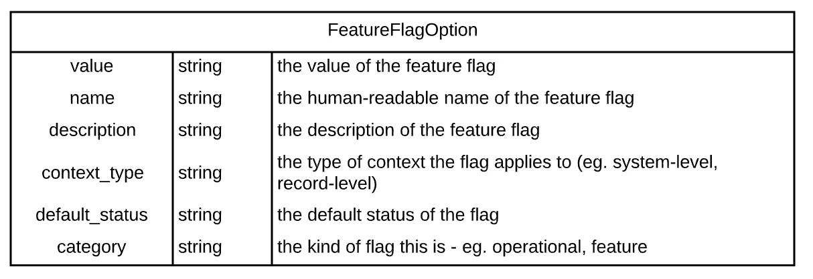
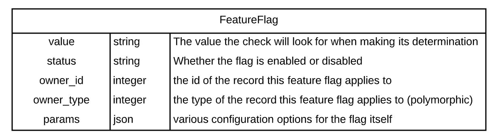

# 如何设计软件——特征标志

> 原文：<https://betterprogramming.pub/how-to-design-software-feature-flags-283c5f938171>



## 深入了解我是如何设计、开发和迁移一个遗留系统到一个新的特性标记系统的

之前的一家公司遇到了一个问题:我们的部署有数千条线路，耗时近一个小时，而且风险极大。工程师讨厌部署，这导致等待部署的拉式请求堆积成山。产品经理合理地希望等到事情全部完成后再发布，这意味着我们的发布可能包含数千行代码，其中任何一行都可能导致灾难性的崩溃。结果呢？未完成的工作越积越多，没有交付价值就浪费掉了。

有些事情必须改变。

# 释放部署

为了帮助解决这些问题，我实施了一项技术改进，允许我们将部署的概念与发布的概念分开。

以前，部署就是发布，一旦代码投入生产，就有数百万用户在使用它。这使得部署承担了难以置信的风险。

这直接让工程师和产品经理产生了分歧。工程师希望通过更小的部署来最小化风险，但是产品经理希望发布有效的、全面的解决方案。我们缺乏技术能力，而不是合作，这创造了一个充满争斗的环境。

我们希望确保我们的技术能够支持在部署之后发布功能。换句话说，我们希望能够在用户看不到的情况下将代码发送到产品中，然后允许业务和产品经理按照他们的计划发布特性。

为了实现这种分离，我在我的计划工作之间，作为一个忍者项目，开发和集成了一个集中的特征标记系统。

# 什么是功能标志？

特性标记系统，也称为特性标记器，归结起来就是存储一个特性是否被启用，然后在需要时检查它。如果该功能已启用，则允许您正在切换的任何内容。如果没有，就对用户隐藏。

就代码而言，理论上它解决了布尔检查和伴随代码路径的执行(或不执行)。一个例子:

```
run_code_path if flag
```

## 旗帜

标志本身是一个值，代码在决定是否运行某段特定代码时会检查该值。这是代码在进行运行时判断时要检查的东西。

## 代码路径

代码路径是正在切换或禁用/启用的代码。

也许它检查页面组件是否可以显示。也许它会在交易中增加额外的费用。也许它甚至还没有完成，你只是把骨架放在适当的位置。

这些隐藏代码的各种原因将决定标志的寿命、使用方式以及放置位置，但最终的机制是相同的。

## 支票

检查是决定代码是否应该运行的代码。if 语句将查看标志并运行代码路径。

对我们来说，我们从概念上将系统分为两种不同的检查:系统级检查和上下文级检查。

*   **系统级检查**执行系统级检查。如果检查通过了一个案例，它将通过所有案例。
*   **上下文级检查**在特定的上下文中执行检查，比如在用户记录的范围内。如果检查通过了一个上下文，它不会确定是否会通过另一个上下文。

最后，检查可以是分层的。通过组合系统级和上下文级的标志，我们可以切换特定记录、属于特定用户的记录或属于特定组内用户的记录的功能，可能性是无限的。

# 哪些功能标志不是

需要指出的一个关键点是，特性标志具体不是用来做什么的。

因为它是一个布尔型检查，所以在任何需要布尔型检查的情况下，您都可以尝试利用它。然而，你能并不意味着你应该。仅仅因为它的存在，开发人员就可能落入将它用于特定于帐户的授权相关逻辑的陷阱。重要的是不要混淆这一关注领域。

您不应该使用功能标记系统作为帐户权限检查，例如检查用户是否是管理员。即使检查一个标志的基本概念是相同的，但是其他的事情都是不同的，需要单独考虑。安全性很重要，像授权这样的概念应该作为系统中的一个主要问题来解决，而不是将其归入一个不相关的功能标志基础结构。

# 处理遗留工作

该产品在这个领域已经有一些错误的开始，分散在整个代码库中。

我在这个产品中看到的最常见的特性标志实现，以及我职业生涯中的许多其他实现，都属于这三个阵营:

*   记录中的布尔值
*   记录上的字符串数组
*   环境变量检查

## 布尔列

记录上的布尔值很简单，添加一个表示该功能是否已启用的布尔值，然后检查它:

```
process_surcharge if @cause.surcharge_enabled?
```

这种方法的缺点是，如果您有几十个可以跨多种记录共享的功能或标志，那么您最终会在整个系统中拥有同样多的功能标志列，以及对它们的各种检查。

它还会使数据库表与系统如何工作的机制相关的东西混杂在一起，而不是领域。这会很快变得难以处理。

## 字符串数组

第二种方法显然是为了解决支持多种特性的第一个缺点。

```
process_surcharge if @cause.features.contains?('surcharge')
```

它解决了一个问题，但仍有其他缺点。它还引入了一个与已经建立的特征标志模式不一致的问题，这个特征标志模式还没有移植到新的方法中。

再加上几年的扩散，我们最终发现了几十个使用这种或那种方法的地方。

## **环境变量**

最后，用环境变量标记系统范围的特性。

```
process_surcharge if ENV['IS_SURCHARGE_ENABLED']
```

## 求解遗留约束

绿地将允许我们做任何我们想做的事情，但我们生活在一个传统的世界里。我们构建的任何新解决方案都必须收集所有这些不同的部分解决方案，以确保只有一种真正的切换功能的方式。

否则，由于不一致，开发人员的心理将导致开发人员继续创建他们自己的或复制其他功能切换机制之一。

# 第一步

我们从解决遗留限制开始。我们通过添加一个间接层并整合该层中的所有差异，解决了所有这些不同的功能检查方法的问题。

## 实施

我们用一个名为`enabled?`的方法创建了一个名为`FeatureToggler`的服务类，该方法接受一个标志和一条记录:

```
class FeatureToggler
  def enabled?(flag, record)
  end
end
```

因为我们系统中不同种类的记录有不同的方法来检查一个特性是否被启用，我们在`enabled?`函数中列举了所有这些方法:

```
def enabled?(flag, record)
 return record.features.contains?(flag) if record.instance_of?(User)
 return record.send("#{flag}?") if record.instance_of?(Cause)
 # ...and so on...
end
```

然后，我们用对新函数的调用替换了所有不同的`if x.<y>_enabled?`、`if z.features.contains?(a)`检查。

代码运动叫嚣着各种各样的违反，从“不要重复自己”到“单一责任原则”到“打破基本继承的规则”。

不过，这都是为了更大的利益。有时候，在清理代码之前，你必须把代码弄得更乱一些。就像滑动拼图一样，你可能需要跳“向前 3 步，向后 2 步”的舞，直到你完成重构。

对我们现有测试套件的微小更新确保了它继续通过。新的整合界面实际上使得将功能切换功能的测试从其他测试中分离出来并创建一个特定的套件成为可能，这使得测试标记更加容易和全面。

# 一种新的数据模型

一旦`FeatureToggler`抽象层就位，我们希望过渡到一个新的数据模型，一个与系统中所有其他数据模型分离的模型。

## 新的数据模型



功能标志的第一个数据模型。

**值** `value`是标志本身，我们将在代码中检查该值，以确定标志是否正在运行。

**状态** `status`是表示标志是`enabled`还是`disabled`的字符串。

**owner_id 和 owner_type** `owner_id`和`owner_type`是以多态方式跟踪拥有记录的两个字段。如果所有者是 ID 为 2 的合同记录，`owner_id`将是`2`，`owner_type`将是`Contract`。

没有所有者意味着该标志是一个系统标志，而不是一个上下文标志。

# 过渡到新的数据模型

过渡比我们期望的要复杂一些。我们的转换计划要求我们转换标志的两个方面:读取和写入。

## 阅读很容易

读取很简单，我们可以在新的`FeatureToggler`层中插入一个检查来查看新的数据模型:

```
def enabled?(flag, record)
 FeatureFlag.exists?(owner: record, enabled: :true, value: flag)
end
```

## 写作更具挑战性

由于传统限制，写入变得更加困难。

为了允许操作在我们的旧系统上切换特性，我们有一个 CRUD 接口，它支持数据模型并通过 DSL 生成。这意味着它是硬编码的，并且明确知道它是否插入到数组中，在特定记录的列上设置布尔值。

没有办法抽象出那种行为，我们改变它的能力受到严重限制。如果我们使用新的数据模型添加一个标志，它将不会反映在旧的数据模型中。如果我们在旧的数据模型中添加一个标志，它将不会反映在新的数据模型中。这意味着标志可能会失去同步。这是造成重大混乱的潜在原因。

遗留的约束迫使我们走向全有或全无版本的道路，这显然是我们计划的反目标。

我们不能让两个系统并行写入，这意味着如果我们想迁移写入，我们必须进行完整的转换。

## 解决方案:只有转换读取

我们决定暂时不迁移写操作，只迁移读操作。我们通过将对旧数据模型所做的任何更改向下传播到新数据模型，将旧数据模型作为更改的真实来源。

我们编写了一个迁移来获取我们在其他各种方法中存储的所有特性标志，并将它们复制到新的数据模型中。

为了保持新旧数据模型之间的数据同步，我们通过回调向现有的写操作添加了一个额外的步骤，确保我们也将相同的数据写入到新数据模型中使用这些方法写入标记的各个位置。

最后，我们更改了对功能标志的读取以指向新系统，但也通过法定系统验证结果，该法定系统在检查不一致时进行记录:

```
def enabled?(flag, record)
 if new_enabled?(flag, record) == old_enabled?(flag, record)
   return new_enabled?(flag, record)
 else
   log_quorum_failure(flag, record)
   return old_enabled?(flag, record)
  end
end
```

我们还决定吃我们自己的狗粮，并对功能标志进行检查，以确定是使用旧系统还是新系统，以防万一。谈论额外的安全。

通过消除转换写入的需求，我们极大地简化了项目，并允许我们快速交付一小部分价值。有时候最简单的事情就是什么都不做。

## 完美的胜利

我们在生产环境中运行了一段时间，它运行得很好，除了那些我们有意创建的测试之外，我们没有看到任何记录的不一致。

在这一点上，我们切换到使用新的数据模型进行所有的读取，并开始考虑转换写入。

# 转换写入

因为我们对读取的稳定性和新系统整体的有用性有充分的信心，所以我们对迁移写入更有信心。

我们有两个数据模型，旧的数据模型是变更的真实来源。由于对旧数据模型的更改与新数据模型同步，这意味着我们仍然依赖旧方法的所有限制。

我们需要让我们的新数据模型成为变革的源泉。因为我们的旧系统依赖于不灵活的 DSL 来修改功能标志，这意味着我们必须创建一个新的用户界面来提供我们实际上可以转换写入之前所期望的相同功能。

事实证明，对于新的数据模型来说，这是小菜一碟。在操作上支持新的标记数据模型就像在表中插入和读取记录一样复杂。没有特别的规则或陷阱。这个界面可以归结为一个有一些按钮的表格，这是最纯粹的 CRUD 功能。

## 放

实际的发布非常简单。

我们向修改特性标志的主要人员提供了一个简短的培训，编写并共享了一个单页文档来广泛地记录它，然后提供了旧界面所在的新界面的链接。

# 迭代和改进

我们的新系统棒极了。

它允许我们快速应用不同种类的特性标志或在不同的上下文中应用多个标志，而不需要进行数据库迁移。

级联标志检查现在很容易，我们可以根据特定记录或特定用户切换功能。我们没有就此止步。既然我们不再受传统约束的限制，我们可以随着时间的推移快速添加更多的功能。

## 描述性列举

旧的特征标志方法的一个问题是，没有人知道标志实际上做了什么或意味着什么。

因为它们中的许多是没有描述的布尔字段或字符串值，所以很难确切地说出切换它们的后果是什么。除非你已经熟悉了这个系统，否则你永远也找不到答案。

当我们把它们转换过来时，我们保留了它们不幸的名字。

对于非工程师来说，带有像`bpfee`和`gp`这样的值的标志是难以辨认的。它提供了糟糕的用户体验，并导致了许多操作错误，最终以错误报告和调查的形式返回到工程中，这是我们想要防止的。

我们想清楚地描述标志的作用和含义，所以我们引入了一个数据模型来列出可用的选项:



功能标志选项

我们修改了修改接口，用这些细节来修饰特性标志列表，为修改特性标志的人提供了更清晰的信息。

他们不再需要仅仅看到:

```
bpfee
```

他们也看到了这意味着什么:

```
Receipt Basis Points Fee (bpfee)Display fee percentages charged as basis points on the receipt.
```

清晰度的提高导致我们收到的错误和问题明显减少，解决了大量上游问题。

## 默认

有时，当创建记录时，我们希望自动启用某些标志。通过向`FeatureFlagOption`表添加一列`default_status`，我们可以实现这一点:



功能标志选项

现在，每当创建一个记录时，我们可以调出`default_status` 为`enabled`的所有标志，并自动启用该记录上的标志。

## 分门别类

随着时间的推移，您会得到许多不同的特性标志，它们都有不同的用途。

有些是短期使用的标志，通常在代码完成之前隐藏代码，或者通过执行 canary 发布来降低风险。一旦代码被部署，标志应该被移除。有些是中期使用的标志，例如用于进行实验的标志。一些标志旨在长期使用。功能可能会根据客户的合同或计划进行切换。

这些标志中的每一个都有不同的所有者和用法，所以能够将它们分开是很重要的。通过给`FeatureFlagOption`添加一个`category`，我们能够进一步确定枚举和行为的范围:



添加一个类别使我们能够根据受众和用途适当地选择选项。

## 实验

有时，我们需要一些标志来将组分成不同的群组，以便进行 A/B 特性测试。我们可以将实验的各种参数存储在`FeatureFlagOption`中，发送给 A/B 子系统:



通过允许在标志中存储可选参数，您可以自定义标志的行为。

虽然 A/B 系统超出了本文的范围，但是如果你使用的是 ruby，我推荐你去看看 [split gem](https://github.com/splitrb/split) 。

## 表演

随着特性标记系统使用的增加，您不希望执行那么多的数据库读取。抽象层提供了一个放置缓存层的完美位置，以确保快速查找特性标志。

一如既往，记住著名的唐纳德·克努特的话:

> 我们*应该*忘记小的效率，比如说 97%的时候:过早的优化是万恶之源。

确保您确实需要提高性能，并且使用模式适合您的解决方案。

另一个技巧是:不要随意添加缓存逻辑。当您试图弄清楚您是否正在处理缓存数据时，很快就会失控。当控制器、数据和数据库上的缓存层都开始相互交互时，这变得非常复杂。

仔细考虑并通过集中控制添加缓存，这样您就可以确切地知道数据有多陈旧，以及如何在必要时强制刷新。

## 客户端检查

我们的新技术平台极大地利用了许多功能标志基础架构。我们创建了一个前端服务和组件，它根据特性标志的状态显示/隐藏嵌套的组件。

通过在 API 中公开标志检查，然后将其所有逻辑整合到服务和组件中，我们能够避免在整个前端都使用功能标志逻辑。

# 效果

过渡进行得令人难以置信的顺利，令人震惊的是从部署中分离出的发布改进了团队协作和交付效率。

部署规模减小了，频率增加了，因为开发人员可以部署代码而不会导致生产问题。这反过来降低了变更失败率，因为部署规模更小，在投入生产之前更容易发现错误。

发布会进行得更顺利，更好地适应了业务的时间表，因为它不需要工程师跟踪不同的工作分支，也不需要处理数万行代码的集成挑战。

这并不是解决我们所有问题的灵丹妙药，但它帮助简化了流程，消除了许多协作摩擦，带来了回报。

# 常见问题

## 我们为什么不找供应商呢？

有很多供应商提供像 Optimizely 或 LaunchDarkly 这样的标志功能。为什么我们不跟他们走，为什么要多此一举？一句话:预算。

当时，我们受到严重的预算限制，很难批准任何额外的支出。由于工程没有控制我们的预算，我们不得不凑合着用现有的东西。

即使获得资源来解决这样的技术债务是不可能的，我们也必须确保在我们发现的“中间”时间(票据、项目和会议之间的小段时间)内，我们在工程计划上取得进展。

我们必须在现有的背景下工作。

## 为什么我们不使用库或 gem 呢？

我们检查了许多 gem，并意识到没有一个适合我们对未来用例、遗留约束或迁移需求的特定期望。特别是一些宝石需要大爆炸式的部署方法，这是我们不想接受的风险水平。

有几个可能需要对我们部门之外的团队如何理解标记进行彻底的检查，这扩大了我们想要进行的更改的范围，并且通过增加更多的利益相关者而显著增加了交付负担。我们已经在做这个非官方的忍者项目了。我们不想增加它永远无法送达的几率。

我们看到的大多数宝石都要求我们走我们曾经走过的路线。我们决定尽快推出我们自己的选择，但将所有访问隐藏在一个接口之后，这样如果资源释放，我们可以在未来交换实现。

我们已经在做这个非官方的忍者项目了。我们不想增加它永远无法送达的几率。

## 你为什么不一次把所有东西都转换过来？

出于几个原因，全有或全无的方法并不可取。

回想一下，这是我们在实际工作中做的一个忍者项目。这意味着我在这里有几分钟，在那里有一两个小时来完成这次迁移。一个全有或全无的方法将需要比我们能够分配的更多的关注。

我们通过将迁移分成更小的部分，在迁移中引入了额外的复杂性。然而，我们这样做几乎降低了整个计划的风险。由于包括合同义务在内的各种原因，功能标志在系统中被广泛使用，如果出现错误，后果将非常严重。

把它分成更小的部分绝对值得安全，即使最终不需要它。

# 你从这里去哪里？

如果您有兴趣了解更多关于功能切换的信息，Martin Fowler 的网站上有一篇由 Pete Hodgson 撰写的关于功能切换的深入文章，我强烈推荐这篇文章。

[](https://martinfowler.com/articles/feature-toggles.html) [## 特征切换(又名特征标志)

### Pete Hodgson Pete Hodgson 是位于旧金山湾区的独立软件交付顾问。他…

martinfowler.com](https://martinfowler.com/articles/feature-toggles.html) 

你喜欢这篇文章吗？在评论里告诉我，或者在 [LinkedIn](https://www.linkedin.com/in/jgefroh/) 上联系我！

***本文是我的*** [***如何设计软件***](https://medium.com/@jgefroh/list/how-to-design-software-03066fa9dcbf) ***系列的一部分。***

# [成为灵媒会员](https://jgefroh.medium.com/membership)帮助支持我的写作以及成千上万的其他作者！

