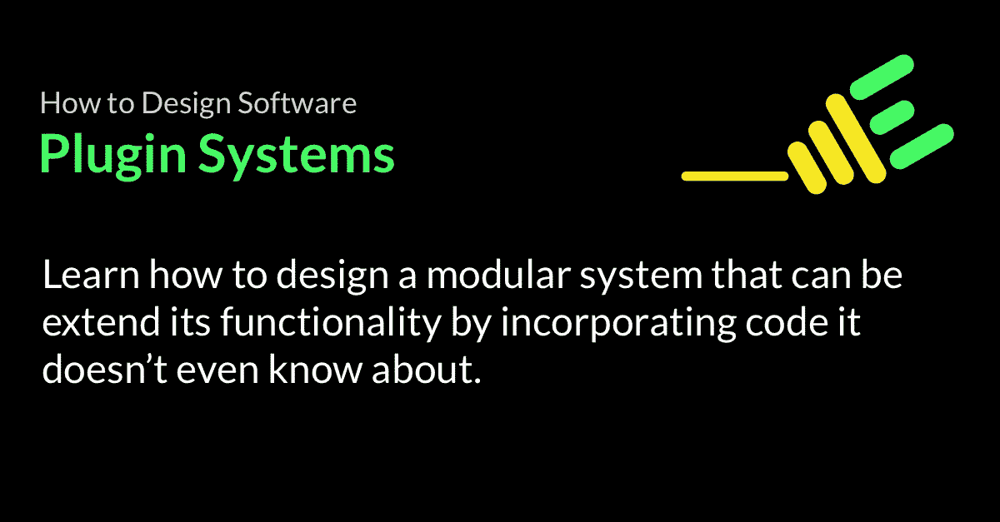
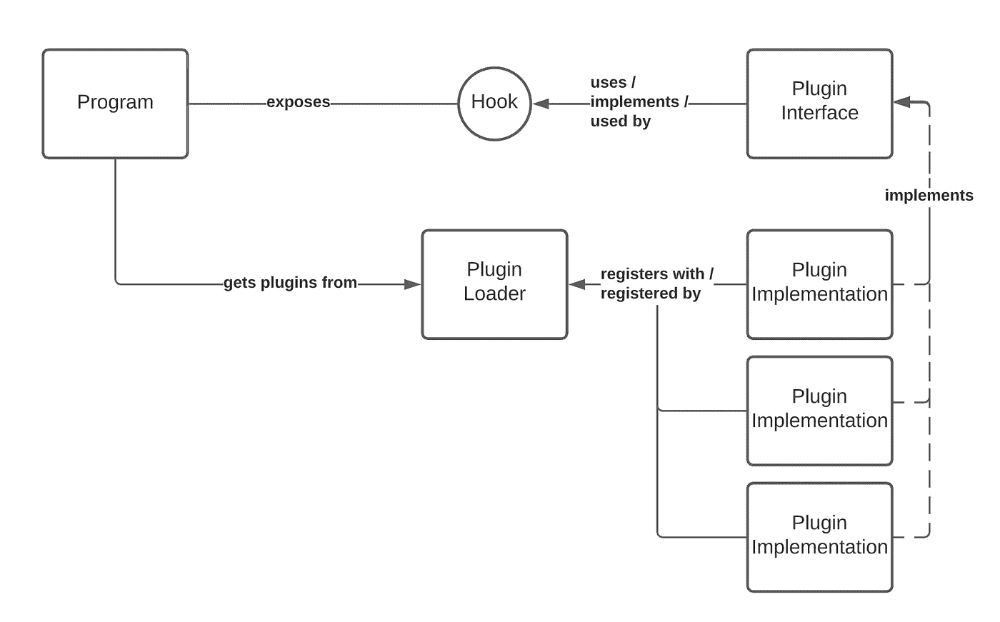
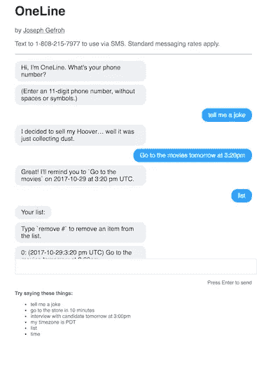

# 如何设计软件——插件系统

> 原文：<https://betterprogramming.pub/how-to-design-software-plugins-d051ce1099b2>

## 以聊天机器人为例，学习如何构建一个插件系统来允许其他人扩展你的程序的功能和模块化。



我年轻的时候，有一台顶级的游戏电脑。我花了数千小时玩游戏，如团队要塞 2，《我的世界》，激战，帝国时代。

在我彻底探索了一个游戏之后，我最喜欢的活动之一就是练习*改装*。修改允许你创建或下载软件包，改变或增加软件的行为——新的关卡，纹理，甚至游戏机制！可能性是无限的。

现在我是一名软件开发人员，我对这些程序中有多少支持如此巨大的可扩展性有了更好的理解。

他们使用了一个叫做*插件*的概念。

# 插件系统

插件允许你编写子程序，然后挂钩或附加到一个更大的程序。这些子程序然后运行，修改或增加运行程序的行为。

为了编写一个插件，程序本身必须被编写(或被破解)以支持插件。一旦这种能力存在，您就可以“即插即用”大量的功能。

# 概念

插件系统有许多形状和形式——为了说明设计，下面的基本概念可以帮助你思考:



基本插件系统的概念组件

## 该计划

第一部分是程序本身，也就是你试图增强或修改其行为的东西。这可能是像 Skyrim 这样的游戏，也可能是像 Sketch 这样的商业应用。它甚至可能是你自己的程序！

不管它是什么，它提供了一些你想要改变的行为和能力。更重要的是，它不知道您想要进行的更改。

## 钩子

你试图改变的程序中的某些东西必须运行它不知道的代码。否则，很难改变行为。

代码运行的这个点被称为*钩子*。Rails 的模型回调或 Vue 的组件生命周期钩子就是在野外使用的钩子的例子。

下面是一个简单的挂钩示例:

看`onSaveHook`怎么没有行为。在这个例子中，预期这个行为将由扩展`RecordSaver`的类填充，并在子类中实现新的行为。

## 插件

插件是其他人编写并“插入”以增强程序功能的代码。

你可以用如下功能扩展上面例子中的`RecordSaver`类:

```
class LoggedRecordSaver < RecordSaver
  def onSaveHook()
    puts 'Saving record.'
  end
end
```

现在调用`LoggedRecordSaver#save()`时，它会在控制台调用`#writeToDisk()`后打印`Saving record.`。这种行为增强是通过扩展`RecordSaver`实现的——这是增强程序行为的一种基本方法。

还要注意，`RecordSaver`对`LoggedRecordSaver`一无所知:耦合是单向的。

## 装载机

如果一个插件从来没有真正运行过，那么它是没有用的。需要加载插件来开始执行它的代码。

有很多技术可以实现这一点，有两种方法:

*   **插件驱动，**插件知道如何访问程序和自注册。
*   **程序驱动**，程序知道如何找到插件并加载它找到的插件。

在插件驱动的加载方法中，程序提供了一种方法，通过这种方法，插件可以向程序注册自己。在程序驱动的加载方法中，程序找到一个插件，比如通过加载一个名为`*_plugin`的文件夹中的所有文件或者加载一个清单。

# 使用插件编写的聊天机器人

不久前，我花了一个周末的时间写了一个聊天机器人 OneLine，它用自然语言告诉我双关语并给我发送提醒。



OneLine，我写的一个聊天机器人，使用了插件方法

方法很简单:接收一条消息，任意处理它，然后发送回一个响应。为了构建这一切，我构建了一个基本的插件系统，实现了这里提到的概念。

## 装载机

OneLine 拥有程序的一部分，即`Core::Plugin`模块上静态方法的子集，定义一个实现来:

*   加载一个`plugin` ( `#load`)
*   跟踪所有加载的`plugins` ( `@@plugins`)
*   调用所有加载的`plugins` ( `#call_all`)

注意，在这个例子中，加载器和钩子都被组合在一起。

**加载器**是`Plugin`实现可以调用的`load`函数，让程序知道它。

钩子是一个非常明确的`call_all`函数，当程序接收到一条消息时就会被调用。

## 插件接口

它还定义了对插件实现的期望——所有`plugins`都应该支持的行为。在这种情况下:

*   检查插件是否应该运行(`#process?`)
*   将被调用来运行插件的方法(`#process`)
*   插件预期返回的标准化响应(`#to_response`)

函数`#process`由钩子调用(在收到消息时)。

## 插件实现

最后，插件实现解析和解释消息，并对其进行处理。我制作插件是为了:

*   给我讲个笑话(`lib/oneline/jokes`)
*   记录我的待办事项清单(`lib/oneline/scheduler`)
*   …以及更多！

下面是最简单的例子，一个告诉你当前时间的插件。

# 就是这样！

相当简单！以这种方式处理事情为其他人留下了可扩展性的空间，保持代码的不同部分分段和隔离，并允许我构建和支持扩展，例如支持 web 服务器或通过 SMS 的对话。

虽然插件系统并不适合所有的场景，但在某些情况下它们非常有用。

# 完整的源代码库

请随意查看聊天机器人的完整源代码(特别是在`lib/oneline`文件夹中):

[](https://github.com/jgefroh/oneline) [## JGefroh/oneline

### OneLine 是一个个人助理聊天机器人，旨在简化我的生活。你是一个有很多重要事情的大忙人…

github.com](https://github.com/jgefroh/oneline) 

你喜欢这篇文章吗？在评论里告诉我，或者在 [LinkedIn](https://www.linkedin.com/in/jgefroh/) 上联系我！

***本文是我的*** [***如何设计软件***](https://medium.com/@jgefroh/list/how-to-design-software-03066fa9dcbf) ***系列的一部分。***

[](https://jgefroh.medium.com/membership) [## 通过我的推荐链接加入媒体-约瑟夫·格夫罗

### 作为一个媒体会员，你的会员费的一部分会给你阅读的作家，你可以完全接触到每一个故事…

jgefroh.medium.com](https://jgefroh.medium.com/membership)