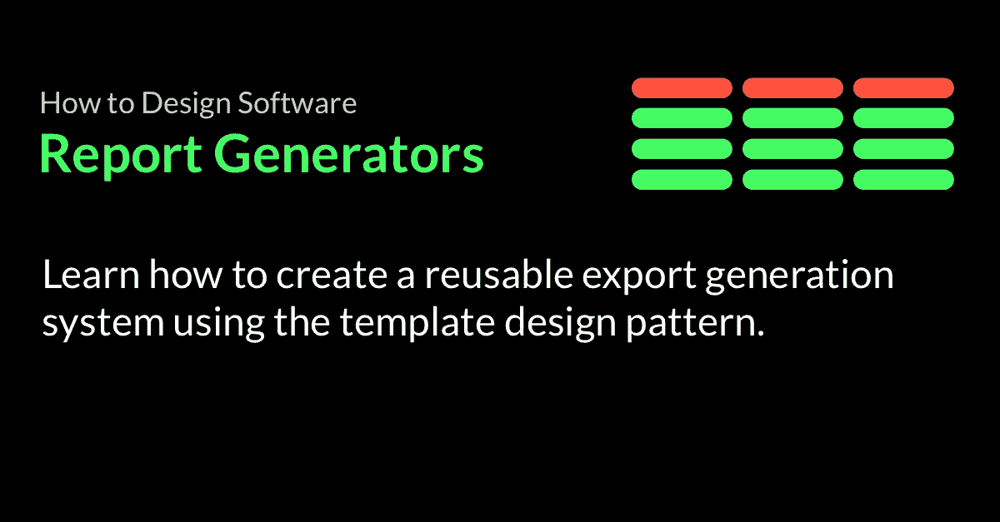
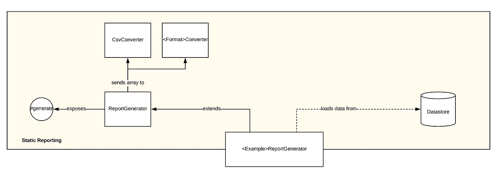

# 如何设计软件—报告生成器

> 原文：<https://betterprogramming.pub/how-to-design-software-report-generators-in-ruby-6691df98a518>



## 了解如何使用模板设计模式创建可重用的导出生成系统。

报告。这通常是企业要求开发人员构建的第一个特性之一。一旦有人有了数据，他们想用它做什么？

没错——查看。

## 工程师对报告有疑问

许多工程师以用例特定的方式处理报告。

他们将得到一个要求，如*“创建一个. csv 报告，显示从商店购买的所有商品”*，他们将去创建那个特定的功能。

下一次，他们可能会收到一个请求，要求*“创建一个. csv 报告，报告所有属于该帐户的用户”*，他们也会去创建该功能。

随着时间的推移，业务要求不同的格式、不同的领域等。这些请求加起来，经过几次迭代后，系统最终会有十几个报告实现，它们都有自己的错误和怪癖。

更糟糕的是，如果需要任何重大的迭代，比如可定制性或一些新的性能改进，就必须一遍又一遍地进行更改(每次都可能稍有不同)，这导致了大量的实现和维护开销，而仅仅是为了生成一个逗号分隔的列表！但是，不一定要这样。有一些简单的技巧可以让你完全避免这种痛苦。

# 什么是报告？

首先，让我们了解一下——到底什么是报告？每个报告都有以下四个基本组成部分:

*   数据记录
*   数据值
*   标签
*   格式

## 数据记录

数据是您用来填充报告的实际数据。可能是你系统里的一堆事件。也许是交易数据。很可能是从你的数据库中提取的数据。

数据可能有一个特定的范围，根据一些参数(如日期范围)来限制数据。

## 数据值

仅有整体数据是不够的。人们通常对特定的数据点感兴趣——数据的特定领域。财务人员可能只对结算的金额感兴趣，而安全监控人员可能对地址不匹配状态感兴趣。

## 标签

标签为数据提供了意义。这是它与众不同的地方:

```
5 | 3 | 230 | 40
```

…由此可见:

```
id | event_id | amount_paid_cents | fee_paid_cents
5  | 3        | 230               | 40
```

标签将无意义的值转换成数据，并为其他任意值提供人类可理解的上下文。

## 格式

最后，还有报告的格式。格式可以是任意的，需要什么格式最终取决于消费者。如果消费者是一个 API，格式可能是 JSON。

如果消费者是 FTP 下线或打算将其导入另一个系统的人，则可能是 CSV。如果消费者是一个对切片和切块感兴趣的数据人员，它可能最终成为一个 Excel 电子表格，甚至是一组数据库导入命令。

# 生成报告的步骤是什么？

现在我们知道了这些部分，我们可以看看算法:生成*任何* 类型的报告需要的步骤顺序是什么？

原来，这并不是一个复杂的算法！它可以概括为以下内容:

*   设置-获取报告的参数
*   获取记录
*   映射-从每个记录中获取一组特定的字段
*   将每组字段转换为报告中的条目
*   将报告发回给用户

## 设置

第一步是设置——将参数发送到报告中以调整它的行为。这通常是用于*范围界定的数据* ***—*** 一些记录集合需要过滤并缩减为一个子集(例如，按帐户、按日期等)。)

## 取得

一旦您有了报告的参数，您将想要开始检索那些记录。您可以根据需要应用过滤器:

## 地图

您可能对记录中的一组特定属性和字段感兴趣。您可以将您的记录转换成那个特定的集合，并且可以选择用额外的数据来丰富每个条目。

## 皈依者

一旦您有了自己的集合——在本例中是一组散列，您将希望把它转换成特定的格式，比如 CSV。

想支持其他格式？没问题:

# 把所有的放在一起

上面的每个步骤可能都有自己的细节，但您通常可以将其概括为如下内容:



一个用例特定的实现可能看起来像:

请注意，绑定到报告的现有功能是多么容易——您可以快速创建许多不同种类的报告，而不必担心如何生成或交付它们。

如果它看起来很熟悉——那是因为它可能就是！

这就是模板模式**——一种设计模式，它有助于封装算法的序列和不变步骤的实现，同时留下可供子类“填充”的可变步骤。**

# **附加迭代**

**一个报告可能有许多其他的关注点和可能的迭代，例如:**

*   **性能—记录批处理、记录大小管理**
*   **自定义—指定标题，更改顺序**
*   **交付— SFTP、下载、电子邮件**

**这种功能可以适当地添加到基类或子类中，而不改变系统的整体结构。输入和输出的标准化允许连接到系统的其他部分。**

**例如，如果您已经有了一个通过电子邮件传递文件的模块，那么您可以轻松地将报告生成器的输出插入到该子系统中，或者从类似于`deliver_to_email(email)`的函数中调用它。**

**就是这样！创建可重用的软件，将机制从用例中分离出来，允许它在许多其他用例中使用，就像将它分解成小部分并仔细考虑输入和输出一样简单。**

**你喜欢这篇文章吗？在评论里告诉我，或者在 [LinkedIn](https://www.linkedin.com/in/jgefroh/) 上联系我！**

**你喜欢这篇文章吗？请在评论中告诉我，或者在 [LinkedIn](https://www.linkedin.com/in/jgefroh/) 上联系我！**

*****本文是我的*** [***如何设计软件***](https://medium.com/@jgefroh/list/how-to-design-software-03066fa9dcbf) ***系列的一部分。*****

# **[成为灵媒会员](https://jgefroh.medium.com/membership)帮助支持我的写作以及成千上万的其他作者！**

****