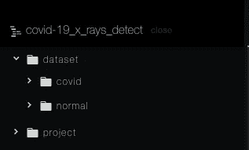
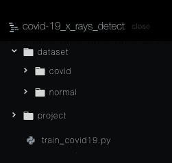
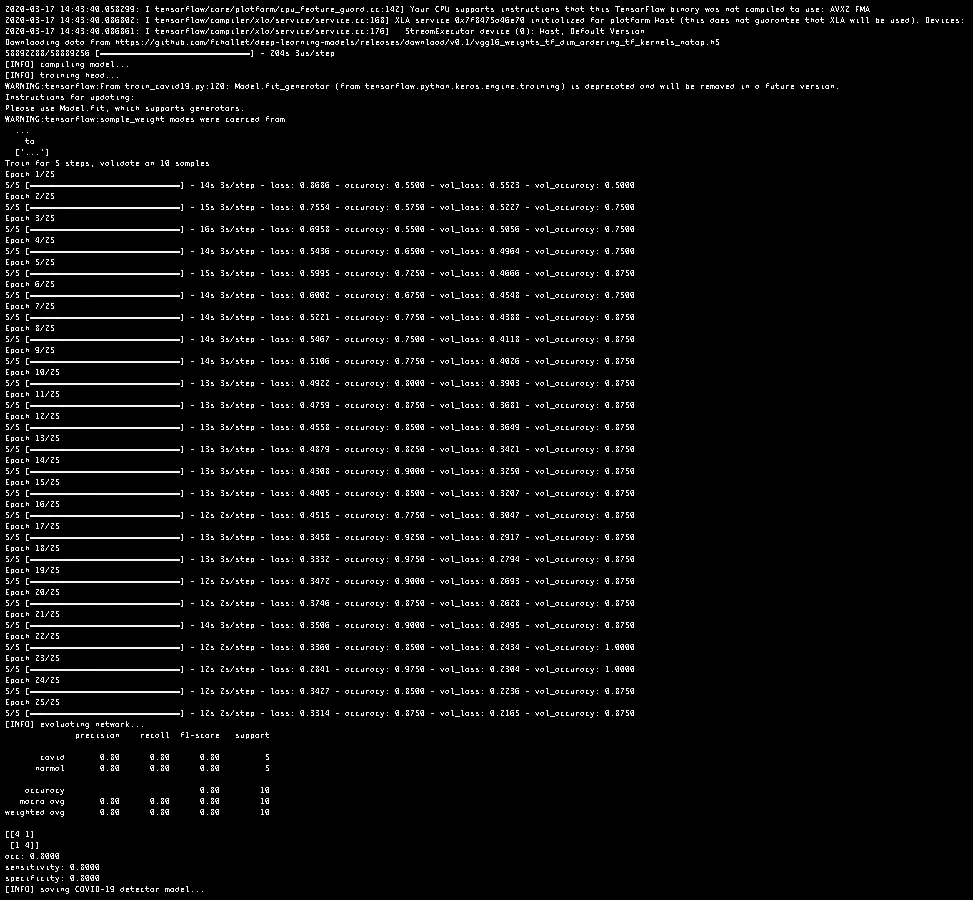
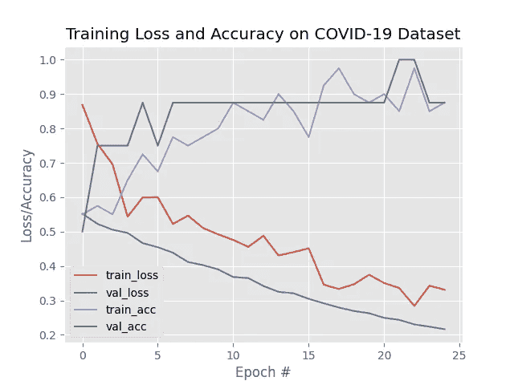

# 如何利用深度学习检测冠状病毒

> 原文：<https://betterprogramming.pub/how-to-detect-coronavirus-using-deep-learning-1568332c728>

## **使用 Python 和深度学习技术自动检测 X 射线图像中的新冠肺炎**


照片由 [Unsplash](https://unsplash.com?utm_source=medium&utm_medium=referral) 上的[融合医学动画](https://unsplash.com/@fusion_medical_animation?utm_source=medium&utm_medium=referral)拍摄

如今，我们都知道新冠肺炎的存在，更好的说法是冠状病毒。

它是由严重急性呼吸综合征冠状病毒 2 型(新型冠状病毒)引起的传染病。这种疾病于 2019 年在中国武汉首次被发现，此后在全球范围内传播，导致了 2019-20 冠状病毒疫情。常见症状包括发烧、咳嗽和气短([维基百科](https://en.wikipedia.org/wiki/Coronavirus_disease_2019))。

但今天，我们不会谈论疾病本身。相反，我们将看到如何使用 TensorFlow、Keras 和 OpenCV 在 Python 中创建深度学习模型，该模型可以分类为新冠肺炎阳性或新冠肺炎阴性的胸部 x 光图像。

在我们开始之前，我想提一下，这不是一个科学严谨的研究。只是用现实世界的问题来实际解释深度学习的一种方式。

也就是说，我们可以设置我们将用于这个项目的开发环境。

# 设置开发环境


[D L](https://unsplash.com/@fotomaniacu?utm_source=medium&utm_medium=referral) 在 [Unsplash](https://unsplash.com?utm_source=medium&utm_medium=referral) 上拍照

虚拟环境是一种工具，通过为不同项目创建隔离的 Python 虚拟环境，有助于保持不同项目所需的依赖关系分离。这意味着每个项目都可以有自己的依赖项，而不管其他项目有什么依赖项。

在 Python 中，为了构建虚拟环境，我们使用了`[virtualenv](https://virtualenv.pypa.io/en/latest/)`包。

为`virtualenv`安装 Python 绑定:

```
pip install virtualenv
```

然后，我们使用以下命令创建环境:

```
virtualenv project
```

这将创建项目文件夹。然后我们激活虚拟环境:

在 UNIX 上(Mac 和 Linux): `source project/bin/activate`

在 Windows 上:`project\env\Scripts\activate.Bat`

我们安装并设置了开发环境，现在我们需要安装我们将在本教程中使用的包:

*   [张量流](https://www.tensorflow.org/)(这可能需要几分钟):`pip install tensorflow`
*   [scikit-learn](https://scikit-learn.org/stable/) : `pip install sklearn`
*   [伊穆蒂尔斯](https://pypi.org/project/imutils/) : `pip install imutils`
*   [Matplotlib](https://matplotlib.org/) : `pip install matplotlib`
*   [OpenCV](https://opencv.org/) : `pip install opencv-python`

安装完所有这些包之后，您就可以进入下一步了。

# 我们将在教程中做什么

正如我在标题中所说，我们将建立一个 CNN 来检测 x 光图像中的冠状病毒。

这篇文章的结构是这样的:

*   下载数据集
*   构建卷积神经网络以自动检测 X 射线图像中的新冠肺炎
*   模型的局限性
*   结论

# 数据集

我们将在本教程中使用的新冠肺炎 X 射线图像数据集是由蒙特利尔大学的博士后研究员[Joseph Cohen](https://josephpcohen.com/w/)博士管理的。

您可以从 Dropbox 下载数据集。

下载完 zip 文件后，将其解压缩。你应该在你的下载文件夹中看到`/dataset`文件夹。将其移动到您将在该项目中使用的目录中。

例如，我的目录是这样设置的:



我的项目的文件夹

## 数据集的结构

正如您在前面的图像中看到的，我们的数据集被分成两个文件夹:`/covid`和 `/normal` **。**`/covid`目录包含 25 张 Covid 阳性胸部的 X 射线图像，而 `/normal`文件夹包含 25 张 Covid 阴性胸部的 X 射线图像。

# CNN 模型

在看到我们的数据集是如何构建的之后，我们可以开始构建我们的 CNN 脚本了。

## 导入和参数

创建`train_covid19.py` 文件并粘贴以下代码:

我们将创建的脚本使用 TensorFlow、 [Keras](https://keras.io/) 、scikit-learn 和 OpenCV 库。

我们将使用:

*   TensorFlow 和 Keras 与我们的 CNN(卷积神经网络)有关的一切工作
*   sci kit-学习使用数据预处理和模型评估
*   OpenCV 加载和处理图像
*   Matplotlib 绘制模型的结果

导入所需模块后，我们[解析命令行参数](https://docs.python.org/3/library/argparse.html)并初始化超参数(将用于构建 CNN 的参数):

第 2–9 行定义了我们的[命令行参数](https://docs.python.org/3/library/argparse.html):

*   `–dataset`是数据集的路径。
*   `–plot`是输出训练历史图的可选路径。默认是`plot.png`。
*   `–model`是我们输出新冠肺炎模型的可选路径；默认情况下，它将被命名为`covid19.model`。

第 13–15 行定义了[初始学习率](https://machinelearningmastery.com/understand-the-dynamics-of-learning-rate-on-deep-learning-neural-networks/)、训练周期数[和批量大小](https://machinelearningmastery.com/difference-between-a-batch-and-an-epoch/)。

## 加载和处理数据

我们现在准备加载和预处理 X 射线数据:

为了加载数据，我们获取数据集目录中图像的所有路径(第 3 行)。然后，对于每个`imagePath`，我们:

*   从路径中提取类标签(Covid 或 normal )(第 11 行)。
*   加载图像，通过转换为 RGB 通道排序对其进行预处理，并将其大小调整为 224×224 像素，以便为我们的卷积神经网络做好准备(第 15–17 行)。
*   分别更新我们的数据和标签列表(第 20 和 21 行)。

第 25–27 行:将数据和标签转换成 NumPy 数组。

现在，我们可以使用一次热编码(第 2–4 行)对标签进行编码，并将数据集分成列并进行测试:

一键编码意味着我们的数据将以下列格式显示:

[[0\. 1.] [0\. 1.] [0\. 1.] … [1\. 0.] [1\. 0.] [1\. 0.]]

每个编码标签由一个两元素数组组成，其中一个元素为“热”(1)或“非”(0)。我们根据需要使用它来分类积极或消极的情况；也就是说，我们执行二元分类。

在第 9 行，测试大小 0.20 意味着我们分割数据集，保留 20%用于测试，剩下的 80%用于训练。

然后，在第 12–14 行，我们执行数据扩充，这是一种提高模型分类能力的数据预处理技术。

## 建立模型

处理完所有数据后，我们可以初始化我们的模型。我们将使用 [VGG16 型号](https://keras.io/applications/#vgg16)。

第 2–3 行用 ImageNet 上预先训练的权重实例化了 [VGG16 网络。](https://keras.io/applications/#vgg16)

在第 6–11 行，我们构建了[头部层](https://keras.io/layers/core/)，在第 14 行，我们将它们添加到模型中。

在第 17–18 行，我们冻结了模型中的每一层，这样它们就不会在第一次训练过程中更新。

## 训练 CNN

我们现在准备编译和训练我们的新冠肺炎(冠状病毒)深度学习模型:

第 3–4 行:这里我们用 [Adam 优化器](https://keras.io/optimizers/)编译 CNN。鉴于这是一个两类问题，我们使用`binary_crossentropy`损失而不是分类`crossentropy`。

第 9–14 行:我们调用了 [Keras 的 fit_generator 方法](https://keras.io/models/sequential/) [，](https://www.pyimagesearch.com/2018/12/24/how-to-use-keras-fit-and-fit_generator-a-hands-on-tutorial/)，同时通过我们的数据扩充对象传递胸部 x 光数据。

## 评估模型

训练模型后，我们对其进行评估:

第 3–6 行:我们对测试集进行预测，并获取预测指数。

第 9–10 行:这里我们使用 scikit-learn 的助手工具生成并打印一份分类报告。

接下来，我们为进一步的统计评估计算混淆矩阵:

第 2 行:生成混淆矩阵。

第 4–6 行:使用混淆矩阵得出准确性、敏感性和特异性，并打印出来(第 9–12 行)。

## 历史训练图和模型序列化

我们至少已经完成了我们的冠状病毒(新冠肺炎)探测器 CNN。但是我们还希望看到检测器的训练历史，并在最后将模型保存在一个文件中。

第 2–12 行:绘制模型的训练精度/损失。

第 13 行:保存我们在参数中定义的`plot.png`图像中的情节。

第 16–17 行:将模型保存在`.model`文件中。

搞定了。

这里是完整的`train_covid19.py`代码:


克里斯蒂安·博尔特在 [Unsplash](https://unsplash.com?utm_source=medium&utm_medium=referral) 上拍摄的照片

# 试验

现在我们测试我们的 CNN。但在此之前，我们先回顾一下我们所做的事情:

1.  创建了虚拟环境并安装了 TensorFlow、scikit-learn、Imutils、Matplotlib 和 OpenCV
2.  下载了数据集并讨论了它的结构
3.  创造了`train_covid19.py`
4.  导入了所需的模块
5.  加载并预处理数据集
6.  构建模型及其图层
7.  训练它并保存它的准确性
8.  在`plot.png`图像中绘制模型的精度/损失历史
9.  将模型保存在`covid19.model`文件中

现在，让我们看看我们项目的文件夹:



如您所见，我们之前创建的`train_covid19.py`文件与`/dataset`文件夹在同一个目录下。这是一个关键点，因为脚本在`/covid-19_x_rays_detect`文件夹中搜索数据集文件夹。

一旦您的目录像前面看到的那样设置好了，我们就可以执行`train_covid19.py`文件:

```
python3 train_covid19.py –dataset dataset
```

这将需要几分钟的时间，因为处理图像的计算成本更高。最后，您的输出应该如下所示:



这里的`train_covid19.py`:

1.  读取并预处理数据集
2.  下载了 VGG16 型号的重量
3.  为模型训练了 25 个时期
4.  评估了 CNN 的表现
5.  打印出来了

现在，查看您的目录，您应该会看到一个新的`plot.png`文件:



通过读取模型的训练历史，我们可以获得以下内容:

*   模型没有过度拟合或拟合不足。这意味着它在训练和测试中是一样的。
*   它的损失随着时代的增加而减少。

# 该模型的局限性


照片由 [Ludovic Charlet](https://unsplash.com/@ludo_photos?utm_source=medium&utm_medium=referral) 在 [Unsplash](https://unsplash.com?utm_source=medium&utm_medium=referral) 上拍摄

我们创造了一个完美的卷积神经网络来检测新冠肺炎。另一方面，我们的 CNN 也不是很准确；它有 80%的准确率，但是为什么呢？

*   也许有更好的分类模型。
*   数据集非常非常小。不幸的是，我没有发现其他新冠肺炎阳性的胸部 x 光片。
*   很难对图像进行分类，尤其是对于不是医学专家的人来说。
*   该模型只考虑图像，而不考虑你在过去几周去过哪里，或者类似的事情。

# 结论

我真的希望这篇文章成功实现了它的主要目的:以实用的方式教授深度学习。事实上，通过阅读我以前的关于使用 Python 进行情感分析的文章，或者等我发表其他文章，你会发现我的主要意图是以实用和聪明的方式解释复杂的主题，使你能够解决现实世界的问题。