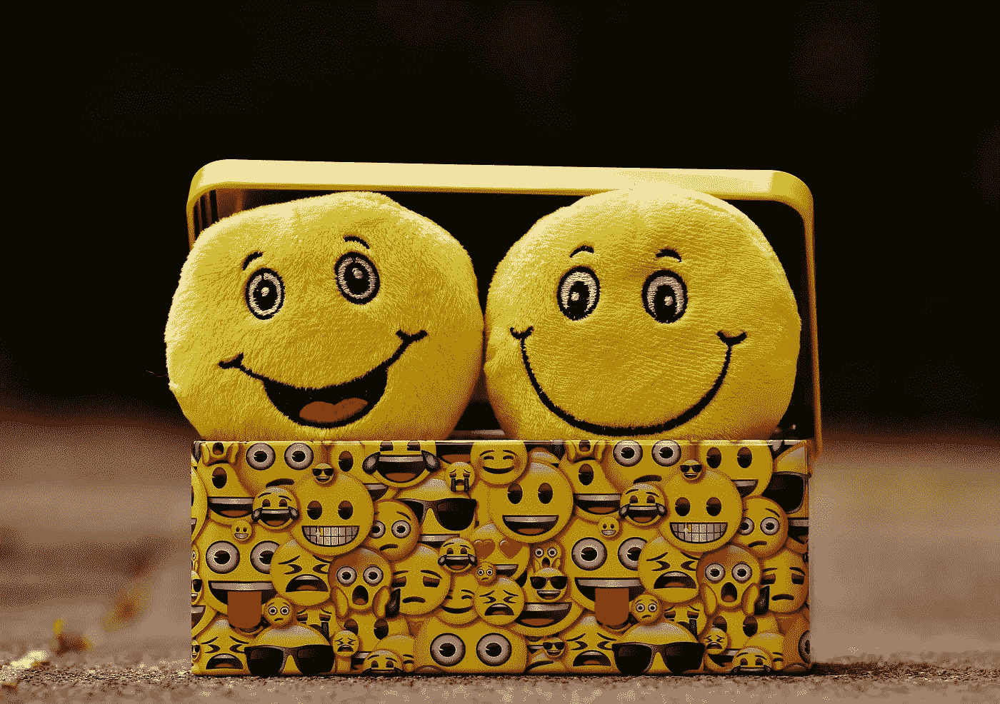
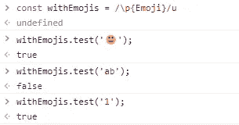
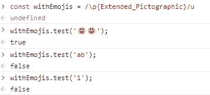
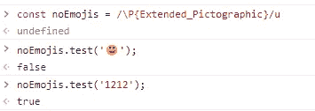
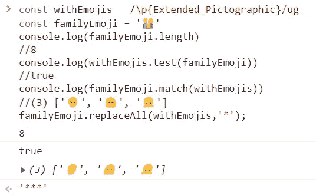

# 如何用 JavaScript 检测表情符号

> 原文：<https://betterprogramming.pub/how-to-detect-emojis-with-javascript-1a0342be9af7>

## 使用正则表达式匹配字符串中的表情符号



照片由[像素](https://www.pexels.com/photo/two-yellow-emoji-on-yellow-case-207983/?utm_content=attributionCopyText&utm_medium=referral&utm_source=pexels)的[像素](https://www.pexels.com/@pixabay?utm_content=attributionCopyText&utm_medium=referral&utm_source=pexels)拍摄

我最近过滤了一个巨大的 Twitter 时间轴，使用深度神经网络进行分析。如你所知，推文可以包含不同种类的内容，包括表情符号。因此，第一步是清理数据，在这种情况下，从时间线中删除所有表情符号。

虽然这可以用很多方法来实现，但我将展示如何用 JavaScript 来实现，因为它简单快捷，所以让我们开始吧。

正如你可能从这篇文章的副标题中猜到的那样，我们将使用正则表达式来做这件事。

现代浏览器支持 Unicode 属性，允许你根据表情符号在表情符号 Unicode 类别中的归属来匹配表情符号。例如，您可以使用类似于`**\p**{Emoji}` 或`\P{Emoji}` 的 Unicode 属性转义来匹配/不匹配表情符号字符。请注意，0123456789#*和其他字符被解释为使用之前的 Unicode 类别的表情符号。因此，更好的方法是使用`**{Extended_Pictographic}**` Unicode 类别，表示所有通常被理解为表情符号的字符，而不是使用`{Emoji}` 类别。

让我们看一些例子。

## 使用\p{}匹配 Unicode 字符

如果您使用“表情符号”Unicode 类别，您可能会得到不正确的结果:

```
const withEmojis = /\p{Emoji}/u
withEmojis.test('😀');  
//truewithEmojis.test('ab');
//falsewithEmojis.test('1');  
//true  **opps!**
```



示例 1

因此，如前所述，最好使用扩展象形图:

```
const withEmojis = /\p{Extended_Pictographic}/u
withEmojis.test('😀😀'); 
//truewithEmojis.test('ab');
//falsewithEmojis.test('1');
//false
```



示例 2

## 使用\P{}来否定匹配。

```
const noEmojis = /\P{Extended_Pictographic}/u
noEmojis.test('😀'); 
//falsenoEmojis.test('1212');
//false
```



示例 3

正如你所看到的，这是一种检测表情符号的简单方法，但是如果你使用我们之前的`withEmojis`正则表达式和分组表情符号，你会对结果感到惊讶。

```
const withEmojis = /\p{Extended_Pictographic}/ugconst familyEmoji = '👨‍👩‍👧' console.log(familyEmoji.length) 
//8console.log(withEmojis.test(familyEmoji))
//trueconsole.log(familyEmoji.match(withEmojis))
//(3) ['👨', '👩', '👧']**familyEmoji.replaceAll(withEmojis,'*');**
//*** **opps!**
```



实例 4

正如您所看到的，如果您对我们的 regex 表达式使用“replaceAll”方法，您将获得三个:而不是一个“出现这种行为是因为分组的表情符号被呈现为单个符号，但由多个代码点组成。

# 最终通过

为了避免这种和其他罕见的行为，你可以使用像[马蒂亚斯·拜能](https://github.com/mathiasbynens) s 的 [emoji-regex](https://github.com/mathiasbynens/emoji-regex) 这样的库。这个库提供了一个正则表达式，根据 Unicode 标准匹配所有 emoji 符号和序列(包括 emoji 的文本表示)。

如果你喜欢这篇文章，可以考虑通过我的[个人资料](https://kesk.medium.com/membership)订阅 Medium。谢谢大家！

# 参考

[](https://developer.mozilla.org/en-US/docs/Web/JavaScript/Guide/Regular_Expressions) [## 正则表达式- JavaScript | MDN

### 正则表达式是用于匹配字符串中字符组合的模式。在 JavaScript 中，正则表达式…

developer.mozilla.org](https://developer.mozilla.org/en-US/docs/Web/JavaScript/Guide/Regular_Expressions) 

[https://github.com/mathiasbynens/emoji-regex](https://github.com/mathiasbynens/emoji-regex)